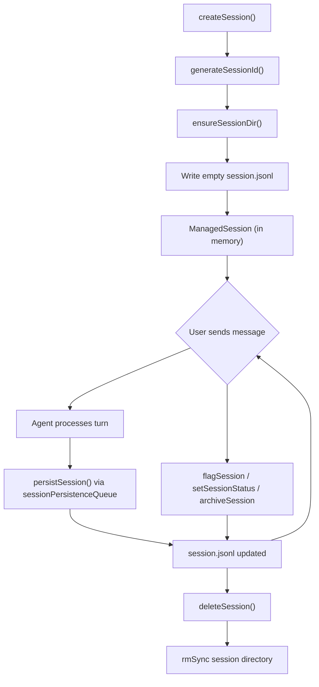
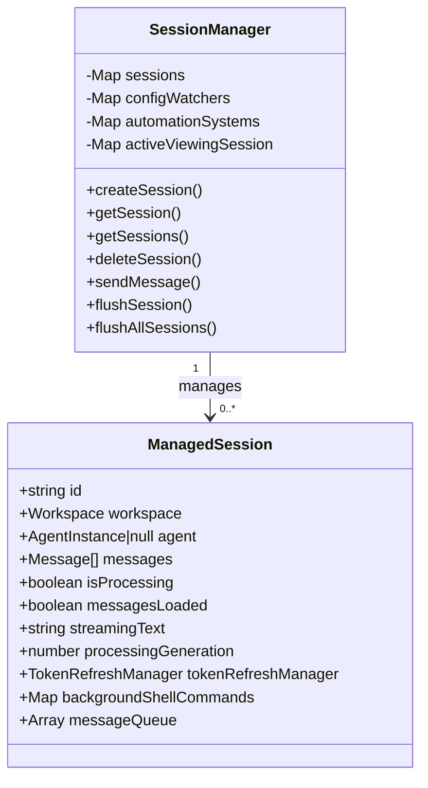
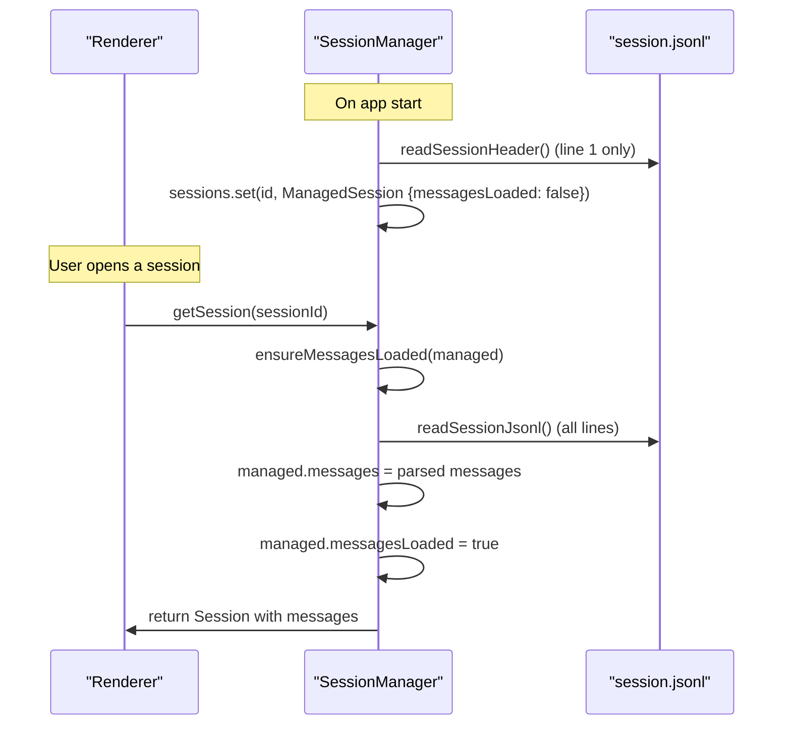
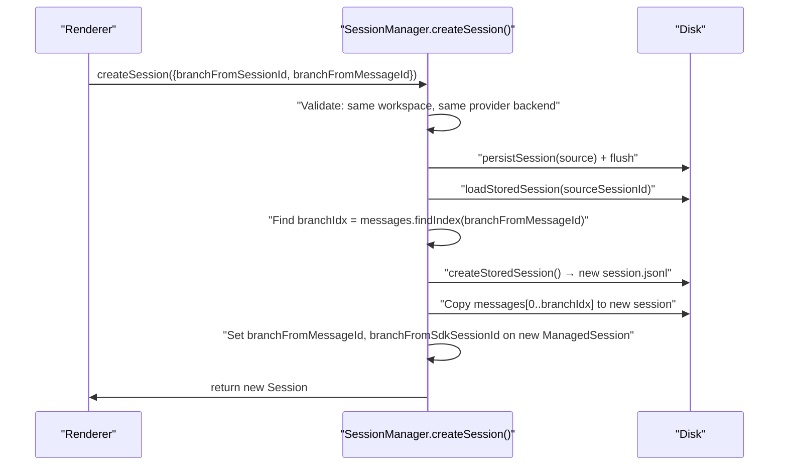
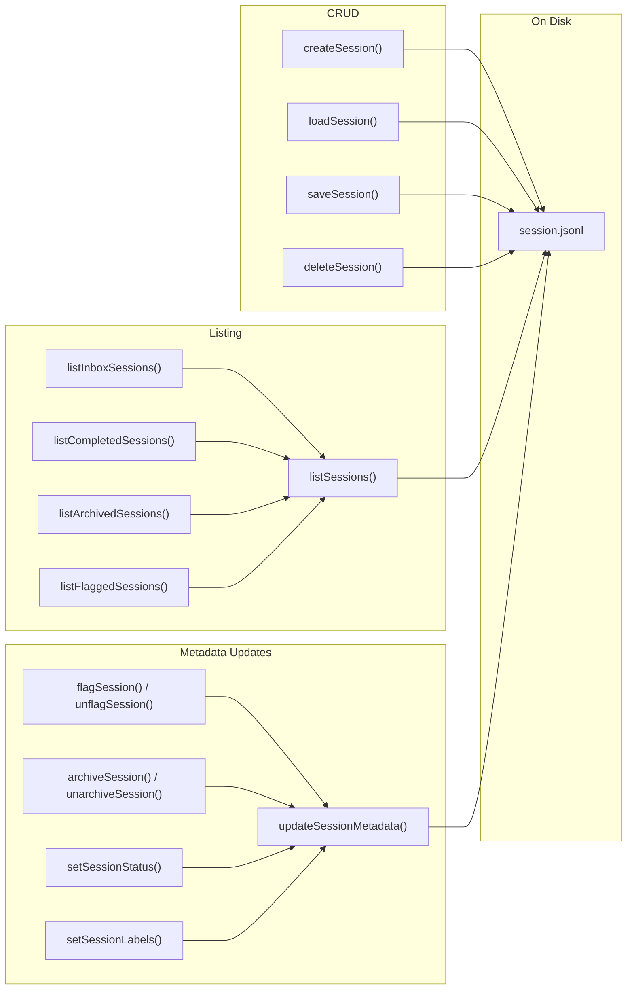

# Sessions

<details>
<summary>Relevant source files</summary>

The following files were used as context for generating this wiki page:

- [README.md](README.md)
- [apps/electron/src/main/sessions.ts](apps/electron/src/main/sessions.ts)
- [packages/shared/src/sessions/storage.ts](packages/shared/src/sessions/storage.ts)

</details>

This page covers the session data model: how sessions are stored on disk, their metadata fields, and the operations that can be performed on them (status changes, flagging, archiving, read/unread tracking, branching, and sharing). For the full runtime lifecycle of a session (message flow, agent event processing, `SessionManager` as orchestrator), see the [Session Lifecycle page (2.7)](#2.7). For workspace-level configuration that governs session defaults, see [Workspaces (4.1)](#4.1).

---

## On-Disk Structure

Each session lives in its own directory inside the workspace:

```
~/.craft-agent/workspaces/{workspaceId}/sessions/{sessionId}/
├── session.jsonl      # Header + all messages (JSONL format)
├── attachments/       # User-uploaded files (images, PDFs, Office docs)
├── plans/             # Plan files (.md) from the SubmitPlan tool
├── data/              # JSON output from the transform_data tool
├── long_responses/    # Full text of tool results summarized due to size limits
└── downloads/         # Binary files downloaded from API sources
```

The primary storage file is `session.jsonl`. It uses a two-section JSONL layout:

- **Line 1 — Header:** A single JSON object (`SessionHeader`) containing all session metadata. This is the only line read when listing sessions, making list operations fast without loading full message history.
- **Lines 2+ — Messages:** One JSON object (`StoredMessage`) per line, each representing a single message or event in the conversation.

Sources: [packages/shared/src/sessions/storage.ts:1-13](), [packages/shared/src/sessions/storage.ts:79-81]()

---

## Session ID Format

Session IDs are human-readable slugs generated at creation time:

```
YYMMDD-adjective-noun
```

Examples: `260111-swift-river`, `260215-bold-canyon`

The generator checks existing session directories to guarantee uniqueness within a workspace. IDs are sanitized via `sanitizeSessionId()` before being used as path segments, preventing path traversal.

Sources: [packages/shared/src/sessions/storage.ts:162-168](), [packages/shared/src/sessions/storage.ts:66-74]()

---

## Session Header Fields

The `SessionHeader` type (line 1 of `session.jsonl`) contains all metadata the UI needs without loading full message history. Key fields:

| Field                 | Type        | Description                                       |
| --------------------- | ----------- | ------------------------------------------------- |
| `id`                  | `string`    | Human-readable session slug                       |
| `name`                | `string?`   | AI-generated or user-defined title                |
| `createdAt`           | `number`    | Unix timestamp (ms)                               |
| `lastUsedAt`          | `number`    | Updated on every write                            |
| `sessionStatus`       | `string?`   | Workspace-scoped status ID (e.g., `todo`, `done`) |
| `isFlagged`           | `boolean?`  | Whether session is pinned/flagged                 |
| `isArchived`          | `boolean?`  | Whether session is archived                       |
| `archivedAt`          | `number?`   | Timestamp when archived                           |
| `hasUnread`           | `boolean?`  | Explicit unread indicator                         |
| `lastReadMessageId`   | `string?`   | ID of last message the user has seen              |
| `labels`              | `string[]?` | Array of label IDs applied to session             |
| `permissionMode`      | `string?`   | `safe` / `ask` / `allow-all`                      |
| `enabledSourceSlugs`  | `string[]?` | Sources active in this session                    |
| `model`               | `string?`   | Model override for this session                   |
| `llmConnection`       | `string?`   | LLM connection slug (locked after first message)  |
| `workingDirectory`    | `string?`   | Working directory for Bash tool                   |
| `sdkCwd`              | `string?`   | Immutable CWD for SDK transcript storage          |
| `sharedUrl`           | `string?`   | Public viewer URL if shared                       |
| `sharedId`            | `string?`   | Viewer ID for revoke                              |
| `branchFromMessageId` | `string?`   | Message ID this session branched from             |

Sources: [packages/shared/src/sessions/storage.ts:524-567](), [apps/electron/src/main/sessions.ts:553-697]()

---

## Session Lifecycle Overview

**Session creation to deletion flow:**



Sources: [packages/shared/src/sessions/storage.ts:177-238](), [packages/shared/src/sessions/storage.ts:429-441](), [apps/electron/src/main/sessions.ts:1434-1467]()

---

## In-Memory Representation

At runtime, each session is held as a `ManagedSession` in `SessionManager.sessions` (a `Map<string, ManagedSession>`). The `ManagedSession` interface extends the persistent header fields with runtime-only state:



The `agent` field on `ManagedSession` is `null` until the first message is sent. The `messagesLoaded` flag gates lazy loading from disk.

Sources: [apps/electron/src/main/sessions.ts:553-697](), [apps/electron/src/main/sessions.ts:799-837]()

---

## Lazy Loading

Messages are **not** loaded at startup. `loadSessionsFromDisk()` populates only header metadata from the first line of each `session.jsonl`. Full messages are loaded from disk only when `getSession(sessionId)` is called.

**Lazy loading flow:**



A `Map<string, Promise<void>>` (`messageLoadingPromises`) deduplicates concurrent load requests for the same session.

Sources: [apps/electron/src/main/sessions.ts:1869-1955](), [apps/electron/src/main/sessions.ts:1370-1431]()

---

## Persistence Queue

Writes go through `sessionPersistenceQueue` (exported from `packages/shared/src/sessions/persistence-queue.ts`). Rapid sequential writes to the same session are coalesced — only the most recent state is written. Two methods exist:

| Method                                     | Behavior                              |
| ------------------------------------------ | ------------------------------------- |
| `sessionPersistenceQueue.enqueue(session)` | Debounced async write                 |
| `sessionPersistenceQueue.flush(sessionId)` | Force immediate write                 |
| `sessionPersistenceQueue.flushAll()`       | Flush all sessions (used on app quit) |

`persistSession()` in `SessionManager` skips writing if `messagesLoaded` is false, preventing an empty message array from overwriting existing JSONL data.

Sources: [packages/shared/src/sessions/storage.ts:305-315](), [apps/electron/src/main/sessions.ts:1434-1467]()

---

## Status System

Each session has a `sessionStatus` field referencing a workspace-defined status ID. Statuses have a **category** — either `open` or `closed` — which determines where sessions appear in the UI:

| Category | Meaning              | UI Location    |
| -------- | -------------------- | -------------- |
| `open`   | Active / in progress | Inbox view     |
| `closed` | Finished / done      | Completed view |

The storage layer exposes filtered list functions:

- `listInboxSessions(workspaceRootPath)` — category `open`, non-archived
- `listCompletedSessions(workspaceRootPath)` — category `closed`, non-archived
- `listArchivedSessions(workspaceRootPath)` — `isArchived === true`

Status validation is applied during list loading via `validateSessionStatus()`, which resolves IDs against the workspace's status configuration and falls back gracefully for unknown IDs.

For how statuses are defined at the workspace level, see [Status Workflow (4.6)](#4.6).

Sources: [packages/shared/src/sessions/storage.ts:700-740](), [packages/shared/src/sessions/storage.ts:386-423]()

---

## Flagging

Flagging marks a session for quick access. The `isFlagged` boolean is stored in the session header.

| Function                                      | Effect                                    |
| --------------------------------------------- | ----------------------------------------- |
| `flagSession(workspaceRootPath, sessionId)`   | Sets `isFlagged: true` and persists       |
| `unflagSession(workspaceRootPath, sessionId)` | Sets `isFlagged: false` and persists      |
| `listFlaggedSessions(workspaceRootPath)`      | Returns all non-archived flagged sessions |

At runtime, `SessionManager` emits `session_flagged` or `session_unflagged` IPC events to the renderer when the flag state changes (including changes detected via `ConfigWatcher` from external edits).

Sources: [packages/shared/src/sessions/storage.ts:570-582](), [apps/electron/src/main/sessions.ts:944-949]()

---

## Archiving

Archived sessions are hidden from the inbox and completed views. They are preserved on disk but excluded from `listActiveSessions()`.

| Function                                                      | Effect                                                                       |
| ------------------------------------------------------------- | ---------------------------------------------------------------------------- |
| `archiveSession(workspaceRootPath, sessionId)`                | Sets `isArchived: true`, records `archivedAt` timestamp                      |
| `unarchiveSession(workspaceRootPath, sessionId)`              | Clears `isArchived` and `archivedAt`                                         |
| `deleteOldArchivedSessions(workspaceRootPath, retentionDays)` | Deletes archived sessions older than cutoff using `archivedAt ?? lastUsedAt` |

The `getUnreadSummary()` method on `SessionManager` excludes both archived and hidden sessions from unread counts and badge updates.

Sources: [packages/shared/src/sessions/storage.ts:608-762](), [apps/electron/src/main/sessions.ts:1802-1827]()

---

## Read / Unread State

Two complementary fields track whether a user has seen new content in a session:

| Field               | Type       | Role                                                                                                                                                                         |
| ------------------- | ---------- | ---------------------------------------------------------------------------------------------------------------------------------------------------------------------------- |
| `hasUnread`         | `boolean?` | **Primary flag.** Set `true` when assistant completes a turn while user is not viewing the session. Set `false` when user views the session (and session is not processing). |
| `lastReadMessageId` | `string?`  | ID of the last message the user has explicitly read. Used for scroll-position recovery.                                                                                      |

`SessionManager` tracks which session the user is actively viewing per workspace in `activeViewingSession: Map<string, string>` (workspaceId → sessionId). When an assistant turn completes for a session that is not the active one, `hasUnread` is set to `true`.

Unread counts are aggregated by `getUnreadSummary()` and broadcast to all windows via `IPC_CHANNELS.SESSIONS_UNREAD_SUMMARY_CHANGED`. The count also drives the OS dock/taskbar badge via `updateBadgeCount()`.

Sources: [apps/electron/src/main/sessions.ts:1798-1864](), [apps/electron/src/main/sessions.ts:600-609]()

---

## Branching

Branching creates a new session that starts with a copy of an existing session's history up to (and including) a selected message. The branch point is specified by `branchFromSessionId` and `branchFromMessageId`.

**Branch creation flow:**



**Validation rules enforced before branching:**

- Both `branchFromSessionId` and `branchFromMessageId` must be provided together.
- Source session must belong to the same workspace.
- Source and target sessions must use the same provider backend (e.g., cannot branch a Claude session into a Pi session).
- The message ID must exist in the source session's stored message list.

The `branchFromSdkSessionId` field records the source session's SDK session ID, enabling the agent backend to fork the conversation at the SDK level (preserving Claude's server-side context).

Sources: [apps/electron/src/main/sessions.ts:2025-2118](), [apps/electron/src/main/sessions.ts:678-686]()

---

## Sharing

Sessions can be exported to the standalone web viewer. When a session is shared:

1. The session's JSONL is uploaded to the viewer service.
2. The returned public URL is stored in `sharedUrl` and the viewer-assigned ID in `sharedId`.
3. Both fields are persisted to the session header.
4. Revoking a share uses `sharedId` to call the viewer's delete endpoint, then clears both fields.

The `isAsyncOperationOngoing` flag on `ManagedSession` is set during share/revoke operations to show a shimmer effect on the session title in the sidebar.

For more on the viewer application itself, see [Web Viewer Application (2.10)](#2.10).

Sources: [apps/electron/src/main/sessions.ts:619-621](), [apps/electron/src/main/sessions.ts:642-643](), [packages/shared/src/sessions/storage.ts:536-560]()

---

## Storage API Summary

**Core functions in `packages/shared/src/sessions/storage.ts`:**



Sources: [packages/shared/src/sessions/storage.ts:170-567](), [packages/shared/src/sessions/storage.ts:696-762]()
