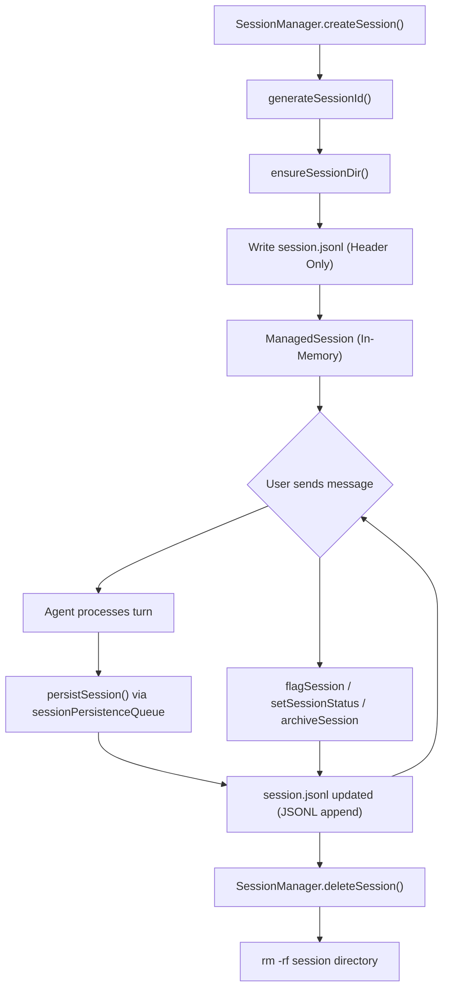
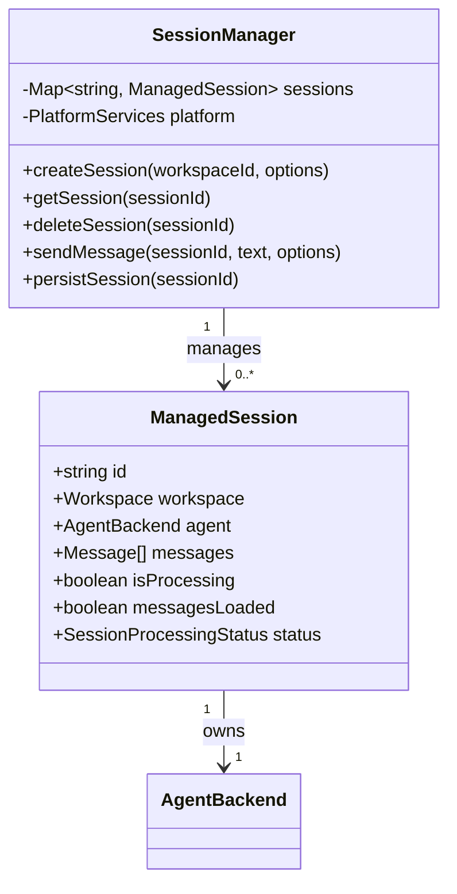
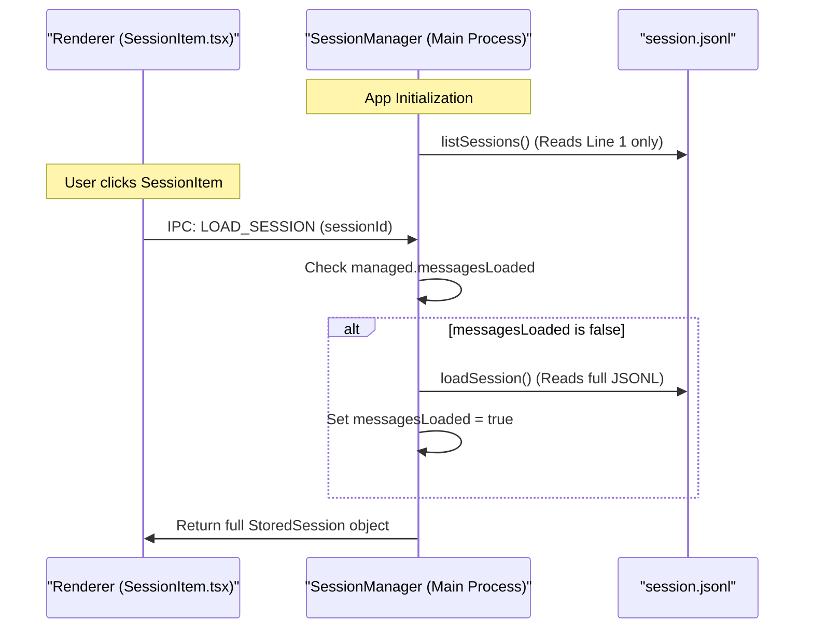

# Sessions

<details>
<summary>Relevant source files</summary>

The following files were used as context for generating this wiki page:

- [apps/electron/src/renderer/components/app-shell/SessionItem.tsx](apps/electron/src/renderer/components/app-shell/SessionItem.tsx)
- [packages/server-core/src/sessions/SessionManager.ts](packages/server-core/src/sessions/SessionManager.ts)

</details>


This page covers the session data model: how sessions are stored on disk, their persistence format, metadata fields, and the operations performed on them including status changes, flagging, archiving, read/unread tracking, branching, and sharing.

---

## On-Disk Structure

Each session lives in its own directory inside a workspace's `sessions` folder. The directory structure isolates all runtime artifacts, attachments, and the primary transaction log.

```
~/.craft-agent/workspaces/{workspaceId}/sessions/{sessionId}/
├── session.jsonl      # Header + all messages (JSONL format)
├── attachments/       # User-uploaded files (images, PDFs, Office docs)
├── plans/             # Plan files (.md) from the SubmitPlan tool
├── data/              # JSON output from the transform_data tool
├── long_responses/    # Full text of tool results summarized due to size limits
└── downloads/         # Binary files downloaded from API sources
```

The primary storage file is `session.jsonl`. It uses a specialized two-section JSONL layout to optimize for fast listing in the UI:

- **Line 1 — Header:** A single JSON object (`SessionHeader`) containing all session metadata. `SessionManager` and the UI only read this first line when populating the sidebar list. [packages/shared/src/sessions/storage.ts:79-81]()
- **Lines 2+ — Messages:** One JSON object (`StoredMessage`) per line, representing a single message, tool call, or agent event. [packages/shared/src/sessions/storage.ts:1-13]()

Sources: [packages/shared/src/sessions/storage.ts:1-81](), [packages/server-core/src/sessions/SessionManager.ts:40-71]()

---

## Session ID Format

Session IDs are human-readable slugs generated at creation time via `generateSessionId()`. They follow a `YYMMDD-adjective-noun` pattern (e.g., `250522-swift-river`). [packages/shared/src/sessions/storage.ts:66-74]()

The generator checks existing session directories to ensure uniqueness within a workspace. IDs are sanitized via `sanitizeSessionId()` before being used as path segments to prevent path traversal. [packages/shared/src/sessions/storage.ts:162-168]()

Sources: [packages/shared/src/sessions/storage.ts:66-168]()

---

## Session Header Fields

The `SessionHeader` type (line 1 of `session.jsonl`) contains all metadata the UI needs without loading full message history.

| Field | Type | Description |
|---|---|---|
| `id` | `string` | Human-readable session slug. |
| `name` | `string?` | AI-generated or user-defined title. |
| `createdAt` | `number` | Unix timestamp (ms). |
| `lastUsedAt` | `number` | Updated on every write. |
| `sessionStatus` | `string?` | Workspace-scoped status ID (e.g., `todo`, `done`). [packages/shared/src/sessions/storage.ts:553-553]() |
| `isFlagged` | `boolean?` | Whether session is pinned/flagged. [packages/shared/src/sessions/storage.ts:534-534]() |
| `isArchived` | `boolean?` | Whether session is archived. [packages/shared/src/sessions/storage.ts:535-535]() |
| `hasUnread` | `boolean?` | Explicit unread indicator for background activity. [packages/shared/src/sessions/storage.ts:546-546]() |
| `lastReadMessageId`| `string?` | ID of the last message the user has seen. |
| `labels` | `string[]?` | Array of label IDs applied to session. [packages/shared/src/sessions/storage.ts:554-554]() |
| `permissionMode` | `string?` | `safe` / `ask` / `allow-all`. |
| `enabledSourceSlugs`| `string[]?`| Sources active in this session. |
| `branchFromMessageId`| `string?` | Message ID this session branched from. [packages/shared/src/sessions/storage.ts:557-557]() |

Sources: [packages/shared/src/sessions/storage.ts:524-567](), [packages/server-core/src/sessions/SessionManager.ts:40-71]()

---

## Session Lifecycle Overview

The `SessionManager` orchestrates the lifecycle from creation to disk persistence via a `sessionPersistenceQueue`. [packages/server-core/src/sessions/SessionManager.ts:58-58]()

**Creation to Persistence Flow:**



Sources: [packages/server-core/src/sessions/SessionManager.ts:40-71](), [packages/shared/src/sessions/storage.ts:177-238]()

---

## In-Memory Representation

At runtime, `SessionManager` maintains sessions as `ManagedSession` objects. This extends the persistent header with runtime state like the active agent instance and processing status.

**Code Entity Association:**



The `agent` field is initialized via `createBackendFromConnection` when the first message is sent. [packages/server-core/src/sessions/SessionManager.ts:10-20]()

Sources: [packages/server-core/src/sessions/SessionManager.ts:1-110]()

---

## Lazy Loading and UI State

To optimize performance, the system only loads metadata initially. Full message histories are loaded on demand when a user selects a session.

**Lazy Loading Sequence:**



Sources: [apps/electron/src/renderer/components/app-shell/SessionItem.tsx:84-86](), [packages/shared/src/sessions/storage.ts:41-43]()

---

## Read / Unread State

The system tracks `hasUnread` status to notify users of background agent activity or automation results. [apps/electron/src/renderer/components/app-shell/SessionItem.tsx:135-141]()

- **Marking Unread:** If an agent finishes a turn or an automation completes while the session is not the active viewing session, `hasUnread` is set to `true`.
- **Marking Read:** When a user focuses a session, the UI calls `onMarkRead`. The main process clears the `hasUnread` flag and updates the header on disk. [apps/electron/src/renderer/components/app-shell/SessionItem.tsx:115-115]()

Sources: [apps/electron/src/renderer/components/app-shell/SessionItem.tsx:126-141](), [packages/server-core/src/sessions/SessionManager.ts:114-124]()

---

## Branching

Branching allows a user to "fork" a conversation from a specific message point. [packages/server-core/src/sessions/SessionManager.ts:98-98]()

1. **Selection:** User triggers a branch from a message in the UI.
2. **Cloning:** `SessionManager` creates a new session ID.
3. **Truncation:** The new `session.jsonl` is written with messages from the source session up to the selected `messageId`.
4. **Metadata:** `branchFromMessageId` is recorded in the new session header to maintain provenance. [packages/shared/src/sessions/storage.ts:557-557]()

Sources: [packages/server-core/src/sessions/SessionManager.ts:40-71](), [packages/shared/src/sessions/storage.ts:557-557]()

---

## Sharing to Web Viewer

Sessions can be shared to a standalone web viewer application for collaborative review.

- **Upload:** The renderer bundles the session (messages + permitted attachments) and uploads it to the viewer service.
- **Persistence:** Upon success, `sharedUrl` and `sharedId` are saved to the session header. [packages/shared/src/sessions/storage.ts:536-560]()
- **UI:** A "Shared" badge or globe icon is displayed in the `SessionItem` and `PanelHeader`. [apps/electron/src/renderer/components/app-shell/SessionItem.tsx:12-13]()

Sources: [packages/shared/src/sessions/storage.ts:536-560](), [apps/electron/src/renderer/components/app-shell/SessionItem.tsx:1-13]()