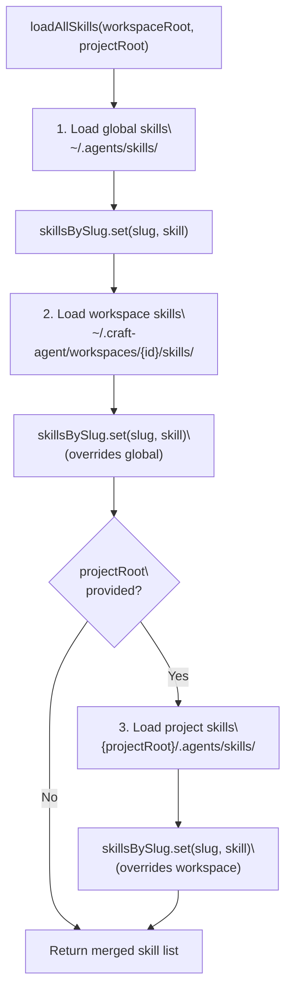
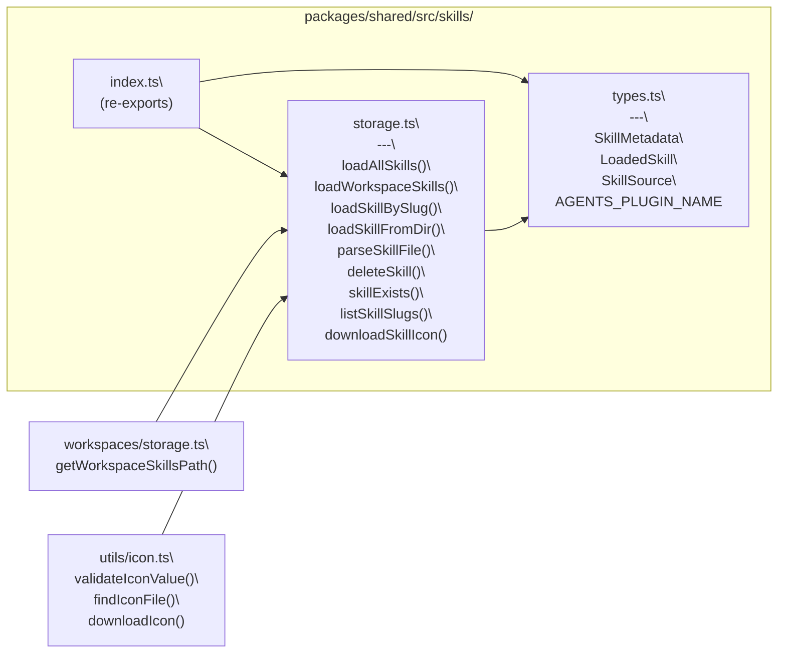
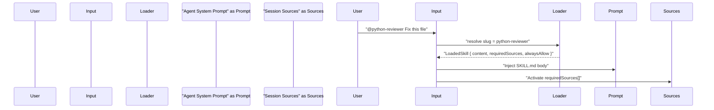

# Skills

<details>
<summary>Relevant source files</summary>

The following files were used as context for generating this wiki page:

- [README.md](README.md)
- [packages/shared/src/skills/index.ts](packages/shared/src/skills/index.ts)
- [packages/shared/src/skills/storage.ts](packages/shared/src/skills/storage.ts)
- [packages/shared/src/skills/types.ts](packages/shared/src/skills/types.ts)

</details>

This page describes what skills are, how they are stored on disk, the `SKILL.md` file format, source priority resolution, and how skills are loaded and injected into the agent system prompt. For information on how automations can reference skills via `@mentions`, see [Hooks & Automation](#4.9). For source-level integration triggered by skills, see [Sources](#4.3).

---

## What Skills Are

A skill is a named Markdown file containing specialized instructions for the agent. When a skill is activated for a session, its content is injected into the agent's system prompt, extending or focusing its behavior for a particular task domain (e.g., "Python code reviewer", "Git commit formatter", "API integration helper").

Skills are scoped per workspace and are referenced in the chat input using `@<skill-slug>` mentions. Changes to skill files take effect immediately — no restart is needed.

Sources: [README.md:97-98](), [packages/shared/src/skills/types.ts:1-8]()

---

## Directory Layout

Each skill is a directory containing a single `SKILL.md` file and an optional icon file. Skills can live in three locations, each corresponding to a different scope:

| Scope     | Path                                            | Priority |
| --------- | ----------------------------------------------- | -------- |
| Global    | `~/.agents/skills/{slug}/`                      | Lowest   |
| Workspace | `~/.craft-agent/workspaces/{id}/skills/{slug}/` | Medium   |
| Project   | `{projectRoot}/.agents/skills/{slug}/`          | Highest  |

Skills with the same slug in a higher-priority scope override those from lower-priority scopes.

**Skill directory layout (one skill):**

```
skills/
└── my-skill/
    ├── SKILL.md       # Required: frontmatter + instruction body
    └── icon.png       # Optional: icon file (auto-downloaded if URL specified)
```

Sources: [packages/shared/src/skills/storage.ts:33-36](), [README.md:309]()

---

## `SKILL.md` Format

Each skill file uses YAML frontmatter (parsed by [`gray-matter`](https://github.com/jonschlinkert/gray-matter)) followed by a Markdown body containing the actual agent instructions.

```markdown
---
name: Python Code Reviewer
description: Reviews Python code for style, correctness, and performance.
icon: 🐍
globs:
  - '**/*.py'
alwaysAllow:
  - Bash(grep:*)
requiredSources:
  - github
---

When reviewing Python code, follow PEP 8 conventions.
Check for type annotation completeness and test coverage.
...
```

### Frontmatter Fields

| Field             | Type       | Required | Description                                                        |
| ----------------- | ---------- | -------- | ------------------------------------------------------------------ |
| `name`            | `string`   | ✅       | Display name shown in skill list                                   |
| `description`     | `string`   | ✅       | Short description shown in skill list                              |
| `icon`            | `string`   | —        | Emoji (rendered directly) or URL (auto-downloaded to `icon.{ext}`) |
| `globs`           | `string[]` | —        | File patterns that auto-trigger this skill                         |
| `alwaysAllow`     | `string[]` | —        | Tool patterns automatically approved when skill is active          |
| `requiredSources` | `string[]` | —        | Source slugs auto-enabled when skill is invoked                    |

The `icon` field accepts only an emoji or an HTTPS URL. Relative paths and inline SVG are rejected by `validateIconValue`.

Sources: [packages/shared/src/skills/types.ts:11-29](), [packages/shared/src/skills/storage.ts:62-95]()

---

## Skill Source Priority

**Skill source resolution diagram:**



Sources: [packages/shared/src/skills/storage.ts:200-222]()

When loading a single skill by slug efficiently (without scanning all skills), `loadSkillBySlug` checks project → workspace → global in order and returns the first match.

Sources: [packages/shared/src/skills/storage.ts:232-246]()

---

## Key Code Entities

**Skills module structure:**



Sources: [packages/shared/src/skills/index.ts:1-20](), [packages/shared/src/skills/storage.ts:1-30]()

### Core Types

- **`SkillMetadata`** — The parsed YAML frontmatter fields (`name`, `description`, `globs`, `alwaysAllow`, `icon`, `requiredSources`). Defined in [packages/shared/src/skills/types.ts:11-29]().
- **`LoadedSkill`** — A fully loaded skill object combining `slug`, `metadata`, `content` (body text), `iconPath`, `path`, and `source`. Defined in [packages/shared/src/skills/types.ts:46-59]().
- **`SkillSource`** — Union type `'global' | 'workspace' | 'project'` identifying which scope the skill was loaded from. Defined in [packages/shared/src/skills/types.ts:32]().
- **`AGENTS_PLUGIN_NAME`** — The constant `'.agents'` used as the plugin name when registering global and project skills with the SDK, since both `~/.agents/` and `{project}/.agents/` share the same `basename`. Defined in [packages/shared/src/skills/types.ts:41-42]().

### Storage Functions

| Function              | Signature                                                   | Description                                                  |
| --------------------- | ----------------------------------------------------------- | ------------------------------------------------------------ |
| `loadAllSkills`       | `(workspaceRoot, projectRoot?) → LoadedSkill[]`             | Loads skills from all three scopes with priority merge       |
| `loadWorkspaceSkills` | `(workspaceRoot) → LoadedSkill[]`                           | Loads only workspace-scoped skills                           |
| `loadSkillBySlug`     | `(workspaceRoot, slug, projectRoot?) → LoadedSkill \| null` | Loads one skill by slug; O(1) lookup                         |
| `loadSkill`           | `(workspaceRoot, slug) → LoadedSkill \| null`               | Loads one workspace-scoped skill                             |
| `deleteSkill`         | `(workspaceRoot, slug) → boolean`                           | Removes the skill directory recursively                      |
| `skillExists`         | `(workspaceRoot, slug) → boolean`                           | Checks whether a skill directory and `SKILL.md` are present  |
| `listSkillSlugs`      | `(workspaceRoot) → string[]`                                | Returns slugs of all valid workspace skills                  |
| `downloadSkillIcon`   | `(skillDir, iconUrl) → Promise<string \| null>`             | Downloads an icon URL to `icon.{ext}` in the skill directory |

Sources: [packages/shared/src/skills/storage.ts:100-354]()

---

## @mention Injection

In the chat input field, typing `@` presents a picker that includes skill names. When a skill is selected:

1. The skill slug is embedded in the message as an `@mention`.
2. At session start (or when the mention is processed), the corresponding `SKILL.md` body is resolved using `loadSkillBySlug` and injected into the agent system prompt.
3. If the skill's `requiredSources` field lists source slugs, those sources are automatically activated for the session.
4. If the skill's `alwaysAllow` field lists tool patterns, those tools are auto-approved without user confirmation for the duration of the session.



Sources: [README.md:55](), [packages/shared/src/skills/types.ts:17-28](), [packages/shared/src/skills/storage.ts:232-246]()

---

## Icon Handling

Icons are optional and support two formats:

- **Emoji** — Stored as a string in the `icon` frontmatter field and rendered directly in the UI.
- **URL** — Validated by `validateIconValue`, then downloaded by `downloadSkillIcon` and saved as `icon.{ext}` alongside `SKILL.md`. The local file path is resolved by `findIconFile` at load time.

The helper `skillNeedsIconDownload` returns `true` when a skill has a URL icon but no corresponding local icon file has been downloaded yet.

Sources: [packages/shared/src/skills/storage.ts:333-354](), [packages/shared/src/skills/types.ts:21-26]()

---

## Creating and Managing Skills

Skills can be created by directly writing a `SKILL.md` file into the appropriate directory, or by asking the agent to create one. The agent reads its own skill directories and writes conforming files. Because skills are plain files on disk, editing them in any text editor takes effect immediately on the next session that references them.

The README documents the workflow:

> "How do I create a new skill? Describe what the skill should do, give it context. The agent takes care of the rest."

> "Do I need to restart after changes? No. Everything is instant. Mention new skills or sources with `@`, even mid-conversation."

Sources: [README.md:51-55]()
