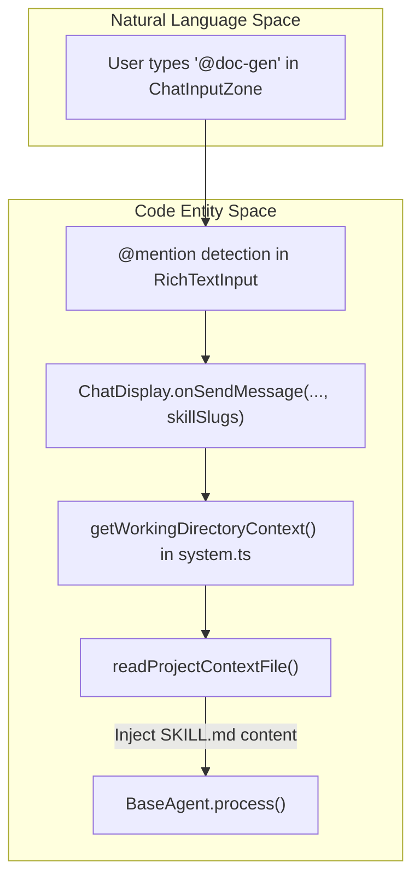
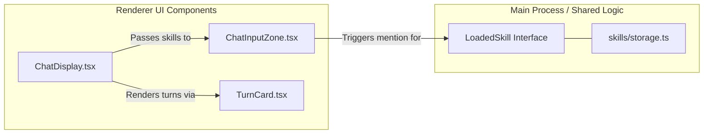

# Skills

<details>
<summary>Relevant source files</summary>

The following files were used as context for generating this wiki page:

- [apps/electron/src/renderer/components/app-shell/ChatDisplay.tsx](apps/electron/src/renderer/components/app-shell/ChatDisplay.tsx)
- [packages/shared/package.json](packages/shared/package.json)
- [packages/shared/src/agent/session-scoped-tools.ts](packages/shared/src/agent/session-scoped-tools.ts)
- [packages/shared/src/prompts/system.ts](packages/shared/src/prompts/system.ts)
- [packages/ui/src/components/chat/TurnCard.tsx](packages/ui/src/components/chat/TurnCard.tsx)

</details>


Skills are per-workspace or per-project markdown instruction files that extend or focus an agent's behavior for specific task domains. They are stored as discrete directories containing a `SKILL.md` file with YAML frontmatter and a Markdown body. Skills are referenced via `@mention` in the chat input, which triggers the injection of their content into the agent's system prompt and activates any required tools or sources.

---

## What Skills Are

A skill is a reusable set of instructions. When a skill is activated for a session, its content is appended to the agent's system prompt. This allows users to create specialized personas (e.g., "@ui-reviewer", "@git-expert") without modifying the core agent logic. 

Skills are dynamic: changes to the underlying `SKILL.md` files are reflected immediately in new sessions or message turns without requiring an application restart.

Sources: [packages/shared/package.json:33-33](), [packages/shared/package.json:59-59]()

---

## Directory Layout and Storage

Skills are organized into directories. Each directory must contain a `SKILL.md` file. The system supports three scopes of skills, resolved in a specific priority order:

| Scope | Location | Description |
| :--- | :--- | :--- |
| **Project** | `{projectRoot}/.agents/skills/{slug}/` | High priority; specific to a codebase. |
| **Workspace** | `~/.craft-agent/workspaces/{id}/skills/{slug}/` | Medium priority; specific to a Craft workspace. |
| **Global** | `~/.agents/skills/{slug}/` | Low priority; available across all workspaces. |

### File Structure
```text
skills/
└── python-expert/
    ├── SKILL.md       # Required: contains frontmatter and instructions
    └── icon.png       # Optional: local cached icon file
```

Sources: [packages/shared/src/prompts/system.ts:41-41](), [packages/shared/src/prompts/system.ts:62-71]()

---

## The `SKILL.md` Format

Skill files use YAML frontmatter for metadata and standard Markdown for the instruction set.

### Frontmatter Schema
The frontmatter is parsed into a `SkillMetadata` object. Key fields include:
- `name`: The display name in the UI.
- `description`: A brief summary of the skill's purpose.
- `icon`: An emoji or an HTTPS URL.
- `globs`: File patterns that, when matched in the working directory, can auto-suggest the skill.
- `alwaysAllow`: A list of tool patterns (e.g., `Bash(*)`) that are pre-approved when this skill is active.
- `requiredSources`: Slugs of data sources (MCP, API, etc.) that must be enabled for this skill to function.

### Example `SKILL.md`
```markdown
---
name: Documentation Specialist
description: Expert at writing technical wiki pages.
icon: 📚
alwaysAllow:
  - Bash(ls)
  - READ_FILE
requiredSources:
  - internal-docs-mcp
---
You are a technical writer. When asked to document code:
1. Analyze the file structure.
2. Use Mermaid diagrams for architecture.
3. Cite line numbers using the standard syntax.
```

Sources: [packages/shared/src/prompts/system.ts:13-14](), [packages/shared/src/prompts/system.ts:154-173]()

---

## Skill Resolution and Injection

The system resolves skills by merging the three scopes. If a slug exists in both "Project" and "Workspace" scopes, the "Project" version takes precedence.

### Technical Data Flow: From Mention to Prompt
When a user types `@mention` in the `ChatInputZone`, the `ChatDisplay` passes the selected `skillSlugs` to the message sending pipeline. These are then processed by the agent backend to modify the system prompt.

**Code Entity Mapping: Skill Resolution**

Sources: [apps/electron/src/renderer/components/app-shell/ChatDisplay.tsx:130-130](), [packages/shared/src/prompts/system.ts:182-190](), [packages/shared/src/prompts/system.ts:154-160]()

---

## UI Integration

The `ChatDisplay` component manages the state of active skills and provides the autocomplete interface via `RichTextInput`.

### Component Architecture
The UI facilitates skill interaction through several specialized components:
- **ChatInputZone**: Captures the `@mention` and maintains the list of `LoadedSkill` objects.
- **TurnCard**: When a skill is used in a message, the `TurnCard` renders the assistant's response which may have been influenced by that skill's instructions.
- **Skill Selection**: Available skills are passed to the renderer via `ChatDisplayProps`.

**UI to Code Association**

Sources: [apps/electron/src/renderer/components/app-shell/ChatDisplay.tsx:178-180](), [packages/ui/src/components/chat/TurnCard.tsx:58-63](), [packages/shared/src/agent/session-scoped-tools.ts:104-106]()

---

## Automated Discovery (Context Files)

Beyond explicit `@mentions`, the system automatically looks for "Project Context Files" which function as implicit skills for a specific directory.
- **Patterns**: The system searches for `agents.md` or `claude.md` (case-insensitive).
- **Recursion**: In monorepos, it searches recursively up to `MAX_CONTEXT_FILES` (30), excluding common directories like `node_modules` or `dist`.
- **Caching**: The glob walk is cached in `contextFileCache` with a 5-minute TTL to prevent performance degradation in large repositories.
- **Injection**: These files are automatically read and included in the prompt via `readProjectContextFile` to provide immediate context about the codebase.

Sources: [packages/shared/src/prompts/system.ts:23-35](), [packages/shared/src/prompts/system.ts:41-41](), [packages/shared/src/prompts/system.ts:79-81](), [packages/shared/src/prompts/system.ts:94-101]()