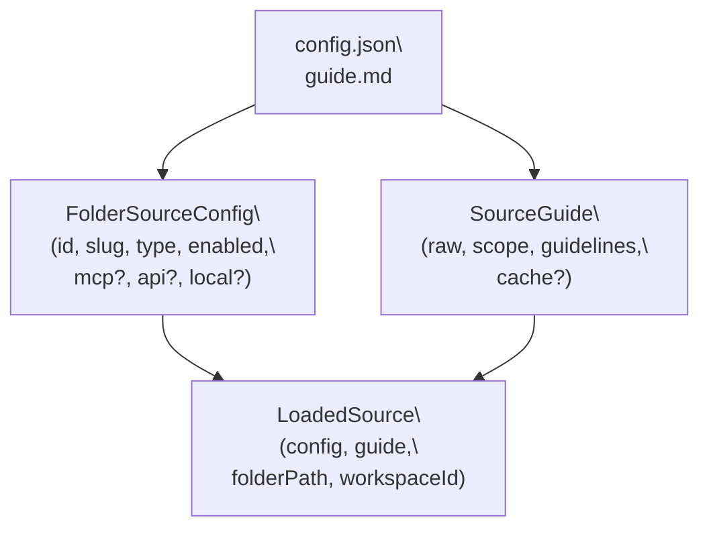
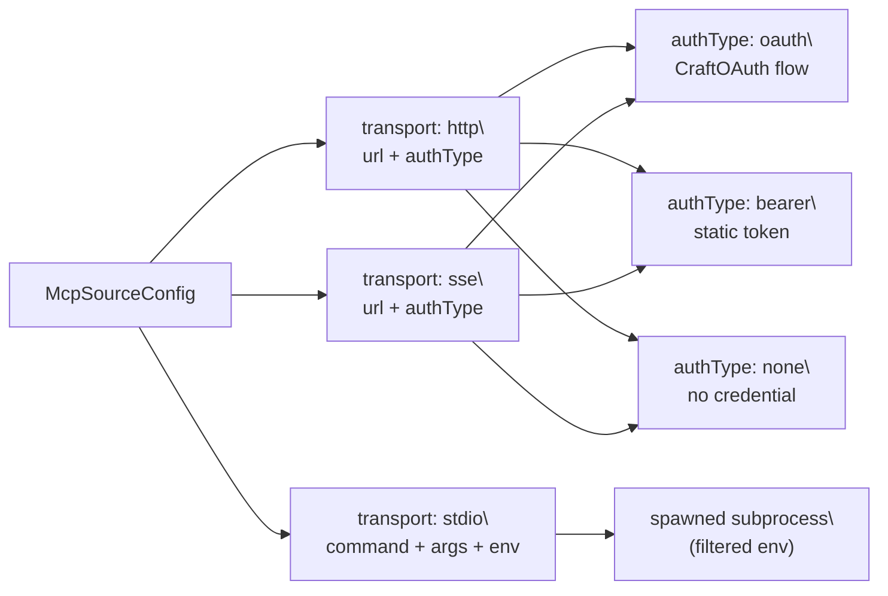
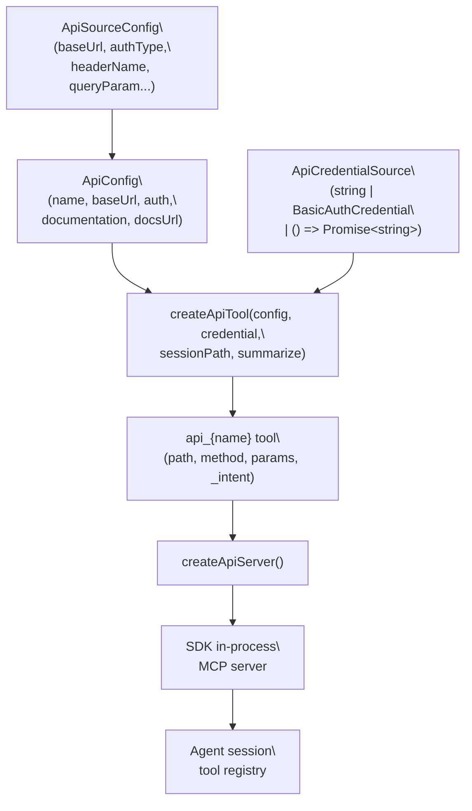
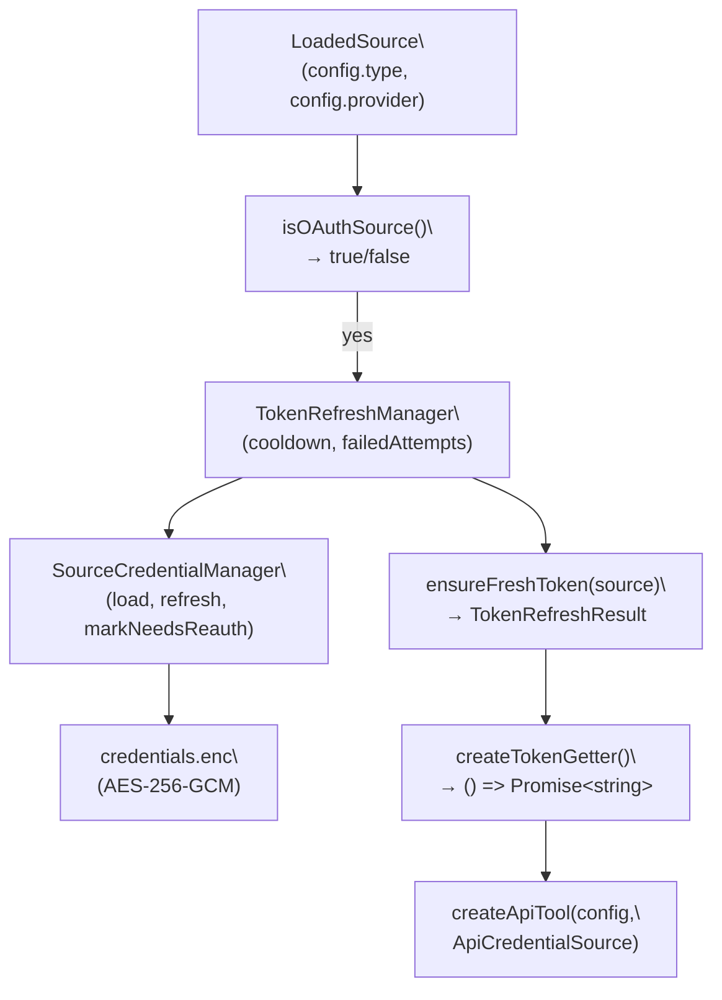

# Sources

<details>
<summary>Relevant source files</summary>

The following files were used as context for generating this wiki page:

- [README.md](README.md)
- [packages/shared/src/auth/oauth.ts](packages/shared/src/auth/oauth.ts)
- [packages/shared/src/sources/api-tools.ts](packages/shared/src/sources/api-tools.ts)
- [packages/shared/src/sources/token-refresh-manager.ts](packages/shared/src/sources/token-refresh-manager.ts)
- [packages/shared/src/sources/types.ts](packages/shared/src/sources/types.ts)

</details>

This page covers the Sources system: what source types exist, how they are configured on disk, how MCP and REST API connections are established, how authentication is managed, and how sources are activated per session.

For information about the workspace that owns sources, see [Workspaces](#4.1). For the automation triggers that fire when sources are used, see [Hooks & Automation](#4.9). For the IPC surface that the renderer uses to manage sources, see [IPC Communication Layer](#2.6). For the credential encryption backing credential storage, see [Credential Storage & Encryption](#7.2).

---

## Overview

A **source** is a named, configured connection to an external service or local resource. Sources are scoped to a workspace and can be activated per-session using `@mentions` in the input field. Once active, the agent can invoke the source's tools as part of its reasoning.

There are three source types:

| Type  | Value   | Description                                                |
| ----- | ------- | ---------------------------------------------------------- |
| MCP   | `mcp`   | Model Context Protocol server — remote or local subprocess |
| API   | `api`   | REST API endpoint with configurable auth                   |
| Local | `local` | Local filesystem or application path                       |

Sources are defined by the `SourceType` union type in [packages/shared/src/sources/types.ts:16]().

---

## On-Disk Layout

Each source lives in its own folder under the workspace directory:

```
~/.craft-agent/workspaces/{workspaceId}/sources/{sourceSlug}/
├── config.json     # FolderSourceConfig — connection settings
└── guide.md        # Agent-facing documentation + optional YAML frontmatter cache
```

The `config.json` is parsed into a `FolderSourceConfig` object. The `guide.md` is parsed into a `SourceGuide` object containing scope, guidelines, context, and optionally a YAML frontmatter cache block.

**`FolderSourceConfig` fields (abbreviated):**

| Field              | Type                      | Purpose                                                |
| ------------------ | ------------------------- | ------------------------------------------------------ |
| `id`               | `string`                  | Unique source ID                                       |
| `slug`             | `string`                  | URL-safe name, used in `@mentions` and credential keys |
| `type`             | `SourceType`              | `mcp`, `api`, or `local`                               |
| `enabled`          | `boolean`                 | Whether the source is active                           |
| `provider`         | `string`                  | Freeform label (e.g., `"linear"`, `"google"`)          |
| `mcp`              | `McpSourceConfig?`        | Present when `type === 'mcp'`                          |
| `api`              | `ApiSourceConfig?`        | Present when `type === 'api'`                          |
| `local`            | `LocalSourceConfig?`      | Present when `type === 'local'`                        |
| `isAuthenticated`  | `boolean?`                | Runtime auth status                                    |
| `connectionStatus` | `SourceConnectionStatus?` | `connected`, `needs_auth`, `failed`, etc.              |

Full interface at [packages/shared/src/sources/types.ts:334-372]().

At runtime, sources are loaded into `LoadedSource` objects, which bundle `config`, `guide`, `folderPath`, `workspaceRootPath`, and `workspaceId` together [packages/shared/src/sources/types.ts:394-421]().

**Diagram: Source Disk Structure to Runtime Types**



Sources: [packages/shared/src/sources/types.ts:334-421]()

---

## MCP Sources

MCP sources connect to Model Context Protocol servers. The `mcp` block of `FolderSourceConfig` holds a `McpSourceConfig` object.

### Transport Variants

The `McpTransport` type [packages/shared/src/sources/types.ts:207]() has three values:

| Transport | Value   | Description                                               |
| --------- | ------- | --------------------------------------------------------- |
| HTTP      | `http`  | HTTP streaming transport to a remote URL                  |
| SSE       | `sse`   | Server-Sent Events transport to a remote URL              |
| Stdio     | `stdio` | Spawns a local subprocess; communicates over stdin/stdout |

`transport` defaults to `http` if omitted.

### MCP Configuration Fields

| Field      | Applies To    | Purpose                                            |
| ---------- | ------------- | -------------------------------------------------- |
| `url`      | `http`, `sse` | Remote endpoint URL                                |
| `authType` | `http`, `sse` | `oauth`, `bearer`, or `none`                       |
| `clientId` | `http`, `sse` | OAuth client ID (non-secret)                       |
| `command`  | `stdio`       | Command to spawn (e.g., `npx`, `python`)           |
| `args`     | `stdio`       | Arguments passed to the command                    |
| `env`      | `stdio`       | Environment variables injected into the subprocess |

Full interface at [packages/shared/src/sources/types.ts:213-252]().

### MCP Authentication Types

The `SourceMcpAuthType` type [packages/shared/src/sources/types.ts:22]() applies to remote MCP servers:

- `oauth`: Full OAuth 2.0 + PKCE flow via `CraftOAuth`
- `bearer`: Static bearer token stored in `credentials.enc`
- `none`: No authentication (public server)

**Diagram: MCP Source Connection Paths**



Sources: [packages/shared/src/sources/types.ts:207-252]()

### Stdio Security

When spawning stdio MCP subprocesses, sensitive environment variables are filtered from the parent process environment before passing to the child. Variables like `ANTHROPIC_API_KEY`, `OPENAI_API_KEY`, `GITHUB_TOKEN`, AWS credentials, and others are blocked. If a subprocess needs a specific variable, it must be declared explicitly in the source's `env` field.

---

## API Sources

API sources connect to REST APIs. The `api` block holds an `ApiSourceConfig` object [packages/shared/src/sources/types.ts:267-292]().

### API Authentication Methods

The `ApiAuthType` type [packages/shared/src/sources/types.ts:27]():

| Auth Type       | Value    | Behavior                                                                                                     |
| --------------- | -------- | ------------------------------------------------------------------------------------------------------------ |
| Bearer token    | `bearer` | `Authorization: Bearer {token}` header. `authScheme` field overrides `Bearer` prefix; empty string omits it. |
| Custom header   | `header` | Single or multi-header credential (e.g., `x-api-key`, or `DD-API-KEY` + `DD-APPLICATION-KEY`)                |
| Query parameter | `query`  | Token appended to URL as query param named by `queryParam`                                                   |
| Basic auth      | `basic`  | `Authorization: Basic {base64(username:password)}`                                                           |
| OAuth           | `oauth`  | Managed OAuth flow (Google, Slack, Microsoft)                                                                |
| None            | `none`   | No authentication (public API)                                                                               |

Header construction is handled by `buildHeaders()` in [packages/shared/src/sources/api-tools.ts:69-119](), which reads `ApiConfig.auth` and the resolved credential to produce a `Record<string, string>`.

The `buildAuthorizationHeader()` function [packages/shared/src/sources/api-tools.ts:35-40]() handles the `authScheme` nuance: `undefined` defaults to `"Bearer"`, an empty string `""` emits the raw token with no prefix.

### Dynamic API Tool Factory

Each API source produces a single flexible MCP tool at session start via `createApiTool()` [packages/shared/src/sources/api-tools.ts:203-305](). The tool is named `api_{config.name}` and accepts:

- `path` — the API endpoint path
- `method` — `GET | POST | PUT | DELETE | PATCH`
- `params` — request body or query parameters
- `_intent` — description of intent (used for large-response summarization)

`createApiServer()` [packages/shared/src/sources/api-tools.ts:316-331]() wraps the tool in an in-process SDK MCP server for use by the agent.

**Diagram: API Source → Agent Tool**



Sources: [packages/shared/src/sources/api-tools.ts:203-331]()

### Google, Slack, and Microsoft OAuth APIs

These three providers use OAuth for API authentication. They are listed in `API_OAUTH_PROVIDERS` [packages/shared/src/sources/types.ts:170]() and identified by `isApiOAuthProvider()`.

**Google**: Requires user-supplied `googleOAuthClientId` and `googleOAuthClientSecret` in `ApiSourceConfig`. Scopes are derived from `googleService` (e.g., `gmail`, `calendar`, `drive`) or explicitly via `googleScopes`.

**Slack**: Uses user-scoped OAuth (`user_scope`). Scope derived from `slackService` or `slackUserScopes`.

**Microsoft**: Uses Microsoft Graph API. Scope derived from `microsoftService` (e.g., `outlook`, `onedrive`, `teams`) or `microsoftScopes`. Client ID and secret are baked into the build via environment variables.

The helper functions `inferGoogleServiceFromUrl()`, `inferSlackServiceFromUrl()`, and `inferMicrosoftServiceFromUrl()` [packages/shared/src/sources/types.ts:50-151]() attempt to auto-detect the service from the `baseUrl`.

---

## Local Sources

Local sources point to a path on the filesystem. The `local` block holds a `LocalSourceConfig`:

```
path: string         — absolute path to the directory or file
format?: string      — hint: 'filesystem' | 'obsidian' | 'git' | 'sqlite' | etc.
```

[packages/shared/src/sources/types.ts:297-300]()

Local sources are surfaced to the agent as filesystem context rather than as MCP tools.

---

## Known Providers

Certain `provider` string values trigger special handling:

| Provider    | Type | Auth                                      |
| ----------- | ---- | ----------------------------------------- |
| `google`    | API  | Google OAuth (user-supplied credentials)  |
| `microsoft` | API  | Microsoft OAuth (build-baked credentials) |
| `slack`     | API  | Slack OAuth (build-baked credentials)     |
| `linear`    | MCP  | Standard MCP OAuth via `CraftOAuth`       |
| `github`    | MCP  | Standard MCP OAuth via `CraftOAuth`       |
| `notion`    | MCP  | Standard MCP OAuth via `CraftOAuth`       |
| `exa`       | API  | API key                                   |

Defined as `KnownProvider` type at [packages/shared/src/sources/types.ts:157-164]().

---

## OAuth Flow for MCP Sources

MCP sources with `authType: 'oauth'` use the `CraftOAuth` class [packages/shared/src/auth/oauth.ts:42-444]().

**Flow:**

1. `discoverOAuthMetadata()` discovers the authorization and token endpoints using RFC 9728 (protected resource metadata via `WWW-Authenticate` header) and falls back to RFC 8414 well-known locations [packages/shared/src/auth/oauth.ts:751-788]().
2. If the server supports dynamic client registration (`registration_endpoint`), the client is registered automatically [packages/shared/src/auth/oauth.ts:69-96]().
3. PKCE (`code_challenge`, `code_verifier`) and CSRF `state` are generated.
4. A local HTTP callback server binds to a port in the range `8914–8924` [packages/shared/src/auth/oauth.ts:332]().
5. The system browser opens to the authorization URL.
6. On callback, the code is exchanged for tokens at the token endpoint [packages/shared/src/auth/oauth.ts:99-145]().

SSRF protection is enforced in `isUrlSafeToFetch()` [packages/shared/src/auth/oauth.ts:508-548](), which rejects non-HTTPS URLs, localhost, and private IP ranges during discovery.

**Diagram: MCP OAuth Flow**

```mermaid
sequenceDiagram
    participant App as "CraftOAuth"
    participant Server as "MCP OAuth Server"
    participant Browser as "Browser"
    participant Callback as "Local HTTP\
Callback Server\
(port 8914-8924)"

    App->>Server: "discoverOAuthMetadata()\
(RFC 9728 / RFC 8414)"
    Server-->>App: "authorization_endpoint\
token_endpoint"
    App->>Server: "registerClient() (if registration_endpoint)"
    Server-->>App: "client_id"
    App->>Callback: "startCallbackServer(state)"
    App->>Browser: "open authURL (PKCE + state)"
    Browser->>Server: "user authorizes"
    Server->>Callback: "GET /oauth/callback?code=...&state=..."
    Callback-->>App: "authorization code"
    App->>Server: "exchangeCodeForTokens(code, verifier)"
    Server-->>App: "access_token, refresh_token, expires_in"
```

Sources: [packages/shared/src/auth/oauth.ts:211-301](), [packages/shared/src/auth/oauth.ts:751-788]()

---

## Credential Management

Credentials for all source types are stored encrypted in `~/.craft-agent/credentials.enc` (AES-256-GCM). The `SourceCredentialManager` class is responsible for loading and storing per-source credentials. Credential keys are scoped as `source_oauth::{workspaceId}::{sourceSlug}`.

The `isOAuthSource()` function [packages/shared/src/sources/types.ts:187-199]() identifies sources that require proactive token refresh:

- MCP sources with `mcp.authType === 'oauth'`
- API sources whose `provider` is in `API_OAUTH_PROVIDERS` (`google`, `slack`, `microsoft`)

---

## Token Refresh

`TokenRefreshManager` [packages/shared/src/sources/token-refresh-manager.ts:39-238]() handles proactive token refresh with rate limiting. Key behaviors:

| Method                              | Purpose                                                             |
| ----------------------------------- | ------------------------------------------------------------------- |
| `needsRefresh(source)`              | Returns `true` if the token is expired or expiring within 5 minutes |
| `ensureFreshToken(source)`          | Refreshes if needed; skips if in cooldown after a recent failure    |
| `getSourcesNeedingRefresh(sources)` | Filters an array of `LoadedSource` to those needing refresh         |
| `refreshSources(sources)`           | Refreshes multiple sources in parallel                              |
| `isInCooldown(slug)`                | Checks 5-minute post-failure cooldown                               |

The `createTokenGetter()` factory [packages/shared/src/sources/token-refresh-manager.ts:244-255]() wraps a `TokenRefreshManager` into an `() => Promise<string>` function that can be passed as an `ApiCredentialSource` to `createApiTool()`.

**Diagram: Credential & Token Refresh Wiring**



Sources: [packages/shared/src/sources/token-refresh-manager.ts:39-255](), [packages/shared/src/sources/types.ts:187-199]()

---

## Session Activation

Sources are opt-in per session. A user can activate a source by `@mentioning` its slug in the chat input. When a session starts with active sources:

1. Each active `LoadedSource` is loaded from disk.
2. OAuth sources are checked via `getSourcesNeedingRefresh()` and refreshed via `refreshSources()` before the agent runs.
3. For API sources, `createApiServer()` produces an in-process MCP server that is passed to the agent SDK.
4. For MCP sources, a connection is established to the remote server (or subprocess) using the configured transport.
5. The `guide.md` of each active source is injected into the agent's system prompt to provide context about the source's capabilities and usage patterns.

For the session lifecycle in detail, see [Session Lifecycle](#2.7). For how the agent resolves and invokes source tools, see [Agent System](#2.3).

---

## Connection Status

The `SourceConnectionStatus` type [packages/shared/src/sources/types.ts:310]() tracks the state of each source:

| Status           | Meaning                                                 |
| ---------------- | ------------------------------------------------------- |
| `connected`      | Last test succeeded                                     |
| `needs_auth`     | Authentication is required or expired                   |
| `failed`         | Connection attempt failed with an error                 |
| `untested`       | Source has never been tested                            |
| `local_disabled` | Stdio source is disabled (local MCP servers turned off) |

`connectionError` on `FolderSourceConfig` stores the error message when `connectionStatus` is `failed`.
