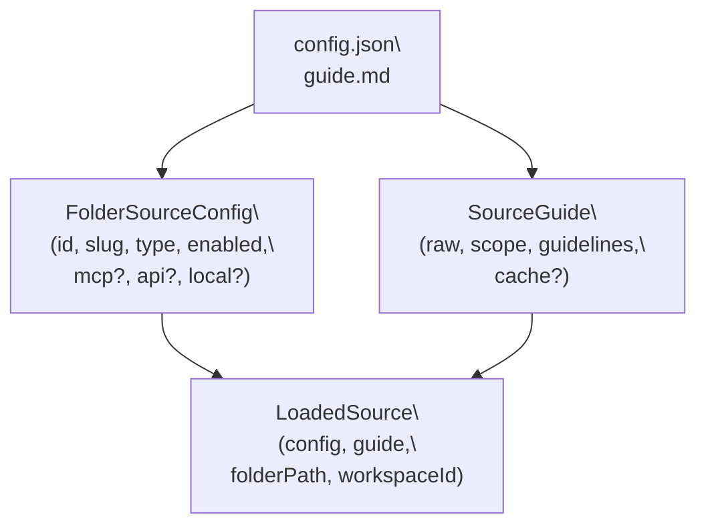
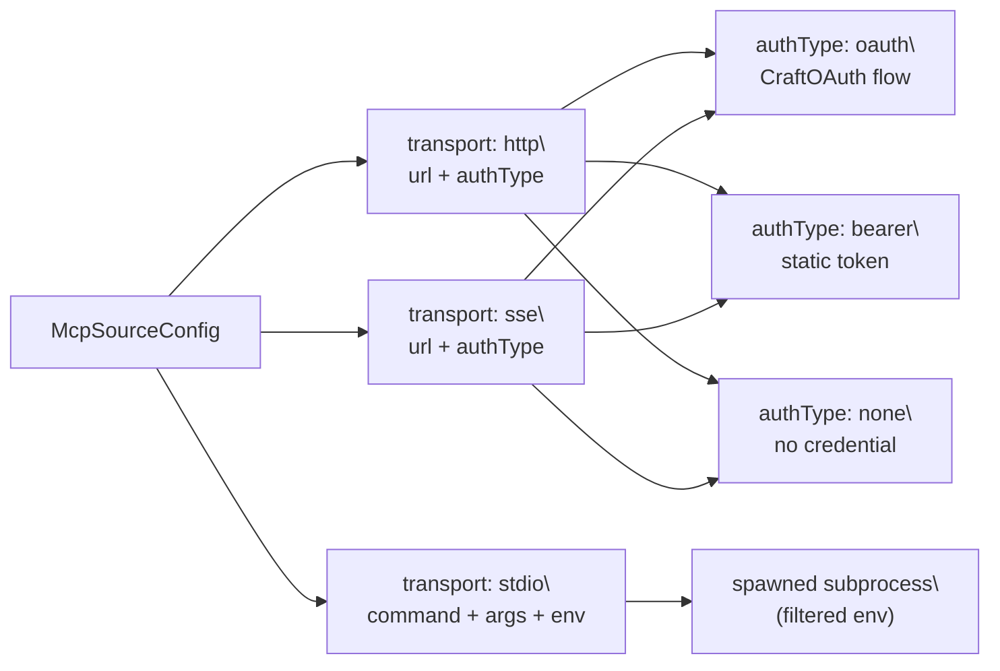
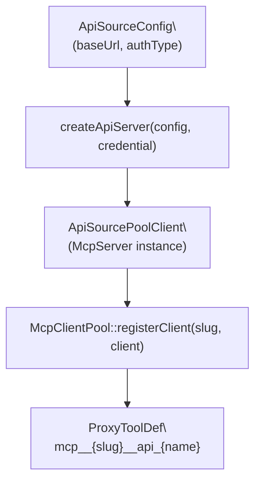
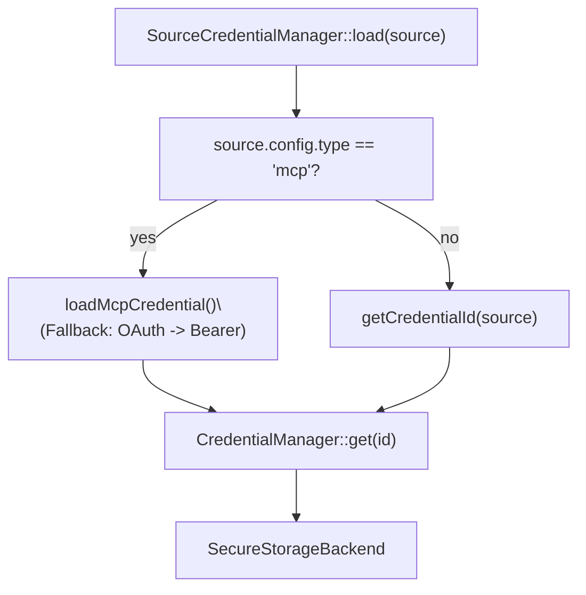

# Sources

<details>
<summary>Relevant source files</summary>

The following files were used as context for generating this wiki page:

- [packages/shared/src/mcp/mcp-pool.ts](packages/shared/src/mcp/mcp-pool.ts)
- [packages/shared/src/sources/credential-manager.ts](packages/shared/src/sources/credential-manager.ts)
- [packages/shared/src/sources/token-refresh-manager.ts](packages/shared/src/sources/token-refresh-manager.ts)

</details>


This page covers the Sources system: what source types exist, how they are configured on disk, how MCP and REST API connections are established, how authentication is managed, and how sources are activated per session.

For information about the workspace that owns sources, see [Workspaces](#4.1). For the automation triggers that fire when sources are used, see [Hooks & Automation](#4.9). For the IPC surface that the renderer uses to manage sources, see [IPC Communication Layer](#2.6). For the credential encryption backing credential storage, see [Credential Storage & Encryption](#7.2).

---

## Overview

A **source** is a named, configured connection to an external service or local resource. Sources are scoped to a workspace and can be activated per-session using `@mentions` in the input field. Once active, the agent can invoke the source's tools as part of its reasoning.

There are three source types:

| Type | Value | Description |
|---|---|---|
| MCP | `mcp` | Model Context Protocol server — remote or local subprocess |
| API | `api` | REST API endpoint with configurable auth |
| Local | `local` | Local filesystem or application path |

Sources are defined by the `SourceType` union type in [packages/shared/src/sources/types.ts:16]().

---

## On-Disk Layout

Each source lives in its own folder under the workspace directory:

```
~/.craft-agent/workspaces/{workspaceId}/sources/{sourceSlug}/
├── config.json     # FolderSourceConfig — connection settings
└── guide.md        # Agent-facing documentation + optional YAML frontmatter cache
```

The `config.json` is parsed into a `FolderSourceConfig` object. The `guide.md` is parsed into a `SourceGuide` object containing scope, guidelines, context, and optionally a YAML frontmatter cache block.

**`FolderSourceConfig` fields (abbreviated):**

| Field | Type | Purpose |
|---|---|---|
| `id` | `string` | Unique source ID |
| `slug` | `string` | URL-safe name, used in `@mentions` and credential keys |
| `type` | `SourceType` | `mcp`, `api`, or `local` |
| `enabled` | `boolean` | Whether the source is active |
| `provider` | `string` | Freeform label (e.g., `"linear"`, `"google"`) |
| `mcp` | `McpSourceConfig?` | Present when `type === 'mcp'` |
| `api` | `ApiSourceConfig?` | Present when `type === 'api'` |
| `local` | `LocalSourceConfig?` | Present when `type === 'local'` |
| `isAuthenticated` | `boolean?` | Runtime auth status |
| `connectionStatus` | `SourceConnectionStatus?` | `connected`, `needs_auth`, `failed`, etc. |

Full interface at [packages/shared/src/sources/types.ts:334-372]().

At runtime, sources are loaded into `LoadedSource` objects, which bundle `config`, `guide`, `folderPath`, `workspaceRootPath`, and `workspaceId` together [packages/shared/src/sources/types.ts:394-421]().

**Diagram: Source Disk Structure to Runtime Types**



Sources: [packages/shared/src/sources/types.ts:334-421]()

---

## MCP Sources

MCP sources connect to Model Context Protocol servers. The `mcp` block of `FolderSourceConfig` holds a `McpSourceConfig` object.

### Transport Variants

The `McpTransport` type [packages/shared/src/sources/types.ts:207]() has three values:

| Transport | Value | Description |
|---|---|---|
| HTTP | `http` | HTTP streaming transport to a remote URL |
| SSE | `sse` | Server-Sent Events transport to a remote URL |
| Stdio | `stdio` | Spawns a local subprocess; communicates over stdin/stdout |

`transport` defaults to `http` if omitted.

### MCP Configuration Fields

| Field | Applies To | Purpose |
|---|---|---|
| `url` | `http`, `sse` | Remote endpoint URL |
| `authType` | `http`, `sse` | `oauth`, `bearer`, or `none` |
| `clientId` | `http`, `sse` | OAuth client ID (non-secret) |
| `command` | `stdio` | Command to spawn (e.g., `npx`, `python`) |
| `args` | `stdio` | Arguments passed to the command |
| `env` | `stdio` | Environment variables injected into the subprocess |

Full interface at [packages/shared/src/sources/types.ts:213-252]().

### MCP Authentication Types

The `SourceMcpAuthType` type [packages/shared/src/sources/types.ts:22]() applies to remote MCP servers:

- `oauth`: Full OAuth 2.0 + PKCE flow via `CraftOAuth`
- `bearer`: Static bearer token stored in `credentials.enc`
- `none`: No authentication (public server)

**Diagram: MCP Source Connection Paths**



Sources: [packages/shared/src/sources/types.ts:207-252]()

### MCP Client Pool

The `McpClientPool` [packages/shared/src/mcp/mcp-pool.ts:101]() manages all active MCP connections in the main process. It provides a unified interface for both remote MCP servers and in-process API sources.

- **Tool Proxying**: It maps tool names to a `mcp__{slug}__{toolName}` convention [packages/shared/src/mcp/mcp-pool.ts:162]().
- **Connection Lifecycle**: Handles `connect()`, `disconnect()`, and `sync()` logic [packages/shared/src/mcp/mcp-pool.ts:173-238]().
- **Change Detection**: The `mcpConfigChanged()` helper determines if a connection needs to be restarted based on URL or auth header changes [packages/shared/src/mcp/mcp-pool.ts:85-99]().

---

## API Sources

API sources connect to REST APIs. The `api` block holds an `ApiSourceConfig` object [packages/shared/src/sources/types.ts:267-292]().

### API Authentication Methods

The `ApiAuthType` type [packages/shared/src/sources/types.ts:27]():

| Auth Type | Value | Behavior |
|---|---|---|
| Bearer token | `bearer` | `Authorization: Bearer {token}` header. `authScheme` field overrides `Bearer` prefix [packages/shared/src/sources/api-tools.ts:35-40](). |
| Custom header | `header` | Single or multi-header credential [packages/shared/src/sources/api-tools.ts:95-105](). |
| Query parameter | `query` | Token appended to URL as query param named by `queryParam` [packages/shared/src/sources/api-tools.ts:139-142](). |
| Basic auth | `basic` | `Authorization: Basic {base64(username:password)}` [packages/shared/src/sources/api-tools.ts:86-92](). |
| OAuth | `oauth` | Managed OAuth flow (Google, Slack, Microsoft) |
| None | `none` | No authentication (public API) |

### Dynamic API Tool Factory

Each API source produces a single flexible MCP tool via `createApiTool()` [packages/shared/src/sources/api-tools.ts:203](). These are integrated into the `McpClientPool` using the `ApiSourcePoolClient` adapter [packages/shared/src/mcp/api-source-pool-client.ts:14]().

**Diagram: API Source → Agent Tool Integration**



Sources: [packages/shared/src/sources/api-tools.ts:203-331](), [packages/shared/src/mcp/mcp-pool.ts:155-168](), [packages/shared/src/mcp/api-source-pool-client.ts:14]()

---

## Local Sources

Local sources point to a path on the filesystem. The `local` block holds a `LocalSourceConfig`:

```
path: string         — absolute path to the directory or file
format?: string      — hint: 'filesystem' | 'obsidian' | 'git' | 'sqlite' | etc.
```

[packages/shared/src/sources/types.ts:297-300]()

---

## Credential Management

The `SourceCredentialManager` [packages/shared/src/sources/credential-manager.ts:116]() provides unified CRUD operations for source credentials.

### Credential Types
- **Simple**: String tokens for bearer/query auth.
- **Basic**: `username` and `password` [packages/shared/src/sources/credential-manager.ts:71-74]().
- **Multi-Header**: `Record<string, string>` for APIs like Datadog [packages/shared/src/sources/credential-manager.ts:80]().

### Secure Storage
The `CredentialManager` [packages/shared/src/credentials/manager.ts:14]() uses `SecureStorageBackend` to persist data. The `SourceCredentialManager` resolves the correct `CredentialId` (e.g., `source_oauth`, `source_bearer`, `api_key`) based on the source's configuration [packages/shared/src/sources/credential-manager.ts:129-131]().

**Diagram: Credential Resolution Flow**



Sources: [packages/shared/src/sources/credential-manager.ts:116-187](), [packages/shared/src/credentials/manager.ts:14]()

---

## Token Refresh

The `TokenRefreshManager` [packages/shared/src/sources/token-refresh-manager.ts:39]() handles the lifecycle of OAuth tokens to ensure they are valid before a session starts.

- **Proactive Refresh**: `needsRefresh()` checks if a token is expired or expiring within 5 minutes [packages/shared/src/sources/token-refresh-manager.ts:95-104]().
- **Rate Limiting**: Failed refreshes trigger a cooldown period (default 5 minutes) to prevent hammering auth providers [packages/shared/src/sources/token-refresh-manager.ts:19-20](), [packages/shared/src/sources/token-refresh-manager.ts:57-61]().
- **Race Condition Prevention**: `SourceCredentialManager` tracks `pendingRefreshes` in a Map to ensure only one refresh happens at a time for a given source [packages/shared/src/sources/credential-manager.ts:119]().

Sources: [packages/shared/src/sources/token-refresh-manager.ts:39-176](), [packages/shared/src/sources/credential-manager.ts:119]()