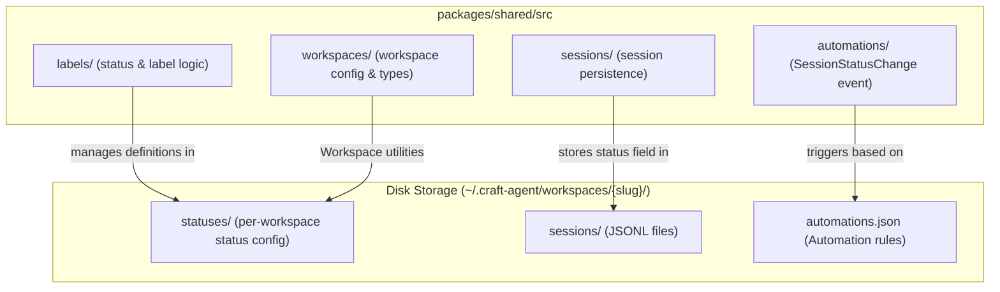
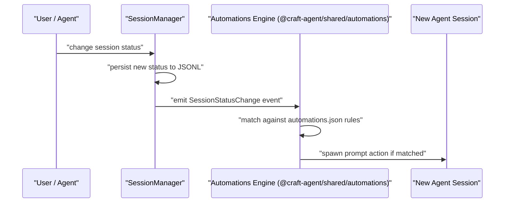

# Status Workflow

<details>
<summary>Relevant source files</summary>

The following files were used as context for generating this wiki page:

- [packages/shared/package.json](packages/shared/package.json)

</details>


This page covers the dynamic session status system in Craft Agents: how statuses are defined per workspace, how they drive session workflow, and how status changes trigger automations. For how sessions themselves are created and persisted, see [Sessions (4.2)](). For the automation system that reacts to status changes, see [Hooks & Automation (4.9)]().

---

## Overview

Each session carries a **status** that represents its current position in a workflow. Statuses are defined per-workspace, making the system fully customizable. Out of the box, a workspace ships with a linear workflow:

```
Todo → In Progress → Needs Review → Done
```

Users and agents can move sessions between statuses manually, and status changes can fire `SessionStatusChange` automation events that trigger further agent actions.

The status configuration for a workspace lives on disk under:

```
~/.craft-agent/workspaces/{id}/statuses/
```

Sources: [packages/shared/package.json:34-44](), [packages/shared/package.json:45-48]()

---

## Status Storage Layout

Statuses are workspace-scoped. Each workspace directory holds a `statuses/` subdirectory containing status definitions. This mirrors the pattern used by other workspace-level configuration (themes, sources, skills, automations).

```
~/.craft-agent/
└── workspaces/
    └── {workspace-slug}/
        ├── config.json
        ├── automations.json
        ├── statuses/          ← status definitions live here
        ├── sessions/
        ├── sources/
        └── skills/
```

The implementation of status management and logic is primarily housed in the `packages/shared` package and exported via `@craft-agent/shared/labels` and `@craft-agent/shared/workspaces`.

Sources: [packages/shared/package.json:34-34](), [packages/shared/package.json:45-48]()

---

## Default Workflow

Craft Agents ships with a four-step default workflow. Each status is an ordered state; sessions advance (or move back) through these states as work progresses.

**Default status sequence:**

| Position | Status Name   | Typical Meaning                              |
|----------|---------------|----------------------------------------------|
| 1        | Todo          | Work has not started                         |
| 2        | In Progress   | Agent or user is actively working on it      |
| 3        | Needs Review  | Work done; awaiting human review             |
| 4        | Done          | Fully complete                               |

This sequence is the default, not a hard constraint. Workspaces can define any set of statuses and any ordering.

---

## Status Workflow State Diagram

**Session Status State Machine (default)**

```mermaid
stateDiagram-v2
    [*] --> "Todo"
    "Todo" --> "In Progress" : "start work"
    "In Progress" --> "Needs Review" : "submit for review"
    "In Progress" --> "Todo" : "pause / requeue"
    "Needs Review" --> "Done" : "approved"
    "Needs Review" --> "In Progress" : "changes requested"
    "Done" --> "In Progress" : "reopened"
    "Done" --> [*]
```

---

## Code Entity Map

The following diagram maps the concept of "status workflow" to the code entities that implement it within the monorepo structure.

**Status System: Concept → Code Entity**



Sources: [packages/shared/package.json:30-34](), [packages/shared/package.json:45-48](), [packages/shared/package.json:60-61]()

---

## Session Status Field

Every session record includes a status field. When a session is created, it is assigned the first status in the workspace's defined sequence (typically `Todo`). The status is stored as part of the session's metadata in its JSONL file.

The `packages/shared/src/sessions/` module, exported via `@craft-agent/shared/sessions`, handles reading and writing this status field alongside the rest of session metadata.

Status transitions are available to:
- **The user** — manually via the session list or session detail UI.
- **The agent** — programmatically using session-scoped tools or direct status update calls.

Sources: [packages/shared/package.json:30-30](), [packages/shared/package.json:57-57]()

---

## Status Changes and Automations

Every time a session's status changes, Craft Agents fires a `SessionStatusChange` event into the automations engine. This is one of the core event types supported by the automation system defined in `@craft-agent/shared/automations`.

**Event → Action flow:**



An example automation rule reacting to a status change might notify a specific channel or trigger a follow-up agent task. The `$CRAFT_SESSION_ID` environment variable is automatically expanded inside prompt actions to allow the new agent session to reference the original context.

Sources: [packages/shared/package.json:60-61](), [packages/shared/package.json:30-30]()

---

## Relationship to Labels

Statuses and labels serve distinct purposes but are often managed through similar internal logic in the `labels/` directory of the shared package.

| Concept | Scope         | Purpose                              | Automation Event         |
|---------|---------------|--------------------------------------|--------------------------|
| Status  | One per session | Ordered workflow position           | `SessionStatusChange`    |
| Label   | Many per session | Free-form tagging and categorization | `LabelAdd`, `LabelRemove` |

A session has exactly one status at any time but can have multiple labels. Labels are documented in [Labels (4.7)]().

Sources: [packages/shared/package.json:45-48]()

---

## Customizing Statuses

Since statuses are defined in the `statuses/` subdirectory of each workspace, they can be modified per workspace without affecting other workspaces. The system uses the `workspaces/` logic in `packages/shared` to resolve these paths.

The system is designed to be reactive; changes to the workspace configuration or the status definitions on disk are picked up by the application, allowing for a dynamic workflow that evolves with the project's needs.

Sources: [packages/shared/package.json:34-34](), [packages/shared/package.json:43-44]()