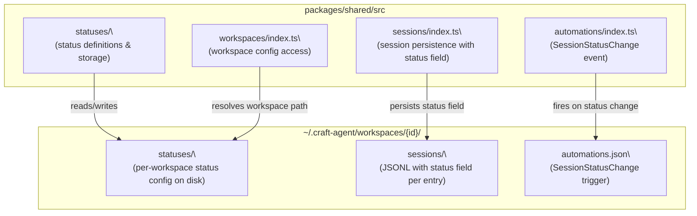

# Status Workflow

<details>
<summary>Relevant source files</summary>

The following files were used as context for generating this wiki page:

- [README.md](README.md)
- [packages/shared/package.json](packages/shared/package.json)

</details>

This page covers the dynamic session status system in Craft Agents: how statuses are defined per workspace, how they drive session workflow, and how status changes trigger automations. For how sessions themselves are created and persisted, see [Sessions (4.2)](#4.2). For the automation system that reacts to status changes, see [Hooks & Automation (4.9)](#4.9).

---

## Overview

Each session carries a **status** that represents its current position in a workflow. Statuses are defined per-workspace, making the system fully customizable. Out of the box, a workspace ships with a linear workflow:

```
Todo → In Progress → Needs Review → Done
```

Users and agents can move sessions between statuses manually, and status changes can fire `SessionStatusChange` automation events that trigger further agent actions.

The status configuration for a workspace lives on disk under:

```
~/.craft-agent/workspaces/{id}/statuses/
```

Sources: [README.md:94-95](), [README.md:310]()

---

## Status Storage Layout

Statuses are workspace-scoped. Each workspace directory holds a `statuses/` subdirectory containing status definitions. This mirrors the pattern used by other workspace-level configuration (themes, sources, skills, automations).

```
~/.craft-agent/
└── workspaces/
    └── {workspace-id}/
        ├── config.json
        ├── automations.json
        ├── statuses/          ← status definitions live here
        ├── sessions/
        ├── sources/
        └── skills/
```

The implementation is in the `packages/shared` package under `packages/shared/src/statuses/`.

Sources: [README.md:294-311](), [packages/shared/package.json:1-80]()

---

## Default Workflow

Craft Agents ships with a four-step default workflow. Each status is an ordered state; sessions advance (or move back) through these states as work progresses.

**Default status sequence:**

| Position | Status Name  | Typical Meaning                         |
| -------- | ------------ | --------------------------------------- |
| 1        | Todo         | Work has not started                    |
| 2        | In Progress  | Agent or user is actively working on it |
| 3        | Needs Review | Work done; awaiting human review        |
| 4        | Done         | Fully complete                          |

This sequence is the default, not a hard constraint. Workspaces can define any set of statuses and any ordering.

Sources: [README.md:115]()

---

## Status Workflow State Diagram

**Session Status State Machine (default)**

```mermaid
stateDiagram-v2
    [*] --> "Todo"
    "Todo" --> "In Progress" : "start work"
    "In Progress" --> "Needs Review" : "submit for review"
    "In Progress" --> "Todo" : "pause / requeue"
    "Needs Review" --> "Done" : "approved"
    "Needs Review" --> "In Progress" : "changes requested"
    "Done" --> "In Progress" : "reopened"
    "Done" --> [*]
```

Sources: [README.md:115]()

---

## Code Entity Map

The following diagram maps the concept of "status workflow" to the code entities that implement it.

**Status System: Concept → Code Entity**



Sources: [README.md:165-171](), [packages/shared/package.json:28-34]()

---

## Session Status Field

Every session record includes a status field. When a session is created, it is assigned the first status in the workspace's defined sequence (typically `Todo`). The status is stored as part of the session's metadata in its JSONL file under `~/.craft-agent/workspaces/{id}/sessions/`.

The `packages/shared/src/sessions/` module, exported via `@craft-agent/shared/sessions` ([packages/shared/package.json:29]()), handles reading and writing this status field alongside the rest of session metadata.

Status transitions are available to:

- **The user** — manually via the session list or session detail UI.
- **The agent** — programmatically using session-scoped tools. See [Session-Scoped Tools (8.5)](#8.5).

Sources: [packages/shared/package.json:29](), [README.md:112-117]()

---

## Status Changes and Automations

Every time a session's status changes, Craft Agents fires a `SessionStatusChange` event into the automations engine. This is one of the supported event types listed in `automations.json`.

**Event → Action flow:**

```mermaid
sequenceDiagram
    participant U as "User / Agent"
    participant SM as "SessionManager"
    participant AE as "Automations Engine\
(automations/index.ts)"
    participant AS as "New Agent Session"

    U->>SM: "change session status"
    SM->>SM: "persist new status to JSONL"
    SM->>AE: "emit SessionStatusChange event"
    AE->>AE: "match against automations.json rules"
    AE->>AS: "spawn prompt action if matched"
```

An example `automations.json` rule reacting to a status change:

```json
{
  "version": 2,
  "automations": {
    "SessionStatusChange": [
      {
        "actions": [
          {
            "type": "prompt",
            "prompt": "Session $CRAFT_SESSION_ID moved to a new status. Notify the team."
          }
        ]
      }
    ]
  }
}
```

The `$CRAFT_SESSION_ID` environment variable is automatically expanded inside prompt actions. For the full list of supported events and environment variables, see [Hooks & Automation (4.9)](#4.9).

Sources: [README.md:329-355](), [README.md:351-353]()

---

## Relationship to Labels

Statuses and labels serve distinct purposes:

| Concept | Scope            | Purpose                              | Automation Event          |
| ------- | ---------------- | ------------------------------------ | ------------------------- |
| Status  | One per session  | Ordered workflow position            | `SessionStatusChange`     |
| Label   | Many per session | Free-form tagging and categorization | `LabelAdd`, `LabelRemove` |

A session has exactly one status at any time but can have multiple labels. Labels are documented in [Labels (4.7)](#4.7).

Sources: [README.md:86-87](), [README.md:98](), [README.md:351-353]()

---

## Customizing Statuses

Since statuses are defined in the `statuses/` subdirectory of each workspace, they can be modified per workspace without affecting other workspaces. The simplest way to customize them is to instruct the agent:

> "Add a 'Blocked' status between 'In Progress' and 'Needs Review'."

The agent reads the existing `statuses/` configuration, updates it, and the new status becomes available immediately in the UI without restarting the application.

Sources: [README.md:54-58](), [README.md:94]()
