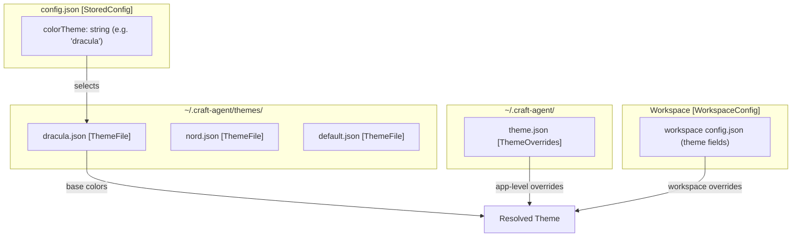
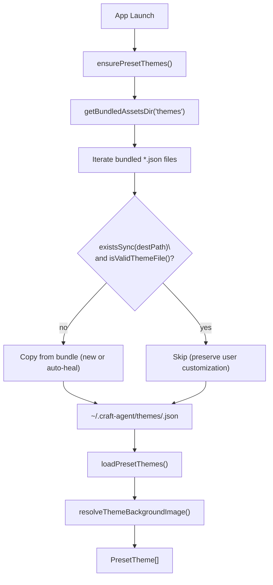
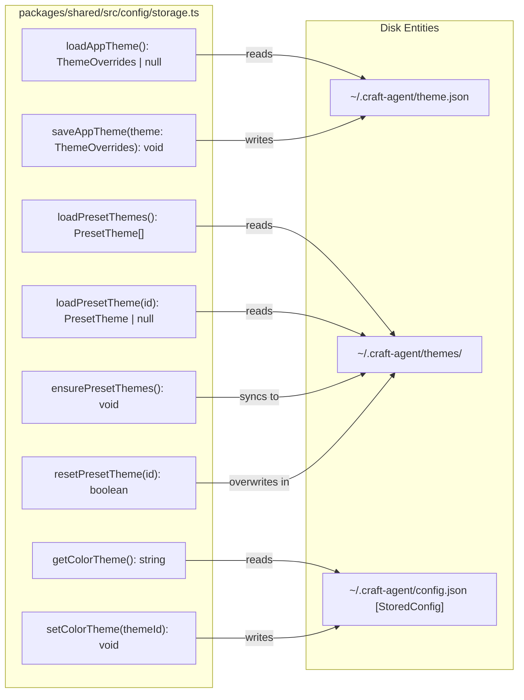

# Theme System

Relevant source files

The following files were used as context for generating this wiki page:

- [apps/electron/src/main/onboarding.ts](apps/electron/src/main/onboarding.ts)
- [apps/electron/src/renderer/index.css](apps/electron/src/renderer/index.css)
- [apps/electron/src/renderer/pages/settings/AppSettingsPage.tsx](apps/electron/src/renderer/pages/settings/AppSettingsPage.tsx)
- [apps/electron/src/shared/types.ts](apps/electron/src/shared/types.ts)
- [bun.lock](bun.lock)
- [packages/shared/src/config/storage.ts](packages/shared/src/config/storage.ts)

The theme system provides cascading theme configuration at both application and workspace levels, allowing users to customize the visual appearance of Craft Agents globally or on a per-workspace basis. Workspace themes override application-level defaults, enabling context-specific styling for different projects.

For information about general workspace configuration, see [Workspaces](#4.1). For storage and configuration file structure, see [Storage & Configuration](#2.8).

## Purpose and Scope

The theme system controls the visual presentation of the Craft Agents desktop application through JSON configuration files and a 6-color CSS variable system. It has three components:

1.  **Preset themes** — bundled named themes (e.g., `dracula`, `nord`) stored at `~/.craft-agent/themes/`, synced from app resources on launch. [packages/shared/src/config/storage.ts:931-973]()
2.  **App-level overrides** — fine-grained color overrides written to `~/.craft-agent/theme.json` (`ThemeOverrides`). [packages/shared/src/config/storage.ts:897-914]()
3.  **Workspace-level themes** — per-workspace theme configuration that overrides the app-level defaults. [apps/electron/src/shared/types.ts:200-201]()

The `colorTheme` field in `StoredConfig` (stored in `~/.craft-agent/config.json`) holds the ID of the selected preset theme. [packages/shared/src/config/storage.ts:63-63]()

Sources: [packages/shared/src/config/storage.ts:51-87](), [packages/shared/src/config/storage.ts:897-973](), [apps/electron/src/shared/types.ts:200-201]()

## Theme Configuration Hierarchy

Theme configuration follows a three-tier structure. The final visual state is rendered using CSS Custom Properties (Variables) defined in the renderer's global styles. [apps/electron/src/renderer/index.css:84-100]()

| Level | Location | Type | Priority |
| :--- | :--- | :--- | :--- |
| **Preset selection** | `colorTheme` field in `~/.craft-agent/config.json` | `string` (theme ID) | Base |
| **App-level overrides** | `~/.craft-agent/theme.json` | `ThemeOverrides` | Middle |
| **Workspace overrides** | Workspace `config.json` theme fields | Workspace-scoped | Highest |

Preset themes live at `~/.craft-agent/themes/<id>.json`. The selected preset is identified by the `colorTheme` string ID. Fine-grained `ThemeOverrides` written to `theme.json` apply on top of the preset.

**Theme Configuration Hierarchy**

Sources: [packages/shared/src/config/storage.ts:63-63](), [packages/shared/src/config/storage.ts:897-914](), [packages/shared/src/config/storage.ts:1143-1164]()

## 6-Color System Implementation

The application uses a 6-color system defined in `oklch` for perceptual uniformity. These are registered as animatable properties in the renderer to allow smooth transitions during theme changes. [apps/electron/src/renderer/index.css:21-64]()

| Variable | Role | Code Entity |
| :--- | :--- | :--- |
| `--background` | Light/dark surface | `initial-value: oklch(0.98 0.003 265)` |
| `--foreground` | Text and icons | `initial-value: oklch(0.185 0.01 270)` |
| `--accent` | Brand purple (Auto mode) | `initial-value: oklch(0.62 0.13 293)` |
| `--info` | Amber (Ask mode) | `initial-value: oklch(0.65 0.16 70)` |
| `--success` | Green (Connected state) | `initial-value: oklch(0.55 0.17 145)` |
| `--destructive` | Red (Errors/Failed) | `initial-value: oklch(0.55 0.22 27)` |

These variables are used to derive variants like `--foreground-50` (50% mix toward background) or `--success-text` (mixed toward foreground for legibility). [apps/electron/src/renderer/index.css:131-152]()

Sources: [apps/electron/src/renderer/index.css:21-161]()

## File Locations

| File | Description |
| :--- | :--- |
| `~/.craft-agent/config.json` | Contains `colorTheme` field (selected preset ID) |
| `~/.craft-agent/theme.json` | App-level `ThemeOverrides` |
| `~/.craft-agent/themes/` | Directory of preset `ThemeFile` JSON files |
| `~/.craft-agent/config-defaults.json` | Fallback values including `colorTheme: 'default'` |

Sources: [packages/shared/src/config/storage.ts:89-90](), [packages/shared/src/config/storage.ts:103-123]()

## Preset Themes Lifecycle

Preset themes are bundled with the application and synced to `~/.craft-agent/themes/` on launch via `ensurePresetThemes()`. [packages/shared/src/config/storage.ts:931-973]()

**Sync behavior (per bundled file):**

| Condition | Action |
| :--- | :--- |
| File does not exist on disk | Copy from bundle |
| File exists but fails `isValidThemeFile()` | Copy from bundle (auto-heal) |
| File exists and is valid | Skip (preserve user customizations) |

The `resetPresetTheme(id)` function allows restoring a bundled preset to its default by overwriting the disk copy. [packages/shared/src/config/storage.ts:1112-1137]()

**Preset Theme Lifecycle**

Sources: [packages/shared/src/config/storage.ts:931-973](), [packages/shared/src/config/storage.ts:979-1013](), [packages/shared/src/config/storage.ts:1112-1137]()

## Storage Functions

All theme I/O is implemented in `packages/shared/src/config/storage.ts`. These functions interact with the Electron main process handlers which are then exposed to the renderer via `ElectronAPI`. [apps/electron/src/shared/types.ts:212-220]()

**Storage and Retrieval Functions**

| Function | Description |
| :--- | :--- |
| `loadAppTheme()` | Reads `ThemeOverrides` from `~/.craft-agent/theme.json`. |
| `saveAppTheme(theme)` | Writes `ThemeOverrides` to `~/.craft-agent/theme.json`. |
| `loadPresetThemes()` | Returns all `PresetTheme[]` from `~/.craft-agent/themes/`, sorted. |
| `getColorTheme()` | Returns selected preset ID from `StoredConfig.colorTheme`. |
| `setColorTheme(id)` | Persists selected preset ID to `StoredConfig.colorTheme`. |

Sources: [packages/shared/src/config/storage.ts:897-914](), [packages/shared/src/config/storage.ts:1143-1164]()

## Integration with Workspace System

Workspace-level theme configuration is stored as part of each workspace's `config.json`. The workspace theme fields override the application-level preset and `ThemeOverrides`. While app-level themes are managed in `packages/shared/src/config/storage.ts`, workspace-level loading is handled by the workspace config system. [packages/shared/src/config/storage.ts:7-11]()

The renderer consumes these settings to update the application appearance. The `AppSettingsPage` and `AppearanceSettingsPage` (referenced in comments) provide the user interface for these modifications. [apps/electron/src/renderer/pages/settings/AppSettingsPage.tsx:11-13]()

Sources: [packages/shared/src/config/storage.ts:7-11](), [apps/electron/src/renderer/pages/settings/AppSettingsPage.tsx:1-13]()