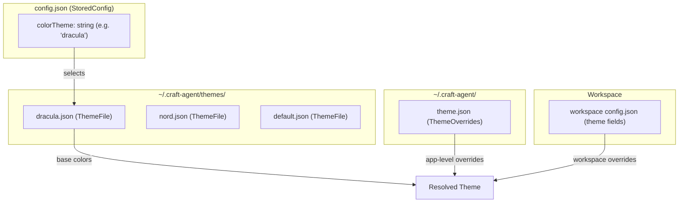
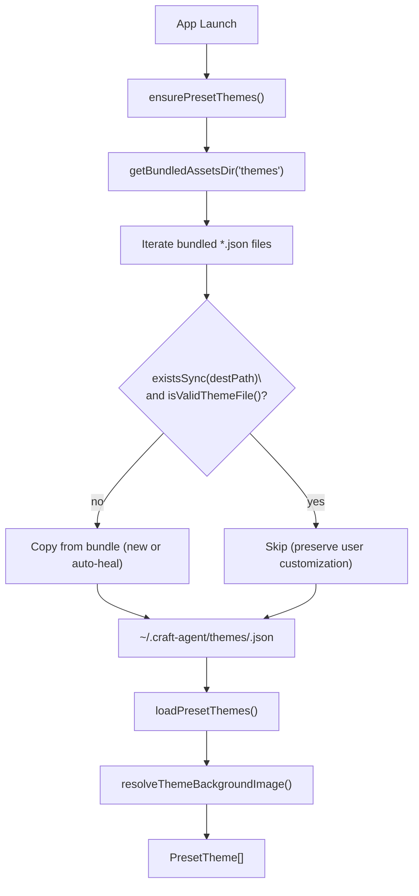
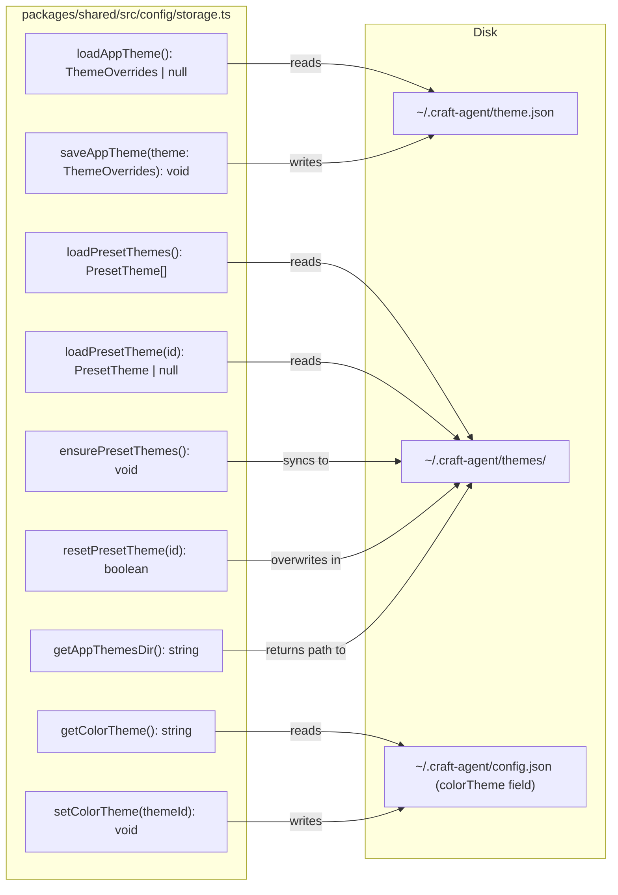
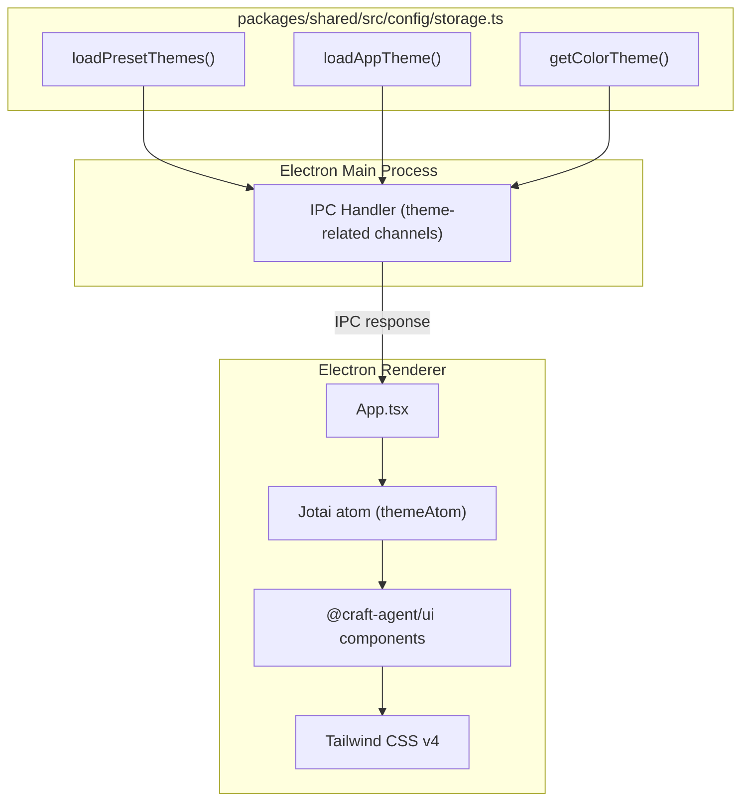

# Theme System

<details>
<summary>Relevant source files</summary>

The following files were used as context for generating this wiki page:

- [packages/shared/package.json](packages/shared/package.json)
- [packages/shared/src/agent/diagnostics.ts](packages/shared/src/agent/diagnostics.ts)
- [packages/shared/src/config/storage.ts](packages/shared/src/config/storage.ts)
- [packages/shared/src/utils/summarize.ts](packages/shared/src/utils/summarize.ts)

</details>

The theme system provides cascading theme configuration at both application and workspace levels, allowing users to customize the visual appearance of Craft Agents globally or on a per-workspace basis. Workspace themes override application-level defaults, enabling context-specific styling for different projects.

For information about general workspace configuration, see [Workspaces](#4.1). For storage and configuration file structure, see [Storage & Configuration](#2.8).

## Purpose and Scope

The theme system controls the visual presentation of the Craft Agents desktop application through JSON configuration files. It has three components:

1. **Preset themes** — bundled named themes (e.g., `dracula`, `nord`) stored at `~/.craft-agent/themes/`, synced from app resources on launch.
2. **App-level overrides** — fine-grained color overrides written to `~/.craft-agent/theme.json` (`ThemeOverrides`).
3. **Workspace-level themes** — per-workspace theme configuration that overrides the app-level defaults.

The `colorTheme` field in `StoredConfig` (stored in `~/.craft-agent/config.json`) holds the ID of the selected preset theme.

Sources: [packages/shared/src/config/storage.ts:877-914]()

## Theme Configuration Hierarchy

Theme configuration follows a three-tier structure:

| Level                   | Location                                           | Type                | Priority |
| ----------------------- | -------------------------------------------------- | ------------------- | -------- |
| **Preset selection**    | `colorTheme` field in `~/.craft-agent/config.json` | `string` (theme ID) | Base     |
| **App-level overrides** | `~/.craft-agent/theme.json`                        | `ThemeOverrides`    | Middle   |
| **Workspace overrides** | Workspace `config.json` theme fields               | Workspace-scoped    | Highest  |

Preset themes live at `~/.craft-agent/themes/<id>.json` and are represented by the `ThemeFile` type. The selected preset is identified by the `colorTheme` string ID. Fine-grained `ThemeOverrides` written to `theme.json` apply on top of the preset.

**Theme Configuration Hierarchy**



Sources: [packages/shared/src/config/storage.ts:880-881](), [packages/shared/src/config/storage.ts:1143-1164]()

## Types

The theme system uses three TypeScript types, all imported from `packages/shared/src/config/theme.ts`:

| Type             | Purpose                                                                     |
| ---------------- | --------------------------------------------------------------------------- |
| `ThemeFile`      | Schema for a preset theme JSON file (colors, name, `backgroundImage`, etc.) |
| `ThemeOverrides` | Partial override object written to `~/.craft-agent/theme.json`              |
| `PresetTheme`    | Runtime object: `{ id: string, path: string, theme: ThemeFile }`            |

The `PresetTheme` objects returned by `loadPresetThemes()` have their `backgroundImage` field resolved from relative paths to data URLs by `resolveThemeBackgroundImage()`, because `file://` URLs are blocked in the renderer when running on localhost in dev mode.

Sources: [packages/shared/src/config/storage.ts:877-878](), [packages/shared/src/config/storage.ts:1039-1075]()

## File Locations

| File                              | Description                                      |
| --------------------------------- | ------------------------------------------------ |
| `~/.craft-agent/config.json`      | Contains `colorTheme` field (selected preset ID) |
| `~/.craft-agent/theme.json`       | App-level `ThemeOverrides`                       |
| `~/.craft-agent/themes/`          | Directory of preset `ThemeFile` JSON files       |
| `~/.craft-agent/themes/<id>.json` | Individual preset theme (e.g., `dracula.json`)   |

Sources: [packages/shared/src/config/storage.ts:880-881]()

## Preset Themes

Preset themes are bundled with the application inside the Electron resources directory and synced to `~/.craft-agent/themes/` on every launch via `ensurePresetThemes()`. The sync logic in `packages/shared/src/config/storage.ts` uses `getBundledAssetsDir('themes')` to locate the bundled source.

**Sync behavior (per bundled file):**

| Condition                                  | Action                              |
| ------------------------------------------ | ----------------------------------- |
| File does not exist on disk                | Copy from bundle                    |
| File exists but fails `isValidThemeFile()` | Copy from bundle (auto-heal)        |
| File exists and is valid                   | Skip (preserve user customizations) |

User-created custom theme files with non-bundled filenames are never touched. The `resetPresetTheme(id)` function lets the user restore a bundled preset to its default by overwriting the disk copy.

Presets are sorted in the UI with `default` first, then alphabetically by `theme.name`.

**Preset Theme Lifecycle**



Sources: [packages/shared/src/config/storage.ts:931-973](), [packages/shared/src/config/storage.ts:979-1013](), [packages/shared/src/config/storage.ts:1112-1137]()

## Background Image Resolution

`ThemeFile` supports a `backgroundImage` field. When loading preset themes, `resolveThemeBackgroundImage()` converts relative paths to base64 data URLs:

- If `backgroundImage` has a URL scheme (e.g., `https://`, `data:`), it is used as-is.
- If it is a relative path, the function reads the image file relative to the theme JSON's directory, encodes it as base64, and returns a `data:<mime>;base64,...` URL.

This is necessary because the Electron renderer running on `localhost` in dev mode cannot load `file://` URLs directly.

Sources: [packages/shared/src/config/storage.ts:1039-1075]()

## Storage Functions

All theme I/O is implemented in `packages/shared/src/config/storage.ts`:

**Storage and Retrieval Functions**



| Function               | Description                                                                                         |
| ---------------------- | --------------------------------------------------------------------------------------------------- |
| `loadAppTheme()`       | Reads `ThemeOverrides` from `~/.craft-agent/theme.json`; returns `null` if absent                   |
| `saveAppTheme(theme)`  | Writes `ThemeOverrides` to `~/.craft-agent/theme.json`                                              |
| `loadPresetThemes()`   | Returns all `PresetTheme[]` from `~/.craft-agent/themes/`, sorted (`default` first)                 |
| `loadPresetTheme(id)`  | Returns a single `PresetTheme` by ID (filename without `.json`)                                     |
| `ensurePresetThemes()` | Syncs bundled presets to disk; runs once per app session                                            |
| `resetPresetTheme(id)` | Overwrites a preset file with the bundled version                                                   |
| `getColorTheme()`      | Returns selected preset ID from `StoredConfig.colorTheme`; defaults to `loadConfigDefaults()` value |
| `setColorTheme(id)`    | Persists selected preset ID to `StoredConfig.colorTheme` in `config.json`                           |

Sources: [packages/shared/src/config/storage.ts:897-914](), [packages/shared/src/config/storage.ts:1147-1164]()

## Integration with Workspace System

Workspace-level theme configuration is stored as part of each workspace's `config.json` (see page 4.1 for workspace config structure). The workspace theme fields override the application-level preset and `ThemeOverrides`. For more on workspace configuration in general, see page 2.8.

The theme system's storage module (`packages/shared/src/config/storage.ts`) handles only app-level theme data. Workspace-level theme loading is handled by the workspace config system (`packages/shared/src/workspaces/storage.ts`).

## Color Theme Selection

The `colorTheme` field in `StoredConfig` is a string ID referencing one of the preset theme files in `~/.craft-agent/themes/`. For example, `"colorTheme": "dracula"` selects `~/.craft-agent/themes/dracula.json`.

- `getColorTheme()` reads this field from `StoredConfig`; falls back to the default specified in `config-defaults.json` via `loadConfigDefaults()`.
- `setColorTheme(themeId)` writes the new selection back to `config.json`.
- The default preset ID is `"default"` (corresponding to `default.json`).

Sources: [packages/shared/src/config/storage.ts:1143-1164](), [packages/shared/src/config/storage.ts:56-57]()

## Theme Validation

The function `isValidThemeFile(path)` (from `packages/shared/src/config/validators.ts`) is used during preset theme sync to detect corrupt or invalid JSON files. A file that fails validation is overwritten with the bundled version (auto-heal). This prevents a corrupt user-edited preset from permanently breaking the theme picker.

Sources: [packages/shared/src/config/storage.ts:962]()

## Relationship to UI Components

The theme system integrates with the UI layer through the `@craft-agent/ui` package. The main process loads theme data using `loadPresetThemes()` and `loadAppTheme()` and sends it to the renderer via IPC. The renderer stores it in Jotai atoms and applies it through Tailwind CSS classes and inline styles.

**Theme Data Flow (Main Process to Renderer)**



Sources: [packages/shared/src/config/storage.ts:897-1013]()

## Theme Override Pattern

The override pattern allows selective customization without full duplication:

**Application Theme Example:**

```json
{
  "colors": {
    "primary": "#3b82f6",
    "secondary": "#64748b",
    "background": "#ffffff"
  },
  "spacing": {
    "sessionGap": "8px",
    "sidebarWidth": "240px"
  }
}
```

**Workspace Theme Example (Partial Override):**

```json
{
  "colors": {
    "primary": "#10b981"
  }
}
```

**Resulting Merged Theme:**

```json
{
  "colors": {
    "primary": "#10b981", // Overridden
    "secondary": "#64748b", // Inherited
    "background": "#ffffff" // Inherited
  },
  "spacing": {
    "sessionGap": "8px", // Inherited
    "sidebarWidth": "240px" // Inherited
  }
}
```

This pattern minimizes configuration maintenance and ensures workspace themes stay synchronized with application-level updates for properties they don't explicitly override.

**Sources:** [README.md:290-299]()
