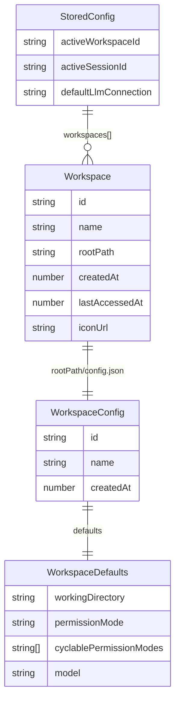
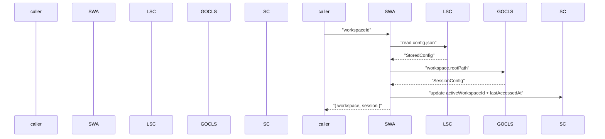

# Workspaces

<details>
<summary>Relevant source files</summary>

The following files were used as context for generating this wiki page:

- [README.md](README.md)
- [packages/shared/package.json](packages/shared/package.json)
- [packages/shared/src/agent/diagnostics.ts](packages/shared/src/agent/diagnostics.ts)
- [packages/shared/src/config/storage.ts](packages/shared/src/config/storage.ts)
- [packages/shared/src/utils/summarize.ts](packages/shared/src/utils/summarize.ts)

</details>

This page explains the workspace concept: what a workspace is, its on-disk layout, how workspaces are created, configured, and switched, and which features are scoped to a workspace.

For the global config file format that tracks workspace registrations, see [Storage & Configuration](#2.8). For features that live inside a workspace (sessions, sources, skills, statuses, automations, themes), see the individual pages linked in the feature table below.

---

## What is a Workspace

A workspace is the primary organizational unit in Craft Agents. Every session, source, skill, automation, status definition, and theme override belongs to exactly one workspace. Users can create multiple workspaces and switch between them.

A workspace has two representations:

| Representation         | Location                                      | Purpose                                                            |
| ---------------------- | --------------------------------------------- | ------------------------------------------------------------------ |
| `Workspace` record     | `~/.craft-agent/config.json` → `workspaces[]` | Global registry: id, rootPath, icon, last-accessed time            |
| `WorkspaceConfig` file | `{rootPath}/config.json`                      | Authoritative name, defaults (working dir, permission mode, model) |

The workspace's `name` is always read from `{rootPath}/config.json`, never from the global registry. `getWorkspaces()` resolves it on every call.

Sources: [packages/shared/src/config/storage.ts:434-463]()

---

## On-Disk Directory Structure

Each workspace is stored in a single directory (by default `~/.craft-agent/workspaces/{uuid}/`). The workspace's `rootPath` in the global config points to this directory.

**Workspace root directory layout**

```
{rootPath}/
├── config.json        # WorkspaceConfig: name, id, defaults
├── theme.json         # ThemeOverrides for this workspace
├── automations.json   # Automation rules (version 2 schema)
├── sessions/          # JSONL session files
├── sources/           # Source configurations (MCP, API, Local)
├── skills/            # Markdown skill instruction files
├── statuses/          # Custom status definitions
└── icon.*             # Optional workspace icon (any image extension)
```

The global config at `~/.craft-agent/config.json` stores `rootPath` with a `~` prefix for portability. `loadStoredConfig()` expands it via `expandPath()`, and `saveConfig()` normalizes it back via `toPortablePath()`.

Sources: [packages/shared/src/config/storage.ts:141-195]()

---

## Data Model

**Workspace data model and storage locations**



- `StoredConfig` is the type for `~/.craft-agent/config.json`, defined in `packages/shared/src/config/storage.ts`.
- `Workspace` is defined in `@craft-agent/core/types` and re-exported by `packages/shared`.
- `WorkspaceConfig` and `WorkspaceDefaults` live in `packages/shared/src/workspaces/storage.ts`.

Sources: [packages/shared/src/config/storage.ts:46-70](), [packages/shared/src/config/storage.ts:27-36]()

---

## Workspace-Level Configuration

The per-workspace `config.json` (loaded via `loadWorkspaceConfig(rootPath)`) holds:

| Field                              | Type       | Description                                             |
| ---------------------------------- | ---------- | ------------------------------------------------------- |
| `id`                               | `string`   | UUID, must match the global registry                    |
| `name`                             | `string`   | Display name (authoritative source)                     |
| `createdAt`                        | `number`   | Unix timestamp                                          |
| `defaults.workingDirectory`        | `string`   | Default working directory for agent sessions            |
| `defaults.permissionMode`          | `string`   | Default permission mode (`safe`, `ask`, `allow-all`)    |
| `defaults.cyclablePermissionModes` | `string[]` | Modes available via SHIFT+TAB cycling                   |
| `defaults.model`                   | `string`   | Per-workspace model override (e.g. `claude-sonnet-4-6`) |

See [Permission System](#4.5) for permission mode details. See [Authentication Setup](#3.3) for LLM connections.

Sources: [packages/shared/src/config/storage.ts:378-381](), [packages/shared/src/config/storage.ts:1467-1482]()

---

## Per-Workspace Features

| Feature            | Storage Path                  | Wiki Page                  |
| ------------------ | ----------------------------- | -------------------------- |
| Sessions           | `{rootPath}/sessions/*.jsonl` | [Sessions](#4.2)           |
| Sources            | `{rootPath}/sources/`         | [Sources](#4.3)            |
| Skills             | `{rootPath}/skills/*.md`      | [Skills](#4.4)             |
| Status Definitions | `{rootPath}/statuses/`        | [Status Workflow](#4.6)    |
| Labels             | Applied to sessions           | [Labels](#4.7)             |
| Theme Override     | `{rootPath}/theme.json`       | [Theme System](#4.8)       |
| Automations        | `{rootPath}/automations.json` | [Hooks & Automation](#4.9) |

---

## Workspace Lifecycle

### Creation

`addWorkspace(workspace)` in `packages/shared/src/config/storage.ts` handles workspace creation:

1. Checks if a workspace with the same `rootPath` already exists (updates if so).
2. Generates a UUID via `generateWorkspaceId()`.
3. Calls `createWorkspaceAtPath(rootPath, name)` from `packages/shared/src/workspaces/storage.ts` if the folder does not yet exist.
4. Appends the new `Workspace` record to `StoredConfig.workspaces` and writes `config.json`.
5. If this is the first workspace, sets it as `activeWorkspaceId`.

Sources: [packages/shared/src/config/storage.ts:525-567](), [packages/shared/src/config/storage.ts:418-424]()

### Discovery

`syncWorkspaces()` runs at app startup to auto-register any workspace directories found under `~/.craft-agent/workspaces/` that are not already in the global config. It uses `discoverWorkspacesInDefaultLocation()` from `packages/shared/src/workspaces/storage.ts` to enumerate candidates, then `isValidWorkspace(rootPath)` to confirm they are valid before adding them.

Sources: [packages/shared/src/config/storage.ts:574-607]()

### Switching

`switchWorkspaceAtomic(workspaceId)` performs a combined workspace switch and session load as a single operation to avoid race conditions:

**Workspace switch sequence (`switchWorkspaceAtomic`)**



Sources: [packages/shared/src/config/storage.ts:503-519]()

`setActiveWorkspace(workspaceId)` is a simpler alternative that only updates `activeWorkspaceId` without loading a session.

Sources: [packages/shared/src/config/storage.ts:485-494]()

### Deletion

`removeWorkspace(workspaceId)` performs a full cleanup:

1. Removes the `Workspace` record from `StoredConfig.workspaces`.
2. If the deleted workspace was active, promotes the next available workspace.
3. Calls `credentialManager.deleteWorkspaceCredentials(workspaceId)` to purge stored credentials.
4. Deletes the workspace data directory at `~/.craft-agent/workspaces/{id}/`.

> **Note:** Deleting a workspace removes its session history and credentials. The `rootPath` folder itself is not deleted by `removeWorkspace`; only the internal data directory keyed by `workspaceId` is removed.

Sources: [packages/shared/src/config/storage.ts:609-640]()

---

## Key Code Entities

**Workspace management functions and their module locations**

```mermaid
graph TD
    subgraph "config/storage.ts"
        GW["getWorkspaces()"]
        GAW["getActiveWorkspace()"]
        GWNI["getWorkspaceByNameOrId()"]
        SAW["setActiveWorkspace()"]
        SWA["switchWorkspaceAtomic()"]
        AW["addWorkspace()"]
        RW["removeWorkspace()"]
        SW["syncWorkspaces()"]
        GWI["findWorkspaceIcon()"]
        GWI2["generateWorkspaceId()"]
    end
    subgraph "workspaces/storage.ts"
        LWC["loadWorkspaceConfig()"]
        SVC["saveWorkspaceConfig()"]
        CWP["createWorkspaceAtPath()"]
        IVW["isValidWorkspace()"]
        DWD["discoverWorkspacesInDefaultLocation()"]
    end
    subgraph "sessions/index.ts"
        GOCLS["getOrCreateLatestSession()"]
    end
    GW --> LWC
    GW --> GWI
    AW --> CWP
    AW --> IVW
    AW --> GWI2
    SW --> DWD
    SW --> LWC
    SWA --> GOCLS
    SWA --> SAW
    RW --> DWD
```



Sources: [packages/shared/src/config/storage.ts:430-640](), [packages/shared/package.json:32-33]()

---

## Workspace Icons

A workspace can display an icon in two ways:

1. **Remote URL**: `workspace.iconUrl` in the global config starts with `http://` or `https://`.
2. **Local file**: Any file named `icon.*` at `{rootPath}/icon.*` (any image extension). `findWorkspaceIcon(rootPath)` detects it via `findIconFile()` from `packages/shared/src/utils/icon.ts`. It is served to the renderer as a `file://` URL with the file's `mtime` appended as a cache-buster (`?t={mtime}`).

Sources: [packages/shared/src/config/storage.ts:430-462]()

---

## Workspace Lookup by Name

`getWorkspaceByNameOrId(nameOrId)` allows lookup by either UUID or display name (case-insensitive). This is used by CLI tooling (`-w` flag) to resolve a workspace without knowing its UUID.

Sources: [packages/shared/src/config/storage.ts:477-483]()
