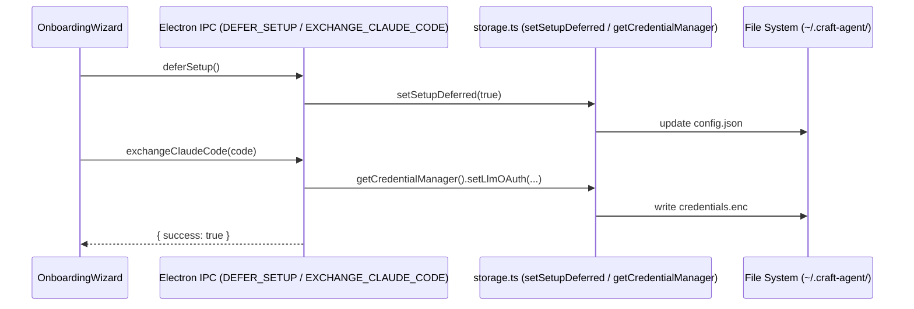
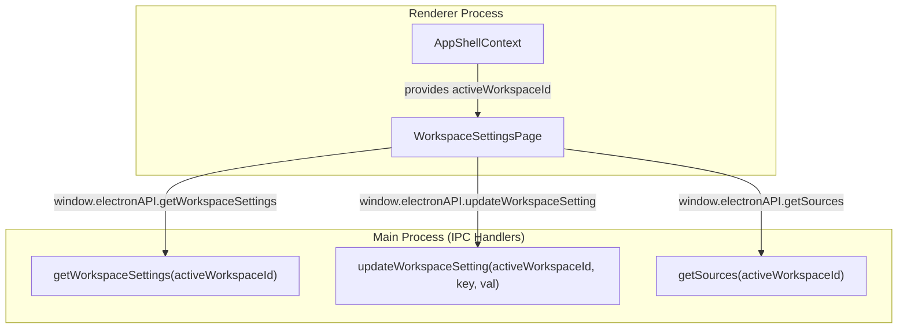

# Workspaces

<details>
<summary>Relevant source files</summary>

The following files were used as context for generating this wiki page:

- [apps/electron/src/main/onboarding.ts](apps/electron/src/main/onboarding.ts)
- [apps/electron/src/renderer/pages/settings/AppSettingsPage.tsx](apps/electron/src/renderer/pages/settings/AppSettingsPage.tsx)
- [apps/electron/src/renderer/pages/settings/WorkspaceSettingsPage.tsx](apps/electron/src/renderer/pages/settings/WorkspaceSettingsPage.tsx)
- [apps/electron/src/shared/types.ts](apps/electron/src/shared/types.ts)
- [bun.lock](bun.lock)
- [packages/shared/src/auth/state.ts](packages/shared/src/auth/state.ts)
- [packages/shared/src/config/storage.ts](packages/shared/src/config/storage.ts)
- [packages/shared/tests/models.test.ts](packages/shared/tests/models.test.ts)

</details>


This page explains the workspace concept: what a workspace is, its on-disk layout, how workspaces are created, managed via the UI and IPC layer, and how features like sources, skills, and automations are scoped to them.

---

## What is a Workspace

A workspace is the primary organizational unit in Craft Agents. Every session, source, skill, automation, status definition, and theme override belongs to exactly one workspace. Users can create multiple workspaces and switch between them to isolate different projects or contexts.

A workspace has two representations in the system:

| Representation | Location | Purpose |
|---|---|---|
| `Workspace` record | `~/.craft-agent/config.json` → `workspaces[]` | Global registry: `id`, `rootPath`, `icon`, and `lastAccessedAt` metadata. [packages/shared/src/config/storage.ts:57-58]() |
| `WorkspaceConfig` file | `{rootPath}/config.json` | Authoritative settings: `name`, `defaults` (working dir, permission mode, model). [packages/shared/src/config/storage.ts:7-11]() |

The workspace's `name` is always read from the local `{rootPath}/config.json`, ensuring that moving or renaming the folder on disk remains the source of truth for the workspace identity. [packages/shared/src/config/storage.ts:7-11]()

Sources: [packages/shared/src/config/storage.ts:51-87](), [apps/electron/src/shared/types.ts:40-41]()

---

## On-Disk Directory Structure

Each workspace is stored in a dedicated directory. By default, these are created under `~/.craft-agent/workspaces/{uuid}/`. [packages/shared/src/config/storage.ts:6-11]()

**Workspace root directory layout**

```
{rootPath}/
├── config.json        # WorkspaceConfig: name, id, defaults, localMcpServers
├── theme.json         # ThemeOverrides for this workspace
├── automations.json   # Automation rules (version 2 schema)
├── sessions/          # JSONL session files
├── sources/           # Source configurations (MCP, API, Local)
├── skills/            # Markdown skill instruction files
├── statuses/          # Custom status definitions
└── icon.{ext}         # Optional workspace icon (png, jpg, svg, etc.)
```

Sources: [packages/shared/src/config/storage.ts:6-11](), [apps/electron/src/renderer/pages/settings/WorkspaceSettingsPage.tsx:113-134]()

---

## Workspace Creation Flow

When a user triggers workspace creation, the renderer calls `window.electronAPI.createSession` (which initializes the workspace context if needed) or specialized setup handlers. The main process handles the directory creation and configuration persistence. [apps/electron/src/main/onboarding.ts:1-12]()

### Implementation Detail: Creation Logic
The `onboarding.ts` file manages the initial setup of workspaces and authentication.



Sources: [apps/electron/src/main/onboarding.ts:112-151](), [apps/electron/src/main/onboarding.ts:166-171]()

---

## Workspace Settings & Configuration

Workspace-level settings are managed via the `WorkspaceSettingsPage`. This page allows users to modify identity, default behaviors, and available tools. [apps/electron/src/renderer/pages/settings/WorkspaceSettingsPage.tsx:1-12]()

### Configuration Fields (`WorkspaceSettings`)

| Field | Description |
|---|---|
| `name` | Display name shown in the sidebar and header. [apps/electron/src/renderer/pages/settings/WorkspaceSettingsPage.tsx:57-57]() |
| `workingDirectory` | The base path where the agent performs file operations. [apps/electron/src/renderer/pages/settings/WorkspaceSettingsPage.tsx:63-63]() |
| `permissionMode` | Default security posture (`safe`, `ask`, `allow-all`). [apps/electron/src/renderer/pages/settings/WorkspaceSettingsPage.tsx:62-62]() |
| `cyclablePermissionModes` | Subset of modes allowed when toggling via `SHIFT+TAB`. [apps/electron/src/renderer/pages/settings/WorkspaceSettingsPage.tsx:72-72]() |
| `localMcpEnabled` | Whether `stdio`-based MCP servers can be spawned. [apps/electron/src/renderer/pages/settings/WorkspaceSettingsPage.tsx:64-64]() |
| `enabledSourceSlugs` | List of active sources for the workspace. [apps/electron/src/renderer/pages/settings/WorkspaceSettingsPage.tsx:69-69]() |

### Icon Management
The system attempts to load a workspace icon by checking for `icon.{ext}` (png, jpg, jpeg, svg, webp, gif) within the workspace root. Icons are read via `window.electronAPI.readWorkspaceImage` and converted to data URLs for the renderer. [apps/electron/src/renderer/pages/settings/WorkspaceSettingsPage.tsx:113-134]()

Sources: [apps/electron/src/renderer/pages/settings/WorkspaceSettingsPage.tsx:85-111](), [apps/electron/src/renderer/pages/settings/WorkspaceSettingsPage.tsx:113-134]()

---

## Switching and State Management

The `AppShellContext` tracks the `activeWorkspaceId`. When a user switches workspaces, the application performs an atomic update to ensure the UI, session history, and available tools stay in sync. [apps/electron/src/renderer/pages/settings/WorkspaceSettingsPage.tsx:52-54]()



### Auto-Healing Sources
When loading workspace settings, the system performs "auto-healing" on `enabledSourceSlugs`. If a source configuration file was deleted from the `sources/` directory manually, the workspace settings will automatically remove that slug to prevent runtime errors. [apps/electron/src/renderer/pages/settings/WorkspaceSettingsPage.tsx:98-110]()

Sources: [apps/electron/src/renderer/pages/settings/WorkspaceSettingsPage.tsx:52-54](), [apps/electron/src/renderer/pages/settings/WorkspaceSettingsPage.tsx:149-165]()

---

## Technical Summary of Types

The `StoredConfig` interface in the shared package defines the global structure of the application's configuration, including the list of registered workspaces.

```typescript
// From packages/shared/src/config/storage.ts

export interface StoredConfig {
  llmConnections?: LlmConnection[];
  defaultLlmConnection?: string;
  workspaces: Workspace[];
  activeWorkspaceId: string | null;
  activeSessionId: string | null;
  // ... appearance and behavior settings
}
```

The `WorkspaceSettings` type (exposed via IPC) defines the mutable properties of a workspace.

```typescript
// From apps/electron/src/shared/types.ts

export interface WorkspaceSettings {
  name?: string;
  permissionMode?: PermissionMode;
  workingDirectory?: string;
  localMcpEnabled?: boolean;
  cyclablePermissionModes?: PermissionMode[];
  enabledSourceSlugs?: string[];
  // ... other workspace-scoped defaults
}
```

Sources: [packages/shared/src/config/storage.ts:51-87](), [apps/electron/src/shared/types.ts:200-201]()