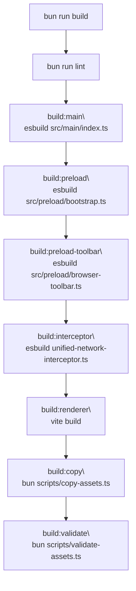
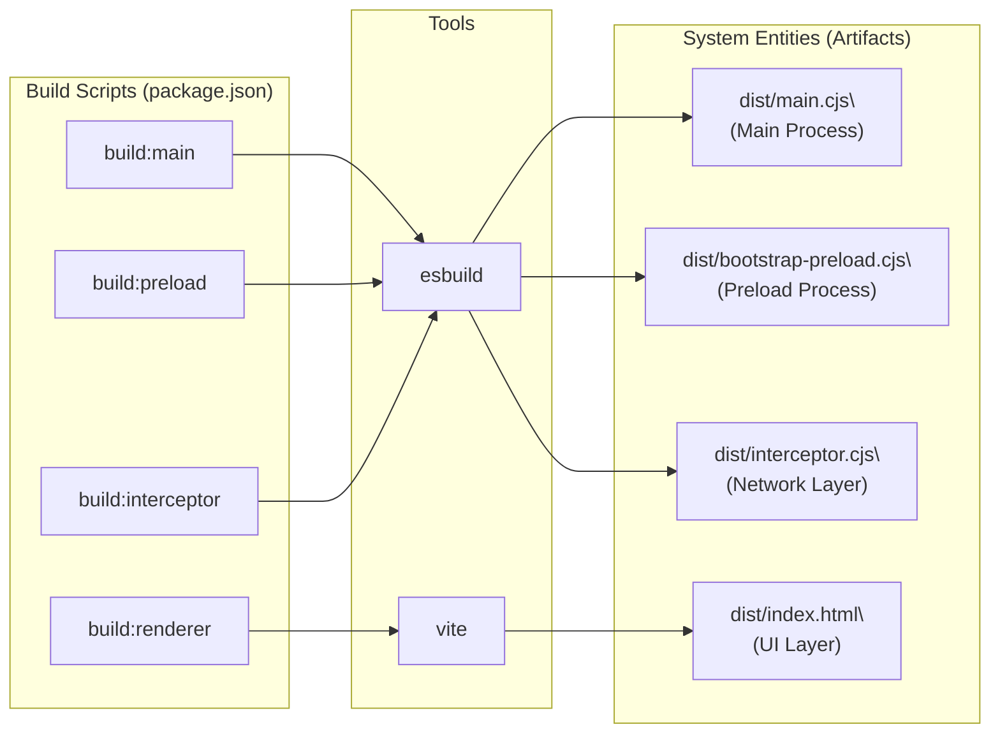

# Build System

Relevant source files

The following files were used as context for generating this wiki page:

- [apps/electron/package.json](apps/electron/package.json)

This page documents the multi-step build pipeline used to compile the Craft Agents Electron application from TypeScript source into runnable and distributable artifacts. It covers the individual build scripts, their inputs and outputs, toolchain choices (esbuild vs. Vite), and how OAuth credentials are injected at build time.

For information on how the three resulting Electron processes (main, preload, renderer) communicate at runtime, see [Electron Application Architecture](2.2). For platform-specific distribution packaging (DMG, installer, Linux), see [Platform-Specific Builds](6.1). For development-mode startup (watch/hot-reload), see [Development Setup](5.1).

---

## Overview

The build system is driven entirely from the monorepo root via `bun` scripts. The primary entry point for the Electron application is the `build` script within the `apps/electron` package, which coordinates the compilation of the main process, preload scripts, and the React-based renderer.

**Top-level build sequence**
The build sequence ensures that all dependencies and sub-services are compiled before the final assets are validated.

Sources: [apps/electron/package.json:26-26](), [apps/electron/package.json:18-25]()

---

## Build Step Pipeline

The build process is orchestrated by specialized scripts that handle environment loading, cross-platform compatibility, and artifact verification.

### Main Process Build
The main process build is managed via `esbuild`. It bundles the entire main process logic into a single CommonJS file.

1.  **Environment Loading**: The script attempts to source the root `.env` file to populate environment variables [apps/electron/package.json:18-18]().
2.  **Network Interceptor**: The `unified-network-interceptor.ts` from the shared package is bundled into `dist/interceptor.cjs` to be injected into Node-based SDK subprocesses [apps/electron/package.json:22-22]().
3.  **Main Bundle**: `esbuild` bundles `src/main/index.ts` into `dist/main.cjs` using the `node` platform and `cjs` format [apps/electron/package.json:18-18]().

### Preload Build
The preload scripts are handled by two distinct `esbuild` commands:
*   `src/preload/bootstrap.ts` → `dist/bootstrap-preload.cjs` [apps/electron/package.json:20-20]().
*   `src/preload/browser-toolbar.ts` → `dist/browser-toolbar-preload.cjs` [apps/electron/package.json:21-21]().

These scripts are bundled with `external:electron` to ensure the Electron-provided modules are available at runtime via the `contextBridge`.

### Renderer Build
The renderer (UI) is built using **Vite**. It processes the React application, performs tree-shaking, and outputs optimized assets into the `dist` directory [apps/electron/package.json:23-23]().

Sources: [apps/electron/package.json:18-23]()

---

## Build Outputs

| Artifact | Source | Tool | Format |
| :--- | :--- | :--- | :--- |
| `dist/main.cjs` | `src/main/index.ts` | esbuild | CJS |
| `dist/bootstrap-preload.cjs` | `src/preload/bootstrap.ts` | esbuild | CJS |
| `dist/browser-toolbar-preload.cjs` | `src/preload/browser-toolbar.ts` | esbuild | CJS |
| `dist/interceptor.cjs` | `packages/shared/.../unified-network-interceptor.ts` | esbuild | CJS |
| `dist/index.html` | Renderer Entry | Vite | HTML/JS |

Sources: [apps/electron/package.json:18-23]()

---

## Environment Variable Injection

The build system injects OAuth credentials directly into the main process bundle using esbuild's `--define` feature. This allows the application to access secrets without relying on runtime `.env` files in production.

### Build Defines
The `build:main` script maps local environment variables to `process.env` constants within the bundled code [apps/electron/package.json:18-18]().

| Variable | Target |
| :--- | :--- |
| `GOOGLE_OAUTH_CLIENT_ID` | `process.env.GOOGLE_OAUTH_CLIENT_ID` |
| `GOOGLE_OAUTH_CLIENT_SECRET` | `process.env.GOOGLE_OAUTH_CLIENT_SECRET` |
| `SLACK_OAUTH_CLIENT_ID` | `process.env.SLACK_OAUTH_CLIENT_ID` |
| `SLACK_OAUTH_CLIENT_SECRET` | `process.env.SLACK_OAUTH_CLIENT_SECRET` |
| `MICROSOFT_OAUTH_CLIENT_ID` | `process.env.MICROSOFT_OAUTH_CLIENT_ID` |

### Platform Differences
On Windows, the `build:main:win` script (and consequently `build:win`) omits these defines from the `esbuild` command line in `package.json` [apps/electron/package.json:19-19](). This requires credentials to be handled differently or provided via the `build-win.ps1` script during the distribution phase [apps/electron/package.json:34-34]().

Sources: [apps/electron/package.json:18-19](), [apps/electron/package.json:27-27]()

---

## Script and Entity Mapping

The following diagram maps the build scripts defined in `package.json` to the code entities they produce and the tools they utilize.

Sources: [apps/electron/package.json:18-23]()

---

## Asset Management

The final stage of the build involves copying and validating static assets to ensure the application bundle is complete.

*   **`build:copy`**: Executes `scripts/copy-assets.ts` using Bun. This moves necessary static resources, icons, and bundled dependencies into the `dist` folder [apps/electron/package.json:24-24]().
*   **`build:validate`**: Executes `scripts/validate-assets.ts` using Bun. This script acts as a safety check to ensure that all required files (such as icons or external binaries) are present and correctly placed before the final packaging step [apps/electron/package.json:25-25]().

Sources: [apps/electron/package.json:24-25]()