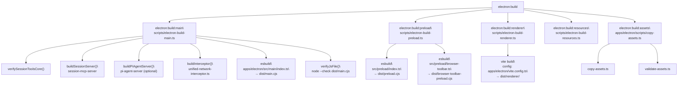
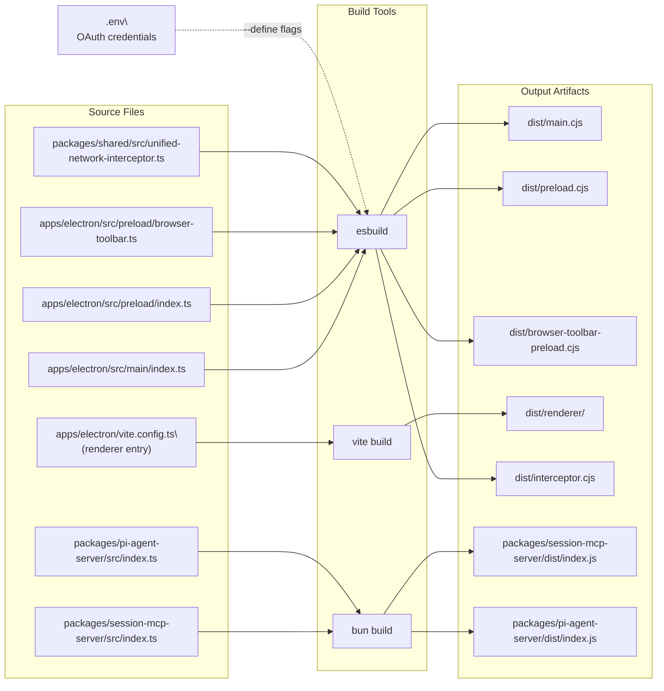

# Build System

<details>
<summary>Relevant source files</summary>

The following files were used as context for generating this wiki page:

- [apps/electron/package.json](apps/electron/package.json)
- [package.json](package.json)
- [scripts/electron-build-main.ts](scripts/electron-build-main.ts)
- [scripts/electron-build-renderer.ts](scripts/electron-build-renderer.ts)

</details>

This page documents the multi-step build pipeline used to compile the Craft Agents Electron application from TypeScript source into runnable and distributable artifacts. It covers the individual build scripts, their inputs and outputs, toolchain choices (esbuild vs. Vite), and how OAuth credentials are injected at build time.

For information on how the three resulting Electron processes (main, preload, renderer) communicate at runtime, see [Electron Application Architecture](#2.2). For platform-specific distribution packaging (DMG, installer, Linux), see [Platform-Specific Builds](#6.1). For development-mode startup (watch/hot-reload), see [Development Setup](#5.1).

---

## Overview

The build system is driven entirely from the monorepo root via `bun` scripts defined in [package.json:12-55](). The top-level `electron:build` script is the canonical entry point and is composed of five ordered sub-steps.

**Top-level build sequence**

```
electron:build = electron:build:main
               + electron:build:preload
               + electron:build:renderer
               + electron:build:resources
               + electron:build:assets
```

Each step is an independent script invoked from the monorepo root, making them individually re-runnable during development.

Sources: [package.json:21-27]()

---

## Build Step Pipeline

**Build Pipeline Flowchart**



Sources: [scripts/electron-build-main.ts:1-326](), [scripts/electron-build-renderer.ts:1-27](), [package.json:21-27](), [apps/electron/package.json:17-36]()

---

## Build Outputs

Each build step produces one or more artifacts under `apps/electron/dist/`.

| Script / Step             | Tool                                    | Input                                                | Output                                              |
| ------------------------- | --------------------------------------- | ---------------------------------------------------- | --------------------------------------------------- |
| `electron:build:main`     | esbuild                                 | `apps/electron/src/main/index.ts`                    | `apps/electron/dist/main.cjs`                       |
| `electron:build:main`     | esbuild                                 | `packages/shared/src/unified-network-interceptor.ts` | `apps/electron/dist/interceptor.cjs`                |
| `electron:build:main`     | `bun build`                             | `packages/session-mcp-server/src/index.ts`           | `packages/session-mcp-server/dist/index.js`         |
| `electron:build:main`     | `bun build`                             | `packages/pi-agent-server/src/index.ts`              | `packages/pi-agent-server/dist/index.js` (optional) |
| `electron:build:preload`  | esbuild                                 | `apps/electron/src/preload/index.ts`                 | `apps/electron/dist/preload.cjs`                    |
| `electron:build:preload`  | esbuild                                 | `apps/electron/src/preload/browser-toolbar.ts`       | `apps/electron/dist/browser-toolbar-preload.cjs`    |
| `electron:build:renderer` | Vite                                    | `apps/electron/vite.config.ts`                       | `apps/electron/dist/renderer/`                      |
| `electron:build:assets`   | `copy-assets.ts` + `validate-assets.ts` | static assets                                        | `apps/electron/dist/` (various)                     |

Sources: [scripts/electron-build-main.ts:10-20](), [apps/electron/package.json:18-26]()

---

## Main Process Build

The main process build is the most complex step. It is orchestrated by `scripts/electron-build-main.ts` and runs several sub-builds before compiling the main entry point.

### Sub-builds within `electron:build:main`

**Order of operations in `main()` ([scripts/electron-build-main.ts:256-326]()):**

1. `loadEnvFile()` — reads `.env` from the monorepo root and populates `process.env`.
2. `verifySessionToolsCore()` — asserts that `packages/session-tools-core/src/index.ts` exists. No compilation needed; this package is TypeScript-first and bundled by its consumers.
3. `buildSessionServer()` — compiles `packages/session-mcp-server/src/index.ts` to `dist/index.js` using `bun build --target=node --format=cjs`. This server provides session-scoped tools such as `SubmitPlan`.
4. `buildPiAgentServer()` — compiles `packages/pi-agent-server/src/index.ts` to `dist/index.js` using `bun build --target=bun --format=esm`. This step is **skipped silently** if the package directory is absent (it is not synced to the OSS repository). ESM format is required because `@mariozechner/pi-coding-agent` is ESM-only.
5. `buildInterceptor()` — compiles `packages/shared/src/unified-network-interceptor.ts` to `apps/electron/dist/interceptor.cjs` using esbuild. This CJS bundle is injected into Node.js subprocess via `--require`.
6. **Main esbuild invocation** — compiles `apps/electron/src/main/index.ts` to `apps/electron/dist/main.cjs` with OAuth defines injected (see [Environment Variable Injection](#environment-variable-injection)).
7. `waitForFileStable()` — polls the output file for size stability before proceeding.
8. `verifyJsFile()` — runs `node --check dist/main.cjs` to catch syntax errors before launch.

Sources: [scripts/electron-build-main.ts:120-326]()

### esbuild Configuration for the Main Process

The main process is always compiled to CommonJS because Electron's main process requires CJS. The key flags used are:

```
--bundle
--platform=node
--format=cjs
--outfile=apps/electron/dist/main.cjs
--external:electron
```

`electron` is kept external so esbuild does not attempt to bundle the native Electron module.

Sources: [scripts/electron-build-main.ts:281-295](), [apps/electron/package.json:18]()

---

## Preload Build

The preload scripts are simple esbuild invocations targeting the `node` platform with CJS output. There are two preload scripts:

- `src/preload/index.ts` → `dist/preload.cjs` — the primary preload that exposes `window.electronAPI` via `contextBridge`.
- `src/preload/browser-toolbar.ts` → `dist/browser-toolbar-preload.cjs` — preload for the embedded browser toolbar window.

Both use `--external:electron` for the same reason as the main process.

Sources: [apps/electron/package.json:20-21]()

---

## Renderer Build

The renderer is built by Vite using the configuration at `apps/electron/vite.config.ts`. The build step is invoked from the monorepo root:

```
vite build --config apps/electron/vite.config.ts
```

The script `scripts/electron-build-renderer.ts` wraps this call and:

- Deletes `apps/electron/dist/renderer/` before building to ensure a clean output.
- Sets `NODE_OPTIONS=--max-old-space-size=4096` to handle the large React dependency tree without OOM errors.

Sources: [scripts/electron-build-renderer.ts:1-27]()

---

## Environment Variable Injection

OAuth client credentials and Sentry configuration are baked into `main.cjs` at compile time using esbuild's `--define` flag. This means the compiled binary contains the literal credential strings rather than reading them from environment variables at runtime.

### `.env` Loading

`loadEnvFile()` in [scripts/electron-build-main.ts:22-42]() reads `<root>/.env` and injects variables into `process.env` before esbuild is invoked. This file is not committed to the repository. It is populated by running `bun run sync-secrets` (see [Development Setup](#5.1)).

### Variables Injected at Build Time

The function `getBuildDefines()` ([scripts/electron-build-main.ts:49-62]()) maps each variable to an esbuild `--define` argument:

| Environment Variable            | Injected into Code As                       |
| ------------------------------- | ------------------------------------------- |
| `SLACK_OAUTH_CLIENT_ID`         | `process.env.SLACK_OAUTH_CLIENT_ID`         |
| `SLACK_OAUTH_CLIENT_SECRET`     | `process.env.SLACK_OAUTH_CLIENT_SECRET`     |
| `MICROSOFT_OAUTH_CLIENT_ID`     | `process.env.MICROSOFT_OAUTH_CLIENT_ID`     |
| `MICROSOFT_OAUTH_CLIENT_SECRET` | `process.env.MICROSOFT_OAUTH_CLIENT_SECRET` |
| `SENTRY_ELECTRON_INGEST_URL`    | `process.env.SENTRY_ELECTRON_INGEST_URL`    |

> **Note:** Google OAuth credentials are **not** baked into the build. Users provide their own via source config. See `README_FOR_OSS.md` for setup instructions.

Sources: [scripts/electron-build-main.ts:44-62](), [apps/electron/package.json:18]()

### Windows Difference

On Windows, the `build:main:win` variant in [apps/electron/package.json:19]() omits all `--define` flags. OAuth credentials must be injected through a different mechanism on Windows (via PowerShell environment before invoking the build). See [Platform-Specific Builds](#6.1) for details.

---

## Script / Artifact Relationship Diagram



Sources: [scripts/electron-build-main.ts:1-326](), [scripts/electron-build-renderer.ts:1-27](), [apps/electron/package.json:17-36]()

---

## Distribution Builds

The `electron:dist` family of scripts extends the standard build by invoking `electron-builder` after `electron:build` completes:

| Script                | Target             |
| --------------------- | ------------------ |
| `electron:dist`       | Current platform   |
| `electron:dist:mac`   | macOS (all arches) |
| `electron:dist:win`   | Windows            |
| `electron:dist:linux` | Linux              |

All use the configuration file `electron-builder.yml` with `--project apps/electron`.

```
electron:dist = electron:build + electron-builder --config electron-builder.yml --project apps/electron
```

For packaging details (extraResources, notarization, installers), see [Electron Packaging](#6.2).

Sources: [package.json:38-41]()

---

## Clean Step

`electron:clean` ([package.json:21]()) is a separate script that removes prior build artifacts. It is not part of the default `electron:build` sequence — the renderer build cleans its own output directory ([scripts/electron-build-renderer.ts:13-16]()), and the main build script creates `dist/` if it does not exist.

---

## Toolchain Summary

| Process                                                | Bundler     | Format     | Why                                                                           |
| ------------------------------------------------------ | ----------- | ---------- | ----------------------------------------------------------------------------- |
| Main (`main.cjs`)                                      | esbuild     | CJS        | Electron main requires CJS; esbuild is fast and supports `--define` injection |
| Preload (`preload.cjs`, `browser-toolbar-preload.cjs`) | esbuild     | CJS        | Preload runs in Node context; must be CJS                                     |
| Network interceptor (`interceptor.cjs`)                | esbuild     | CJS        | Loaded via `--require` into Node.js subprocesses                              |
| Renderer (`dist/renderer/`)                            | Vite        | ESM bundle | React/Tailwind ecosystem; HMR support in dev mode                             |
| Session MCP server                                     | `bun build` | CJS        | Spawned as Node.js subprocess; CJS works with Node target                     |
| Pi agent server                                        | `bun build` | ESM        | `@mariozechner/pi-coding-agent` is ESM-only                                   |

Sources: [scripts/electron-build-main.ts:136-254](), [apps/electron/package.json:18-26]()
