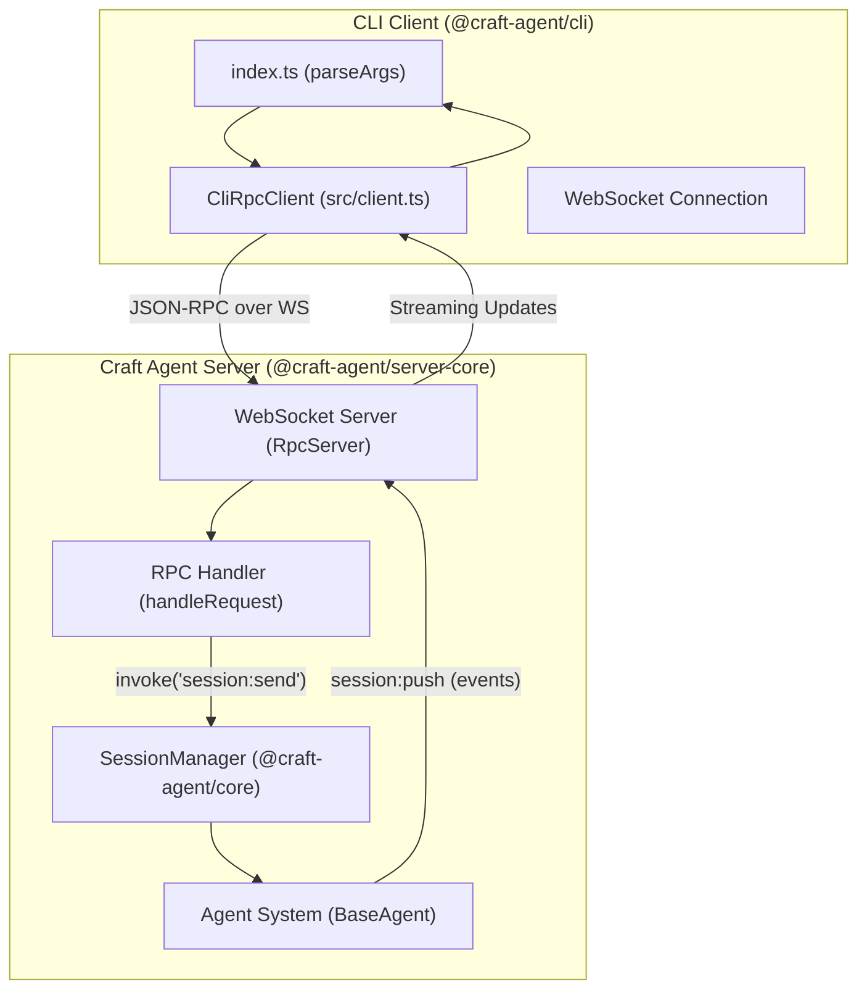
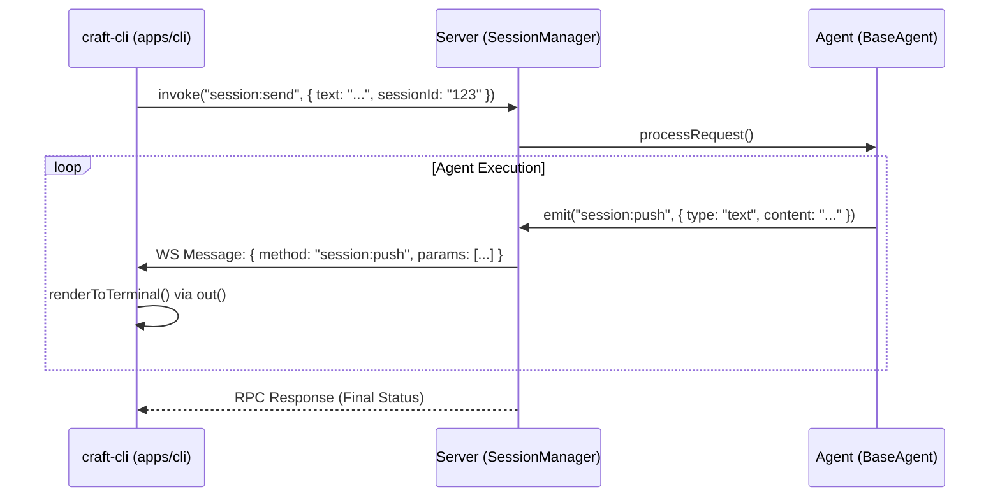

# CLI Client

<details>
<summary>Relevant source files</summary>

The following files were used as context for generating this wiki page:

- [apps/cli/package.json](apps/cli/package.json)
- [apps/cli/src/index.ts](apps/cli/src/index.ts)

</details>


The CLI Client (`apps/cli`) is a terminal-based interface for interacting with a Craft Agent server. It allows users to manage sessions, invoke tools, and run agentic workflows directly from the command line or within CI/CD pipelines [apps/cli/package.json:5](). The client communicates with the server via a WebSocket-based JSON-RPC protocol, enabling real-time streaming of agent responses and tool execution status [apps/cli/src/index.ts:5-8]().

## Architecture and Data Flow

The CLI client acts as a thin RPC wrapper. It establishes a WebSocket connection to the server's RPC port, authenticates using a server token, and maps terminal commands to IPC-style calls that the server's `SessionManager` or `Agent` system can process.

### Connection Lifecycle

The CLI uses the `CliRpcClient` class to manage the lifecycle of the connection [apps/cli/src/client.ts:25]().

1.  **Authentication**: The client sends the `CRAFT_SERVER_TOKEN` as a query parameter or header during the WebSocket handshake [apps/cli/src/client.ts:65-70]().
2.  **Workspace Resolution**: If no workspace is specified via `--workspace`, the client automatically resolves the first available workspace from the server using the `resolveWorkspace` function [apps/cli/src/index.ts:164-184]().
3.  **RPC Invocation**: Commands are dispatched using `client.invoke(channel, ...args)`, which matches the IPC channel pattern used in the Electron app [apps/cli/src/client.ts:114-142]().
4.  **Event Listening**: For streaming commands (like `run`), the client registers listeners for `session:push` events to capture real-time updates via the `on` method [apps/cli/src/client.ts:162-178]().

### CLI to Server Communication Diagram

The following diagram illustrates how the CLI client interacts with the server components, bridging the terminal interface to the core agent logic.

"CLI to Server RPC Flow"

Sources: [apps/cli/src/index.ts:11-12](), [apps/cli/src/client.ts:114-142](), [apps/cli/src/client.ts:162-178]()

## Available Commands

The `craft-cli` binary supports several core commands for different operational modes, parsed in the `parseArgs` function [apps/cli/src/index.ts:43-158]().

| Command | Description | Key Options |
| :--- | :--- | :--- |
| `run` | Starts a new session, sends a prompt, and waits for completion. | `--source`, `--mode`, `--no-cleanup` |
| `invoke` | Executes a specific RPC channel on the server. | `channel`, `args` |
| `listen` | Subscribes to server events and prints them to stdout. | N/A |
| `validate` | Checks server health and connection status. | `--validate-server` |
| `list` | Lists active sessions or workspaces. | `--json` |

### The `run` Command Workflow

The `run` command is the primary entry point for scripting. It performs a full lifecycle:
1.  **Session Initialization**: Creates a temporary or named session [apps/cli/src/index.ts:17-41]().
2.  **Source Attachment**: Attaches specified `--source` integrations (MCP, API, or Local) [apps/cli/src/index.ts:91-93]().
3.  **Permission Control**: Sets the permission `--mode` (e.g., `allow-all` for autonomous execution) [apps/cli/src/index.ts:94-96]().
4.  **Execution & Streaming**: Streams the agent's thought process and tool outputs to the terminal using the `session:push` event listener [apps/cli/src/client.ts:162-178]().
5.  **Cleanup**: Cleans up the session unless `--no-cleanup` is specified [apps/cli/src/index.ts:100-102]().

Sources: [apps/cli/src/index.ts:17-41](), [apps/cli/src/index.ts:43-158]()

## Implementation Details

### Arg Parsing and Environment
The CLI parses arguments using a custom loop in `parseArgs` [apps/cli/src/index.ts:43-158](). It supports several environment variable fallbacks to simplify CI/CD configuration:
- `CRAFT_SERVER_URL`: The WebSocket URL of the server [apps/cli/src/index.ts:149]().
- `CRAFT_SERVER_TOKEN`: The authentication token [apps/cli/src/index.ts:150]().
- `LLM_PROVIDER` / `LLM_API_KEY`: Overrides for the agent's LLM configuration [apps/cli/src/index.ts:152-154]().

### Real-time Streaming
Streaming is handled via the `session:push` event. The `CliRpcClient` maintains a map of callbacks in `this.listeners` [apps/cli/src/client.ts:31](). When the server pushes a `session:push` message, the client checks if the message belongs to the active session and renders the content using the `out` helper [apps/cli/src/index.ts:190-198]().

"Streaming Event Handling"

Sources: [apps/cli/src/client.ts:114-142](), [apps/cli/src/client.ts:162-178](), [apps/cli/src/index.ts:190-198]()

## CI/CD and Scripting Workflows

The CLI is designed for non-interactive use in automation pipelines.

### Example: Automated Documentation Update
A script can use the CLI to read a codebase and update a documentation file by passing a prompt and local source:
```bash
craft-cli run "Read the files in src/ and update README.md with the new API changes" \
  --source local:./src \
  --mode allow-all \
  --no-cleanup
```

### Server Validation
In CI environments, the `--validate-server` flag (aliased to the `validate` command) is used to ensure the agent infrastructure is reachable before running tests [apps/cli/src/index.ts:136-138]().

### JSON Output
For downstream processing (e.g., with `jq`), the `--json` flag forces all outputs into a machine-readable JSON format via the `out` helper [apps/cli/src/index.ts:190-198]().

Sources: [apps/cli/src/index.ts:17-41](), [apps/cli/src/index.ts:190-198]()