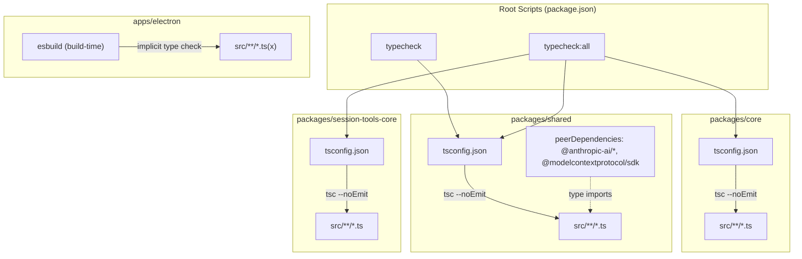
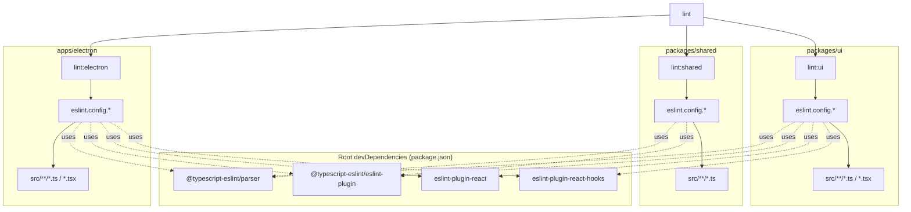
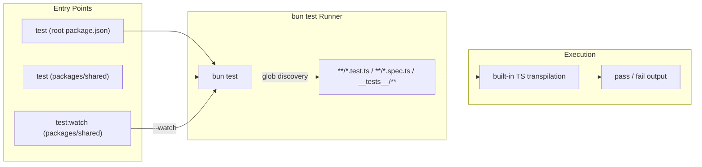
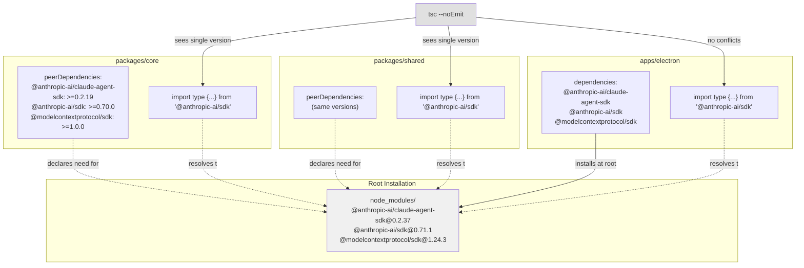

# Code Quality & Type Checking

<details>
<summary>Relevant source files</summary>

The following files were used as context for generating this wiki page:

- [package.json](package.json)

</details>

This page documents the type checking, linting, and testing infrastructure used to maintain code quality across the Craft Agents codebase. For information about building and packaging the application, see [Build System](#5.2). For information about working with packages and their dependencies, see [Working with Packages](#5.4).

## Overview

The codebase employs three primary quality control mechanisms:

- **TypeScript** for static type checking with strict mode enabled
- **ESLint** for code style and pattern enforcement with TypeScript-aware rules
- **Bun** as the test runner for unit and integration tests

All quality checks are designed to work within the monorepo structure and respect workspace boundaries.

## TypeScript Configuration

The project uses TypeScript 5.0+ with strict type checking enabled. Type checking is configured at the package level rather than globally, allowing each package to maintain its own `tsconfig.json` while sharing common settings.

### Type Checking Scripts

The root `package.json` defines two type checking scripts:

| Script          | Packages Checked                                                  | Notes                                                  |
| --------------- | ----------------------------------------------------------------- | ------------------------------------------------------ |
| `typecheck`     | `packages/shared`                                                 | Quick check on the shared package only                 |
| `typecheck:all` | `packages/core`, `packages/shared`, `packages/session-tools-core` | Full sequential check across all foundational packages |

Both scripts invoke `tsc --noEmit`, which validates types without emitting output files.

Sources: [package.json:14-15]()

### Why Selective Type Checking

Type checking focuses on `packages/core`, `packages/shared`, and `packages/session-tools-core` because:

1. These contain the foundational types and business logic consumed across all applications
2. The Electron app (`apps/electron`) is type-checked during build via `esbuild`
3. Vite-based apps (`viewer`, `marketing`) perform type checking during their build process
4. MCP server binaries use the shared package types and don't require separate explicit checks

### Peer Dependencies Pattern

Both `core` and `shared` packages declare AI SDKs as peer dependencies rather than direct dependencies:

```json
"peerDependencies": {
  "@anthropic-ai/claude-agent-sdk": ">=0.2.19",
  "@anthropic-ai/sdk": ">=0.70.0",
  "@modelcontextprotocol/sdk": ">=1.0.0"
}
```

This pattern ensures:

- **Single version resolution**: Only one version of each SDK exists in the dependency tree
- **Type consistency**: TypeScript sees the same SDK types across all packages
- **Version flexibility**: Applications can control SDK versions without conflicts

**Sources:** [packages/core/package.json:14-18](), [packages/shared/package.json:71-76]()

## Type Checking Flow

The following diagram maps the `typecheck` and `typecheck:all` scripts to the packages they validate.

**Diagram: `tsc --noEmit` Targets by Script**



Sources: [package.json:14-15](), [packages/core/package.json:14-18](), [packages/shared/package.json:71-76]()

## ESLint Configuration

The codebase uses ESLint with TypeScript-specific plugins to enforce code quality standards. Linting is configured separately for different parts of the monorepo.

### Lint Scripts

| Script          | Target            | Command                                                         |
| --------------- | ----------------- | --------------------------------------------------------------- |
| `lint:electron` | `apps/electron`   | `cd apps/electron && bun run lint`                              |
| `lint:shared`   | `packages/shared` | `npx eslint .`                                                  |
| `lint:ui`       | `packages/ui`     | `npx eslint .`                                                  |
| `lint`          | All three         | Runs `lint:electron`, `lint:shared`, and `lint:ui` sequentially |

Sources: [package.json:16-19]()

### ESLint Plugins

The following ESLint packages are installed at the root level and shared across all lint targets:

| Package                            | Purpose                             |
| ---------------------------------- | ----------------------------------- |
| `@typescript-eslint/parser`        | Parses TypeScript syntax for ESLint |
| `@typescript-eslint/eslint-plugin` | TypeScript-specific linting rules   |
| `eslint-plugin-react`              | React component best practices      |
| `eslint-plugin-react-hooks`        | Enforces Rules of Hooks             |

Sources: [package.json:72-73](), [package.json:76-78]()

### Linting Architecture

**Diagram: ESLint Scope per `lint:*` Script**



Sources: [package.json:16-19](), [package.json:72-73](), [package.json:76-78]()

### Why Separate Lint Configurations

Each package maintains its own ESLint configuration because:

1. **Different environments**: `apps/electron` and `packages/ui` contain React components, while `packages/shared` is pure TypeScript
2. **Plugin requirements**: React-specific rules (`eslint-plugin-react`, `eslint-plugin-react-hooks`) only apply to packages with JSX
3. **Rule customization**: Each package can tune rules for its specific context
4. **Performance**: Smaller lint scopes produce faster feedback during development

## Testing with Bun

The project uses [Bun](https://bun.sh) as its test runner, providing fast execution and built-in TypeScript support.

### Test Scripts

| Location          | Script       | Command            |
| ----------------- | ------------ | ------------------ |
| Root              | `test`       | `bun test`         |
| `packages/shared` | `test`       | `bun test`         |
| `packages/shared` | `test:watch` | `bun test --watch` |

**Sources:** [package.json:13](), [packages/shared/package.json:11-12]()

### Test Execution Flow

**Diagram: `bun test` Discovery and Execution**



Sources: [package.json:13](), [packages/shared/package.json:11-12]()

### Test File Patterns

Bun automatically discovers test files matching these patterns:

- `**/*.test.ts`
- `**/*.spec.ts`
- Files in `__tests__` directories

No additional configuration is required as Bun includes TypeScript support out of the box.

### Watch Mode

The `test:watch` script in `packages/shared` enables continuous testing during development:

```bash
cd packages/shared
npm run test:watch
```

This re-runs tests automatically when source files change, providing rapid feedback during development.

**Sources:** [packages/shared/package.json:12]()

## Quality Check Integration

The following table summarizes the complete set of quality checks and their scopes:

| Script           | Command                 | Scope                                                               |
| ---------------- | ----------------------- | ------------------------------------------------------------------- |
| `typecheck`      | `bun run typecheck`     | `packages/shared`                                                   |
| `typecheck:all`  | `bun run typecheck:all` | `packages/core` + `packages/shared` + `packages/session-tools-core` |
| `lint:electron`  | `bun run lint:electron` | `apps/electron`                                                     |
| `lint:shared`    | `bun run lint:shared`   | `packages/shared`                                                   |
| `lint:ui`        | `bun run lint:ui`       | `packages/ui`                                                       |
| `lint`           | `bun run lint`          | All three lint targets                                              |
| `test`           | `bun run test`          | All test files in workspace                                         |
| Build type check | Via `esbuild` / Vite    | Implicit during build                                               |

Sources: [package.json:13-19]()

## Peer Dependency Type Safety

The peer dependency pattern ensures type safety across package boundaries. Here's how it works:

**Diagram: Peer Dependency Type Resolution**



**Sources:** [packages/core/package.json:14-18](), [packages/shared/package.json:71-76](), [package.json:89-92]()

### Type Conflict Prevention

Without peer dependencies, this scenario could occur:

1. `packages/core` depends on `@anthropic-ai/sdk@0.70.0`
2. `packages/shared` depends on `@anthropic-ai/sdk@0.71.0`
3. TypeScript sees two different type definitions for the same import
4. Type errors occur when passing objects between packages

With peer dependencies:

1. Both `core` and `shared` declare they need `@anthropic-ai/sdk` >= some version
2. The root `package.json` (or the consuming app) provides the exact version
3. TypeScript sees exactly one set of types
4. No conflicts occur

## Pre-commit Hooks

The project uses [Husky](https://typicode.github.io/husky/) for Git hooks. The `prepare` script [package.json:54]() configures Husky automatically after `bun install`. Pre-commit hooks can be used to run linting and type checking on staged files before a commit is accepted.

Sources: [package.json:54](), [package.json:83]()

## Common Workflows

### Before Committing Changes

```bash
bun run typecheck:all   # type-check core + shared + session-tools-core
bun run lint            # lint electron + shared + ui
bun run test            # run all tests
```

### During Development

```bash
# Continuous test feedback
cd packages/shared
bun run test:watch

# Quick type check on shared only
bun run typecheck
```

### Before Opening a PR

```bash
bun run typecheck:all && bun run lint && bun run test
```

### Isolating Type Errors in a Package

Run `tsc --noEmit` directly inside the failing package for detailed error output:

```bash
cd packages/shared
bun run tsc --noEmit
```

Sources: [package.json:13-19]()

## Integration with Build System

Type checking integrates with the build system differently for each application:

| Application         | Build Tool | Type Checking          |
| ------------------- | ---------- | ---------------------- |
| Electron (main)     | esbuild    | Build-time via esbuild |
| Electron (renderer) | esbuild    | Build-time via esbuild |
| Viewer              | Vite       | Build-time via Vite    |
| Marketing           | Vite       | Build-time via Vite    |

All build tools perform type checking during the build process, ensuring that production builds are type-safe even if manual type checking is skipped.

For more details on the build system, see [Build System](#5.2).

**Sources:** [package.json:21-26,36-45]()
