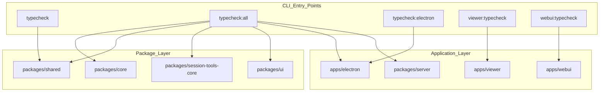
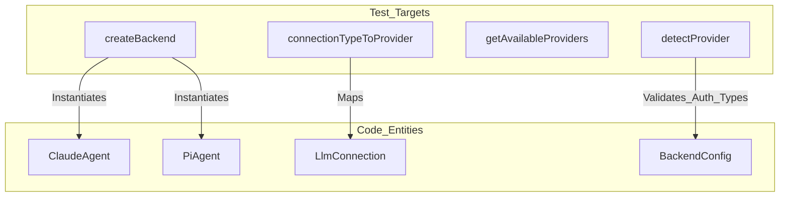
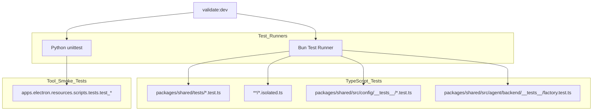

# Code Quality & Type Checking

<details>
<summary>Relevant source files</summary>

The following files were used as context for generating this wiki page:

- [package.json](package.json)
- [packages/shared/src/agent/backend/__tests__/factory.test.ts](packages/shared/src/agent/backend/__tests__/factory.test.ts)
- [packages/shared/src/config/__tests__/llm-connections.test.ts](packages/shared/src/config/__tests__/llm-connections.test.ts)

</details>


This page documents the type checking, linting, and testing infrastructure used to maintain code quality across the Craft Agents codebase. For information about building and packaging the application, see [Build System](). For information about working with packages and their dependencies, see [Working with Packages]().

## Overview

The codebase employs three primary quality control mechanisms:

- **TypeScript** for static type checking with strict mode enabled.
- **ESLint** for code style and pattern enforcement with TypeScript-aware rules.
- **Bun** as the primary test runner for unit and integration tests, alongside specialized Python tests for document tools.

All quality checks are designed to work within the monorepo structure and respect workspace boundaries.

## TypeScript Configuration

The project uses TypeScript with strict type checking enabled. Type checking is configured at the package level, allowing each package to maintain its own `tsconfig.json` while sharing common settings.

### Type Checking Scripts

The root `package.json` defines several type checking scripts to validate different layers of the monorepo:

| Script | Packages Checked | Command |
|--------|-----------------|---------|
| `typecheck` | `packages/shared` | `cd packages/shared && bun run tsc --noEmit` |
| `typecheck:all` | Core foundational packages | Sequential `tsc --noEmit` across `core`, `shared`, `server-core`, `server`, `session-tools-core`, `apps/electron`, and `ui`. |
| `typecheck:electron` | `apps/electron` | `cd apps/electron && bun run typecheck` |
| `typecheck:staged` | Staged Git files | `bash scripts/typecheck-staged.sh` |
| `viewer:typecheck` | `apps/viewer` | `cd apps/viewer && bun run typecheck` |
| `webui:typecheck` | `apps/webui` | `cd apps/webui && bun run typecheck` |

**Sources:** [package.json:24-27](), [package.json:35](), [package.json:75](), [package.json:81]()

### Why Selective Type Checking

The `typecheck:all` script is the most comprehensive, covering:
1. **Foundational Packages**: `shared`, `core`, and `session-tools-core` contain logic consumed across all apps.
2. **Server Layer**: `server` and `server-core` handle the headless agent execution.
3. **UI & Apps**: `ui` (component library) and `apps/electron` (the main desktop client).

**Sources:** [package.json:27]()

## Type Checking Flow

The following diagram maps the `typecheck` scripts to the packages they validate.

**Diagram: Type Check Execution Flow**



**Sources:** [package.json:24-27](), [package.json:35](), [package.json:75](), [package.json:81]()

## ESLint Configuration

The codebase uses ESLint with TypeScript-specific plugins to enforce code quality standards. Linting is configured separately for different parts of the monorepo to handle different environments (Node.js vs. Browser/React).

### Lint Scripts

| Script | Target | Command |
|--------|--------|---------|
| `lint:electron` | `apps/electron` | `cd apps/electron && bun run lint` |
| `lint:shared` | `packages/shared` | `npx eslint .` |
| `lint:ui` | `packages/ui` | `npx eslint .` |
| `lint:ipc-sends` | IPC Security | `bash scripts/check-raw-sends.sh` |
| `lint` | **Full Suite** | Runs all the above scripts sequentially. |

**Sources:** [package.json:43-47]()

### Specialized Linting: IPC Security
The `lint:ipc-sends` script executes `scripts/check-raw-sends.sh`. This is a specialized check to ensure that IPC communication follows the established security patterns, preventing unsafe raw sends from the renderer process.

**Sources:** [package.json:43]()

## Testing Infrastructure

The project primarily uses [Bun](https://bun.sh) as its test runner, providing fast execution and built-in TypeScript support. It also includes Python-based smoke tests for document processing tools.

### Test Suites

| Suite | Script | Purpose |
|-------|--------|---------|
| **Core Logic** | `test` | Runs `bun test` and executes all `*.isolated.ts` tests in the repo. |
| **Shared Config** | `test:shared:config` | Validates LLM connections, storage migrations, and startup logic. |
| **Document Tools** | `test:doc-tools` | Python unit tests for PDF, XLSX, DOCX, and image processing tools. |
| **Full Validation** | `validate:dev` | Runs `typecheck:all`, `test:shared:all`, and `test:doc-tools`. |

**Sources:** [package.json:23](), [package.json:38](), [package.json:40-41]()

### Agent & Connection Validation
Tests in `packages/shared/src/agent/backend/__tests__/factory.test.ts` verify the integrity of the agent creation pipeline, including provider detection and backend mapping.

**Diagram: Agent Factory Test Coverage**



**Sources:** [packages/shared/src/agent/backend/__tests__/factory.test.ts:13-27](), [packages/shared/src/agent/backend/__tests__/factory.test.ts:88-103]()

### Test Discovery & Execution

**Diagram: Test Runner Architecture**



**Sources:** [package.json:23](), [package.json:38-41](), [packages/shared/src/agent/backend/__tests__/factory.test.ts:10]()

## Quality Check Integration

Before submitting changes, developers should run the full validation suite. This ensures that type safety is maintained across package boundaries and that no regressions are introduced in core logic or document processing tools.

### Pre-submission Workflow

```bash
# Run full type checking across all packages
bun run typecheck:all

# Run all linting including IPC security checks
bun run lint

# Run the complete validation suite (Types + Bun Tests + Python Tests)
bun run validate:dev
```

**Sources:** [package.json:27](), [package.json:41](), [package.json:47]()

### Continuous Development
For rapid feedback during development of the shared logic:
```bash
# Run specific tests for LLM connections and models
bun run test:shared:all
```

**Sources:** [package.json:39]()