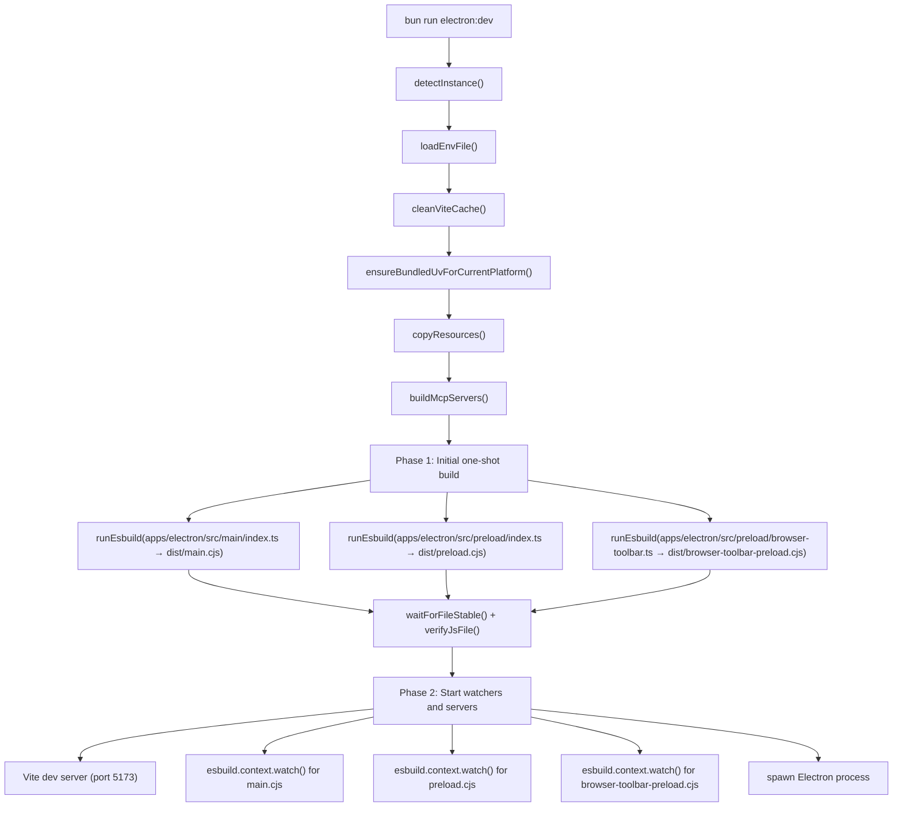
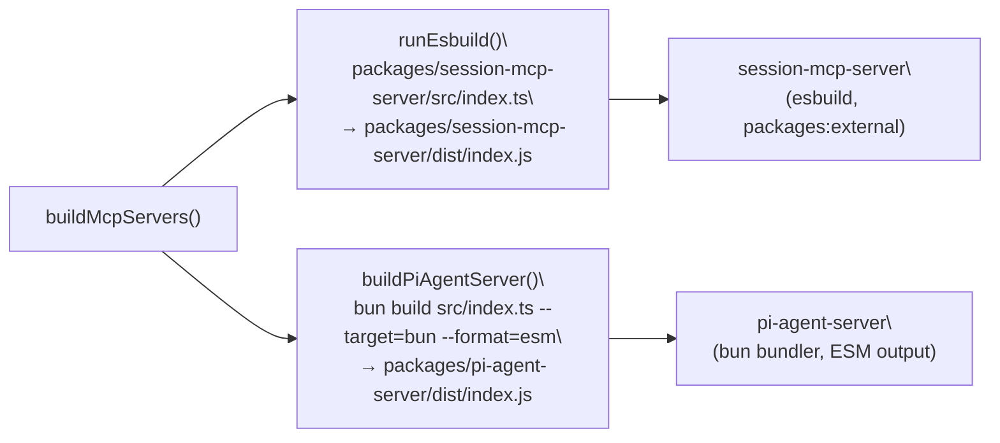
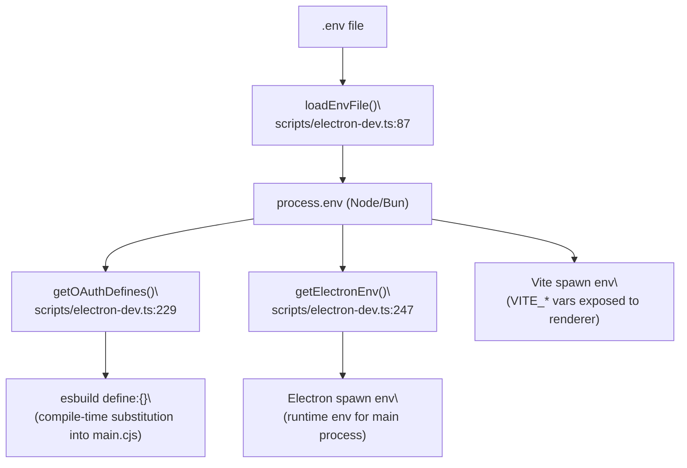

# Development Setup

<details>
<summary>Relevant source files</summary>

The following files were used as context for generating this wiki page:

- [CONTRIBUTING.md](CONTRIBUTING.md)
- [package.json](package.json)
- [scripts/electron-dev.ts](scripts/electron-dev.ts)

</details>

This page covers the steps required to clone the repository, install dependencies, configure environment credentials, and launch the app in development mode. For information about the full build pipeline and distribution artifacts, see [Build System](#5.2). For running checks and tests before submitting changes, see [Code Quality & Type Checking](#5.3).

---

## Prerequisites

| Requirement                    | Notes                                               |
| ------------------------------ | --------------------------------------------------- |
| [Bun](https://bun.sh/) runtime | Primary package manager and script runner           |
| Node.js 18+                    | Required by some tooling (e.g., `electron-builder`) |
| macOS, Linux, or Windows       | All three platforms are supported                   |

---

## Cloning and Installing Dependencies

```bash
git clone https://github.com/lukilabs/craft-agents-oss.git
cd craft-agents-oss
bun install
```

`bun install` reads the root [package.json:7-11]() workspace definition and installs dependencies for all packages under `packages/*` and `apps/*` (excluding `apps/online-docs`).

Sources: [package.json:1-11](), [CONTRIBUTING.md:15-23]()

---

## Environment Configuration

### Creating the `.env` File

Copy the example file and populate it with your credentials:

```bash
cp .env.example .env
```

The `.env` file is loaded at dev-server startup by `loadEnvFile()` in [scripts/electron-dev.ts:87-109](). It is parsed line-by-line; lines beginning with `#` are skipped, and surrounding quotes are stripped from values.

### Required OAuth Variables

The following variables are injected at build time into the main process bundle by `getOAuthDefines()` [scripts/electron-dev.ts:229-245]():

| Variable                        | Purpose                     |
| ------------------------------- | --------------------------- |
| `GOOGLE_OAUTH_CLIENT_ID`        | Google AI Studio OAuth flow |
| `GOOGLE_OAUTH_CLIENT_SECRET`    | Google AI Studio OAuth flow |
| `SLACK_OAUTH_CLIENT_ID`         | Slack integration           |
| `SLACK_OAUTH_CLIENT_SECRET`     | Slack integration           |
| `MICROSOFT_OAUTH_CLIENT_ID`     | Microsoft OAuth flow        |
| `MICROSOFT_OAUTH_CLIENT_SECRET` | Microsoft OAuth flow        |

If a variable is absent from the environment, `getOAuthDefines()` substitutes an empty string. Missing OAuth credentials will disable the corresponding provider flow but will not prevent the app from starting.

### Syncing Secrets

If you have access to the team secrets store, run:

```bash
bun run sync-secrets
```

This executes `scripts/sync-secrets.sh` [package.json:33]() and populates the `.env` file with the canonical OAuth credentials used for development builds.

Sources: [scripts/electron-dev.ts:229-245](), [scripts/electron-dev.ts:87-109](), [package.json:33](), [CONTRIBUTING.md:26-30]()

---

## Launching in Development Mode

```bash
bun run electron:dev
```

This runs [scripts/electron-dev.ts]() which coordinates a two-phase startup sequence.

### Dev Startup Sequence

**Dev startup orchestration (`main()` function)**



Sources: [scripts/electron-dev.ts:362-580]()

### Phase 1 — Initial Build

`main()` calls `runEsbuild()` [scripts/electron-dev.ts:266-288]() in parallel for three entry points:

| Entry Point                                    | Output                                           |
| ---------------------------------------------- | ------------------------------------------------ |
| `apps/electron/src/main/index.ts`              | `apps/electron/dist/main.cjs`                    |
| `apps/electron/src/preload/index.ts`           | `apps/electron/dist/preload.cjs`                 |
| `apps/electron/src/preload/browser-toolbar.ts` | `apps/electron/dist/browser-toolbar-preload.cjs` |

After each build, `waitForFileStable()` [scripts/electron-dev.ts:333-360]() polls until the file size stabilizes, and `verifyJsFile()` [scripts/electron-dev.ts:318-330]() confirms the file exists and is non-empty.

### Phase 2 — Watch Mode

Four concurrent processes are started:

| Process                 | Mechanism                   | Description                                |
| ----------------------- | --------------------------- | ------------------------------------------ |
| Vite dev server         | `spawn(VITE_BIN)`           | Serves renderer at `http://localhost:5173` |
| Main watcher            | `esbuild.context().watch()` | Rebuilds `main.cjs` on source changes      |
| Preload watcher         | `esbuild.context().watch()` | Rebuilds `preload.cjs` on source changes   |
| Toolbar preload watcher | `esbuild.context().watch()` | Rebuilds `browser-toolbar-preload.cjs`     |

Electron is launched via `spawn(ELECTRON_BIN, "apps/electron")` [scripts/electron-dev.ts:537-545]() with the environment produced by `getElectronEnv()` [scripts/electron-dev.ts:247-263](), which injects `VITE_DEV_SERVER_URL` so the main process knows where to load the renderer from.

Sources: [scripts/electron-dev.ts:390-580]()

---

## Auxiliary Dev Scripts

| Script                  | Command                         | Notes                                                  |
| ----------------------- | ------------------------------- | ------------------------------------------------------ |
| `electron:dev`          | `bun run electron:dev`          | Standard dev mode                                      |
| `electron:dev:terminal` | `bun run electron:dev:terminal` | Passes `--terminal` flag                               |
| `electron:dev:menu`     | `bun run electron:dev:menu`     | Interactive Bash menu (`scripts/electron-dev.sh`)      |
| `electron:dev:logs`     | `bun run electron:dev:logs`     | Tails `main.log` in a new Terminal window (macOS)      |
| `fresh-start`           | `bun run fresh-start`           | Resets local config state via `scripts/fresh-start.ts` |
| `fresh-start:token`     | `bun run fresh-start:token`     | Resets only the stored token                           |

Sources: [package.json:29-36]()

---

## MCP Server Builds

Before the Electron process starts, `buildMcpServers()` [scripts/electron-dev.ts:190-226]() builds two server packages:

**MCP server build targets**



- `session-mcp-server` is built with `esbuild` using `packages: "external"` so it resolves dependencies from the root `node_modules` at runtime.
- `pi-agent-server` is built with `bun build` because its dependency (`@mariozechner/pi-coding-agent`) is ESM-only and cannot be handled by esbuild with `packages: "external"` (which would emit `require()` calls that fail for ESM modules).
- If `packages/pi-agent-server/src` does not exist (e.g., in the OSS mirror), the pi-agent-server build step is skipped automatically.

Sources: [scripts/electron-dev.ts:190-226](), [scripts/electron-dev.ts:294-311]()

---

## Multi-Instance Development

Running multiple development instances simultaneously is supported. `detectInstance()` [scripts/electron-dev.ts:67-84]() checks the repository folder name for a numeric suffix (e.g., `craft-agents-1`) and adjusts the following environment variables:

| Variable                | Default           | Instance 1 Example  |
| ----------------------- | ----------------- | ------------------- |
| `CRAFT_VITE_PORT`       | `5173`            | `1173`              |
| `CRAFT_APP_NAME`        | `Craft Agents`    | `Craft Agents [1]`  |
| `CRAFT_CONFIG_DIR`      | `~/.craft-agent/` | `~/.craft-agent-1/` |
| `CRAFT_DEEPLINK_SCHEME` | `craftagents`     | `craftagents1`      |

Cloning the repo into a folder named `craft-agents-2` would configure the second instance on port `2173` with its own isolated config directory.

Sources: [scripts/electron-dev.ts:67-84](), [scripts/electron-dev.ts:247-263]()

---

## Environment Variable Flow

**How `.env` variables reach the running processes**



OAuth variables travel through `getOAuthDefines()` and are embedded as string literals inside `main.cjs` at build time. Runtime environment variables (ports, config dir, app name, deep link scheme) are passed to the Electron process via `getElectronEnv()`.

Sources: [scripts/electron-dev.ts:87-109](), [scripts/electron-dev.ts:229-263]()
