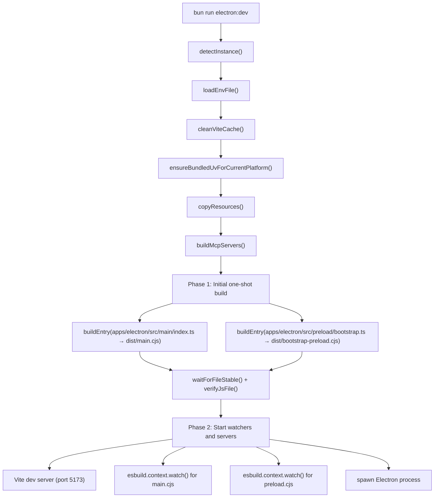
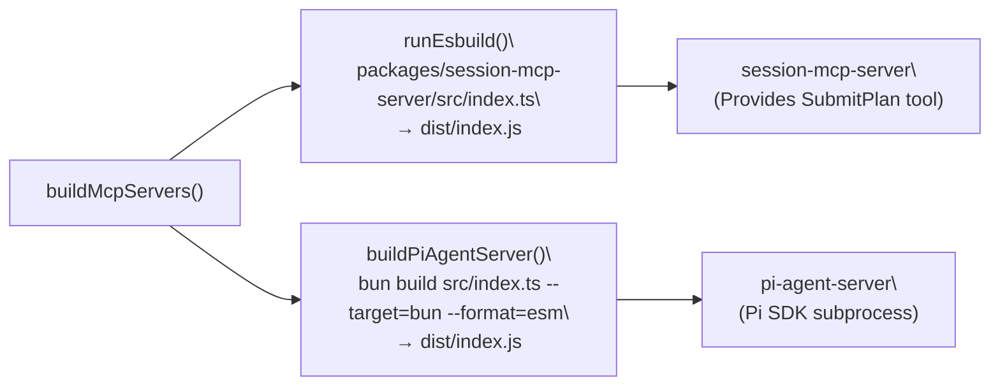
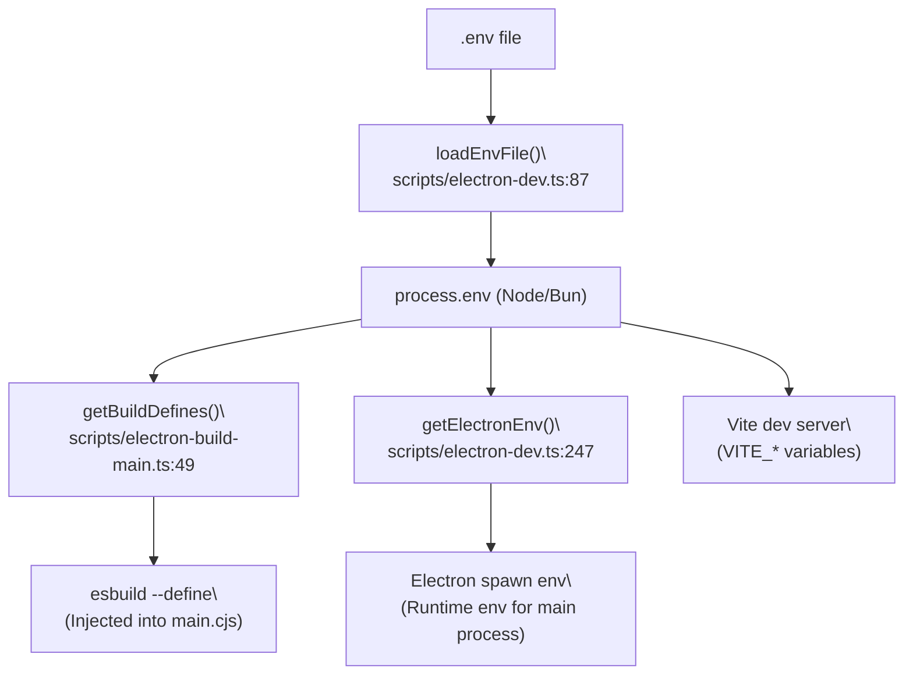

# Development Setup

<details>
<summary>Relevant source files</summary>

The following files were used as context for generating this wiki page:

- [apps/electron/package.json](apps/electron/package.json)
- [package.json](package.json)

</details>


This page covers the steps required to clone the repository, install dependencies, configure environment credentials, and launch the app in development mode. For information about the full build pipeline and distribution artifacts, see [Build System](#5.2). For running checks and tests before submitting changes, see [Code Quality & Type Checking](#5.3).

---

## Prerequisites

| Requirement | Notes |
|---|---|
| [Bun](https://bun.sh/) runtime | Primary package manager and script runner [package.json:23]() |
| Node.js 18+ | Required for Electron and certain build tools [apps/electron/package.json:15]() |
| macOS, Linux, or Windows | All three platforms are supported for development [package.json:30-34]() |

---

## Cloning and Installing Dependencies

```bash
git clone https://github.com/lukilabs/craft-agents-oss.git
cd craft-agents-oss
bun install
```

`bun install` reads the root [package.json:17-21]() workspace definition and installs dependencies for all packages under `packages/*` and `apps/*` (excluding `apps/online-docs`). Key trusted dependencies like `electron`, `esbuild`, and `sharp` are handled by the Bun runtime [package.json:8-16]().

Sources: [package.json:1-21](), [package.json:8-16]()

---

## Environment Configuration

### Creating the `.env` File

Copy the example file and populate it with your credentials:

```bash
cp .env.example .env
```

The `.env` file is loaded at dev-server startup by `loadEnvFile()` in [scripts/electron-dev.ts:87-109](). It is parsed line-by-line; lines beginning with `#` are skipped, and surrounding quotes are stripped from values.

### Required OAuth Variables

The following variables are injected at build time into the main process bundle by `getBuildDefines()` in [scripts/electron-build-main.ts:49-63](). These defines are used by `esbuild` to replace global constants in the code [apps/electron/package.json:18]().

| Variable | Purpose |
|---|---|
| `GOOGLE_OAUTH_CLIENT_ID` | Google AI Studio / Gemini integration [apps/electron/package.json:18]() |
| `GOOGLE_OAUTH_CLIENT_SECRET` | Google AI Studio / Gemini integration [apps/electron/package.json:18]() |
| `SLACK_OAUTH_CLIENT_ID` | Slack integration [apps/electron/package.json:18]() |
| `SLACK_OAUTH_CLIENT_SECRET` | Slack integration [apps/electron/package.json:18]() |
| `MICROSOFT_OAUTH_CLIENT_ID` | Microsoft OAuth flow [apps/electron/package.json:18]() |
| `CRAFT_DEV_RUNTIME` | Enables dev-only features in main process [package.json:70]() |

If a variable is absent from the environment, `getBuildDefines()` substitutes an empty string [scripts/electron-build-main.ts:60-61](). Missing OAuth credentials will disable the corresponding provider flow but will not prevent the app from starting.

### Syncing Secrets

If you have access to the internal team secrets store, you can run:

```bash
bun run sync-secrets
```

This executes `scripts/sync-secrets.sh` [package.json:61]() which populates the `.env` file with canonical OAuth credentials.

Sources: [scripts/electron-build-main.ts:49-63](), [scripts/electron-dev.ts:87-109](), [package.json:61](), [apps/electron/package.json:18-19]()

---

## Launching in Development Mode

```bash
bun run electron:dev
```

This runs [scripts/electron-dev.ts]() which coordinates a multi-phase startup sequence involving both `esbuild` for the Node.js side and `Vite` for the frontend.

### Dev Startup Sequence

**Dev startup orchestration (`main()` function)**



Sources: [scripts/electron-dev.ts:390-580]()

### Phase 1 — Initial Build

The script builds essential entry points before launching. `buildEntry()` [scripts/electron-dev.ts:266-288]() uses `esbuild` to bundle the main and preload scripts.

| Entry Point | Output |
|---|---|
| `apps/electron/src/main/index.ts` | `apps/electron/dist/main.cjs` [apps/electron/package.json:5]() |
| `apps/electron/src/preload/bootstrap.ts` | `apps/electron/dist/bootstrap-preload.cjs` [apps/electron/package.json:20]() |
| `apps/electron/src/preload/browser-toolbar.ts` | `apps/electron/dist/browser-toolbar-preload.cjs` [apps/electron/package.json:21]() |

After each build, `waitForFileStable()` [scripts/electron-dev.ts:333-360]() polls until the file size stabilizes, and `verifyJsFile()` [scripts/electron-dev.ts:318-330]() confirms the file is syntactically valid using `node --check`.

### Phase 2 — Watch Mode

Concurrent processes are started to enable Hot Module Replacement (HMR) and automatic restarts:

| Process | Mechanism | Description |
|---|---|---|
| Vite dev server | `spawn(VITE_BIN)` | Serves renderer at `http://localhost:5173` [scripts/electron-dev.ts:497-509]() |
| Main watcher | `esbuild.context().watch()` | Rebuilds `main.cjs` on source changes [scripts/electron-dev.ts:511-523]() |
| Preload watcher | `esbuild.context().watch()` | Rebuilds `bootstrap-preload.cjs` on changes [scripts/electron-dev.ts:525-535]() |

Electron is launched via `spawn(ELECTRON_BIN, "apps/electron")` [scripts/electron-dev.ts:537-545]() with an environment that includes `VITE_DEV_SERVER_URL` [scripts/electron-dev.ts:247-263](), directing the main process to load the UI from the Vite server instead of local files.

Sources: [scripts/electron-dev.ts:390-580](), [scripts/electron-dev.ts:266-288](), [scripts/electron-dev.ts:318-360](), [scripts/electron-dev.ts:497-545]()

---

## Auxiliary Dev Scripts

| Script | Command | Notes |
|---|---|---|
| `electron:dev` | `bun run electron:dev` | Standard dev mode [package.json:57]() |
| `electron:dev:terminal` | `bun run electron:dev:terminal` | Dev mode with `--terminal` flag [package.json:58]() |
| `electron:dev:menu` | `bun run electron:dev:menu` | Interactive Bash menu [package.json:59]() |
| `electron:dev:logs` | `bun run electron:dev:logs` | Tails `main.log` (macOS) [package.json:60]() |
| `fresh-start` | `bun run fresh-start` | Resets local config state [package.json:62]() |
| `fresh-start:token` | `bun run fresh-start:token` | Resets only the stored token [package.json:63]() |
| `playground:dev` | `bun run playground:dev` | Launches the UI playground [package.json:73]() |

Sources: [package.json:57-73]()

---

## MCP Server Builds

The application relies on sidecar MCP servers for specific functionalities like session-scoped tools. `buildMcpServers()` [scripts/electron-dev.ts:190-226]() prepares these:

**MCP server build targets**



- `session-mcp-server` is built using `esbuild` to provide tools like `SubmitPlan` for Codex sessions [scripts/electron-build-main.ts:169-206]().
- `pi-agent-server` is built with `bun build` to handle ESM-only dependencies like `@mariozechner/pi-coding-agent` [scripts/electron-build-main.ts:208-239]().
- `ensureBundledUvForCurrentPlatform()` downloads the `uv` binary if missing, which is used for managing Python environments for MCP servers [scripts/electron-dev.ts:42-64]().

Sources: [scripts/electron-dev.ts:190-226](), [scripts/electron-build-main.ts:169-239](), [scripts/electron-dev.ts:42-64]()

---

## Multi-Instance Development

Running multiple development instances simultaneously is supported via folder naming. `detectInstance()` [scripts/electron-dev.ts:68-84]() checks the repository folder name for a numeric suffix (e.g., `craft-agents-1`) and adjusts the environment:

| Variable | Default | Instance 1 Example |
|---|---|---|
| `CRAFT_VITE_PORT` | `5173` | `1173` |
| `CRAFT_APP_NAME` | `Craft Agents` | `Craft Agents [1]` |
| `CRAFT_CONFIG_DIR` | `~/.craft-agent/` | `~/.craft-agent-1/` |
| `CRAFT_DEEPLINK_SCHEME` | `craftagents` | `craftagents1` |

This isolation ensures that different instances do not conflict on network ports or local database/config files [scripts/electron-dev.ts:82]().

Sources: [scripts/electron-dev.ts:68-84]()

---

## Environment Variable Flow

**How `.env` variables reach the running processes**



Variables from `.env` are either baked into the JS bundle at compile-time (via `esbuild --define`) or passed as runtime environment variables when the Electron process is spawned [scripts/electron-build-main.ts:49-63](), [scripts/electron-dev.ts:247-263](). Note that `apps/electron/package.json` specifically defines these for the production build as well [apps/electron/package.json:18]().

Sources: [scripts/electron-dev.ts:87-109](), [scripts/electron-build-main.ts:49-63](), [scripts/electron-dev.ts:247-263](), [apps/electron/package.json:18]()