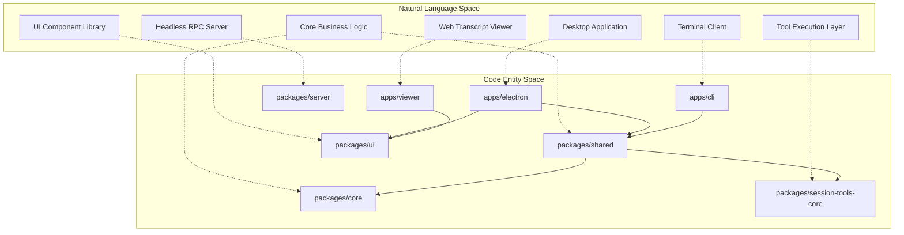
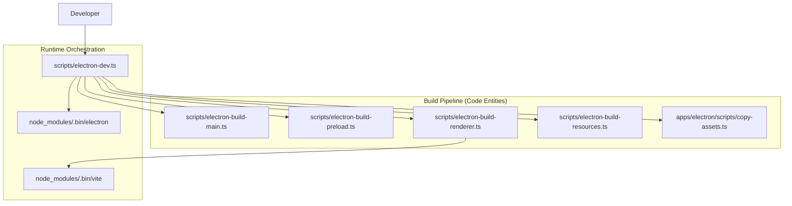

# Development Guide

<details>
<summary>Relevant source files</summary>

The following files were used as context for generating this wiki page:

- [apps/electron/package.json](apps/electron/package.json)
- [package.json](package.json)

</details>


This page provides an overview of the development workflow, tooling, and common tasks for contributing to the Craft Agents codebase. It covers the prerequisites, development environment setup, and high-level build processes.

For detailed setup instructions, see [Development Setup](#5.1). For comprehensive build system documentation, see [Build System](#5.2). For code quality tools and testing, see [Code Quality & Type Checking](#5.3). For working with the monorepo packages, see [Working with Packages](#5.4).

## Prerequisites and Tech Stack

The Craft Agents project uses a modern JavaScript/TypeScript stack with specific tooling requirements:

| Component | Technology | Version | Purpose |
|-----------|-----------|---------|---------|
| Runtime | Bun | latest | Package manager, test runner, script execution |
| Desktop Framework | Electron | ^39.2.7 | Cross-platform desktop application |
| UI Framework | React | ^18.3.1 | User interface components |
| Build Tool (Main/Preload) | ESBuild | ^0.25.0 | Fast JavaScript/TypeScript bundler |
| Build Tool (Renderer) | Vite | ^6.2.4 | Modern frontend build tool with HMR |
| Type System | TypeScript | ^5.0.0 | Static type checking |
| Linter | ESLint | ^9.39.2 | Code quality and style enforcement |
| Packager | Electron Builder | ^26.0.12 | Application distribution |
| CSS Framework | Tailwind CSS | ^4.1.18 | Utility-first styling |

**Sources:** [package.json:1-128]()

## Monorepo Structure

The codebase is organized as a Bun workspace monorepo with strict separation between applications and shared packages. The workspace configuration explicitly excludes `apps/online-docs` [package.json:17-21]().

### System Architecture to Code Mapping

The following diagram bridges the high-level system concepts to their specific code entities in the monorepo.



**Sources:** [package.json:17-21](), [apps/electron/package.json:38-42]()

## Development Workflow

### Development Cycle

The typical development workflow involves building, running, and testing changes across multiple processes. The primary entry point for developers is `scripts/electron-dev.ts`, which orchestrates the multi-process build and launch sequence [package.json:57-57]().



**Sources:** [package.json:50-58](), [apps/electron/package.json:18-26]()

## Common Development Commands

All commands should be run from the repository root using `bun run`:

### Development Commands

| Command | Purpose | Details |
|---------|---------|---------|
| `bun run electron:dev` | Start development mode | Orchestrates builds and launches Electron |
| `bun run electron:dev:terminal` | Dev mode (terminal) | Runs dev mode with output in current terminal |
| `bun run electron:dev:logs` | View application logs | Tails `@craft-agent/electron/main.log` |
| `bun run viewer:dev` | Start web viewer dev | Launches Vite on port 5174 |
| `bun run webui:dev` | Start browser-based UI | Launches Vite on port 5175 |
| `bun run server:dev` | Start headless server | Runs `packages/server/src/index.ts` |

### Build & Quality Commands

| Command | Purpose | Scope |
|---------|---------|-------|
| `bun run electron:build` | Full Electron build | Main, preload, renderer, resources, assets |
| `bun run typecheck:all` | Full type check | `core`, `shared`, `server`, `ui`, `electron`, etc. |
| `bun run lint` | Run all linters | `apps/electron`, `packages/shared`, `packages/ui` |
| `bun test` | Run all tests | Executes `bun test` across the workspace |
| `bun run validate:dev` | Full validation | Runs typecheck, shared tests, and doc-tools tests |

**Sources:** [package.json:22-58](), [package.json:27-27](), [package.json:41-41](), [package.json:73-81]()

## Development Environment Setup

### Quick Start

1. **Install Bun runtime**
   ```bash
   curl -fsSL https://bun.sh/install | bash
   ```

2. **Clone repository**
   ```bash
   git clone https://github.com/lukilabs/craft-agents-oss.git
   cd craft-agents-oss
   ```

3. **Install dependencies**
   ```bash
   bun install
   ```

4. **Start development mode**
   ```bash
   bun run electron:dev
   ```

For detailed environment configuration including OAuth credentials and build-time variables, see [Environment Configuration](#3.2).

## Package Development

The monorepo contains several packages with a clear dependency hierarchy. Shared packages are referenced using the `workspace:*` syntax in `package.json` [apps/electron/package.json:39-42]().

| Package | Path | Purpose |
|---------|------|---------|
| `@craft-agent/core` | `packages/core` | Base type definitions and shared utilities |
| `@craft-agent/shared` | `packages/shared` | Business logic: `SessionManager`, `AgentSystem` |
| `@craft-agent/ui` | `packages/ui` | Shared React component library |
| `session-tools-core`| `packages/session-tools-core` | Core logic for session-scoped tools |
| `codex-types` | `packages/codex-types` | Type definitions for Codex integration |
| `session-mcp-server`| `packages/session-mcp-server` | MCP server exposing session tools |

For details on adding packages or managing `workspace:*` references, see [Working with Packages](#5.4).

**Sources:** [package.json:17-21](), [apps/electron/package.json:38-42]()

## Type Checking and Linting

Type checking is performed using `tsc --noEmit`. The project provides granular scripts for checking individual packages or the entire workspace:

- **Focused check**: `bun run typecheck` - checks `packages/shared` [package.json:24-24]().
- **Full check**: `bun run typecheck:all` - sequentially checks all major packages [package.json:27-27]().

Linting is enforced via ESLint, with specific targets for `electron`, `shared`, and `ui` packages [package.json:44-47](). A custom script `lint:ipc-sends` checks for raw IPC sends [package.json:43-43]().

For detailed information on code quality tools, see [Code Quality & Type Checking](#5.3).

## Distribution and Release

Production builds are handled by `electron-builder` using the configuration in `apps/electron/electron-builder.yml`.

| Script | Target |
|--------|--------|
| `electron:dist:mac` | macOS (Universal/ARM/x64) |
| `electron:dist:win` | Windows (.exe) |
| `electron:dist:linux` | Linux (.AppImage, .deb) |
| `server:build` | Headless Server bundle |

For details on platform-specific requirements and code signing, see [Building & Distribution](#6).

**Sources:** [package.json:66-72](), [package.json:30-30]()

## Utility Scripts

The repository includes several utility scripts for common maintenance tasks:

- `bun run electron:clean`: Removes build artifacts from `apps/electron/dist` [package.json:49-49]().
- `bun run sync-secrets`: Pulls development secrets into the environment [package.json:61-61]().
- `bun run fresh-start`: Wipes local configuration and data for a clean testing state [package.json:62-62]().
- `bun run print:system-prompt`: Outputs the current system prompt for debugging [package.json:64-64]().

## Next Steps

- **Setup**: Follow [Development Setup](#5.1) for detailed installation and configuration.
- **Build Details**: See [Build System](#5.2) for comprehensive build documentation.
- **CLI Usage**: See [CLI Client](#5.6) for using the `craft-cli` tool.
- **Codex Integration**: See [Type Generation for Codex](#5.5) for working with session tools.