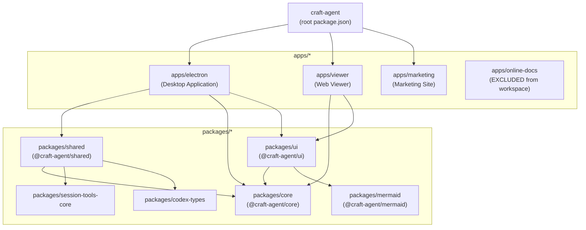
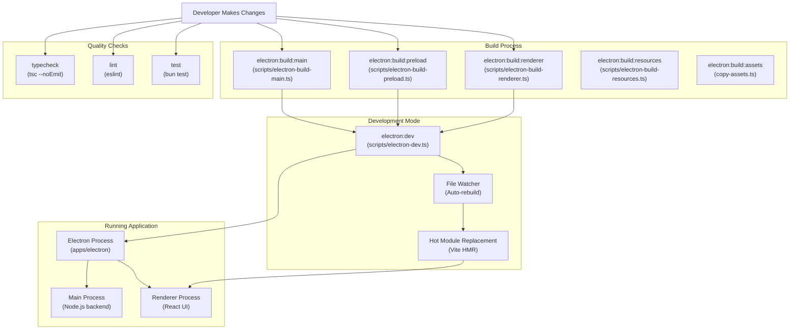
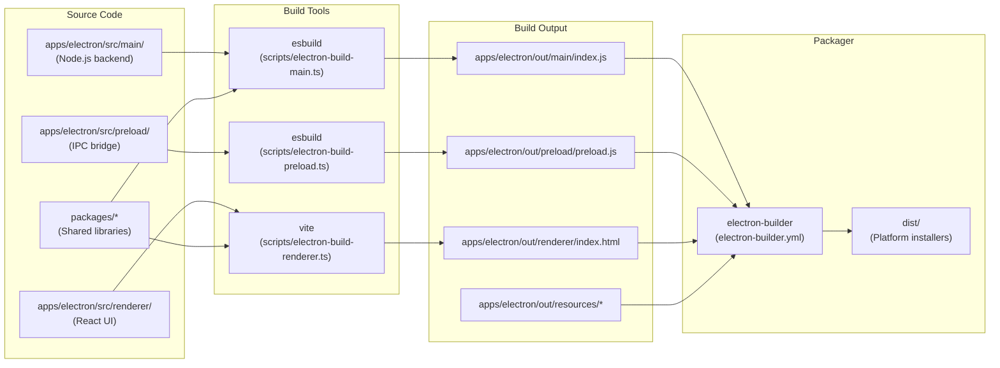
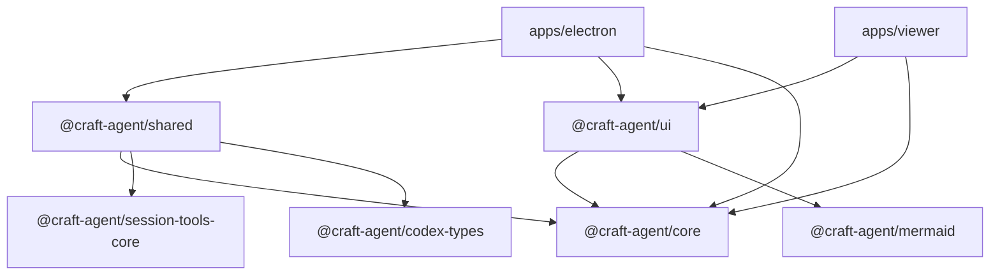

# Development Guide

<details>
<summary>Relevant source files</summary>

The following files were used as context for generating this wiki page:

- [CONTRIBUTING.md](CONTRIBUTING.md)
- [package.json](package.json)

</details>

This page provides an overview of the development workflow, tooling, and common tasks for contributing to the Craft Agents codebase. It covers the prerequisites, development environment setup, and high-level build processes.

For detailed setup instructions, see [Development Setup](#5.1). For comprehensive build system documentation, see [Build System](#5.2). For code quality tools and testing, see [Code Quality & Type Checking](#5.3). For working with the monorepo packages, see [Working with Packages](#5.4).

## Prerequisites and Tech Stack

The Craft Agents project uses a modern JavaScript/TypeScript stack with specific tooling requirements:

| Component                 | Technology       | Version  | Purpose                                        |
| ------------------------- | ---------------- | -------- | ---------------------------------------------- |
| Runtime                   | Bun              | latest   | Package manager, test runner, script execution |
| Desktop Framework         | Electron         | ^39.2.7  | Cross-platform desktop application             |
| UI Framework              | React            | ^18.3.1  | User interface components                      |
| Build Tool (Main/Preload) | ESBuild          | ^0.25.0  | Fast JavaScript/TypeScript bundler             |
| Build Tool (Renderer)     | Vite             | ^6.2.4   | Modern frontend build tool with HMR            |
| Type System               | TypeScript       | ^5.0.0   | Static type checking                           |
| Linter                    | ESLint           | ^9.39.2  | Code quality and style enforcement             |
| Packager                  | Electron Builder | ^26.0.12 | Application distribution                       |
| CSS Framework             | Tailwind CSS     | ^4.1.18  | Utility-first styling                          |

**Sources:** [package.json:1-128]()

## Monorepo Structure

The codebase is organized as a Bun workspace monorepo with strict separation between applications and shared packages:



The workspace configuration excludes `apps/online-docs` from the monorepo to prevent dependency conflicts with its separate documentation tooling.

**Sources:** [package.json:7-10]()

## Development Workflow

### Development Cycle

The typical development workflow involves building, running, and testing changes across multiple processes:



**Sources:** [package.json:12-51]()

## Common Development Commands

The root `package.json` defines npm scripts for all common development tasks. All commands should be run from the repository root using `bun run`:

### Development Commands

| Command                         | Purpose                         | Details                                         |
| ------------------------------- | ------------------------------- | ----------------------------------------------- |
| `bun run electron:dev`          | Start development mode          | Builds and launches Electron with file watching |
| `bun run electron:dev:terminal` | Development mode (terminal)     | Runs dev mode with output in current terminal   |
| `bun run electron:dev:logs`     | View application logs           | Opens tail of main.log in new terminal          |
| `bun run viewer:dev`            | Start web viewer dev server     | Launches Vite dev server on port 5174           |
| `bun run marketing:dev`         | Start marketing site dev server | Launches marketing site with Vite               |

### Build Commands

| Command                            | Purpose                       | Output Location                |
| ---------------------------------- | ----------------------------- | ------------------------------ |
| `bun run electron:build`           | Build all Electron components | `apps/electron/out/`           |
| `bun run electron:build:main`      | Build main process only       | `apps/electron/out/main/`      |
| `bun run electron:build:preload`   | Build preload script only     | `apps/electron/out/preload/`   |
| `bun run electron:build:renderer`  | Build renderer process only   | `apps/electron/out/renderer/`  |
| `bun run electron:build:resources` | Copy static resources         | `apps/electron/out/resources/` |
| `bun run electron:build:assets`    | Copy asset files              | `apps/electron/out/assets/`    |

### Distribution Commands

| Command                       | Purpose                                  | Output                      |
| ----------------------------- | ---------------------------------------- | --------------------------- |
| `bun run electron:dist`       | Build distributable for current platform | `dist/` directory           |
| `bun run electron:dist:mac`   | Build for macOS (ARM64 + x64)            | `.dmg` and `.zip` files     |
| `bun run electron:dist:win`   | Build for Windows                        | `.exe` installer            |
| `bun run electron:dist:linux` | Build for Linux                          | `.AppImage`, `.deb`, `.rpm` |

### Quality Assurance Commands

| Command                 | Purpose                   | Scope                                 |
| ----------------------- | ------------------------- | ------------------------------------- |
| `bun test`              | Run all tests             | All packages with test files          |
| `bun run typecheck`     | Type check shared package | `packages/shared` only                |
| `bun run typecheck:all` | Type check all packages   | `packages/core` and `packages/shared` |
| `bun run lint`          | Run linters               | `apps/electron` and `packages/shared` |
| `bun run lint:electron` | Lint Electron app only    | `apps/electron`                       |
| `bun run lint:shared`   | Lint shared package only  | `packages/shared`                     |

**Sources:** [package.json:12-51]()

## Development Environment Setup

### Quick Start

1. **Install Bun runtime**

   ```bash
   curl -fsSL https://bun.sh/install | bash
   ```

2. **Clone repository**

   ```bash
   git clone https://github.com/lukilabs/craft-agents-oss.git
   cd craft-agents-oss
   ```

3. **Install dependencies**

   ```bash
   bun install
   ```

4. **Start development mode**
   ```bash
   bun run electron:dev
   ```

For detailed environment configuration including OAuth credentials and build-time variables, see [Environment Configuration](#3.2).

## Build System Architecture

The build system uses different tools for different parts of the application, optimized for each use case:



### Build Tool Rationale

- **ESBuild for Main Process**: Fast builds with Node.js compatibility, external dependencies, source maps for debugging
- **ESBuild for Preload**: Similar to main process, requires context isolation compatibility
- **Vite for Renderer**: Hot Module Replacement (HMR) during development, React Fast Refresh, modern ES modules
- **Electron Builder**: Cross-platform packaging with code signing, auto-update support, platform-specific configurations

For detailed build configuration and optimization, see [Build System](#5.2).

**Sources:** [package.json:20-26](), [package.json:36-39]()

## Package Development

The monorepo contains six packages under `packages/`:

### Core Packages

| Package               | Path              | Purpose                        | Key Exports                                |
| --------------------- | ----------------- | ------------------------------ | ------------------------------------------ |
| `@craft-agent/core`   | `packages/core`   | Type definitions and utilities | Base types, utility functions              |
| `@craft-agent/shared` | `packages/shared` | Business logic layer           | SessionManager, ConfigManager, AgentSystem |
| `@craft-agent/ui`     | `packages/ui`     | React components               | Reusable UI components, theming            |

### Supporting Packages

| Package                           | Path                          | Purpose                        |
| --------------------------------- | ----------------------------- | ------------------------------ |
| `@craft-agent/mermaid`            | `packages/mermaid`            | Mermaid diagram renderer       |
| `@craft-agent/session-tools-core` | `packages/session-tools-core` | Session-scoped tool handlers   |
| `@craft-agent/codex-types`        | `packages/codex-types`        | Codex backend type definitions |

### Dependency Graph



For detailed information on working with packages, including dependency management and inter-package references, see [Working with Packages](#5.4).

**Sources:** [package.json:7-10]()

## Type Checking and Linting

### TypeScript Configuration

Type checking is performed using TypeScript's `tsc` compiler in `--noEmit` mode (type checking only, no code generation):

- **Focused check**: `bun run typecheck` - checks `packages/shared` only (most business logic)
- **Comprehensive check**: `bun run typecheck:all` - checks `packages/core` and `packages/shared`

TypeScript configuration files are located in each package directory. The type checking workflow excludes applications because they are type-checked during their build processes by ESBuild and Vite.

### ESLint Configuration

ESLint enforces code quality standards across two main areas:

- **Electron app**: `bun run lint:electron` - runs ESLint in `apps/electron`
- **Shared package**: `bun run lint:shared` - runs ESLint in `packages/shared`
- **All linting**: `bun run lint` - runs both linters sequentially

The ESLint configuration uses TypeScript-aware rules and React-specific plugins. Configuration files are located at the package level.

For detailed information on code quality tools, testing frameworks, and pre-commit hooks, see [Code Quality & Type Checking](#5.3).

**Sources:** [package.json:14-18]()

## Testing

Tests are written using Bun's built-in test runner and are located throughout the codebase with `.test.ts` or `.spec.ts` extensions:

```bash
bun test
```

The test command recursively finds and executes all test files in the monorepo. Bun's test runner provides:

- Fast execution with native performance
- Built-in TypeScript support (no transpilation needed)
- Jest-compatible API (`describe`, `it`, `expect`)
- Watch mode for development

For testing best practices and coverage requirements, see [Code Quality & Type Checking](#5.3).

**Sources:** [package.json:13]()

## Utility Scripts

### Development Utilities

| Script                | Purpose                                 | Usage                        |
| --------------------- | --------------------------------------- | ---------------------------- |
| `fresh-start`         | Reset all configuration and credentials | For testing onboarding flow  |
| `fresh-start:token`   | Reset OAuth tokens only                 | For testing token refresh    |
| `print:system-prompt` | Display current system prompt           | For prompt development       |
| `electron:clean`      | Clean build artifacts                   | Removes `apps/electron/out/` |
| `sync-secrets`        | Sync secrets from 1Password             | Requires 1Password CLI       |

### Advanced Development

| Script              | Purpose                        | Notes                               |
| ------------------- | ------------------------------ | ----------------------------------- |
| `electron:dev:menu` | Launch dev mode via shell menu | Uses `scripts/electron-dev.sh`      |
| `electron:dev:logs` | Auto-tail application logs     | Opens new terminal with log tail    |
| `check-version`     | Validate version consistency   | Ensures package.json versions match |
| `oss:sync`          | Sync to OSS repository         | Used by maintainers only            |

**Sources:** [package.json:32-50]()

## Distribution and Release

Production builds and distributions are created using Electron Builder with platform-specific configurations defined in `electron-builder.yml`:

### Build Process

1. **Build application**: `bun run electron:build`
   - Compiles all Electron components
   - Bundles dependencies
   - Copies resources and assets

2. **Create distributable**: `bun run electron:dist:mac` (or `:win`, `:linux`)
   - Packages application with Electron runtime
   - Creates platform-specific installer
   - Signs code (if configured)
   - Generates update artifacts for auto-update system

For comprehensive information on building distributions, code signing, and platform-specific configurations, see [Building & Distribution](#6) and [Platform-Specific Builds](#6.1).

**Sources:** [package.json:36-39]()

## Hot Reload and Development Experience

### Electron Development Mode

The `electron:dev` script ([scripts/electron-dev.ts]()) provides a streamlined development experience:

1. **Initial build**: Builds main process, preload, and renderer
2. **File watching**: Monitors source files for changes
3. **Selective rebuild**: Rebuilds only changed components
4. **Process restart**: Restarts Electron on main/preload changes
5. **HMR**: Hot Module Replacement for renderer without restart

### Renderer Hot Module Replacement

The renderer process uses Vite's HMR capabilities:

- **React Fast Refresh**: Component changes apply instantly without losing state
- **CSS updates**: Style changes apply without page reload
- **State preservation**: Component state persists across updates when possible

### Debugging

Development builds include source maps for all components:

- **Chrome DevTools**: Built-in for renderer process debugging
- **VS Code**: Can attach to main process for Node.js debugging
- **Console output**: Main process logs to terminal running `electron:dev`

For security architecture including context isolation and IPC sandboxing, see [Security Architecture](#7.1).

**Sources:** [package.json:28-29]()

## Next Steps

- **Setup**: Follow [Development Setup](#5.1) for detailed installation and configuration
- **Build Details**: See [Build System](#5.2) for comprehensive build documentation
- **Code Quality**: Review [Code Quality & Type Checking](#5.3) for testing and linting
- **Package Work**: Read [Working with Packages](#5.4) for monorepo workflow

For architecture understanding, see [Architecture](#2). For contributing features, review [Core Concepts](#4) to understand the system's domain model.
