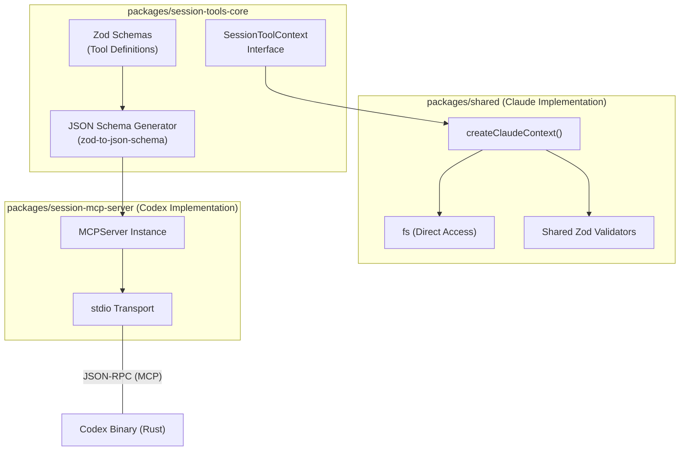
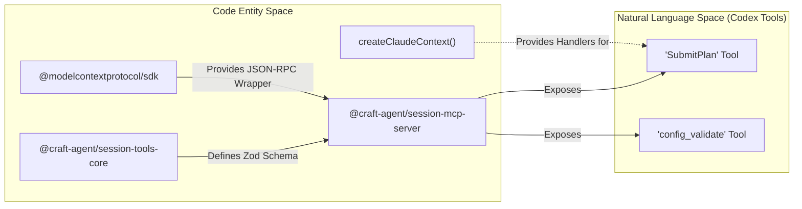
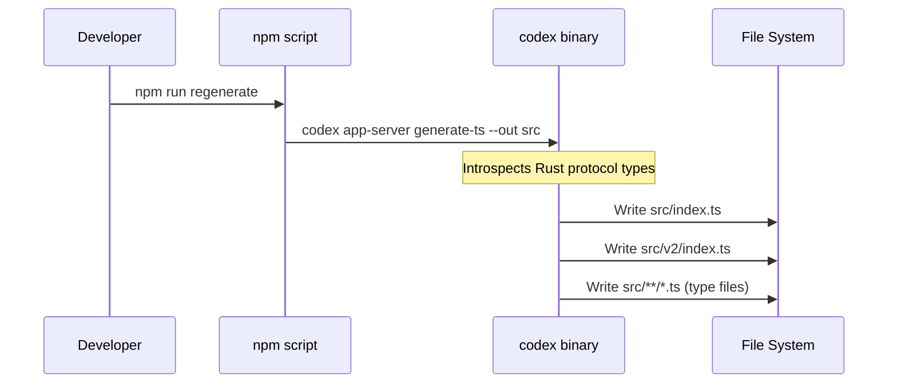

# Type Generation for Codex

<details>
<summary>Relevant source files</summary>

The following files were used as context for generating this wiki page:

- [packages/session-mcp-server/package.json](packages/session-mcp-server/package.json)
- [packages/session-tools-core/package.json](packages/session-tools-core/package.json)
- [packages/session-tools-core/src/context.ts](packages/session-tools-core/src/context.ts)
- [packages/shared/src/agent/claude-context.ts](packages/shared/src/agent/claude-context.ts)

</details>


This page documents how the Craft Agents system provides shared utilities and type definitions for Codex integration via the `codex-types` and `session-tools-core` packages, and how the `session-mcp-server` exposes these capabilities to the Codex binary via the Model Context Protocol (MCP).

---

## Overview

Integration with the Codex app-server requires a robust bridge between the TypeScript environment of Craft Agents and the Rust-based execution environment of Codex. This is achieved through three primary mechanisms:
1.  **Type Generation**: Auto-generating TypeScript definitions from the Codex protocol.
2.  **Shared Tooling**: Providing common logic for session-scoped tools (like `SubmitPlan` and `config_validate`) that both the main app and Codex need to understand.
3.  **MCP Communication**: Using a dedicated MCP server to expose these tools to Codex over `stdio` transport.

Sources: [packages/session-tools-core/package.json:1-5](), [packages/session-mcp-server/package.json:1-5]()

---

## Shared Session Tools Architecture

The `@craft-agent/session-tools-core` package serves as the single source of truth for tool definitions used by both the Craft Agents UI and the Codex agent. It utilizes `zod` for schema definition and `zod-to-json-schema` to export these definitions in a format compatible with LLM tool-calling protocols.

### Session Tool Context and Portability

A key innovation in `session-tools-core` is the `SessionToolContext` interface. This abstract interface allows tool handlers to be written once and run in two distinct environments:
- **In-process (Claude)**: Uses `createClaudeContext` to provide direct access to Electron internals, Node.js `fs`, and full Zod validators [packages/shared/src/agent/claude-context.ts:103-146]().
- **Subprocess (Codex)**: Uses a restricted implementation that communicates via the MCP server [packages/session-mcp-server/package.json:5-10]().

### Data Flow: Tool Definition to Execution



**Key Interfaces:**
- `FileSystemInterface`: Abstracts file operations so tools can run without direct Node.js `fs` access in restricted environments [packages/session-tools-core/src/context.ts:69-90]().
- `SessionToolCallbacks`: Handles asynchronous events like `onPlanSubmitted` and `onAuthRequest` across transport boundaries [packages/session-tools-core/src/context.ts:45-59]().
- `CredentialManagerInterface`: Provides a way for tools to check or refresh OAuth tokens without knowing the underlying storage mechanism [packages/session-tools-core/src/context.ts:101-116]().

Sources: [packages/session-tools-core/package.json:15-20](), [packages/session-tools-core/src/context.ts:1-151](), [packages/shared/src/agent/claude-context.ts:103-121]()

---

## Session MCP Server

The `@craft-agent/session-mcp-server` is a standalone Node.js executable that acts as a bridge. It consumes the schemas from `session-tools-core` and exposes them as tools to the Codex agent via the standard MCP `stdio` transport.

### Implementation Details

The server is built using the `@modelcontextprotocol/sdk` and is designed to be spawned as a subprocess by the Codex binary.

| Component | Role | Source |
|-----------|------|--------|
| **Entry Point** | `src/index.ts` | [packages/session-mcp-server/package.json:12-13]() |
| **Transport** | `stdio` | [packages/session-mcp-server/package.json:5-5]() |
| **Core Logic** | `@craft-agent/session-tools-core` | [packages/session-mcp-server/package.json:16-16]() |
| **Shared Utils** | `@craft-agent/shared` | [packages/session-mcp-server/package.json:17-17]() |

### Code Entity Mapping: MCP Tool Export



Sources: [packages/session-mcp-server/package.json:1-20](), [packages/shared/src/agent/claude-context.ts:124-127]()

---

## Type Generation for Codex

The `@craft-agent/codex-types` package contains auto-generated TypeScript definitions that ensure type safety when communicating with the Codex binary via JSON-RPC.

### Regeneration Process

The Codex binary includes a code generator that introspects its Rust protocol definitions and outputs matching TypeScript types.



**Package Exports:**
- `@craft-agent/codex-types`: Main protocol types like `RequestId` and `ReasoningEffort`.
- `@craft-agent/codex-types/v2`: V2 protocol additions like `AskForApproval`, `SandboxMode`, and `UserInput`.

Sources: [packages/shared/src/agent/claude-context.ts:73-73]()

---

## Type Usage in CodexAgent

The `CodexAgent` class (located in `packages/shared`) utilizes these generated types to ensure that all messages sent to and received from the Codex binary are valid according to the protocol.

### Protocol Type Mapping

| Type | Usage in `CodexAgent` |
|------|-------|
| `RequestId` | Identifying JSON-RPC requests |
| `ReasoningEffort` | Mapping thinking levels (`off`, `think`, `max`) to protocol values |
| `UserInput` | Constructing turn input messages with text and attachments |
| `AskForApproval` | Configuring the agent's approval policy (e.g., `never`, `on-request`) |

**Example: Context Integration**
When creating a context for tool execution, the system uses `createClaudeContext` to bridge the shared tool logic with the Electron main process:
```typescript
// packages/shared/src/agent/claude-context.ts:103-105
export function createClaudeContext(options: ClaudeContextOptions): SessionToolContext {
  const { sessionId, workspacePath, workspaceId, onPlanSubmitted, onAuthRequest } = options;
  // ...
}
```

Sources: [packages/shared/src/agent/claude-context.ts:103-105](), [packages/shared/src/agent/claude-context.ts:149-162]()