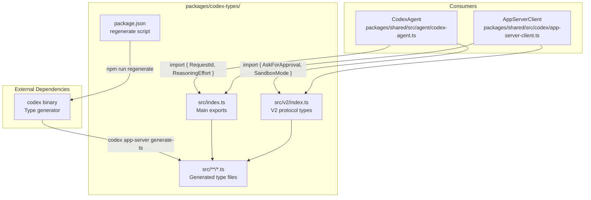
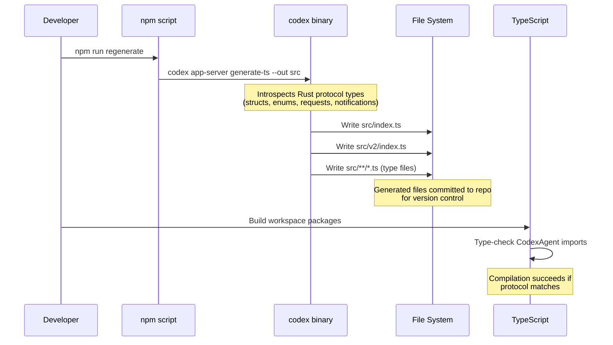
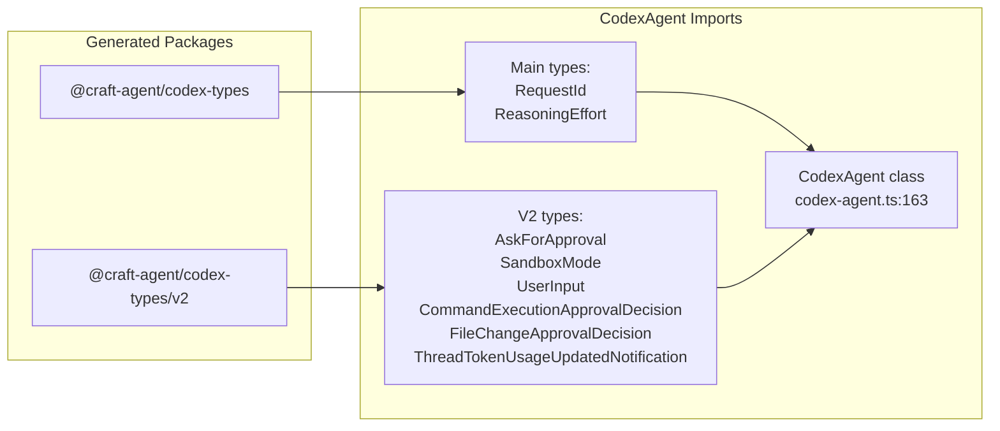
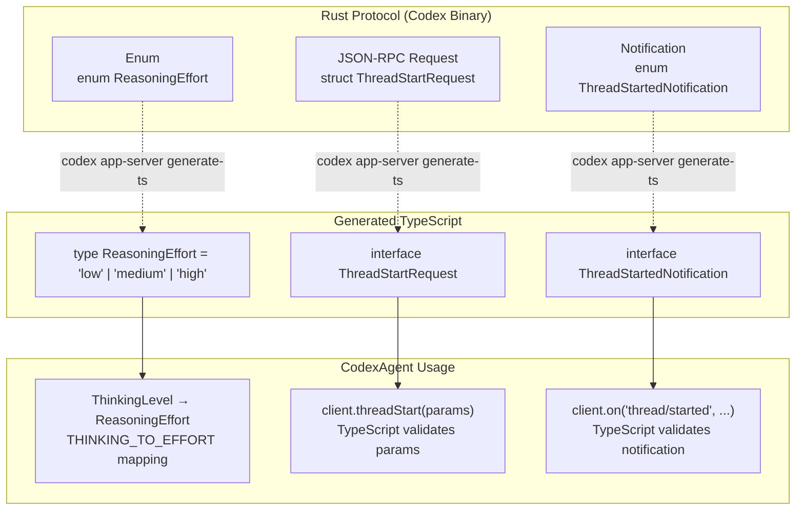

# Type Generation for Codex

<details>
<summary>Relevant source files</summary>

The following files were used as context for generating this wiki page:

- [packages/session-mcp-server/package.json](packages/session-mcp-server/package.json)
- [packages/session-tools-core/package.json](packages/session-tools-core/package.json)

</details>

This page documents the process of regenerating TypeScript types from the Codex app-server protocol. The `@craft-agent/codex-types` package contains auto-generated TypeScript definitions that ensure type safety when communicating with the Codex binary via JSON-RPC.

For information about building the Codex agent itself, see [Agent System](#2.3). For general development setup, see [Development Setup](#5.1).

---

## Overview

The Codex app-server is a Rust binary that communicates via JSON-RPC over stdio. To maintain type safety in TypeScript, the binary includes a code generator that introspects its protocol definitions and outputs matching TypeScript types. These generated types are stored in the `@craft-agent/codex-types` package and consumed by `CodexAgent` and related code.

**When to regenerate:**

- After updating the Codex binary to a new version
- When new protocol features are added (notifications, requests, responses)
- If you see type mismatches between the app-server and TypeScript code

Sources: [packages/codex-types/package.json:1-19]()

---

## Package Structure

### codex-types Package Organization



**Package exports:**

| Export Path                   | Purpose               | Example Types                                                                       |
| ----------------------------- | --------------------- | ----------------------------------------------------------------------------------- |
| `@craft-agent/codex-types`    | Main protocol types   | `RequestId`, `ReasoningEffort`                                                      |
| `@craft-agent/codex-types/v2` | V2 protocol additions | `AskForApproval`, `SandboxMode`, `UserInput`, `ThreadTokenUsageUpdatedNotification` |

Sources: [packages/codex-types/package.json:8-11]()

---

## Type Generation Workflow

### Regeneration Process



**Command syntax:**

```bash
# From packages/codex-types directory
npm run regenerate

# Or manually
codex app-server generate-ts --out src
```

**What gets generated:**

- Type definitions for all JSON-RPC protocol types
- Request parameter types
- Response types
- Notification payload types
- Enum definitions matching Rust enums

Sources: [packages/codex-types/package.json:15-16]()

---

## Type Usage in CodexAgent

### Import Structure

The `CodexAgent` class imports generated types to ensure protocol compliance:



**Import examples from CodexAgent:**

| Type                                  | Source                        | Usage                                     |
| ------------------------------------- | ----------------------------- | ----------------------------------------- |
| `RequestId`                           | `@craft-agent/codex-types`    | Identifying JSON-RPC requests             |
| `ReasoningEffort`                     | `@craft-agent/codex-types`    | Mapping thinking levels to effort         |
| `AskForApproval`                      | `@craft-agent/codex-types/v2` | Approval policy configuration             |
| `SandboxMode`                         | `@craft-agent/codex-types/v2` | Sandbox security mode                     |
| `UserInput`                           | `@craft-agent/codex-types/v2` | Building turn input messages              |
| `CommandExecutionApprovalDecision`    | `@craft-agent/codex-types/v2` | Responding to bash approval requests      |
| `FileChangeApprovalDecision`          | `@craft-agent/codex-types/v2` | Responding to file edit approval requests |
| `ThreadTokenUsageUpdatedNotification` | `@craft-agent/codex-types/v2` | Token usage updates for UI                |

Sources: [packages/shared/src/agent/codex-agent.ts:94-105]()

---

## Type Safety Examples

### Protocol Type Mapping



**Example: Thinking level mapping**

```typescript
// Type-safe enum mapping (codex-agent.ts:141-145)
const THINKING_TO_EFFORT: Record<ThinkingLevel, ReasoningEffort> = {
  off: 'low',
  think: 'medium',
  max: 'high',
}
```

**Example: Approval policy type**

```typescript
// Type-safe approval policy (codex-agent.ts:2140-2148)
private getApprovalPolicy(_mode: PermissionMode): AskForApproval {
  // 'never' | 'untrusted' | 'on-failure' | 'on-request'
  return 'never';
}
```

**Example: User input construction**

```typescript
// Type-safe input array (codex-agent.ts:2051-2134)
private buildUserInput(
  message: string,
  attachments?: FileAttachment[]
): UserInput[] {
  const input: UserInput[] = [];
  input.push({ type: 'text', text: fullMessage, text_elements: [] });
  // TypeScript ensures UserInput[] matches protocol
  return input;
}
```

Sources: [packages/shared/src/agent/codex-agent.ts:141-145](), [packages/shared/src/agent/codex-agent.ts:2140-2148](), [packages/shared/src/agent/codex-agent.ts:2051-2134]()

---

## Regeneration Procedure

### Step-by-Step Process

1. **Ensure Codex binary is available**

   ```bash
   # Check binary location
   which codex
   # Should point to bundled binary or PATH location
   ```

2. **Navigate to codex-types package**

   ```bash
   cd packages/codex-types
   ```

3. **Run regeneration script**

   ```bash
   npm run regenerate
   ```

4. **Verify generated files**

   ```bash
   # Check that src/ was updated
   git status
   # Should show modified files in src/
   ```

5. **Type-check the workspace**

   ```bash
   cd ../..
   npm run typecheck
   ```

6. **Commit generated types**
   ```bash
   git add packages/codex-types/src/
   git commit -m "Regenerate Codex types for protocol v2.x"
   ```

Sources: [packages/codex-types/package.json:15-16]()

---

## Version Management

### Protocol Version Tracking

The codex-types package uses two export paths to manage protocol evolution:

| Export                        | Purpose           | Breaking Changes            |
| ----------------------------- | ----------------- | --------------------------- |
| `@craft-agent/codex-types`    | Stable core types | Rare; v1 protocol           |
| `@craft-agent/codex-types/v2` | V2 additions      | More frequent; new features |

**Migration strategy:**

- Core types (`RequestId`, `ReasoningEffort`) remain in main export
- New protocol features land in `/v2` export
- Consumers can import selectively based on feature requirements

**Example: Dual imports in CodexAgent**

```typescript
// Core protocol types (stable)
import type { RequestId, ReasoningEffort } from '@craft-agent/codex-types'

// V2 protocol additions (evolving)
import type {
  AskForApproval,
  SandboxMode,
  UserInput,
  // ... more v2 types
} from '@craft-agent/codex-types/v2'
```

Sources: [packages/codex-types/package.json:8-11](), [packages/shared/src/agent/codex-agent.ts:94-105]()

---

## Troubleshooting

### Common Issues

| Issue                            | Cause                    | Solution                                        |
| -------------------------------- | ------------------------ | ----------------------------------------------- |
| `codex: command not found`       | Codex binary not in PATH | Set `CODEX_PATH` env var or install Codex       |
| Type mismatch after Codex update | Stale generated types    | Run `npm run regenerate` in codex-types package |
| Missing types in v2 export       | Outdated binary version  | Update Codex binary, then regenerate            |
| TypeScript errors in CodexAgent  | Protocol change          | Regenerate types and update CodexAgent usage    |

**Debug type generation:**

```bash
# Run with verbose output to see what's being generated
codex app-server generate-ts --out src --verbose

# Check Codex version
codex --version
```

Sources: [packages/codex-types/package.json:15-16]()
