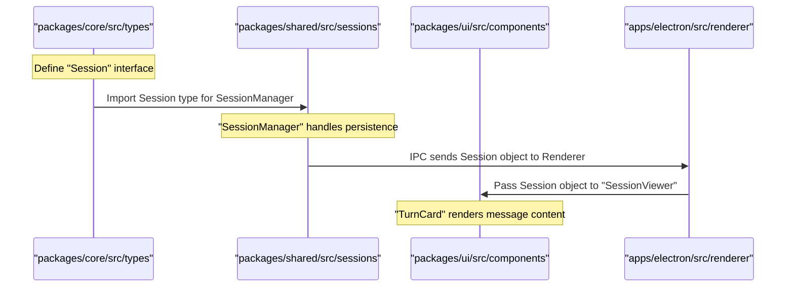

# Working with Packages

<details>
<summary>Relevant source files</summary>

The following files were used as context for generating this wiki page:

- [packages/core/package.json](packages/core/package.json)
- [packages/shared/package.json](packages/shared/package.json)
- [packages/ui/package.json](packages/ui/package.json)

</details>


This page explains how to develop within the Craft Agents monorepo, covering package structure, dependency management, the workspace protocol, and guidelines for the shared, core, and UI packages including peer dependency contracts.

---

## Package Structure

Craft Agents uses a monorepo managed by Bun with workspaces defined in the root configuration. The codebase is organized into shared packages and application packages:

| Package | Path | Purpose | Internal Dependencies |
|---------|------|---------|----------------------|
| `@craft-agent/core` | `packages/core/` | Foundational types, storage abstractions, and agent logic | Peer deps only |
| `@craft-agent/session-tools-core` | `packages/session-tools-core/` | Shared type definitions and utilities for session-scoped tools and Codex integration | None |
| `@craft-agent/shared` | `packages/shared/` | Business logic: agent, auth, config, credentials, sessions, sources, workspaces, automations | `core`, `session-tools-core` |
| `@craft-agent/ui` | `packages/ui/` | React components for session rendering, markdown, and chat display | `core` |
| `@craft-agent/mermaid` | `packages/mermaid/` | Mermaid diagram rendering utilities | External libs only |
| `@craft-agent/electron` | `apps/electron/` | Main Electron desktop application | `core`, `shared`, `ui` |
| `@craft-agent/viewer` | `apps/viewer/` | Web viewer for shared session transcripts | `core`, `ui` |
| `@craft-agent/webui` | `apps/webui/` | Browser-based thin client | `core`, `shared`, `ui` |

**Sources:** [packages/core/package.json:2-5](), [packages/shared/package.json:2-5](), [packages/ui/package.json:2-5](), [packages/shared/package.json:65-66](), [packages/ui/package.json:20-20]()

---

## Dependency Architecture

The following diagram maps the relationship between high-level architectural layers and the specific code packages that implement them.

**Package Dependency Graph**

```mermaid
graph TB
    subgraph "Application Layer (apps/)"
        Electron["@craft-agent/electron"]
        Viewer["@craft-agent/viewer"]
        WebUI["@craft-agent/webui"]
    end

    subgraph "Logic & UI Layer (packages/)"
        Shared["@craft-agent/shared"]
        UI["@craft-agent/ui"]
    end

    subgraph "Foundation Layer (packages/)"
        Core["@craft-agent/core"]
        SessionTools["@craft-agent/session-tools-core"]
        Mermaid["@craft-agent/mermaid"]
    end

    subgraph "External SDKs (Peer Dependencies)"
        ClaudeSDK["@anthropic-ai/claude-agent-sdk"]
        MCPSDK["@modelcontextprotocol/sdk"]
        Zod["zod"]
    end

    Electron -->|"workspace:*""| Shared
    Electron -->|"workspace:*"| UI
    WebUI -->|"workspace:*"| Shared
    WebUI -->|"workspace:*"| UI
    Viewer -->|"workspace:*"| UI
    
    Shared -->|"workspace:*"| Core
    Shared -->|"workspace:*"| SessionTools
    UI -->|"workspace:*"| Core
    
    Core -.->|"peerDependency"| ClaudeSDK
    Core -.->|"peerDependency"| MCPSDK
    Shared -.->|"peerDependency"| ClaudeSDK
    Shared -.->|"peerDependency"| MCPSDK
    Shared -.->|"peerDependency"| Zod
    UI -.->|"peerDependency"| Zod
```

**Sources:** [packages/core/package.json:14-17](), [packages/shared/package.json:64-66](), [packages/shared/package.json:77-81](), [packages/ui/package.json:19-20](), [packages/ui/package.json:30-53]()

---

## Workspace Protocol & Bun

The monorepo uses Bun's workspace protocol to link packages. In `package.json` files, internal dependencies are declared with `workspace:*`.

**How it works:**
- `workspace:*` ensures the package manager resolves the dependency to the local folder within the monorepo rather than attempting to fetch it from a remote registry like npm. [packages/shared/package.json:65-66]()
- Changes to source files in `packages/core` are immediately available to `packages/shared` without a manual rebuild step during development.
- Bun creates symlinks in `node_modules/` pointing to the package source directories.

**Example resolution:**
When `packages/shared` imports from `@craft-agent/core`, it resolves via the `exports` map defined in `packages/core/package.json`. [packages/core/package.json:9-13]()

---

## Package Exports & Contracts

Each package defines explicit exports to control the public API surface. This prevents deep-linking into internal utility files and ensures a clean contract between layers.

### The `@craft-agent/core` Contract
This package contains the base types and agent logic. It is designed to be lean, with minimal runtime dependencies.

```json
"exports": {
  ".": "./src/index.ts",
  "./types": "./src/types/index.ts",
  "./utils": "./src/utils/index.ts"
}
```
**Sources:** [packages/core/package.json:9-13]()

### The `@craft-agent/shared` Contract
This package serves as the primary business logic engine. It exports domain-specific modules for use in the Electron main process and the web server. [packages/shared/package.json:5-6]()

```json
"exports": {
  ".": "./src/index.ts",
  "./agent": "./src/agent/index.ts",
  "./auth": "./src/auth/index.ts",
  "./config": "./src/config/index.ts",
  "./credentials": "./src/credentials/index.ts",
  "./mcp": "./src/mcp/index.ts",
  "./sessions": "./src/sessions/index.ts",
  "./sources": "./src/sources/index.ts",
  "./workspaces": "./src/workspaces/index.ts",
  "./automations": "./src/automations/index.ts"
}
```
**Sources:** [packages/shared/package.json:14-63]()

### The `@craft-agent/ui` Contract
The UI package provides the shared React components. It includes exports for chat components, markdown rendering, and global styles. [packages/ui/package.json:5-6]()

```json
"exports": {
  ".": "./src/index.ts",
  "./chat": "./src/components/chat/index.ts",
  "./chat/SessionViewer": "./src/components/chat/SessionViewer.tsx",
  "./chat/TurnCard": "./src/components/chat/TurnCard.tsx",
  "./markdown": "./src/components/markdown/index.ts",
  "./styles": "./src/styles/index.css"
}
```
**Sources:** [packages/ui/package.json:9-18]()

---

## Peer Dependency Guidelines

The shared packages (`core`, `shared`, `ui`) use `peerDependencies` for large or singleton-sensitive libraries. This ensures that the final application (Electron or Web) provides a single instance of the library, preventing version conflicts and reducing bundle size.

### Core & Shared Peer Dependencies
Both `core` and `shared` require the Anthropic and MCP SDKs. By listing them as peer dependencies, we ensure that if both packages are used in an app, they share the same SDK instance.

**`packages/core/package.json`**:
- `@anthropic-ai/claude-agent-sdk`: `>=0.2.19` [packages/core/package.json:15-15]()
- `@modelcontextprotocol/sdk`: `>=1.0.0` [packages/core/package.json:16-16]()

**`packages/shared/package.json`**:
- `@anthropic-ai/claude-agent-sdk`: `^0.2.19` [packages/shared/package.json:78-78]()
- `zod`: `>=3.0.0` [packages/shared/package.json:80-80]()

### UI Peer Dependencies
The UI package has an extensive list of peer dependencies including React, Radix UI, and Tailwind CSS. This allows the consuming application to manage the React lifecycle and styling configuration. [packages/ui/package.json:30-53]()

- `react`: `>=18.0.0` [packages/ui/package.json:41-41]()
- `lucide-react`: `>=0.400.0` [packages/ui/package.json:39-39]()
- `tailwindcss`: `>=4.0.0` [packages/ui/package.json:51-51]()

**Sources:** [packages/core/package.json:14-17](), [packages/shared/package.json:77-81](), [packages/ui/package.json:30-53]()

---

## Cross-Package Data Flow

The following diagram illustrates how a change in a core type propagates through the package layers to the final UI.

**Data Flow: Type Definition to UI Rendering**



**Sources:** [packages/core/package.json:11-11](), [packages/shared/package.json:30-30](), [packages/ui/package.json:12-13]()

---

## Adding New Packages

When adding a new package to the monorepo:

1. **Create Directory:** Create a new folder in `packages/`.
2. **Initialize `package.json`:**
   - Set the `name` to `@craft-agent/<name>`.
   - Set `"type": "module"`. [packages/core/package.json:6-6]()
   - Define `exports` for public entry points. [packages/core/package.json:9-13]()
3. **Reference Workspaces:** If the new package needs `core`, add `"@craft-agent/core": "workspace:*"` to its dependencies. [packages/shared/package.json:65-65]()
4. **Register in Root:** Ensure the directory is covered by the `workspaces` glob in the root `package.json`.
5. **Peer Dependencies:** If using `zod` or AI SDKs, add them as `peerDependencies` rather than `dependencies` to maintain the singleton contract. [packages/shared/package.json:77-81]()

**Sources:** [packages/core/package.json:1-13](), [packages/shared/package.json:64-81]()