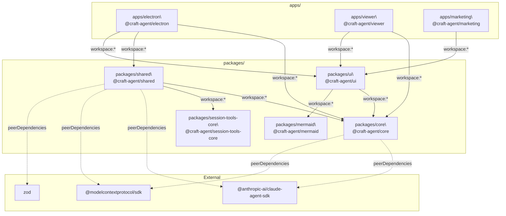
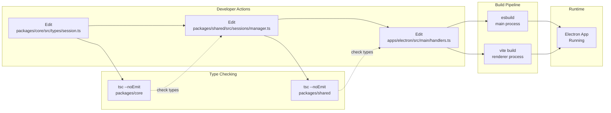
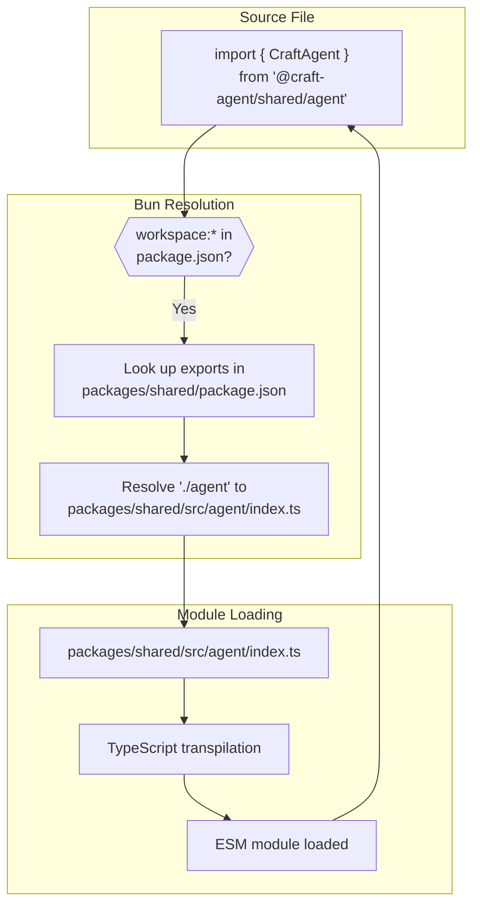

# Working with Packages

<details>
<summary>Relevant source files</summary>

The following files were used as context for generating this wiki page:

- [package.json](package.json)
- [packages/core/package.json](packages/core/package.json)
- [packages/shared/package.json](packages/shared/package.json)

</details>

This page explains how to develop within the Craft Agents monorepo, covering package structure, dependency management, the workspace protocol, and cross-package development workflows. For information about setting up your development environment, see [Development Setup](#5.1). For details on the build pipeline, see [Build System](#5.2).

---

## Package Structure

Craft Agents uses a monorepo managed by Bun with workspaces defined in [package.json:7-10](). The codebase is organized into four shared packages and three application packages:

| Package                           | Path                           | Purpose                                                                                      | Internal Dependencies        |
| --------------------------------- | ------------------------------ | -------------------------------------------------------------------------------------------- | ---------------------------- |
| `@craft-agent/core`               | `packages/core/`               | Foundational types, storage abstractions                                                     | Peer deps only               |
| `@craft-agent/session-tools-core` | `packages/session-tools-core/` | Shared type definitions and utilities for session-scoped tools and Codex integration         | None                         |
| `@craft-agent/shared`             | `packages/shared/`             | Business logic: agent, auth, config, credentials, sessions, sources, workspaces, automations | `core`, `session-tools-core` |
| `@craft-agent/ui`                 | `packages/ui/`                 | React components for session rendering, markdown, diagrams                                   | `core`, `mermaid`            |
| `@craft-agent/mermaid`            | `packages/mermaid/`            | Mermaid diagram rendering via `beautiful-mermaid`                                            | External libs only           |
| `@craft-agent/electron`           | `apps/electron/`               | Electron desktop application                                                                 | `core`, `shared`, `ui`       |
| `@craft-agent/viewer`             | `apps/viewer/`                 | Web viewer for shared sessions                                                               | `core`, `ui`                 |
| `@craft-agent/marketing`          | `apps/marketing/`              | Marketing website                                                                            | `ui`                         |

**Sources:** [package.json:7-10](), [packages/core/package.json:1-21](), [packages/shared/package.json:1-80]()

---

## Dependency Architecture

**Workspace dependency graph** — solid arrows are `workspace:*` references; dashed arrows are `peerDependencies`:



**Sources:** [packages/core/package.json:14-18](), [packages/shared/package.json:61-75]()

---

## Workspace Protocol

The monorepo uses Bun's workspace protocol to link packages. In `package.json` files, internal dependencies are declared with `workspace:*`:

```json
"dependencies": {
  "@craft-agent/core": "workspace:*",
  "@craft-agent/shared": "workspace:*"
}
```

**How it works:**

- `workspace:*` resolves to the current version of the local package
- Changes to source files are immediately visible to consumers
- No need to rebuild packages during development
- `bun install` creates symlinks in `node_modules/` pointing to package source directories

**Example resolution:** When `apps/electron` imports from `@craft-agent/shared`, Bun resolves it to `packages/shared/src/index.ts` directly, enabling hot module replacement during development.

**Sources:** [bun.lock:84-116](), [packages/shared/package.json:54]()

---

## Package Exports

Each package defines explicit exports in its `package.json` to control which files are importable. This creates clear public APIs and prevents internal implementation details from being imported.

### Core Package Exports

```typescript
// packages/core/package.json exports:
{
  ".": "./src/index.ts",
  "./types": "./src/types/index.ts",
  "./utils": "./src/utils/index.ts"
}

// Import examples:
import { Session } from '@craft-agent/core'
import { AgentConfig } from '@craft-agent/core/types'
import { validateFilePath } from '@craft-agent/core/utils'
```

### Shared Package Exports

The `shared` package has extensive exports for different domains:

```typescript
// packages/shared/package.json exports (partial):
{
  ".": "./src/index.ts",
  "./agent": "./src/agent/index.ts",
  "./auth": "./src/auth/index.ts",
  "./config": "./src/config/index.ts",
  "./credentials": "./src/credentials/index.ts",
  "./mcp": "./src/mcp/index.ts",
  "./sessions": "./src/sessions/index.ts",
  "./sources": "./src/sources/index.ts",
  "./workspaces": "./src/workspaces/index.ts"
}

// Import examples:
import { CraftAgent } from '@craft-agent/shared/agent'
import { loadWorkspace } from '@craft-agent/shared/workspaces'
import { SourceManager } from '@craft-agent/shared/sources'
```

**Sources:** [packages/core/package.json:9-13](), [packages/shared/package.json:13-52]()

---

## Peer Dependencies Pattern

The `core` and `shared` packages use peer dependencies for the Claude Agent SDK, Anthropic SDK, and MCP SDK instead of regular dependencies. This pattern ensures:

1. **Single Instance:** Only one copy of these SDKs exists across the entire application
2. **Version Control:** The consuming application (e.g., `apps/electron`) controls the exact version
3. **Type Safety:** TypeScript types are consistent across all packages

### Configuration

**`packages/core/package.json`** [packages/core/package.json:14-18]():

```json
{
  "peerDependencies": {
    "@anthropic-ai/claude-agent-sdk": ">=0.2.19",
    "@modelcontextprotocol/sdk": ">=1.0.0"
  }
}
```

**`packages/shared/package.json`** [packages/shared/package.json:71-75]():

```json
{
  "peerDependencies": {
    "@anthropic-ai/claude-agent-sdk": "^0.2.19",
    "@modelcontextprotocol/sdk": ">=1.0.0",
    "zod": ">=3.0.0"
  }
}
```

**Root `package.json`** (actual installed versions) [package.json:93-143]():

```json
{
  "dependencies": {
    "@anthropic-ai/claude-agent-sdk": "^0.2.37",
    "@modelcontextprotocol/sdk": "^1.24.3",
    "zod": "^4.0.0"
  }
}
```

**Why this matters:** If `core` and `shared` declared these SDKs as regular `dependencies`, Bun could install multiple versions in the tree. Using `peerDependencies` means the root `package.json` controls the single installed version and all packages share that same instance—critical for maintaining consistent types and avoiding duplicate SDK initialization.

**Sources:** [packages/core/package.json:14-18](), [packages/shared/package.json:71-75](), [package.json:92-143]()

---

## Cross-Package Development Workflow



### Making Changes Across Packages

When modifying code that spans multiple packages:

1. **Start from the foundation:** Make changes in `core` first if touching types
2. **Propagate upward:** Update `shared` to use new core types/utilities
3. **Update consumers:** Modify application code to use updated shared logic
4. **Type check incrementally:** Run `bun run typecheck` to catch issues early

### Example: Adding a New Session Field

```typescript
// Step 1: Add type to core
// packages/core/src/types/session.ts
export interface Session {
  id: string
  workspaceId: string
  // ... existing fields
  priority?: 'low' | 'medium' | 'high' // NEW
}

// Step 2: Update shared logic
// packages/shared/src/sessions/manager.ts
export class SessionManager {
  async updatePriority(sessionId: string, priority: Session['priority']) {
    // Implementation using new field
  }
}

// Step 3: Update Electron app
// apps/electron/src/main/ipc-handlers.ts
ipcMain.handle('session:set-priority', async (event, sessionId, priority) => {
  await sessionManager.updatePriority(sessionId, priority)
})
```

### Development Scripts

```bash
# Type check a specific package
cd packages/core && bun run tsc --noEmit
cd packages/shared && bun run tsc --noEmit

# Type check all packages
bun run typecheck:all

# Lint specific packages
bun run lint:electron
bun run lint:shared

# Run dev server (auto-reloads on changes)
bun run electron:dev
```

**Sources:** [package.json:14-18](), [package.json:28-29]()

---

## Adding Dependencies

### To a Shared Package

```bash
# Add regular dependency
cd packages/shared
bun add some-library

# Add dev dependency
bun add -d @types/some-library

# Add peer dependency (edit package.json manually)
# Then update root package.json to install it
```

### To an Application

```bash
# Add dependency to electron app
cd apps/electron
bun add some-library

# This creates entry in apps/electron/package.json
# and updates bun.lock
```

### To Root (Shared by All)

```bash
# From repository root
bun add react react-dom

# This makes the package available to all workspaces
# Useful for common dependencies like React, TypeScript types
```

**Best practices:**

- Add type definitions to `devDependencies`
- Use peer dependencies for SDKs that must be singletons
- Add common UI dependencies to root for consistency
- Keep package-specific utilities in their respective packages

**Sources:** [packages/shared/package.json:53-61](), [bun.lock:80-250]()

---

## Import Resolution in Development



**Key points:**

- No build step required during development
- Changes to `.ts` files are immediately reflected
- Hot Module Replacement works across package boundaries
- Bun's fast transpiler handles TypeScript on-the-fly

**Sources:** [packages/shared/package.json:13-52](), [bun.lock:190-212]()

---

## Circular Dependency Prevention

The package structure prevents circular dependencies through layering:

```
Layer 3: apps/*  (electron, viewer, marketing)
           ↓
Layer 2: packages/shared, packages/ui  (business logic, React components)
           ↓
Layer 1: packages/core, packages/session-tools-core, packages/mermaid  (types, contracts, diagrams)
           ↓
Layer 0: External dependencies (SDK, libraries)
```

**Rules:**

- Lower layers cannot import from higher layers
- `core` has zero internal package dependencies
- `session-tools-core` has zero internal package dependencies
- `shared` depends only on `core` and `session-tools-core`
- `ui` depends on `core` and `mermaid` but **not** `shared`
- Apps can depend on any package

This ensures the dependency graph remains acyclic and changes propagate predictably upward through the layers.

**Sources:** [packages/core/package.json:1-21](), [packages/shared/package.json:60-70]()

---

## Type Checking Workflow

The monorepo uses TypeScript's project references implicitly through the workspace structure:

```bash
# Check core types (no dependencies to check)
cd packages/core && tsc --noEmit

# Check shared (sees core types via workspace:*)
cd packages/shared && tsc --noEmit

# Check all packages sequentially
bun run typecheck:all
```

**How it works:**

- Each package has its own `tsconfig.json`
- TypeScript resolves `@craft-agent/core` imports to source `.ts` files
- Type errors in `core` will cascade to `shared` and apps
- Fix errors bottom-up: core → shared → apps

**Common type errors:**

- Missing exports: Add to `package.json` exports field
- Version mismatches: Ensure peer dependency ranges align
- Circular type references: Refactor to break the cycle (extract to core)

**Sources:** [package.json:14-15]()

---

## Package Publishing (Internal)

Packages are not published to npm; they exist only within the monorepo. The `workspace:*` protocol ensures all packages always use the local development versions. The version in each `package.json` is synchronized:

```json
// All packages have matching version
{
  "version": "0.3.1"
}
```

When releasing a new version:

1. Update version in root `package.json`
2. Update version in all package `package.json` files
3. Update `bun.lock` by running `bun install`
4. Create git tag and build distributable

**Sources:** [package.json:3](), [packages/core/package.json:3](), [packages/shared/package.json:3]()
