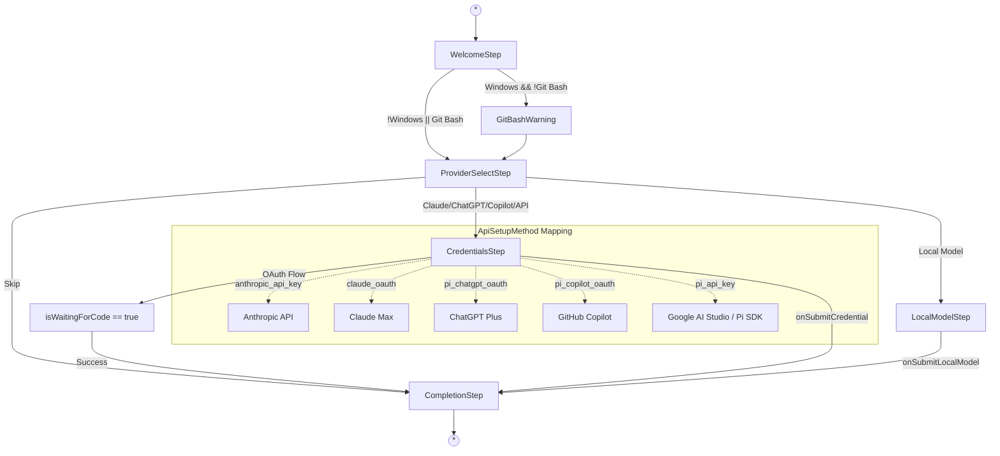
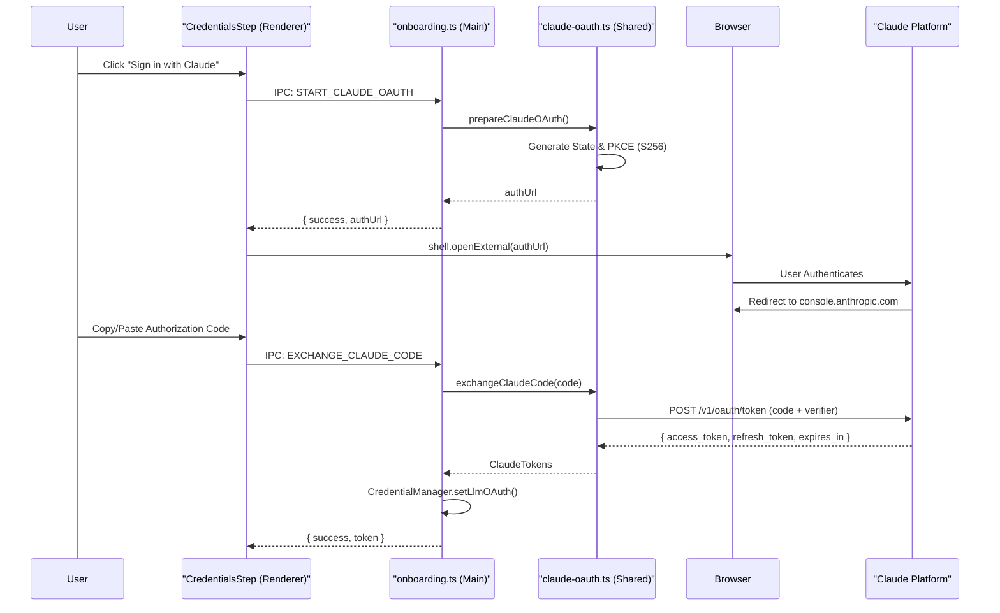

# Authentication Setup

Relevant source files

The following files were used as context for generating this wiki page:

- [apps/electron/src/renderer/components/apisetup/ApiKeyInput.tsx](apps/electron/src/renderer/components/apisetup/ApiKeyInput.tsx)
- [apps/electron/src/renderer/components/onboarding/CredentialsStep.tsx](apps/electron/src/renderer/components/onboarding/CredentialsStep.tsx)
- [apps/electron/src/renderer/components/onboarding/OnboardingWizard.tsx](apps/electron/src/renderer/components/onboarding/OnboardingWizard.tsx)
- [apps/electron/src/renderer/hooks/useOnboarding.ts](apps/electron/src/renderer/hooks/useOnboarding.ts)
- [packages/shared/src/auth/__tests__/oauth.test.ts](packages/shared/src/auth/__tests__/oauth.test.ts)
- [packages/shared/src/auth/claude-oauth-config.ts](packages/shared/src/auth/claude-oauth-config.ts)
- [packages/shared/src/auth/claude-oauth.ts](packages/shared/src/auth/claude-oauth.ts)
- [packages/shared/src/auth/claude-token.ts](packages/shared/src/auth/claude-token.ts)
- [packages/shared/src/auth/google-oauth.ts](packages/shared/src/auth/google-oauth.ts)
- [packages/shared/src/auth/oauth.ts](packages/shared/src/auth/oauth.ts)

This page describes the authentication setup process in Craft Agents, covering the onboarding wizard flow, supported authentication methods, OAuth flows, and credential storage. This is the initial setup users complete after installing the application to configure AI provider access.

For information about configuring OAuth credentials for third-party services (Google, Slack, Microsoft), see [External Service Integration](#2.4). For credential encryption details, see [Credential Storage & Encryption](#7.2).

---

## Onboarding Wizard Overview

The onboarding wizard is a multi-step flow that guides users through initial authentication setup. The wizard is implemented as a state machine in the `useOnboarding` hook and rendered by the `OnboardingWizard` component.

**Wizard Steps:**

| Step | Name | Purpose | Conditional |
|------|------|---------|-------------|
| 1 | `welcome` | Introduction screen | Always shown |
| 2 | `git-bash` | Git Bash installation check | Windows only, if not found |
| 3 | `provider-select` | Choose AI provider (Claude, ChatGPT, etc.) | Always shown |
| 4 | `credentials` | Enter API keys or perform OAuth | For API/OAuth providers |
| 5 | `local-model` | Configure local LLM (Ollama/LM Studio) | If "Local" selected |
| 6 | `complete` | Confirmation and finalization | Always shown |

The wizard supports both creating new LLM connections and editing existing ones via the `editingSlug` parameter. Slugs are generated using `resolveSlugForMethod`, which appends increments (e.g., `-2`) if a base slug is already in use.

**Sources:**
- [apps/electron/src/renderer/hooks/useOnboarding.ts:107-121]()
- [apps/electron/src/renderer/components/onboarding/OnboardingWizard.tsx:12-33]()
- [apps/electron/src/renderer/components/onboarding/OnboardingWizard.tsx:91-118]()

---

## Onboarding State Machine

**State Transitions:**

The wizard flow is controlled by the `OnboardingWizard` component which switches between sub-components like `CredentialsStep` and `LocalModelStep` based on the `state.step` property. The `useOnboarding` hook manages the transition logic, such as mapping an `ApiSetupMethod` to a `LlmConnectionSetup` object for persistence.

**Sources:**
- [apps/electron/src/renderer/hooks/useOnboarding.ts:137-192]()
- [apps/electron/src/renderer/components/onboarding/OnboardingWizard.tsx:119-190]()
- [apps/electron/src/renderer/components/onboarding/CredentialsStep.tsx:60-65]()

---

## Authentication Methods

Craft Agents supports several authentication methods, mapped to the `ApiSetupMethod` type:

| Method | Provider | Transport | Description |
|--------|----------|-----------|-------------|
| `anthropic_api_key` | Anthropic / 3PP | Direct API | API key for Anthropic, OpenRouter, Groq, etc. |
| `claude_oauth` | Claude Pro/Max | OAuth 2.0 | Native Claude OAuth with PKCE. |
| `pi_chatgpt_oauth` | ChatGPT Plus | OAuth 2.0 | Browser-based OAuth via Craft Agents backend. |
| `pi_copilot_oauth` | GitHub Copilot | Device Flow | OAuth device code flow for Copilot subscriptions. |
| `pi_api_key` | Google AI Studio | Direct API | Google Gemini API keys or Bedrock via the Pi SDK. |

**Sources:**
- [apps/electron/src/renderer/hooks/useOnboarding.ts:94-100]()
- [apps/electron/src/renderer/components/onboarding/CredentialsStep.tsx:60-65]()
- [apps/electron/src/renderer/components/apisetup/ApiKeyInput.tsx:93-113]()

---

## API Key Authentication

### ApiKeyInput Component

The `ApiKeyInput` component is a reusable form for API key entry. It includes presets for various providers (Anthropic, OpenAI, Google, OpenRouter, Azure, Bedrock, etc.) and handles base URL configuration.

**Workflow:**
1. **Provider Selection**: User selects a preset (e.g., "Anthropic" or "OpenRouter").
2. **Key Entry**: User enters the key. The input uses `type="password"` with a visibility toggle.
3. **Model Configuration**: Users can define a 3-tier model mapping (Small/Medium/Large) or use automatically synced models.
4. **Submission**: Data is bundled into an `ApiKeySubmitData` object.

For `pi_api_key` flows, the component supports advanced configurations like AWS Bedrock IAM credentials and region selection.

**Sources:**
- [apps/electron/src/renderer/components/apisetup/ApiKeyInput.tsx:12-57]()
- [apps/electron/src/renderer/components/apisetup/ApiKeyInput.tsx:93-113]()
- [apps/electron/src/renderer/components/apisetup/ApiKeyInput.tsx:142-149]()

---

## OAuth Authentication

### Claude OAuth (Native PKCE)

Claude OAuth implements a secure browser-based flow using **PKCE (Proof Key for Code Exchange)**, which does not require a client secret for the desktop application.

**Token Lifecycle:**
- **Configuration**: Uses `CLAUDE_OAUTH_CONFIG` for client ID (`9d1c250a...`) and endpoints.
- **Refresh**: The `refreshClaudeToken` function uses the `refresh_token` to obtain a new `access_token` when the current one expires.
- **Expiry Check**: `isTokenExpired` considers a token invalid if it expires within 5 minutes.

**Sources:**
- [packages/shared/src/auth/claude-oauth-config.ts:8-36]()
- [packages/shared/src/auth/claude-oauth.ts:65-89]()
- [packages/shared/src/auth/claude-oauth.ts:141-216]()
- [packages/shared/src/auth/claude-token.ts:16-73]()
- [packages/shared/src/auth/claude-token.ts:78-86]()

### GitHub Copilot (Device Flow)

Copilot authentication uses the OAuth 2.0 Device Authorization Grant.

1. **Initiation**: User clicks "Sign in with GitHub".
2. **Code Generation**: The main process generates a user code and verification URI.
3. **User Action**: The `CredentialsStep` displays the `userCode` and automatically copies it to the clipboard using `navigator.clipboard.writeText`.
4. **Verification**: The user navigates to `github.com/login/device` and enters the code.
5. **Polling**: The system polls the GitHub token endpoint until authorization is granted.

**Sources:**
- [apps/electron/src/renderer/components/onboarding/CredentialsStep.tsx:71-89]()
- [apps/electron/src/renderer/components/onboarding/CredentialsStep.tsx:132-193]()

### Google OAuth

Google OAuth is supported for external services (Gmail, Calendar, etc.) and utilizes a local callback server for token exchange.

**Implementation Details:**
- **Discovery**: Uses `discoverOAuthMetadata` to find endpoints via RFC 9728 or RFC 8414.
- **PKCE**: Generates S256 challenges via `generatePKCE`.
- **Scopes**: Predefined in `GOOGLE_SERVICE_SCOPES` for services like `gmail`, `drive`, and `calendar`.
- **Refresh**: `refreshGoogleToken` requires both `clientId` and `clientSecret`.

**Sources:**
- [packages/shared/src/auth/google-oauth.ts:33-35]()
- [packages/shared/src/auth/google-oauth.ts:40-71]()
- [packages/shared/src/auth/google-oauth.ts:108-114]()
- [packages/shared/src/auth/__tests__/oauth.test.ts:66-101]()

---

## IPC Communication in Onboarding

The `apps/electron/src/main/onboarding.ts` file registers handlers for the `RPC_CHANNELS.onboarding` namespace.

| Handler | Code Entity | Purpose |
|---------|-------------|---------|
| `GET_AUTH_STATE` | `getAuthState()` | Returns redacted credentials and setup status. |
| `START_CLAUDE_OAUTH` | `prepareClaudeOAuth()` | Generates the PKCE-secured login URL. |
| `EXCHANGE_CLAUDE_CODE` | `exchangeClaudeCode()` | Swaps auth code for tokens and persists them. |
| `VALIDATE_MCP` | `validateMcpConnection()` | Checks if an MCP server is reachable with given credentials. |
| `DEFER_SETUP` | `setSetupDeferred(true)` | Marks onboarding as skipped by the user. |

**Sources:**
- [apps/electron/src/main/onboarding.ts:34-49]()
- [apps/electron/src/main/onboarding.ts:96-109]()
- [apps/electron/src/main/onboarding.ts:112-151]()
- [apps/electron/src/main/onboarding.ts:166-171]()