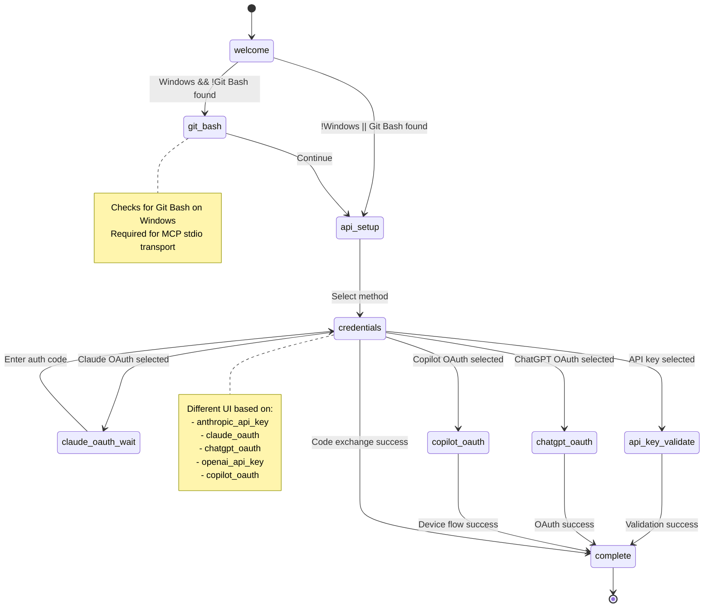
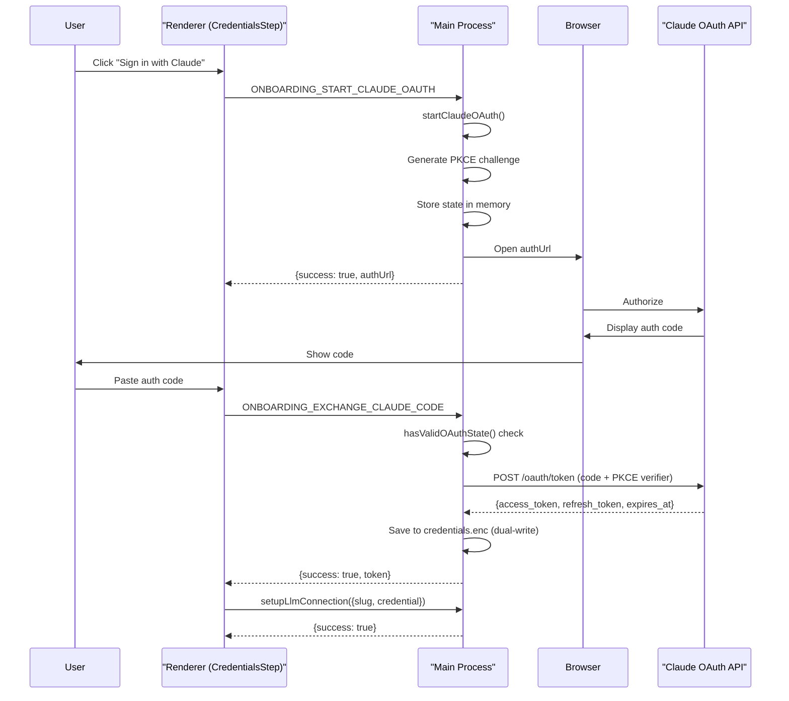
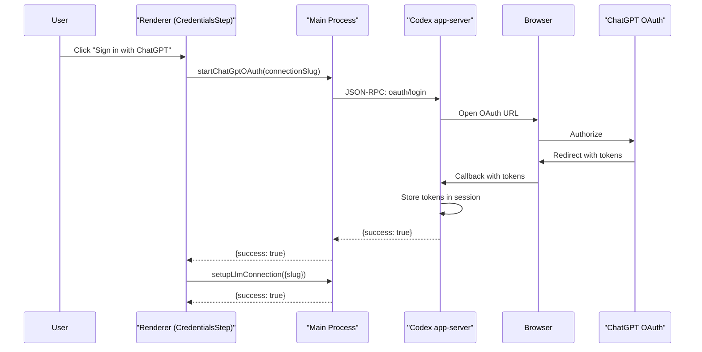
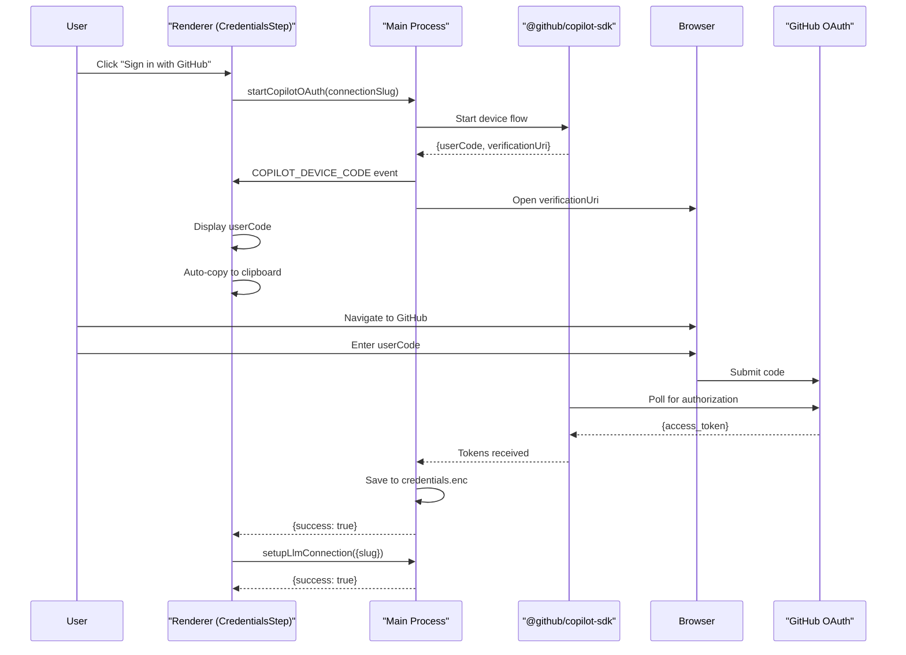
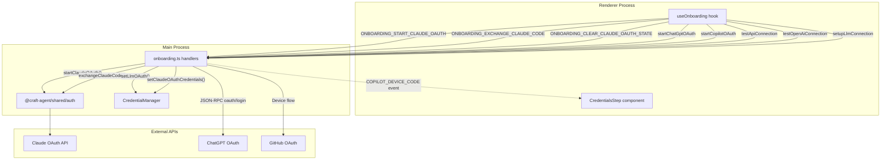

# Authentication Setup

<details>
<summary>Relevant source files</summary>

The following files were used as context for generating this wiki page:

- [apps/electron/src/main/onboarding.ts](apps/electron/src/main/onboarding.ts)
- [apps/electron/src/renderer/components/onboarding/CredentialsStep.tsx](apps/electron/src/renderer/components/onboarding/CredentialsStep.tsx)
- [apps/electron/src/renderer/components/onboarding/OnboardingWizard.tsx](apps/electron/src/renderer/components/onboarding/OnboardingWizard.tsx)
- [apps/electron/src/renderer/hooks/useOnboarding.ts](apps/electron/src/renderer/hooks/useOnboarding.ts)
- [packages/shared/src/auth/oauth.ts](packages/shared/src/auth/oauth.ts)
- [packages/shared/src/sources/types.ts](packages/shared/src/sources/types.ts)

</details>

This page describes the authentication setup process in Craft Agents, covering the onboarding wizard flow, supported authentication methods, OAuth flows, and credential storage. This is the initial setup users complete after installing the application to configure AI provider access.

For information about configuring OAuth credentials for third-party services (Google, Slack, Microsoft), see [Sources](#4.3). For credential encryption details, see [Credential Storage & Encryption](#7.2). For environment variables used during builds, see [Environment Configuration](#3.2).

---

## Onboarding Wizard Overview

The onboarding wizard is a multi-step flow that guides users through initial authentication setup. The wizard is implemented as a state machine in the `useOnboarding` hook and rendered by the `OnboardingWizard` component.

**Wizard Steps:**

| Step | Name          | Purpose                             | Conditional                |
| ---- | ------------- | ----------------------------------- | -------------------------- |
| 1    | `welcome`     | Introduction screen                 | Always shown               |
| 2    | `git-bash`    | Git Bash installation check         | Windows only, if not found |
| 3    | `api-setup`   | Choose authentication method        | Always shown               |
| 4    | `credentials` | Enter credentials or complete OAuth | Always shown               |
| 5    | `complete`    | Confirmation and finalization       | Always shown               |

The wizard supports both creating new LLM connections and editing existing ones via the `editingSlug` parameter.

**Sources:**

- [apps/electron/src/renderer/hooks/useOnboarding.ts:12-41]()
- [apps/electron/src/renderer/components/onboarding/OnboardingWizard.tsx:9-14]()

---

## Onboarding State Machine



**State Transitions:**

The wizard flow is controlled by `handleContinue` and `handleBack` functions. The Git Bash check runs asynchronously on wizard mount and determines whether the `git-bash` step is shown.

**Sources:**

- [apps/electron/src/renderer/hooks/useOnboarding.ts:232-260]()
- [apps/electron/src/renderer/hooks/useOnboarding.ts:263-284]()
- [apps/electron/src/renderer/hooks/useOnboarding.ts:176-190]()

---

## Authentication Methods

Craft Agents supports five authentication methods, each mapped to a specific `ApiSetupMethod` enum value:

| Method                | Enum Value          | Provider                | Transport  | Description                                                                     |
| --------------------- | ------------------- | ----------------------- | ---------- | ------------------------------------------------------------------------------- |
| **Anthropic API Key** | `anthropic_api_key` | Claude Agent SDK        | Direct API | API key authentication with optional custom base URL (OpenRouter, Ollama, etc.) |
| **Claude OAuth**      | `claude_oauth`      | Claude Max subscription | OAuth 2.0  | Two-step OAuth flow requiring manual code entry                                 |
| **ChatGPT OAuth**     | `chatgpt_oauth`     | ChatGPT Plus/Pro        | OAuth 2.0  | Single-step browser-based OAuth via Codex app-server                            |
| **OpenAI API Key**    | `openai_api_key`    | OpenAI API              | Direct API | Direct OpenAI API key via Codex app-server                                      |
| **Copilot OAuth**     | `copilot_oauth`     | GitHub Copilot          | OAuth 2.0  | Device flow requiring code entry on GitHub                                      |

Each method generates a unique connection slug (e.g., `anthropic-api`, `claude-max`, `codex`, `codex-api`, `copilot`). If a slug already exists, a numeric suffix is appended (`codex-2`, `codex-3`, etc.).

**Sources:**

- [apps/electron/src/renderer/hooks/useOnboarding.ts:80-87]()
- [apps/electron/src/renderer/hooks/useOnboarding.ts:94-108]()
- [README.md:261-280]()

---

## API Key Authentication

### Anthropic API Key Flow

The Anthropic API key method supports both direct Anthropic API access and third-party providers through custom base URLs.

**Workflow:**

1. User enters API key in `ApiKeyInput` component
2. Optionally configures:
   - Base URL (default: Anthropic API)
   - Default model
   - Available models list
3. Connection validation via `testApiConnection` IPC call
4. On success, calls `setupLlmConnection` to persist configuration

**Supported Providers:**

- **Anthropic API** - Direct API access (requires API key)
- **OpenRouter** - Multi-model gateway (`https://openrouter.ai/api`)
- **Vercel AI Gateway** - AI gateway with observability (`https://ai-gateway.vercel.sh`)
- **Ollama** - Local models (`http://localhost:11434`, API key optional)
- **Custom** - Any Anthropic-compatible endpoint

**Validation Process:**

The `testApiConnection` handler validates:

- Authentication (if API key provided)
- Endpoint accessibility
- Model availability
- Tool support (extended thinking, computer use)

**Sources:**

- [apps/electron/src/renderer/hooks/useOnboarding.ts:293-350]()
- [apps/electron/src/renderer/components/onboarding/CredentialsStep.tsx:248-279]()
- [README.md:261-280]()

### OpenAI API Key Flow

The OpenAI API key method provides direct access to OpenAI models via the Codex app-server.

**Workflow:**

1. User enters OpenAI API key
2. Optionally configures:
   - Base URL (default: OpenAI API)
   - Default model
   - Available models list
3. Validation via `testOpenAiConnection` IPC call (tests `/v1/models` endpoint)
4. On success, persists to `codex-api` or `codex-api-{N}` connection

**Key Differences from Anthropic:**

- API key is always required (no local model support)
- Uses Codex app-server JSON-RPC transport
- Limited to OpenAI-compatible endpoints only

**Sources:**

- [apps/electron/src/renderer/hooks/useOnboarding.ts:296-310]()
- [apps/electron/src/renderer/hooks/useOnboarding.ts:326-332]()

---

## OAuth Authentication

### Claude OAuth (Two-Step Flow)

Claude OAuth uses a two-step flow requiring manual authorization code entry.



**State Management:**

OAuth state (PKCE verifier, nonce) is stored in memory during the flow and validated before code exchange:

- `startClaudeOAuth()` - Initiates flow, stores state
- `hasValidOAuthState()` - Checks if state exists and is valid
- `exchangeClaudeCode()` - Exchanges code, validates state
- `clearOAuthState()` - Clears state on cancel/reset

**Dual-Write Pattern:**

Tokens are saved to both the new LLM connection system and legacy credential keys for backward compatibility:

```typescript
// New system
await manager.setLlmOAuth(connectionSlug, {
  accessToken,
  refreshToken,
  expiresAt,
})

// Legacy system (for validation)
await manager.setClaudeOAuthCredentials({
  accessToken,
  refreshToken,
  expiresAt,
  source: 'native',
})
```

**Sources:**

- [apps/electron/src/renderer/hooks/useOnboarding.ts:492-533]()
- [apps/electron/src/main/onboarding.ts:72-132]()
- [apps/electron/src/renderer/components/onboarding/CredentialsStep.tsx:184-246]()

### ChatGPT OAuth (Browser Flow)

ChatGPT OAuth uses a single-step browser flow that captures tokens automatically.



**Key Characteristics:**

- **No manual code entry** - Tokens captured automatically via browser callback
- **Codex app-server handles OAuth** - Main process delegates to JSON-RPC subprocess
- **Session-based storage** - Tokens stored in Codex app-server's internal session
- **Connection slug required** - Passed to app-server to identify session

**Sources:**

- [apps/electron/src/renderer/hooks/useOnboarding.ts:404-424]()
- [apps/electron/src/renderer/components/onboarding/CredentialsStep.tsx:80-118]()

### Copilot OAuth (Device Flow)

GitHub Copilot uses the OAuth device flow, displaying a user code that must be entered on GitHub.



**Device Code Display:**

The device code is displayed in a large, monospaced font and automatically copied to the clipboard when it appears. The UI shows a confirmation when the copy succeeds.

**Polling Mechanism:**

The Copilot SDK polls GitHub's authorization endpoint until the user completes the flow or the code expires. The renderer shows a loading state during polling with the message "Waiting for authorization...".

**Sources:**

- [apps/electron/src/renderer/hooks/useOnboarding.ts:427-458]()
- [apps/electron/src/renderer/components/onboarding/CredentialsStep.tsx:56-78]()
- [apps/electron/src/renderer/components/onboarding/CredentialsStep.tsx:120-182]()

---

## Connection Validation

Before saving credentials, all authentication methods perform connection validation to catch configuration errors early.

### Anthropic Connection Test

The `testApiConnection` IPC handler validates Anthropic-compatible connections:

1. **Authentication Test** - Verifies API key (if provided)
2. **Endpoint Accessibility** - Confirms base URL is reachable
3. **Model Availability** - Tests specified model or default
4. **Tool Support** - Checks for extended thinking and computer use capabilities

**Optional Validation:**

For Ollama and local endpoints, API key validation is skipped if no key is provided. The endpoint and model checks still run to ensure the service is accessible.

### OpenAI Connection Test

The `testOpenAiConnection` IPC handler validates OpenAI connections by calling the `/v1/models` endpoint:

1. Constructs request to `${baseUrl}/v1/models` (default: `https://api.openai.com`)
2. Includes `Authorization: Bearer ${apiKey}` header
3. Validates response structure
4. Optionally verifies specified models are available

**Sources:**

- [apps/electron/src/renderer/hooks/useOnboarding.ts:323-350]()

---

## Configuration Persistence

### LLM Connection Setup

After successful authentication, credentials are saved via the unified `setupLlmConnection` IPC call. This replaces the legacy per-method save handlers.

**Connection Setup Structure:**

```typescript
interface LlmConnectionSetup {
  slug: string // Unique identifier (e.g., "anthropic-api", "claude-max-2")
  credential?: string // API key or OAuth token
  baseUrl?: string // Custom endpoint URL
  defaultModel?: string // Default model for this connection
  models?: string[] // Available models list
}
```

**Slug Generation:**

Slugs are generated from the authentication method using the `resolveSlugForMethod` function:

- New connection: Uses base slug (`anthropic-api`) or appends numeric suffix if taken
- Editing existing: Reuses the provided `editingSlug`

**Credential Storage:**

All credentials are encrypted and stored in `~/.craft-agent/credentials.enc` using AES-256-GCM. See [Credential Storage & Encryption](#7.2) for details.

**Sources:**

- [apps/electron/src/renderer/hooks/useOnboarding.ts:110-152]()
- [apps/electron/src/renderer/hooks/useOnboarding.ts:192-230]()

### Configuration File Updates

The `setupLlmConnection` call updates both credentials and configuration:

1. **Credentials** - Saved to `~/.craft-agent/credentials.enc`
   - API keys stored with connection slug prefix
   - OAuth tokens stored with refresh token and expiry
2. **Config** - Updated in `~/.craft-agent/config.json`
   - Connection added to `llmConnections` array
   - Default model and custom endpoint saved
3. **State Propagation** - `onConfigSaved` callback fires immediately
   - UI updates billing/model info without waiting for completion
   - Prevents stale state during wizard flow

**Sources:**

- [apps/electron/src/renderer/hooks/useOnboarding.ts:208-214]()

---

## IPC Communication Flow

The authentication setup process uses several IPC channels to communicate between the renderer and main processes.

### Authentication IPC Channels



**Channel Mapping:**

| IPC Channel                           | Request                   | Response                  | Purpose                       |
| ------------------------------------- | ------------------------- | ------------------------- | ----------------------------- |
| `ONBOARDING_GET_AUTH_STATE`           | -                         | `{authState, setupNeeds}` | Check authentication status   |
| `ONBOARDING_START_CLAUDE_OAUTH`       | -                         | `{success, authUrl}`      | Initiate Claude OAuth flow    |
| `ONBOARDING_EXCHANGE_CLAUDE_CODE`     | `code, connectionSlug`    | `{success, token}`        | Exchange auth code for tokens |
| `ONBOARDING_HAS_CLAUDE_OAUTH_STATE`   | -                         | `boolean`                 | Check if OAuth state exists   |
| `ONBOARDING_CLEAR_CLAUDE_OAUTH_STATE` | -                         | `{success}`               | Clear OAuth state             |
| `startChatGptOAuth`                   | `connectionSlug`          | `{success, error?}`       | ChatGPT browser OAuth         |
| `startCopilotOAuth`                   | `connectionSlug`          | `{success, error?}`       | Copilot device flow           |
| `testApiConnection`                   | `apiKey, baseUrl, models` | `{success, error?}`       | Validate Anthropic connection |
| `testOpenAiConnection`                | `apiKey, baseUrl, models` | `{success, error?}`       | Validate OpenAI connection    |
| `setupLlmConnection`                  | `LlmConnectionSetup`      | `{success, error?}`       | Save connection config        |

**Event Channels:**

- `COPILOT_DEVICE_CODE` - Emitted during Copilot device flow with `{userCode, verificationUri}`

**Sources:**

- [apps/electron/src/main/onboarding.ts:19-144]()
- [apps/electron/src/renderer/hooks/useOnboarding.ts:370-533]()

---

## Git Bash Check (Windows)

On Windows, the wizard checks for Git Bash before proceeding to API setup. Git Bash is required for spawning MCP servers using the stdio transport.

**Check Process:**

1. On wizard mount, calls `checkGitBash` IPC handler
2. Searches for `bash.exe` in common Git installation paths
3. If not found, displays `GitBashWarning` step
4. User can:
   - Browse for `bash.exe` manually
   - Recheck after installing Git
   - Continue anyway (MCP servers won't work)

**Git Bash Paths Checked:**

- `C:\Program Files\Git\bin\bash.exe`
- `C:\Program Files (x86)\Git\bin\bash.exe`
- User-specified path via browse dialog

**Sources:**

- [apps/electron/src/renderer/hooks/useOnboarding.ts:178-190]()
- [apps/electron/src/renderer/hooks/useOnboarding.ts:544-580]()
- [apps/electron/src/renderer/components/onboarding/OnboardingWizard.tsx:101-113]()
