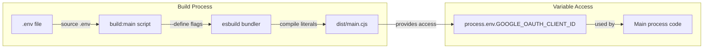
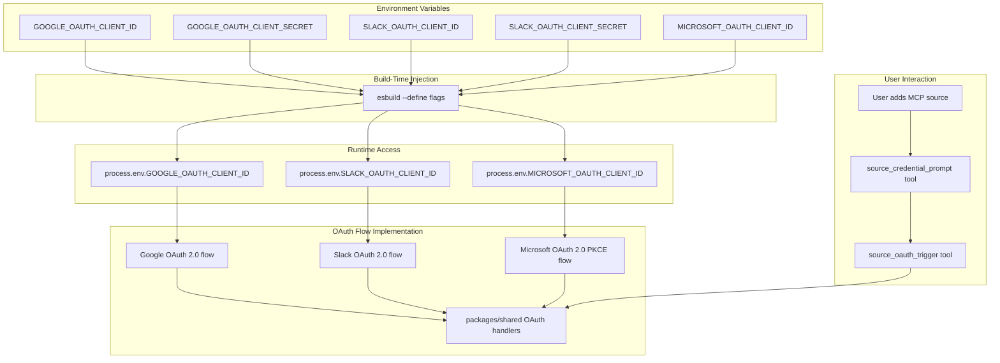
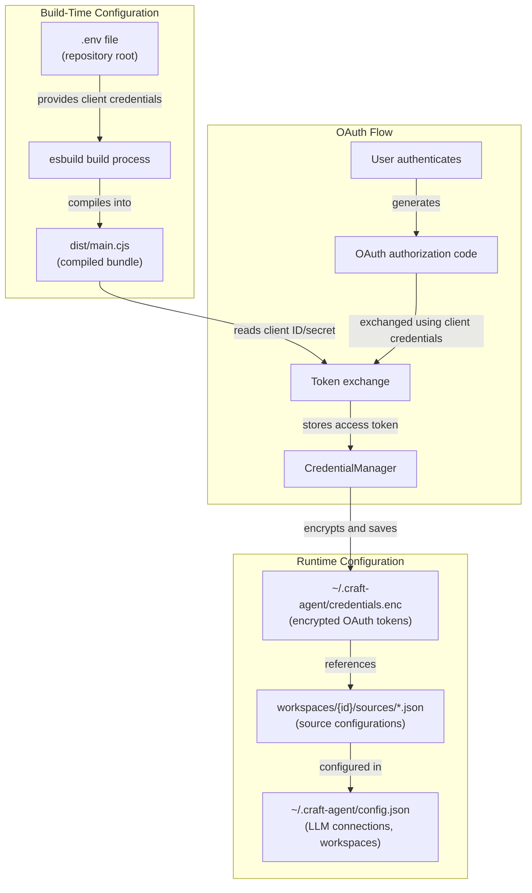

# Environment Configuration

<details>
<summary>Relevant source files</summary>

The following files were used as context for generating this wiki page:

- [README.md](README.md)
- [packages/shared/src/agent/diagnostics.ts](packages/shared/src/agent/diagnostics.ts)
- [packages/shared/src/config/llm-connections.ts](packages/shared/src/config/llm-connections.ts)
- [packages/shared/src/config/storage.ts](packages/shared/src/config/storage.ts)
- [packages/shared/src/utils/summarize.ts](packages/shared/src/utils/summarize.ts)

</details>

## Purpose and Scope

This page documents the environment variables and build-time configuration required for developing and building Craft Agents. It covers OAuth client credentials for MCP source integrations, build-time variable injection, and the `.env` file structure.

For runtime authentication setup and user-facing credential management, see [Authentication Setup](#3.3). For workspace-specific configuration files, see [Storage & Configuration](#2.8).

---

## Overview

Craft Agents uses environment variables for two primary purposes:

1. **Build-time injection**: OAuth client IDs and secrets are compiled into the application binary during the build process
2. **Development configuration**: Optional settings for development workflows

All environment variables are sourced from a `.env` file at the repository root and injected into the Electron main process bundle using esbuild's `--define` flag.

**Sources:** [apps/electron/package.json:18]()

---

## Environment Variable Categories

### OAuth Client Credentials

The following environment variables configure OAuth client credentials for MCP source integrations. These are optional but required for users to authenticate with the respective services.

| Variable                     | Service         | Required | Purpose                                        |
| ---------------------------- | --------------- | -------- | ---------------------------------------------- |
| `GOOGLE_OAUTH_CLIENT_ID`     | Google APIs     | No       | OAuth 2.0 client ID for Google MCP sources     |
| `GOOGLE_OAUTH_CLIENT_SECRET` | Google APIs     | No       | OAuth 2.0 client secret for Google MCP sources |
| `SLACK_OAUTH_CLIENT_ID`      | Slack API       | No       | OAuth 2.0 client ID for Slack MCP sources      |
| `SLACK_OAUTH_CLIENT_SECRET`  | Slack API       | No       | OAuth 2.0 client secret for Slack MCP sources  |
| `MICROSOFT_OAUTH_CLIENT_ID`  | Microsoft Graph | No       | OAuth 2.0 client ID for Microsoft MCP sources  |

**Note:** Microsoft OAuth does not require a client secret as it uses PKCE (Proof Key for Code Exchange) for public clients.

**Sources:** [apps/electron/package.json:18]()

---

## The `.env` File

### Location and Format

The `.env` file must be placed at the repository root (`craft-agents-oss/.env`). It uses standard environment variable syntax:

```bash
# MCP OAuth Credentials
GOOGLE_OAUTH_CLIENT_ID=your-client-id.apps.googleusercontent.com
GOOGLE_OAUTH_CLIENT_SECRET=your-client-secret

SLACK_OAUTH_CLIENT_ID=your-slack-client-id
SLACK_OAUTH_CLIENT_SECRET=your-slack-client-secret

MICROSOFT_OAUTH_CLIENT_ID=your-microsoft-client-id
```

### Security Considerations

- The `.env` file should **never** be committed to version control
- Add `.env` to `.gitignore` to prevent accidental commits
- Store credentials securely using a password manager or secret management service
- For production builds, use secure environment variable injection in CI/CD pipelines

**Sources:** [apps/electron/package.json:18]()

---

## Build-Time Variable Injection

### Injection Mechanism

Environment variables are injected at build time using esbuild's `--define` flag in the `build:main` script. The build process:

1. Sources the `.env` file using `source ../../.env`
2. Passes each variable to esbuild with `--define:process.env.VAR_NAME=\"${VAR_NAME:-}\"`
3. The `:-` syntax provides an empty string default if the variable is unset
4. Variables are compiled as string literals into the main process bundle



**Diagram: Build-Time Environment Variable Injection Flow**

**Sources:** [apps/electron/package.json:18]()

---

## Platform-Specific Build Scripts

### macOS and Linux

The standard `build:main` script sources the `.env` file using bash:

```bash
source ../../.env 2>/dev/null || true
```

The `2>/dev/null || true` pattern ensures the build continues even if the `.env` file doesn't exist.

**Sources:** [apps/electron/package.json:18]()

### Windows

Windows builds use a separate `build:main:win` script that does not source the `.env` file. Environment variables must be set in the Windows environment or passed via PowerShell:

```powershell
$env:GOOGLE_OAUTH_CLIENT_ID = "your-client-id"
bun run build:win
```

**Sources:** [apps/electron/package.json:19]()

---

## Environment Variable to Code Entity Mapping

The following diagram shows how environment variables map to code entities in the application:



**Diagram: Environment Variable to OAuth Flow Mapping**

**Sources:** [apps/electron/package.json:18]()

---

## Development Workflow

### Initial Setup

1. Create a `.env` file at the repository root:

   ```bash
   touch .env
   ```

2. Add OAuth credentials (optional for basic development):

   ```bash
   echo "GOOGLE_OAUTH_CLIENT_ID=your-client-id" >> .env
   echo "GOOGLE_OAUTH_CLIENT_SECRET=your-client-secret" >> .env
   ```

3. Verify the file is ignored by git:
   ```bash
   git status  # .env should not appear
   ```

### Building with Environment Variables

Run the standard build command, which automatically sources the `.env` file:

```bash
bun run electron:build
```

Or build just the main process:

```bash
bun run electron:build:main
```

**Sources:** [package.json:21-22](), [apps/electron/package.json:18]()

### Development Mode

The development script automatically rebuilds when changes are detected:

```bash
bun run electron:dev
```

Environment variables are re-sourced on each rebuild of the main process.

**Sources:** [package.json:28]()

---

## Obtaining OAuth Credentials

### Google OAuth Credentials

1. Create a project in [Google Cloud Console](https://console.cloud.google.com)
2. Enable required APIs (Gmail, Calendar, Drive, etc.)
3. Create OAuth 2.0 credentials with redirect URI: `http://localhost:3000/oauth/callback`
4. Copy the client ID and secret to your `.env` file

### Slack OAuth Credentials

1. Create an app in [Slack API Portal](https://api.slack.com/apps)
2. Add OAuth redirect URL: `http://localhost:3000/oauth/callback`
3. Copy the client ID and secret to your `.env` file
4. Configure required OAuth scopes for your use case

### Microsoft OAuth Credentials

1. Register an app in [Azure Portal](https://portal.azure.com)
2. Set redirect URI to `ms-craftagents://auth` (custom protocol)
3. Enable public client flows (PKCE)
4. Copy the application (client) ID to your `.env` file
5. **No client secret is required** for PKCE flows

---

## Missing Credentials Behavior

### Build Time

If OAuth credentials are not provided:

- The build completes successfully with empty string defaults
- Variables are defined as `""` in the compiled bundle
- No warnings or errors are generated

### Runtime

When a user attempts to add an MCP source requiring OAuth:

- The application checks if the respective client ID is defined
- If missing, the OAuth flow is disabled for that source
- Users see an error indicating OAuth is not configured
- API key authentication may still be available for some sources

**Sources:** [apps/electron/package.json:18]()

---

## Production Builds

### CI/CD Configuration

For automated builds in CI/CD environments:

1. Store OAuth credentials as encrypted secrets in your CI/CD platform
2. Inject them as environment variables before the build step
3. Never log or expose credentials in build output

Example GitHub Actions configuration:

```yaml
- name: Build Electron App
  env:
    GOOGLE_OAUTH_CLIENT_ID: ${{ secrets.GOOGLE_OAUTH_CLIENT_ID }}
    GOOGLE_OAUTH_CLIENT_SECRET: ${{ secrets.GOOGLE_OAUTH_CLIENT_SECRET }}
    SLACK_OAUTH_CLIENT_ID: ${{ secrets.SLACK_OAUTH_CLIENT_ID }}
    SLACK_OAUTH_CLIENT_SECRET: ${{ secrets.SLACK_OAUTH_CLIENT_SECRET }}
    MICROSOFT_OAUTH_CLIENT_ID: ${{ secrets.MICROSOFT_OAUTH_CLIENT_ID }}
  run: bun run electron:build
```

### Distribution Considerations

OAuth credentials compiled into distributed binaries:

- Are **not** user-specific; they identify your application to the OAuth provider
- Should be rotated regularly and monitored for abuse
- May have rate limits or quotas imposed by the provider
- Should be registered with appropriate redirect URIs for production

---

## Configuration File Structure

The following diagram shows how environment variables relate to the broader configuration architecture:



**Diagram: Environment Variables in Configuration Architecture**

**Sources:** [apps/electron/package.json:18]()

---

## Troubleshooting

### Build Fails to Source `.env`

**Symptom:** Build script cannot find `.env` file

**Solution:**

- Verify `.env` exists at repository root
- Check file permissions: `chmod 600 .env`
- On Windows, use `build:main:win` or set variables in PowerShell

### OAuth Flows Don't Work

**Symptom:** OAuth authentication fails or shows "not configured" error

**Solution:**

- Verify credentials are in `.env` before building
- Rebuild the application after updating `.env`
- Check that redirect URIs match in OAuth provider console
- Ensure client ID/secret are valid and not expired

### Environment Variables Not Defined

**Symptom:** `process.env.GOOGLE_OAUTH_CLIENT_ID` is `undefined` at runtime

**Solution:**

- Verify the `build:main` script was used (not `build:main:win` on Unix)
- Check esbuild `--define` flags in build script
- Rebuild the main process: `bun run electron:build:main`
- Confirm the variable exists in the compiled `dist/main.cjs` bundle

**Sources:** [apps/electron/package.json:18-19]()

---

## Related Pages

- [Installation](#3.1) - Platform-specific installation instructions
- [Authentication Setup](#3.3) - User-facing authentication configuration
- [Storage & Configuration](#2.8) - Runtime configuration file formats
- [External Service Integration](#2.4) - How sources use OAuth credentials
