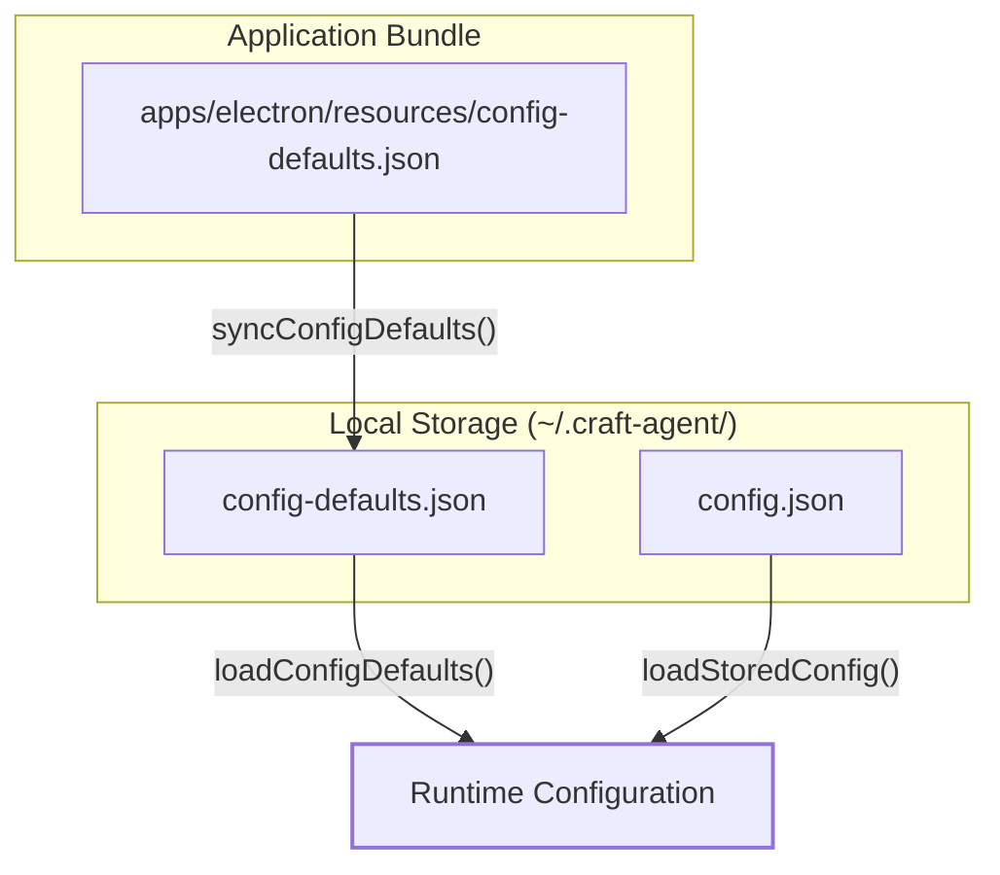
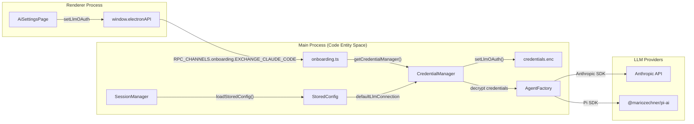

# Environment Configuration

Relevant source files

The following files were used as context for generating this wiki page:

- [apps/electron/resources/config-defaults.json](apps/electron/resources/config-defaults.json)
- [apps/electron/src/main/onboarding.ts](apps/electron/src/main/onboarding.ts)
- [apps/electron/src/renderer/pages/settings/AppSettingsPage.tsx](apps/electron/src/renderer/pages/settings/AppSettingsPage.tsx)
- [apps/electron/src/shared/types.ts](apps/electron/src/shared/types.ts)
- [bun.lock](bun.lock)
- [packages/shared/src/config/config-defaults-schema.ts](packages/shared/src/config/config-defaults-schema.ts)
- [packages/shared/src/config/storage.ts](packages/shared/src/config/storage.ts)
- [packages/shared/src/config/watcher.ts](packages/shared/src/config/watcher.ts)

## Purpose and Scope

This page documents the environment configuration of Craft Agents, focusing on the on-disk data layout under `~/.craft-agent/`, the structure of core configuration files (`config.json`, `preferences.json`, `config-defaults.json`), and the management of LLM connections and workspaces. It explains how the system initializes its environment and how configuration state flows between the filesystem and the application.

---

## The `~/.craft-agent/` Directory Structure

Craft Agents stores all persistent state in a standardized directory located at `~/.craft-agent/` (expanded via `expandPath('~/.craft-agent')` [packages/shared/src/config/storage.ts:15-18]()). This directory acts as the root for application configuration, workspace data, and bundled assets.

| Path | Purpose | Key File/Subdirectory |
|:---|:---|:---|
| `/` | Root config directory | `config.json`, `preferences.json`, `credentials.enc` |
| `/docs/` | In-app documentation | Markdown files synced from bundled assets |
| `/themes/` | UI Theme definitions | JSON files defining CSS variables and colors |
| `/workspaces/` | Workspace-scoped data | Subdirectories per workspace slug |
| `/workspaces/{slug}/` | Individual workspace | `config.json`, `/sessions/`, `/sources/`, `/skills/` |

**Sources:** [packages/shared/src/config/storage.ts:1-29](), [packages/shared/src/config/paths.ts:18-18]()

---

## Core Configuration Files

### `config.json` (`StoredConfig`)

The `config.json` file in the root directory is the authoritative source for application-level settings and the workspace registry. It is managed by the `StoredConfig` interface [packages/shared/src/config/storage.ts:51-87]().

| Field | Type | Description |
|:---|:---|:---|
| `llmConnections` | `LlmConnection[]` | Array of configured LLM providers (Anthropic, Bedrock, etc.) |
| `defaultLlmConnection` | `string` | The slug of the connection used for new sessions |
| `workspaces` | `Workspace[]` | Registry of known workspaces and their metadata |
| `activeWorkspaceId` | `string` | ID of the workspace currently selected in the UI |
| `colorTheme` | `string` | ID of the selected preset theme (e.g., 'dracula', 'nord') |
| `notificationsEnabled` | `boolean` | Desktop notifications for task completion |
| `networkProxy` | `NetworkProxySettings` | Global proxy configuration for outbound requests |

**Sources:** [packages/shared/src/config/storage.ts:51-87]()

### `config-defaults.json`

On every launch, the application syncs `config-defaults.json` from its bundled assets to the config directory via `syncConfigDefaults()` [packages/shared/src/config/storage.ts:125-152](). This ensures that new settings introduced in application updates have sensible defaults.

**Diagram: Configuration Defaults Sync Flow**

**Sources:** [packages/shared/src/config/storage.ts:125-152](), [packages/shared/src/config/storage.ts:158-166](), [apps/electron/resources/config-defaults.json:1-23]()

---

## LLM Connection Configuration

LLM Connections are named provider configurations. Each connection specifies a `providerType` (e.g., `anthropic`, `bedrock`, `pi`) and an `authType` (e.g., `api_key`, `oauth`, `iam_credentials`) [apps/electron/src/shared/types.ts:67-68]().

### Connection Structure (`LlmConnection`)

| Property | Description |
|:---|:---|
| `slug` | URL-safe identifier (e.g., `anthropic-pro`) |
| `providerType` | Implementation backend: `anthropic`, `bedrock`, `vertex`, `pi`, etc. |
| `authType` | Mechanism: `api_key`, `oauth`, `iam_credentials`, `none` |
| `models` | Optional override for available models (e.g., for Ollama/Local) |

**Sources:** [packages/shared/src/config/storage.ts:45-45](), [apps/electron/src/shared/types.ts:67-68]()

### Data Flow: Connection to Agent

When a session starts, the `LlmConnection` slug is used to retrieve credentials from the encrypted `credentials.enc` store and initialize the appropriate `BaseAgent` implementation.

**Diagram: LLM Connection and Credential Flow**

**Sources:** [apps/electron/src/main/onboarding.ts:112-151](), [packages/shared/src/config/storage.ts:51-54](), [apps/electron/src/shared/types.ts:212-220]()

---

## User Preferences and Watcher

### `preferences.json` (`UserPreferences`)

The `preferences.json` file stores user-specific metadata that isn't critical to application logic but enhances the AI's context, such as the user's name, timezone, and location [packages/shared/src/config/watcher.ts:79-90]().

### Config Watcher (`ConfigWatcher`)

The `ConfigWatcher` class monitors configuration files for external changes and triggers callbacks in the application to ensure the UI stays in sync without a restart [packages/shared/src/config/watcher.ts:182-186]().

| Watched File | Callback Triggered |
|:---|:---|
| `config.json` | `onConfigChange` |
| `preferences.json` | `onPreferencesChange` |
| `workspaces/*/config.json` | `onWorkspacePermissionsChange` / `onSourceChange` |
| `automations.json` | `onAutomationsConfigChange` |

**Sources:** [packages/shared/src/config/watcher.ts:62-63](), [packages/shared/src/config/watcher.ts:95-156]()

---

## Implementation Details

### Configuration Initialization

At startup, the application executes the following sequence to prepare the environment:
1.  **Directory Verification**: Creates `~/.craft-agent/` if it does not exist [packages/shared/src/config/storage.ts:1-17]().
2.  **Asset Syncing**: Calls `syncConfigDefaults()` to update the defaults file from the app bundle [packages/shared/src/config/storage.ts:125-152]().
3.  **Documentation Syncing**: Calls `initializeDocs()` to ensure in-app help is up-to-date [packages/shared/src/config/storage.ts:14-14]().
4.  **Config Loading**: Executes `loadStoredConfig()` which reads `config.json` and populates the runtime state [packages/shared/src/config/storage.ts:28-28]().
5.  **Workspace Discovery**: Runs `discoverWorkspacesInDefaultLocation()` to find and register all workspace directories [packages/shared/src/config/storage.ts:6-6]().

**Sources:** [packages/shared/src/config/storage.ts:1-152](), [packages/shared/src/config/watcher.ts:1-17]()

### Settings UI (`AppSettingsPage`)

The `AppSettingsPage` component in the renderer provides a user interface for modifying these files. It communicates with the main process via `window.electronAPI` to persist changes to disk [apps/electron/src/renderer/pages/settings/AppSettingsPage.tsx:94-200]().

*   **Notifications**: Toggles `notificationsEnabled` in `config.json` [apps/electron/src/renderer/pages/settings/AppSettingsPage.tsx:148-151]().
*   **Network Proxy**: Configures `networkProxy` settings [apps/electron/src/renderer/pages/settings/AppSettingsPage.tsx:168-191]().
*   **Browser Tool**: Enables or disables the built-in browser automation tool [apps/electron/src/renderer/pages/settings/AppSettingsPage.tsx:158-161]().

**Sources:** [apps/electron/src/renderer/pages/settings/AppSettingsPage.tsx:1-200](), [apps/electron/src/shared/types.ts:212-230]()

---

## Related Pages
*   **2.8 Storage & Configuration** — Deep dive into the persistence logic and `SessionManager`.
*   **3.3 Authentication Setup** — Walkthrough of the onboarding wizard and credential management.
*   **4.1 Workspaces** — Detailed guide on workspace-level configuration and directory structure.