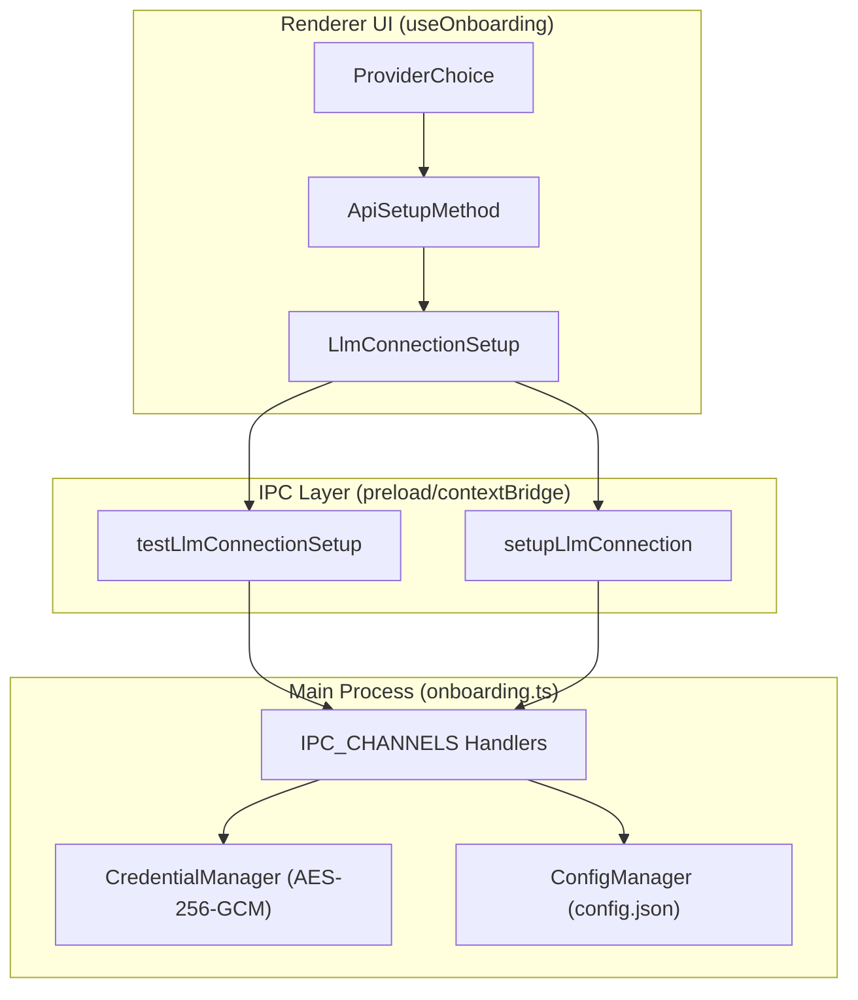

# Getting Started

<details>
<summary>Relevant source files</summary>

The following files were used as context for generating this wiki page:

- [README.md](README.md)
- [apps/electron/src/renderer/hooks/useOnboarding.ts](apps/electron/src/renderer/hooks/useOnboarding.ts)

</details>


This page guides you through the initial setup process for Craft Agents, from installation through authentication and workspace creation. The setup involves running the desktop application and completing an onboarding wizard that configures your AI provider connections and workspace.

For detailed installation methods, see [Installation](#3.1). For environment configuration and directory structure, see [Environment Configuration](#3.2). For authentication details specific to each provider, see [Authentication Setup](#3.3).

## Overview

Craft Agents uses an interactive onboarding wizard that runs on first launch. The wizard guides you through:

1.  **Platform Setup** (Windows only) - Verifying Git Bash availability for MCP stdio servers. [apps/electron/src/renderer/hooks/useOnboarding.ts:7-7]()
2.  **API Connection** - Selecting and configuring an AI provider (Claude, ChatGPT, OpenAI, Copilot). [apps/electron/src/renderer/hooks/useOnboarding.ts:8-8]()
3.  **Authentication** - Providing API keys or completing OAuth flows. [apps/electron/src/renderer/hooks/useOnboarding.ts:9-9]()
4.  **Configuration Persistence** - Saving encrypted credentials and connection metadata to disk. [apps/electron/src/renderer/hooks/useOnboarding.ts:10-10]()

The onboarding wizard is implemented as a React state machine in the renderer process using the `useOnboarding` hook, with IPC communication to the main process for credential validation and storage.

**Sources:** [README.md:101-108](), [apps/electron/src/renderer/hooks/useOnboarding.ts:1-11]()

## Onboarding Wizard State Machine

The onboarding flow is managed by the `useOnboarding` hook ([apps/electron/src/renderer/hooks/useOnboarding.ts:194-203]()) which implements a state machine. The `OnboardingWizard` component renders the current step based on the `step` field in `OnboardingState`.

**Onboarding Flow Diagram**

```mermaid
stateDiagram-v2
    [*] --> "welcome": "Launch app"
    "welcome" --> "provider-select": "macOS / Linux"
    "welcome" --> "git-bash": "Windows (if missing)"
    "git-bash" --> "provider-select": "Path configured"

    "provider-select" --> "credentials": "Select Claude / ChatGPT / Copilot / API Key"
    "provider-select" --> "local-model": "Select Local Model (Ollama)"

    "credentials" --> "validating": "Submit credentials"
    "local-model" --> "saving": "Submit local endpoint"
    "validating" --> "credentials": "Validation failed"
    "validating" --> "saving": "Validation success"

    "saving" --> "complete": "Config saved via setupLlmConnection"
    "complete" --> [*]: "Close wizard (onComplete)"
```

**Sources:** [apps/electron/src/renderer/hooks/useOnboarding.ts:1-11](), [apps/electron/src/renderer/hooks/useOnboarding.ts:194-215]()

### State Management

The wizard state is managed by the `OnboardingState` interface:

| Field | Type | Purpose |
| :--- | :--- | :--- |
| `step` | `OnboardingStep` | Current wizard step (e.g., `welcome`, `provider-select`) |
| `loginStatus` | `Status` | OAuth flow status (`idle`, `waiting`, `success`, `error`) |
| `credentialStatus` | `Status` | API key / OAuth validation status |
| `completionStatus` | `'saving' \| 'complete'` | Configuration persistence status |
| `apiSetupMethod` | `ApiSetupMethod \| null` | Selected authentication method |
| `errorMessage` | `string?` | Current error message for display |

**Sources:** [apps/electron/src/renderer/hooks/useOnboarding.ts:13-22](), [apps/electron/src/renderer/hooks/useOnboarding.ts:205-215]()

## Authentication Methods

Craft Agents supports several `ApiSetupMethod` values, each corresponding to a `ProviderChoice` in the UI and a connection slug used for credential storage.

**Authentication Method Mapping**



**Sources:** [apps/electron/src/renderer/hooks/useOnboarding.ts:94-100](), [apps/electron/src/renderer/hooks/useOnboarding.ts:137-153](), [apps/electron/src/renderer/hooks/useOnboarding.ts:53-68]()

### Method Characteristics

The `BASE_SLUG_FOR_METHOD` map defines the unique identifiers used in the configuration for each provider type.

| `ApiSetupMethod` | Base Slug | Purpose |
| :--- | :--- | :--- |
| `anthropic_api_key` | `anthropic-api` | Direct Anthropic API key access |
| `claude_oauth` | `claude-max` | Claude Pro/Max browser-based OAuth |
| `pi_chatgpt_oauth` | `chatgpt-plus` | ChatGPT Plus integration via Pi SDK |
| `pi_copilot_oauth` | `github-copilot` | GitHub Copilot integration via Device Code |
| `pi_api_key` | `pi-api-key` | Generic Pi SDK API key |

**Sources:** [apps/electron/src/renderer/hooks/useOnboarding.ts:94-100]()

## Installation

Craft Agents provides one-line installers for major platforms to simplify the setup of the Electron application and its dependencies.

### One-Line Install (Recommended)

**macOS / Linux:**
The installation script handles architecture detection and fetches the latest release for your platform.

```bash
curl -fsSL https://agents.craft.do/install-app.sh | bash
```

**Windows (PowerShell):**
The PowerShell script performs similar detection for `win32-x64` and executes the installer.

```powershell
irm https://agents.craft.do/install-app.ps1 | iex
```

**Sources:** [README.md:63-73]()

### Build from Source

For developers, the app can be run directly from the monorepo using `bun`:

1.  Clone the repository: `git clone https://github.com/lukilabs/craft-agents-oss.git`
2.  Install dependencies: `bun install` [README.md:80-80]()
3.  Launch the app: `bun run electron:start` [README.md:81-81]()

**Sources:** [README.md:75-82]()

## Step-by-Step Flow

### 1. Platform Setup (Windows Only)
On Windows, the wizard checks for Git Bash. This is required because many MCP servers rely on `sh` or `bash` for stdio transport. The `handleBrowseGitBash` function allows users to manually locate the executable. [apps/electron/src/renderer/hooks/useOnboarding.ts:74-74]()

**Sources:** [apps/electron/src/renderer/hooks/useOnboarding.ts:7-7](), [apps/electron/src/renderer/hooks/useOnboarding.ts:74-76]()

### 2. Provider Selection & Authentication
The user selects a provider via `handleSelectProvider` ([apps/electron/src/renderer/hooks/useOnboarding.ts:53-53]()), which triggers either an API Key input field or an OAuth flow. 

*   **OAuth (Claude/ChatGPT/Copilot):** Initiated via `handleStartOAuth`. For Claude, the user must paste back an authorization code via `handleSubmitAuthCode`. [apps/electron/src/renderer/hooks/useOnboarding.ts:63-67]()
*   **API Key:** Users enter their key via `handleSubmitCredential`. The app validates the key using `testLlmConnectionSetup` before proceeding. [apps/electron/src/renderer/hooks/useOnboarding.ts:59-59]()

**Sources:** [apps/electron/src/renderer/hooks/useOnboarding.ts:53-71]()

### 3. Configuration Persistence
Once validated, the wizard calls `setupLlmConnection` via IPC. This handler:
1.  Resolves a unique slug for the connection using `resolveSlugForMethod`. [apps/electron/src/renderer/hooks/useOnboarding.ts:107-121]()
2.  Maps the UI setup data to an `LlmConnectionSetup` object. [apps/electron/src/renderer/hooks/useOnboarding.ts:137-153]()
3.  Encrypts credentials and updates `~/.craft-agent/config.json`.

**Sources:** [apps/electron/src/renderer/hooks/useOnboarding.ts:107-153]()

## Troubleshooting

### Windows Git Bash Issues
If Git Bash is not auto-detected, ensure "Git for Windows" is installed. You can use `handleRecheckGitBash` after installation to refresh the status. [apps/electron/src/renderer/hooks/useOnboarding.ts:76-76]()

### Validation Errors
If credentials fail to validate, the `credentialStatus` will move to `error`. Common issues include:
*   **Network:** Machine cannot reach the provider's API endpoint.
*   **Custom Endpoints:** For local models (Ollama), `isLoopbackEndpoint` checks if the `baseUrl` points to localhost. [apps/electron/src/renderer/hooks/useOnboarding.ts:124-135]()

**Sources:** [apps/electron/src/renderer/hooks/useOnboarding.ts:124-135](), [apps/electron/src/renderer/hooks/useOnboarding.ts:208-208]()