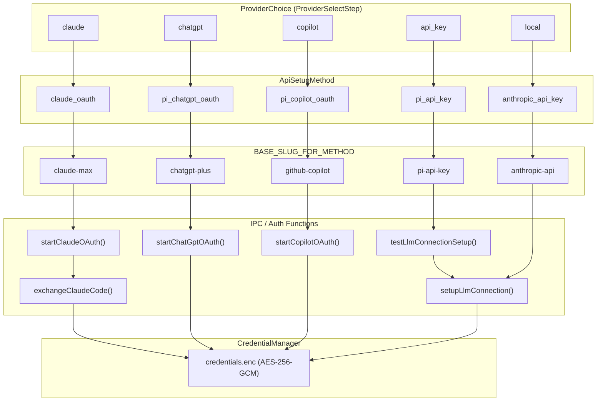
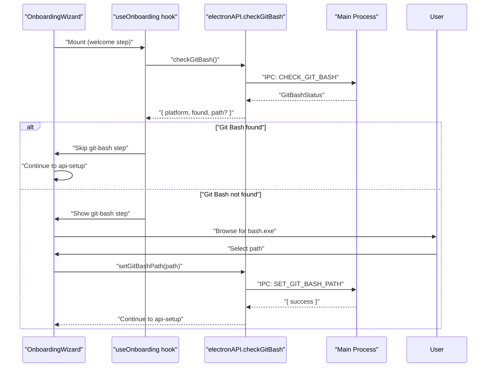
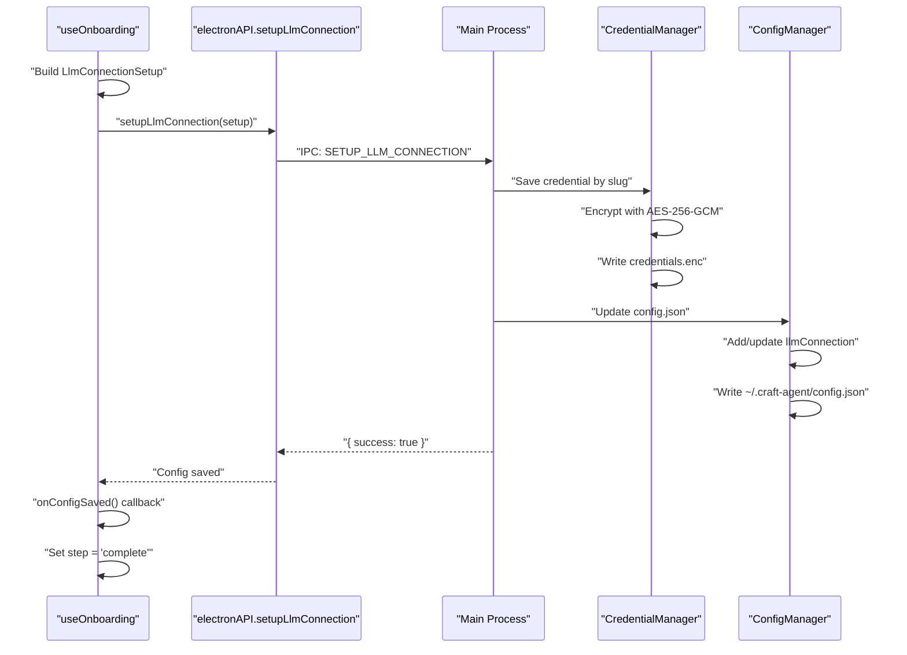

# Getting Started

<details>
<summary>Relevant source files</summary>

The following files were used as context for generating this wiki page:

- [README.md](README.md)
- [apps/electron/src/main/onboarding.ts](apps/electron/src/main/onboarding.ts)
- [apps/electron/src/renderer/components/onboarding/CredentialsStep.tsx](apps/electron/src/renderer/components/onboarding/CredentialsStep.tsx)
- [apps/electron/src/renderer/components/onboarding/OnboardingWizard.tsx](apps/electron/src/renderer/components/onboarding/OnboardingWizard.tsx)
- [apps/electron/src/renderer/hooks/useOnboarding.ts](apps/electron/src/renderer/hooks/useOnboarding.ts)

</details>

This page guides you through the initial setup process for Craft Agents, from installation through authentication and workspace creation. The setup involves running the desktop application and completing an onboarding wizard that configures your AI provider connections and workspace.

For detailed installation methods, see [Installation](#3.1). For environment variable configuration during builds, see [Environment Configuration](#3.2). For authentication details specific to each provider, see [Authentication Setup](#3.3).

## Overview

Craft Agents uses an interactive onboarding wizard that runs on first launch. The wizard guides you through:

1. **Platform Setup** (Windows only) - Verifying Git Bash availability for MCP stdio servers
2. **API Connection** - Selecting and configuring an AI provider (Claude, ChatGPT, OpenAI, Copilot)
3. **Authentication** - Providing API keys or completing OAuth flows
4. **Configuration Persistence** - Saving encrypted credentials to `~/.craft-agent/`

The onboarding wizard is implemented as a React state machine in the renderer process, with IPC communication to the main process for credential validation and storage.

**Sources:** [README.md:101-108](), [apps/electron/src/renderer/hooks/useOnboarding.ts:1-11]()

## Onboarding Wizard State Machine

The onboarding flow is managed by the `useOnboarding` hook ([apps/electron/src/renderer/hooks/useOnboarding.ts]()) which implements a state machine. The `OnboardingWizard` component renders the current step.

**Onboarding Flow Diagram**

```mermaid
stateDiagram-v2
    [*] --> "provider-select": "Launch app (macOS/Linux)"
    [*] --> "git-bash": "Launch app (Windows, Git Bash missing)"
    "git-bash" --> "provider-select": "Git Bash configured"

    "provider-select" --> "credentials": "Select Claude / ChatGPT / Copilot / API Key"
    "provider-select" --> "local-model": "Select Local Model (Ollama)"

    "credentials" --> "validating": "Submit credentials"
    "local-model" --> "saving": "Submit local endpoint"
    "validating" --> "credentials": "Validation failed"
    "validating" --> "saving": "Validation success"

    "saving" --> "complete": "Config saved"
    "complete" --> [*]: "Close wizard"
```

Sources: [apps/electron/src/renderer/hooks/useOnboarding.ts:160-176](), [apps/electron/src/renderer/components/onboarding/OnboardingWizard.tsx:11-29]()

### State Management

The wizard state is managed by the `OnboardingState` interface in `OnboardingWizard.tsx`:

| Field               | Type                                                                                           | Purpose                                   |
| ------------------- | ---------------------------------------------------------------------------------------------- | ----------------------------------------- |
| `step`              | `'welcome' \| 'git-bash' \| 'provider-select' \| 'local-model' \| 'credentials' \| 'complete'` | Current wizard step                       |
| `loginStatus`       | `'idle' \| 'waiting' \| 'success' \| 'error'`                                                  | OAuth flow status                         |
| `credentialStatus`  | `'idle' \| 'validating' \| 'success' \| 'error'`                                               | API key / OAuth validation status         |
| `completionStatus`  | `'saving' \| 'complete'`                                                                       | Configuration persistence status          |
| `apiSetupMethod`    | `ApiSetupMethod \| null`                                                                       | Selected authentication method            |
| `isExistingUser`    | `boolean`                                                                                      | Whether user has prior configuration      |
| `gitBashStatus`     | `GitBashStatus`                                                                                | Git Bash detection result (Windows)       |
| `isCheckingGitBash` | `boolean`                                                                                      | Whether initial Git Bash check is pending |
| `errorMessage`      | `string?`                                                                                      | Current error message                     |

Sources: [apps/electron/src/renderer/components/onboarding/OnboardingWizard.tsx:18-32]()

## Authentication Methods

Craft Agents supports five `ApiSetupMethod` values, each corresponding to a `ProviderChoice` in the UI and a connection slug used for credential storage.

**Authentication Method Mapping**



Sources: [apps/electron/src/renderer/hooks/useOnboarding.ts:89-96](), [apps/electron/src/renderer/hooks/useOnboarding.ts:547-574]()

### Method Characteristics

| `ApiSetupMethod`    | `ProviderChoice` | Base Slug        | Flow Type                 | Backend    |
| ------------------- | ---------------- | ---------------- | ------------------------- | ---------- |
| `anthropic_api_key` | `local`          | `anthropic-api`  | API key / custom endpoint | Claude SDK |
| `claude_oauth`      | `claude`         | `claude-max`     | Two-step browser OAuth    | Claude SDK |
| `pi_chatgpt_oauth`  | `chatgpt`        | `chatgpt-plus`   | Native browser OAuth      | Pi SDK     |
| `pi_copilot_oauth`  | `copilot`        | `github-copilot` | Device flow OAuth         | Pi SDK     |
| `pi_api_key`        | `api_key`        | `pi-api-key`     | API key input             | Pi SDK     |

Slug uniqueness is ensured by `resolveSlugForMethod`, which appends `-2`, `-3`, etc. when the base slug is already taken.

Sources: [apps/electron/src/renderer/hooks/useOnboarding.ts:89-117]()

## Step-by-Step Flow

### 1. Platform Setup (Windows Only)

On Windows, the wizard checks for Git Bash availability before proceeding. This is required for MCP servers that use stdio transport.

**Git Bash Detection Flow**



**Sources:** [apps/electron/src/renderer/hooks/useOnboarding.ts:178-190](), [apps/electron/src/renderer/hooks/useOnboarding.ts:544-563]()

### 2. Provider Selection

The `ProviderSelectStep` component presents provider cards. Selecting a card calls `handleSelectProvider(choice: ProviderChoice)`, which maps the choice to an `ApiSetupMethod`, updates state, and (for OAuth methods) immediately calls `handleStartOAuth` on the next tick.

Sources: [apps/electron/src/renderer/hooks/useOnboarding.ts:547-574](), [apps/electron/src/renderer/components/onboarding/OnboardingWizard.tsx:138-143]()

### 3. Credential Input / OAuth Flow

The `CredentialsStep` component renders different UIs based on `state.apiSetupMethod`:

#### API Key Flow (`anthropic_api_key`, `pi_api_key`)

1. `ApiKeyInput` component collects key, optional `baseUrl`, and optional model list
2. `handleSubmitCredential` validates inputs, then calls `window.electronAPI.testLlmConnectionSetup({ provider, apiKey, baseUrl, model, piAuthProvider })`
3. On success, calls `handleSaveConfig`, which calls `window.electronAPI.setupLlmConnection(setup)`
4. Configuration saved to `~/.craft-agent/credentials.enc` and `config.json`

For `anthropic_api_key`, a custom `baseUrl` enables OpenRouter, Ollama, or any Anthropic-compatible endpoint. For `pi_api_key`, the `piAuthProvider` field selects among Pi SDK-supported providers (Google AI Studio, OpenAI, etc.).

Sources: [apps/electron/src/renderer/hooks/useOnboarding.ts:323-413](), [apps/electron/src/renderer/components/onboarding/CredentialsStep.tsx:256-288]()

#### Local Model Flow (`anthropic_api_key` with custom endpoint)

When `ProviderChoice` is `local`, the wizard shows `LocalModelStep` (not `CredentialsStep`). The user provides a local endpoint URL (e.g., `http://localhost:11434` for Ollama) and selects a model. `handleSubmitLocalModel` calls `handleSaveConfig` with `baseUrl` and `connectionDefaultModel`; no API key is required.

Sources: [apps/electron/src/renderer/hooks/useOnboarding.ts:614-637](), [apps/electron/src/renderer/components/onboarding/OnboardingWizard.tsx:144-153]()

#### Claude OAuth Flow (Two-Step) (`claude_oauth`)

1. Click "Sign in with Claude" → `handleStartOAuth` calls `window.electronAPI.startClaudeOAuth()`
2. Main process (`onboarding.ts`) calls `startClaudeOAuth` from `@craft-agent/shared/auth`, opens browser
3. `isWaitingForCode` set to `true`; UI shows authorization code input
4. User pastes code → `handleSubmitAuthCode` calls `window.electronAPI.exchangeClaudeCode(code, connectionSlug)`
5. Main process calls `exchangeClaudeCode`, saves tokens via `CredentialManager.setLlmOAuth` and legacy `setClaudeOAuthCredentials`

Sources: [apps/electron/src/renderer/hooks/useOnboarding.ts:443-543](), [apps/electron/src/main/onboarding.ts:73-132](), [apps/electron/src/renderer/components/onboarding/CredentialsStep.tsx:193-254]()

#### ChatGPT OAuth Flow (Native Browser) (`pi_chatgpt_oauth`)

1. Click "Sign in with ChatGPT" → `handleStartOAuth` calls `window.electronAPI.startChatGptOAuth(connectionSlug)`
2. Browser opens for OpenAI authentication; tokens captured automatically by main process
3. On success, calls `saveAndValidateConnection` (saves config then tests connection)
4. No manual code entry required

Sources: [apps/electron/src/renderer/hooks/useOnboarding.ts:469-483](), [apps/electron/src/renderer/components/onboarding/CredentialsStep.tsx:89-126]()

#### Copilot OAuth Flow (Device Flow) (`pi_copilot_oauth`)

1. Click "Sign in with GitHub" → `handleStartOAuth` calls `window.electronAPI.startCopilotOAuth(connectionSlug)`
2. Subscribes to `window.electronAPI.onCopilotDeviceCode` before starting flow
3. Device code emitted by main process; UI displays code (auto-copied to clipboard)
4. Browser opens to `github.com/login/device`; user enters code on GitHub
5. Main process polls for token; on success, `saveAndValidateConnection` saves and verifies

Sources: [apps/electron/src/renderer/hooks/useOnboarding.ts:485-510](), [apps/electron/src/renderer/components/onboarding/CredentialsStep.tsx:129-191]()

### 4. Configuration Persistence

After successful validation, `handleSaveConfig` persists the configuration:

**Configuration Save Flow**



The `setupLlmConnection` IPC handler performs:

1. `apiSetupMethodToConnectionSetup` builds an `LlmConnectionSetup` object with slug, credential, `baseUrl`, `defaultModel`, `models`, and `piAuthProvider`
2. `resolveSlugForMethod` generates a unique slug (appends `-2`, `-3`, etc. if base slug exists)
3. Credential saved to `CredentialManager` keyed by slug
4. `config.json` updated with connection metadata
5. Returns `{ success: true }` or `{ success: false, error }`

Sources: [apps/electron/src/renderer/hooks/useOnboarding.ts:119-158](), [apps/electron/src/renderer/hooks/useOnboarding.ts:209-251]()

## Post-Onboarding

After the `complete` step, `handleFinish` calls `onComplete()`, which typically:

1. Closes the onboarding modal/wizard
2. Triggers auth state refresh in the main UI
3. Displays workspace selection or creation
4. Enables session creation and chat interface

The application is now ready for use. Users can:

- Create sessions in the active workspace
- Connect additional sources (MCP servers, API sources)
- Create skills for specialized agent instructions
- Configure workspace-level settings

For workspace setup details, see [Workspaces](#4.1). For source configuration, see [Sources](#4.3).

**Sources:** [apps/electron/src/renderer/hooks/useOnboarding.ts:587-589](), [README.md:101-108]()

## Credential Storage

All credentials are encrypted using AES-256-GCM and stored in `~/.craft-agent/credentials.enc`. The encryption key is derived from platform-specific keychains (Keychain on macOS, Windows Credential Manager, Secret Service on Linux).

The credential storage format maps connection slugs to credential data:

| Key Pattern    | Value Type                                                               | Example                               |
| -------------- | ------------------------------------------------------------------------ | ------------------------------------- |
| `llm-{slug}`   | `string` (API key) or `{ accessToken, refreshToken, expiresAt }` (OAuth) | `llm-anthropic-api`, `llm-claude-max` |
| `claude-oauth` | `{ accessToken, refreshToken, expiresAt, source: 'native' }`             | Legacy key for validation             |

For encryption details, see [Credential Storage & Encryption](#7.2).

**Sources:** [apps/electron/src/main/onboarding.ts:106-122](), [README.md:283-300]()

## Troubleshooting First Launch

### Windows Git Bash Issues

If Git Bash is not auto-detected:

1. Download Git for Windows from [git-scm.com](https://git-scm.com/download/win)
2. Install with default options
3. Recheck in wizard, or manually browse to `C:\Program Files\Git\bin\bash.exe`
4. Set path via `handleUseGitBashPath`

**Sources:** [apps/electron/src/renderer/hooks/useOnboarding.ts:544-580]()

### Validation Errors

If credential validation fails, `OnboardingState.errorMessage` is populated with a provider-specific message:

- **`anthropic_api_key`**: Verify key is valid and has quota; check `baseUrl` if using a custom endpoint
- **`pi_api_key`**: API key required for known Pi providers; optional for custom endpoints (Ollama)
- **`claude_oauth`**: Ensure browser completed authorization before entering code; re-run if OAuth state expired
- **`pi_chatgpt_oauth`**: Requires an active ChatGPT Plus or Pro subscription
- **`pi_copilot_oauth`**: Requires an active GitHub Copilot subscription

Sources: [apps/electron/src/renderer/hooks/useOnboarding.ts:323-413]()

### Debug Mode

Launch with `--debug` flag to enable verbose logging:

```bash
# macOS
/Applications/Craft\ Agents.app/Contents/MacOS/Craft\ Agents -- --debug

# Windows
& "$env:LOCALAPPDATA\Programs\@craft-agentelectron\Craft Agents.exe" -- --debug

# Linux
./craft-agents -- --debug
```

Logs written to platform-specific paths (see README.md for details).

**Sources:** [README.md:381-404]()
