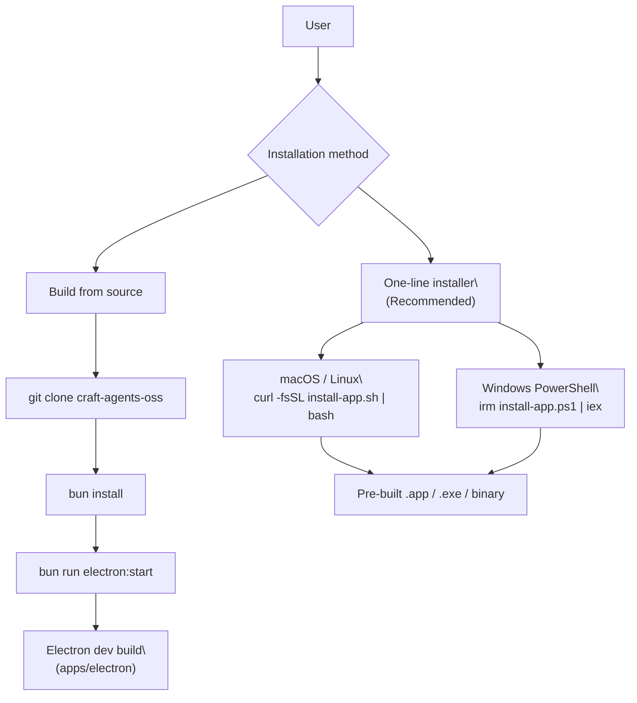
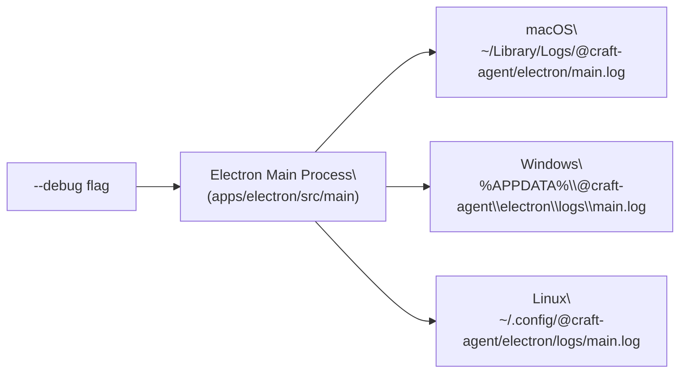

# Installation

<details>
<summary>Relevant source files</summary>

The following files were used as context for generating this wiki page:

- [README.md](README.md)

</details>

This page covers how to install Craft Agents on your machine, the first-launch experience, system requirements, and how to enable debug logging. For configuring the `~/.craft-agent/` directory and its files after installation, see [Environment Configuration](#3.2). For completing the provider authentication wizard that appears on first launch, see [Authentication Setup](#3.3).

---

## System Requirements

| Requirement                | Details                                            |
| -------------------------- | -------------------------------------------------- |
| **OS**                     | macOS, Windows, Linux                              |
| **Architecture**           | arm64 / x64 (macOS), x64 (Windows, Linux)          |
| **Runtime (install)**      | None — pre-built binary                            |
| **Runtime (source build)** | [Bun](https://bun.sh/)                             |
| **Disk**                   | ~500 MB for app + `~/.craft-agent/` data directory |

---

## Installation Methods

There are two supported installation paths: a one-line installer that downloads a pre-built binary, and a build-from-source path for developers.

**Installation paths overview:**



Sources: [README.md:62-83]()

---

### One-Line Install (Recommended)

**macOS and Linux:**

```bash
curl -fsSL https://agents.craft.do/install-app.sh | bash
```

**Windows (PowerShell):**

```powershell
irm https://agents.craft.do/install-app.ps1 | iex
```

These scripts download the latest pre-built binary for your platform and architecture, then place the application in the standard installation directory. No additional runtime dependencies are needed.

Sources: [README.md:63-73]()

---

### Build from Source

```bash
git clone https://github.com/lukilabs/craft-agents-oss.git
cd craft-agents-oss
bun install
bun run electron:start
```

`bun run electron:start` compiles both the main process (via esbuild) and the renderer (via Vite) and then launches the packaged Electron application. For hot-reload during development, use `bun run electron:dev` instead. For a full explanation of the build pipeline, see [Build System](#5.2).

Sources: [README.md:75-83]()

---

## First-Launch Experience

On the first launch, Craft Agents detects that no `~/.craft-agent/config.json` exists and opens the onboarding wizard.

**First-launch sequence mapped to code components:**

```mermaid
sequenceDiagram
  participant OS as "OS / User"
  participant Electron as "Electron Main\
(apps/electron/src/main)"
  participant IPC as "IPC Layer\
(preload contextBridge)"
  participant Renderer as "React Renderer\
(apps/electron/src/renderer)"
  participant Wizard as "OnboardingWizard\
(useOnboarding hook)"
  participant Config as "~/.craft-agent/config.json"

  OS->>Electron: "Launch app"
  Electron->>Config: "Read config.json"
  Config-->>Electron: "Not found / empty"
  Electron->>Renderer: "Load renderer"
  Renderer->>Wizard: "No LLM connection → open wizard"
  Wizard->>Renderer: "CredentialsStep: select provider"
  Renderer->>IPC: "IPC: save LLM connection"
  IPC->>Electron: "Handler: write config.json"
  Electron->>Config: "Write LlmConnection entry"
  Config-->>Renderer: "Config saved"
  Renderer->>Renderer: "Open workspace / session view"
```

Sources: [README.md:101-107]()

The onboarding wizard (`OnboardingWizard`, driven by the `useOnboarding` hook) guides you through:

1. **Selecting an LLM provider** — Anthropic API key, Claude Max/Pro OAuth, Google AI Studio, ChatGPT Plus (Codex OAuth), or GitHub Copilot device code flow.
2. **Entering credentials** — handled by `CredentialsStep`.
3. **Creating a workspace** — the app creates a default workspace under `~/.craft-agent/workspaces/{id}/`.

See [Authentication Setup](#3.3) for full details on each provider flow.

---

## LLM Provider Options at First Launch

| Provider                         | Auth Method                     | Notes                                      |
| -------------------------------- | ------------------------------- | ------------------------------------------ |
| **Anthropic**                    | API key or Claude Max/Pro OAuth | Default; uses Claude Agent SDK             |
| **Google AI Studio**             | API key                         | Gemini models with Google Search grounding |
| **ChatGPT Plus / Pro**           | Codex OAuth                     | Requires active ChatGPT subscription       |
| **GitHub Copilot**               | OAuth device code               | Requires active Copilot subscription       |
| **OpenRouter / Ollama / Custom** | API key + custom endpoint       | Via the Anthropic API key connection path  |

Sources: [README.md:261-291]()

---

## Debug Logging

Debug logs can be enabled by launching the packaged application with the `-- --debug` flag (note the double-dash separator required by Electron's argument parser).

**Platform launch commands:**

| Platform    | Command                                                                           |
| ----------- | --------------------------------------------------------------------------------- |
| **macOS**   | `/Applications/Craft\ Agents.app/Contents/MacOS/Craft\ Agents -- --debug`         |
| **Windows** | `& "$env:LOCALAPPDATA\Programs\@craft-agentelectron\Craft Agents.exe" -- --debug` |
| **Linux**   | `./craft-agents -- --debug`                                                       |

**Log file locations:**



In development (`bun run electron:dev`), verbose logging is enabled automatically without the `--debug` flag.

Sources: [README.md:388-411]()

---

## After Installation

Once installed and launched:

- All application data is stored under `~/.craft-agent/`. See [Environment Configuration](#3.2) for the full directory layout and config file reference.
- The first-launch wizard saves your LLM connection into `~/.craft-agent/config.json` as an `LlmConnection` entry.
- A default workspace is created under `~/.craft-agent/workspaces/{id}/`.
