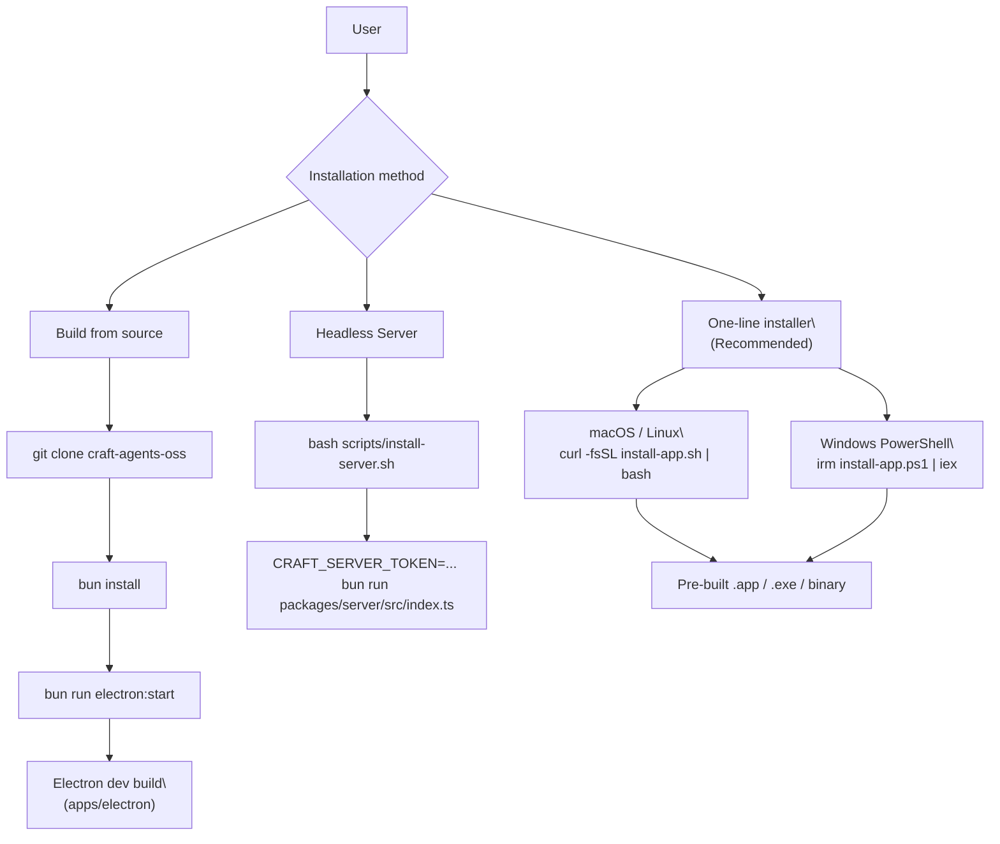

# Installation

<details>
<summary>Relevant source files</summary>

The following files were used as context for generating this wiki page:

- [README.md](README.md)
- [scripts/install-server.sh](scripts/install-server.sh)

</details>


This page covers how to install Craft Agents on your machine, the first-launch experience, system requirements, and the headless server installation. For configuring the `~/.craft-agent/` directory and its files after installation, see [Environment Configuration](#3.2). For completing the provider authentication wizard that appears on first launch, see [Authentication Setup](#3.3).

---

## System Requirements

| Requirement | Details |
|---|---|
| **OS** | macOS, Windows, Linux [README.md:65-70]() |
| **Architecture** | arm64 / x64 (macOS), x64 (Windows, Linux) [README.md:152]() |
| **Runtime (install)** | None — pre-built binary |
| **Runtime (source build)** | [Bun](https://bun.sh/) >= 1.0 [README.md:80](), [scripts/install-server.sh:7-36]() |
| **Disk** | ~500 MB for app + `~/.craft-agent/` data directory |

---

## Installation Methods

There are three supported installation paths: a one-line installer for the desktop app, a build-from-source path for developers, and a server-side installation for headless environments.

**Installation paths overview:**



Sources: [README.md:61-83](), [scripts/install-server.sh:1-12]()

---

### One-Line Install (Recommended)

The recommended way to install the desktop application is via the hosted installation scripts which automate platform detection and deployment.

**macOS and Linux:**

```bash
curl -fsSL https://agents.craft.do/install-app.sh | bash
```

**Windows (PowerShell):**

```powershell
irm https://agents.craft.do/install-app.ps1 | iex
```

Sources: [README.md:63-73]()

---

### Build from Source

For developers who wish to modify the codebase or contribute, the project uses a monorepo structure managed by Bun.

```bash
git clone https://github.com/lukilabs/craft-agents-oss.git
cd craft-agents-oss
bun install
bun run electron:start
```

`bun run electron:start` triggers the build pipeline for the `apps/electron` package, which involves compiling the main process, preload scripts, and the React-based renderer.

Sources: [README.md:75-83]()

---

### Headless Server Installation

Craft Agents can run as a headless server on a remote machine (e.g., a Linux VPS). This allows the desktop app to connect as a thin client to maintain long-running sessions.

The `install-server.sh` script automates the setup:
1. Verifies Bun installation [scripts/install-server.sh:29-33]().
2. Installs dependencies using `bun install` [scripts/install-server.sh:54-56]().
3. Builds subprocess servers via `server:build:subprocess` [scripts/install-server.sh:58-59]().
4. Builds the Web UI via `webui:build` [scripts/install-server.sh:61-62]().
5. Generates a unique `CRAFT_SERVER_TOKEN` for authentication [scripts/install-server.sh:68]().

To run the server after installation:
```bash
CRAFT_SERVER_TOKEN=your_token_here \
CRAFT_WEBUI_DIR=./apps/webui/dist \
CRAFT_BUNDLED_ASSETS_ROOT=./apps/electron \
bun run packages/server/src/index.ts
```

Sources: [README.md:150-163](), [scripts/install-server.sh:1-107]()

---

## First-Launch Experience

On the first launch, Craft Agents detects the absence of a valid configuration and initiates the onboarding flow to establish an LLM connection.

**First-launch sequence mapped to code components:**

```mermaid
sequenceDiagram
  participant OS as "OS / User"
  participant Electron as "Electron Main\
(apps/electron/src/main)"
  participant IPC as "IPC Layer\
(preload contextBridge)"
  participant Renderer as "React Renderer\
(apps/electron/src/renderer)"
  participant Wizard as "OnboardingWizard\
(useOnboarding hook)"
  participant Config as "~/.craft-agent/config.json"

  OS->>Electron: "Launch app"
  Electron->>Config: "Read config.json"
  Config-->>Electron: "Not found / empty"
  Electron->>Renderer: "Load renderer"
  Renderer->>Wizard: "No LLM connection → open wizard"
  Wizard->>Renderer: "CredentialsStep: select provider"
  Renderer->>IPC: "IPC: save LLM connection"
  IPC->>Electron: "Handler: write config.json"
  Electron->>Config: "Write LlmConnection entry"
  Config-->>Renderer: "Config saved"
  Renderer->>Renderer: "Open workspace / session view"
```

Sources: [README.md:101-107]()

The onboarding process involves:
1. **Provider Selection**: Choosing between Anthropic, Google AI Studio, ChatGPT Plus, or GitHub Copilot [README.md:104]().
2. **Credential Entry**: Providing API keys or completing OAuth flows [README.md:88-89]().
3. **Workspace Initialization**: Setting up the initial environment for sessions [README.md:105]().

---

## LLM Provider Options at First Launch

Craft Agents supports multiple high-performance LLM backends. Users can configure multiple connections and set per-workspace defaults.

| Provider | Auth Method | Notes |
|---|---|---|
| **Anthropic** | API key or Claude Max/Pro OAuth | Primary provider; powers the Claude Agent experience [README.md:89-104]() |
| **Google AI Studio** | API key | Access to Gemini models [README.md:104]() |
| **ChatGPT Plus** | Codex OAuth | Integration with OpenAI models [README.md:104]() |
| **GitHub Copilot** | OAuth device code | Uses Copilot's specialized models [README.md:104]() |

Sources: [README.md:88-89](), [README.md:104]()

---

## After Installation

Once the application is running:
- **Data Directory**: All local state, including sessions and workspace configs, is stored in `~/.craft-agent/` [README.md:117]().
- **Default Workspace**: A workspace is automatically generated to house your first sessions [README.md:105]().
- **Instant Configuration**: New skills or sources mentioned with `@` are activated instantly without requiring an app restart [README.md:54-55]().
- **Permission Modes**: The app starts in a default permission mode (typically `ask` / "Ask to Edit") which prompts for approval before the agent performs write operations [README.md:129-135]().