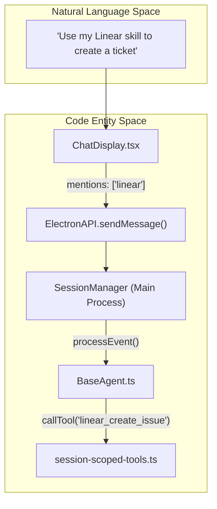
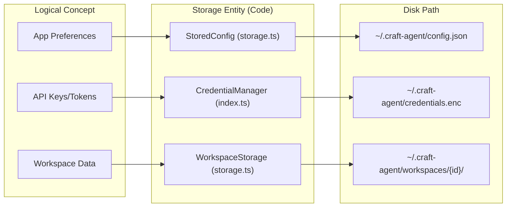

# Glossary

Relevant source files

The following files were used as context for generating this wiki page:

- [apps/electron/src/main/onboarding.ts](apps/electron/src/main/onboarding.ts)
- [apps/electron/src/renderer/components/app-shell/ChatDisplay.tsx](apps/electron/src/renderer/components/app-shell/ChatDisplay.tsx)
- [apps/electron/src/renderer/pages/settings/AppSettingsPage.tsx](apps/electron/src/renderer/pages/settings/AppSettingsPage.tsx)
- [apps/electron/src/shared/types.ts](apps/electron/src/shared/types.ts)
- [apps/webui/package.json](apps/webui/package.json)
- [apps/webui/src/adapter/web-api.ts](apps/webui/src/adapter/web-api.ts)
- [bun.lock](bun.lock)
- [package.json](package.json)
- [packages/shared/package.json](packages/shared/package.json)
- [packages/shared/src/agent/session-scoped-tools.ts](packages/shared/src/agent/session-scoped-tools.ts)
- [packages/shared/src/config/storage.ts](packages/shared/src/config/storage.ts)
- [packages/shared/src/prompts/system.ts](packages/shared/src/prompts/system.ts)
- [packages/ui/src/components/chat/TurnCard.tsx](packages/ui/src/components/chat/TurnCard.tsx)

This glossary defines the technical terms, architectural concepts, and domain-specific jargon used within the Craft Agents codebase. It serves as a reference for onboarding engineers to understand the relationship between abstract concepts and their concrete implementations.

## Core System Concepts

### Workspace
The top-level organizational unit in Craft Agents. A workspace encapsulates a specific set of sessions, sources, skills, and configurations. Each workspace is stored in its own directory under `~/.craft-agent/workspaces/{id}/`.
*   **Implementation**: Defined as the `Workspace` interface in `packages/core/src/types/index.ts`.
*   **Data Flow**: The `SessionManager` in the main process filters sessions based on the `activeWorkspaceId` stored in `StoredConfig`.
*   **Sources**: [packages/shared/src/config/storage.ts:33-41](), [apps/electron/src/shared/types.ts:40-41](), [packages/shared/src/config/storage.ts:57-58]()

### Session
A single conversation thread between a user and an agent. Sessions are persisted as JSONL files where each line represents a message or an event.
*   **Implementation**: Represented by the `Session` interface in the protocol and `ManagedSession` within the `SessionManager`.
*   **Lifecycle**: Managed via `createSession`, `deleteSession`, and `getSessionMessages` IPC handlers.
*   **Sources**: [apps/electron/src/shared/types.ts:177-220](), [packages/shared/src/config/storage.ts:58-59]()

### Source
An external integration that provides tools and data to the agent. Sources can be **MCP Servers** (Model Context Protocol), **REST APIs** (configured via the API tool factory), or **Local Filesystems**.
*   **Implementation**: `LoadedSource` and `FolderSourceConfig` types.
*   **Mechanism**: Sources are activated per session, and their tools are injected into the LLM prompt.
*   **Sources**: [apps/electron/src/shared/types.ts:58-60](), [packages/shared/package.json:31-32]()

### Skill
Specialized instructions or "system prompt fragments" stored as Markdown files within a workspace. Users can reference skills using `@mention` in the chat input to guide the agent's behavior for specific tasks.
*   **Implementation**: `LoadedSkill` and `SkillMetadata`.
*   **Storage**: Located in the `skills/` subdirectory of a workspace.
*   **Sources**: [apps/electron/src/shared/types.ts:62-64](), [packages/shared/package.json:33-33]()

---

## Agent & Execution Jargon

### Permission Mode
A security setting that governs the agent's ability to execute tools, particularly those with side effects (like writing files or making API calls).
*   **Modes**:
    *   `safe`: Read-only access.
    *   `ask`: Requires user approval for write operations.
    *   `allow-all`: Executes all tools without prompting.
*   **Sources**: [apps/electron/src/shared/types.ts:25-28](), [packages/shared/src/config/storage.ts:21-21](), [packages/shared/src/config/storage.ts:119-120]()

### Thinking Level
A configuration that controls the "reasoning" depth of the LLM, often mapping to specific model features like Anthropic's "Thinking" blocks.
*   **Implementation**: `ThinkingLevel` enum with values like `off`, `medium`, `max`.
*   **Sources**: [apps/electron/src/shared/types.ts:31-33](), [packages/shared/src/config/storage.ts:22-23](), [packages/shared/src/config/storage.ts:55-55]()

### Tool Use & Result
The mechanism by which the LLM interacts with the outside world. An agent emits a `tool_use` event, the system executes the corresponding function, and returns a `tool_result`.
*   **Data Flow**:
    1.  Agent sends `tool_use`.
    2.  `SessionManager` identifies the tool (e.g., from an MCP server).
    3.  Main process executes the tool.
    4.  Result is appended to the session and sent back to the agent.
*   **Sources**: [packages/shared/src/agent/session-scoped-tools.ts:32-34](), [packages/shared/src/agent/session-scoped-tools.ts:157-161]()

---

## Technical Entities & Components

### Mermaid Diagram: Natural Language to Code Mapping (Agent Flow)
This diagram shows how user intent in natural language maps to specific classes and interfaces in the codebase.

**Sources**: [apps/electron/src/renderer/components/app-shell/ChatDisplay.tsx:130-131](), [apps/electron/src/shared/types.ts:212-220](), [packages/shared/src/agent/session-scoped-tools.ts:119-125]()

### Mermaid Diagram: System Storage & Config
This diagram maps the logical data concepts to the physical file structure and storage classes.

**Sources**: [packages/shared/src/config/storage.ts:51-85](), [packages/shared/src/config/storage.ts:89-90](), [packages/shared/src/config/paths.ts:18-18]()

---

## Technical Abbreviations

| Abbreviation | Full Name | Definition | Code Pointer |
| :--- | :--- | :--- | :--- |
| **MCP** | Model Context Protocol | A standard for connecting LLMs to data sources and tools. | [packages/shared/package.json:79-79]() |
| **IPC** | Inter-Process Communication | The mechanism Electron uses to communicate between the Main and Renderer processes. | [apps/electron/src/shared/types.ts:168-170]() |
| **JSONL** | JSON Lines | The file format used for session persistence (one JSON object per line). | [packages/shared/src/config/storage.ts:19-19]() |
| **DTO** | Data Transfer Object | Plain objects used to pass data over the IPC/Network boundary. | [apps/electron/src/shared/types.ts:2-4]() |
| **SSRF** | Server-Side Request Forgery | A security vulnerability the system protects against during OAuth metadata discovery. | [packages/shared/src/auth/index.ts:20-20]() |

---

## Infrastructure & Environment

### `~/.craft-agent/`
The root directory for all application data on the user's machine.
*   **`config.json`**: Global application state and LLM connections. [packages/shared/src/config/storage.ts:89-89]()
*   **`config-defaults.json`**: Default settings synced from bundled assets. [packages/shared/src/config/storage.ts:90-90]()
*   **`docs/`**: Synced internal documentation for help popovers. [packages/shared/src/docs/index.ts:14-14]()

### Transport Mode
Defines whether the UI is connecting to a local Electron backend or a remote headless server.
*   **Values**: `local` | `remote`.
*   **Sources**: [apps/electron/src/shared/types.ts:126-126](), [apps/webui/src/adapter/web-api.ts:72-72]()

### Automation (v2)
An event-driven system that triggers agent actions based on hooks like `LabelAdd`, `SessionCreate`, or `Cron` schedules.
*   **Schema**: Defined in `automations.json`.
*   **Sources**: [packages/shared/package.json:60-61](), [packages/shared/src/config/storage.ts:86-86]()

### Session-Scoped Tools
Tools that are instantiated per-session with specific callbacks (e.g., `call_llm`, `spawn_session`, `browser_tool`).
*   **Implementation**: `SessionScopedToolCallbacks` interface in `session-scoped-tools.ts`.
*   **Sources**: [packages/shared/src/agent/session-scoped-tools.ts:67-111](), [packages/shared/src/agent/session-scoped-tools.ts:157-161]()

### Web UI Adapter
A shim layer that allows the renderer codebase to run in a standard browser by mapping Electron IPC calls to WebSocket RPCs.
*   **Implementation**: `createWebApi` in `apps/webui/src/adapter/web-api.ts`.
*   **Sources**: [apps/webui/src/adapter/web-api.ts:63-66](), [apps/webui/src/adapter/web-api.ts:84-154]()