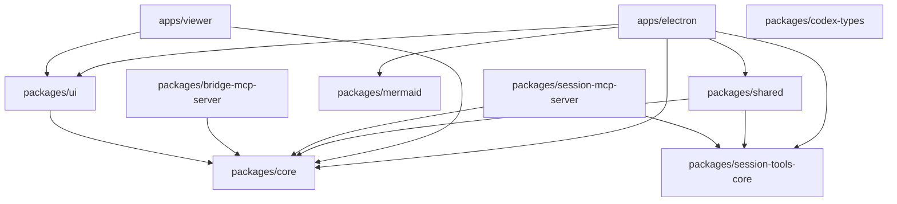
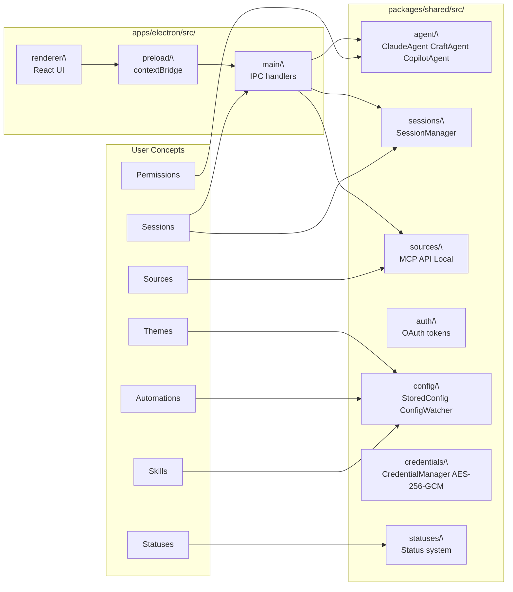

# Overview

<details>
<summary>Relevant source files</summary>

The following files were used as context for generating this wiki page:

- [README.md](README.md)
- [package.json](package.json)

</details>

This page introduces Craft Agents: its purpose, the Agent Native software philosophy it embodies, and a high-level map of the monorepo. For detailed architecture, see [Architecture](#2). For installation and first-run setup, see [Getting Started](#3).

---

## What Craft Agents Is

Craft Agents is an open-source desktop application for running AI agents against real workflows. It was built by the [craft.do](https://craft.do) team as the tool they use internally to work with agents — the project is self-hosted in the sense that Craft Agents is developed using Craft Agents.

The core value proposition:

- **Multi-session inbox** with workflow status, flagging, and archiving
- **Multiple LLM providers** in a single interface (Anthropic, Google AI Studio, GitHub Copilot, OpenAI, and any OpenAI-compatible endpoint)
- **Sources**: connect MCP servers, REST APIs, and local filesystems with no manual config files
- **Skills**: per-workspace instruction files that can be `@mention`ed mid-conversation
- **Permission modes**: three-level gate (`safe` / `ask` / `allow-all`) with per-command and per-domain whitelisting
- **Automations**: event-driven agent sessions triggered by labels, status changes, cron schedules, and tool use events
- **Session sharing**: export conversation transcripts to a hosted web viewer

The project is licensed under Apache 2.0.

Sources: [README.md:14-23]()

---

## Agent Native Software Philosophy

Craft Agents is described as being built with _Agent Native software_ principles. In practice this means:

| Principle                      | Implementation                                                                                                                                   |
| ------------------------------ | ------------------------------------------------------------------------------------------------------------------------------------------------ |
| Configuration via conversation | Connecting Linear, Slack, or a custom API is done by describing the intent to the agent — it reads docs, sets up credentials, and writes config. |
| No restart required            | Sources, skills, and settings take effect immediately; `@mention` new resources mid-session.                                                     |
| Self-modifying workflow        | The app itself is developed using Craft Agents — prompts replace code-editor interactions.                                                       |
| Transparent tool use           | Every tool call, permission prompt, and file diff is surfaced in the UI, not hidden.                                                             |

Sources: [README.md:14-58]()

---

## Supported LLM Providers

Craft Agents routes agent work through two internal backends — `ClaudeAgent` (Claude Agent SDK) and `CopilotAgent`/`CraftAgent` (Pi SDK). See [Agent System](#2.3) for the routing logic.

| Provider                                | Auth Method                     | Backend                          |
| --------------------------------------- | ------------------------------- | -------------------------------- |
| Anthropic Claude                        | API key or Claude Max/Pro OAuth | `ClaudeAgent` (Claude Agent SDK) |
| Google AI Studio                        | API key                         | Pi SDK                           |
| ChatGPT Plus / Pro                      | Codex OAuth                     | Pi SDK                           |
| GitHub Copilot                          | OAuth device code               | Pi SDK                           |
| OpenRouter / Vercel AI Gateway / Ollama | Custom base URL + API key       | `ClaudeAgent` (custom endpoint)  |

Sources: [README.md:262-290]()

---

## Monorepo Structure

The repository is a Bun workspace monorepo. The root `package.json` declares workspaces at `packages/*` and `apps/*`.

**Top-level layout:**

```
craft-agent/
├── apps/
│   ├── electron/          # Desktop application (Electron + React)
│   └── viewer/            # Web viewer for shared session transcripts
├── packages/
│   ├── core/              # Shared TypeScript types
│   ├── shared/            # Business logic (agents, auth, config, sessions, sources)
│   ├── ui/                # Shared React component library (shadcn/ui + Tailwind)
│   ├── mermaid/           # Mermaid diagram rendering integration
│   ├── codex-types/       # Type definitions for Codex integration
│   ├── session-tools-core/# Session-scoped tool utilities
│   ├── bridge-mcp-server/ # MCP server subprocess bridge
│   └── session-mcp-server/# Session-scoped MCP tools over stdio
└── scripts/               # Build, release, and dev scripts
```

Sources: [README.md:153-171](), [package.json:7-11]()

The following diagram maps the workspace packages to their roles and dependencies:

**Package dependency graph**



Sources: [README.md:153-171](), [package.json:1-11]()

---

## Key Subsystems at a Glance

The diagram below maps high-level user-visible concepts to the code packages and directories that implement them:

**Concept-to-code map**



Sources: [README.md:153-171]()

---

## Configuration on Disk

All runtime state lives under `~/.craft-agent/`. See [Storage & Configuration](#2.8) for the full schema reference.

```
~/.craft-agent/
├── config.json              # StoredConfig: workspaces, LLM connections
├── credentials.enc          # AES-256-GCM encrypted credentials
├── preferences.json         # UI preferences
├── theme.json               # App-level theme
└── workspaces/{id}/
    ├── config.json          # Workspace settings
    ├── theme.json           # Theme override
    ├── automations.json     # Event-driven automations (version 2)
    ├── sessions/            # JSONL session transcripts
    ├── sources/             # Source configurations
    ├── skills/              # Markdown skill files
    └── statuses/            # Status definitions
```

Sources: [README.md:292-311]()

---

## Tech Stack Summary

| Layer               | Technology                                 | Used In                                 |
| ------------------- | ------------------------------------------ | --------------------------------------- |
| Runtime             | [Bun](https://bun.sh/)                     | All packages                            |
| Desktop shell       | Electron                                   | `apps/electron`                         |
| UI framework        | React 18 + Vite                            | `apps/electron/renderer`, `apps/viewer` |
| UI components       | shadcn/ui + Tailwind CSS v4                | `packages/ui`                           |
| Main process build  | esbuild                                    | `scripts/electron-build-main.ts`        |
| AI (Claude backend) | `@anthropic-ai/claude-agent-sdk`           | `packages/shared/src/agent/`            |
| AI (Pi backend)     | `@mariozechner/pi-coding-agent`            | `packages/shared/src/agent/`            |
| MCP protocol        | `@modelcontextprotocol/sdk`                | `packages/shared/src/sources/`          |
| Credential storage  | AES-256-GCM (Node `crypto`)                | `packages/shared/src/credentials/`      |
| Diagrams            | `beautiful-mermaid` via `packages/mermaid` | Renderer UI                             |

Sources: [README.md:376-386](), [package.json:56-143]()

---

## Where to Go Next

| Topic                                          | Wiki Page                                 |
| ---------------------------------------------- | ----------------------------------------- |
| Full system architecture and process model     | [Architecture](#2)                        |
| Monorepo package layout and inter-dependencies | [Package Structure](#2.1)                 |
| Electron main/preload/renderer processes       | [Electron Application Architecture](#2.2) |
| Agent backends and LLM routing                 | [Agent System](#2.3)                      |
| MCP servers, REST APIs, OAuth                  | [External Service Integration](#2.4)      |
| Installation                                   | [Installation](#3.1)                      |
| Workspaces, sessions, sources, skills          | [Core Concepts](#4)                       |
| Automations reference                          | [Hooks & Automation](#4.9)                |
| Developer setup and scripts                    | [Development Setup](#5.1)                 |
