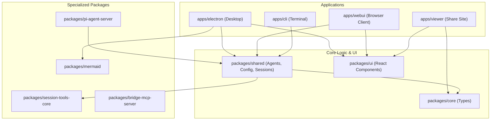
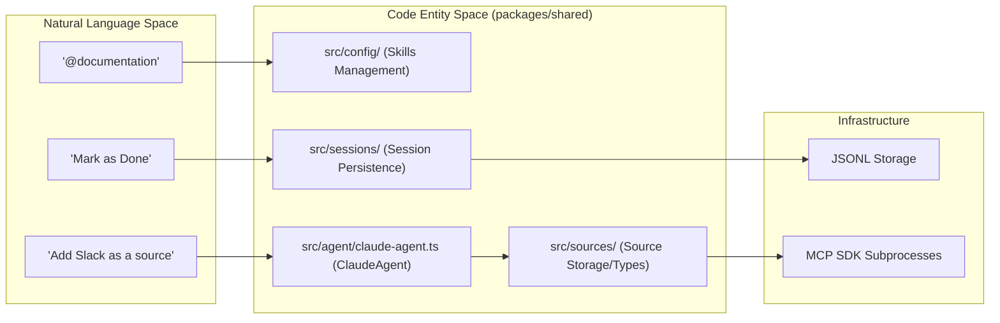

# Overview

Relevant source files

The following files were used as context for generating this wiki page:

- [README.md](README.md)
- [package.json](package.json)
- [packages/shared/CLAUDE.md](packages/shared/CLAUDE.md)

This page introduces Craft Agents: its purpose, the Agent Native software philosophy it embodies, and a high-level map of the monorepo. For detailed architecture, see [Architecture](). For installation and first-run setup, see [Getting Started]().

---

## What Craft Agents Is

Craft Agents is an open-source desktop application for running AI agents against real-world workflows. It was built by the [craft.do](https://craft.do) team as a tool for intuitive multitasking, connecting to any API or service, and sharing sessions in a document-centric workflow. The project is "self-hosted" in the sense that the developers use Craft Agents to build Craft Agents. [README.md:14-23]()

### Core Value Proposition

*   **Multi-session Inbox**: A desktop interface with session management, status workflows, and flagging. [README.md:86-86]()
*   **Multiple LLM Providers**: Support for Anthropic (API or Claude Max), Google AI Studio, ChatGPT Plus (Codex), GitHub Copilot, and OpenAI. [README.md:88-89]()
*   **Sources**: Deep integration with Model Context Protocol (MCP) servers, REST APIs (Gmail, Slack, etc.), and local filesystems. [README.md:91-91]()
*   **Skills**: Specialized agent instructions stored per-workspace that can be `@mention`ed in the chat. [README.md:97-97]()
*   **Permission Modes**: A three-level security system (`safe`, `ask`, `allow-all`) to control agent actions. [README.md:92-92]()
*   **Automations**: Event-driven agent sessions triggered by labels, cron schedules, or tool use. [README.md:99-99]()

Sources: [README.md:14-23](), [README.md:84-99]()

---

## Agent Native Software Philosophy

Craft Agents is built on *Agent Native* principles, where the software is designed from the ground up to be navigated and configured by AI agents rather than just humans. [README.md:19-19]()

| Principle | Implementation in Code |
| :--- | :--- |
| **Natural Language Config** | Users tell the agent to "add Linear as a source." The agent finds APIs, reads docs, and configures the `Source` object. [README.md:29-32]() |
| **No-Restart Updates** | Changes to skills, sources, or configurations take effect immediately without app restarts. [README.md:54-55]() |
| **Contextual Awareness** | Agents can reference specific "Skills" (markdown files) via `@` mentions to gain specialized domain knowledge. [README.md:54-56]() |
| **Transparent Agency** | Every tool call and file diff is surfaced to the user via `TurnCard` and `Multi-File Diff` views. [README.md:87-96]() |

Sources: [README.md:14-58](), [README.md:84-100]()

---

## Supported LLM Providers

The system routes requests through specialized agent implementations. The primary routing logic differentiates between the Claude Agent SDK and the Pi SDK (used for Codex/Copilot/Gemini). [README.md:17-17]()

| Provider | Backend Implementation | Auth Mechanism |
| :--- | :--- | :--- |
| **Anthropic Claude** | `ClaudeAgent` | API Key or Claude Max OAuth |
| **Google AI Studio** | `CraftAgent` (via Pi SDK) | API Key |
| **ChatGPT Plus** | `CopilotAgent` (via Pi SDK) | Codex OAuth |
| **GitHub Copilot** | `CopilotAgent` (via Pi SDK) | Device Code OAuth |
| **OpenAI / Custom** | `ClaudeAgent` | API Key + Custom Base URL |

Sources: [README.md:104-104](), [packages/shared/CLAUDE.md:29-31]()

---

## Monorepo Structure

The repository is a Bun workspace monorepo. The root `package.json` manages dependencies and orchestrates the build pipeline across `apps/` and `packages/`. [package.json:1-21]()

### Package Dependency Graph

This diagram illustrates how the core logic in `packages/shared` flows into the primary application targets.

Sources: [package.json:17-21](), [package.json:22-92](), [package.json:82-82]()

---

## System Architecture: Natural Language to Code

The following diagram bridges user-facing concepts to the specific code entities that handle them within the `packages/shared` workspace.

Sources: [README.md:29-58](), [packages/shared/CLAUDE.md:9-15](), [package.json:17-21]()

---

## Configuration & Storage

All application data is persisted in a standardized directory structure, typically located at `~/.craft-agent/`. [README.md:152-152]()

| Path | Description | Code Reference |
| :--- | :--- | :--- |
| `config.json` | Global `StoredConfig` (LLM connections, workspaces) | `packages/shared/src/config/` [packages/shared/CLAUDE.md:13-13]() |
| `credentials.enc` | AES-256-GCM encrypted API keys and OAuth tokens | `packages/shared/src/credentials/` [packages/shared/CLAUDE.md:14-14]() |
| `workspaces/{id}/` | Isolated workspace data (sessions, skills, sources) | `packages/shared/src/workspaces/` |
| `sessions/*.jsonl` | Append-only session transcripts | `packages/shared/src/sessions/` [packages/shared/CLAUDE.md:12-12]() |

Sources: [README.md:117-128](), [package.json:38-38](), [packages/shared/CLAUDE.md:9-15]()

---

## Tech Stack Summary

The project utilizes a modern TypeScript stack optimized for high-performance agentic workflows.

*   **Runtime**: [Bun](https://bun.sh) for package management and script execution. [package.json:23-27]()
*   **Desktop**: [Electron](https://www.electronjs.org/) with a three-process architecture (Main, Preload, Renderer). [package.json:50-57]()
*   **Frontend**: [React 18](https://react.dev/), [Vite](https://vitejs.dev/), and [Tailwind CSS](https://tailwindcss.com/). [package.json:73-80]()
*   **Agent Logic**: Anthropic Claude Agent SDK and Pi SDK. [README.md:17-17]()
*   **Bundling**: [esbuild](https://esbuild.github.io/) for the Electron main process and [Vite](https://vitejs.dev/) for the renderer. [package.json:12-12]()

Sources: [package.json:1-16](), [README.md:153-171]()

---

## Where to Go Next

*   **[Architecture]()**: Deep dive into the Electron process model and IPC layer.
*   **[Agent System]()**: Implementation details of `ClaudeAgent` and tool-use pipelines.
*   **[External Service Integration]()**: How MCP servers and REST APIs are dynamically instantiated.
*   **[Development Guide]()**: Setting up your environment and running the build pipeline.