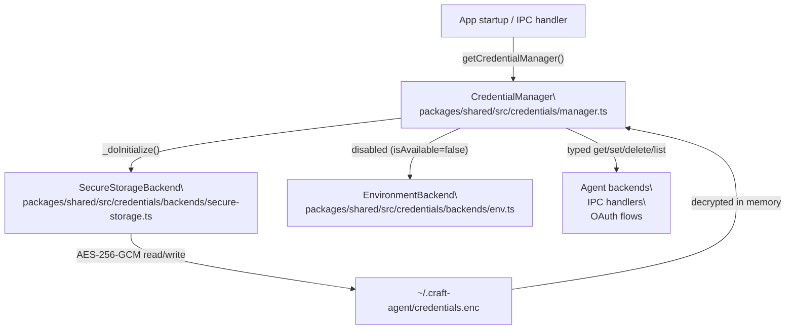
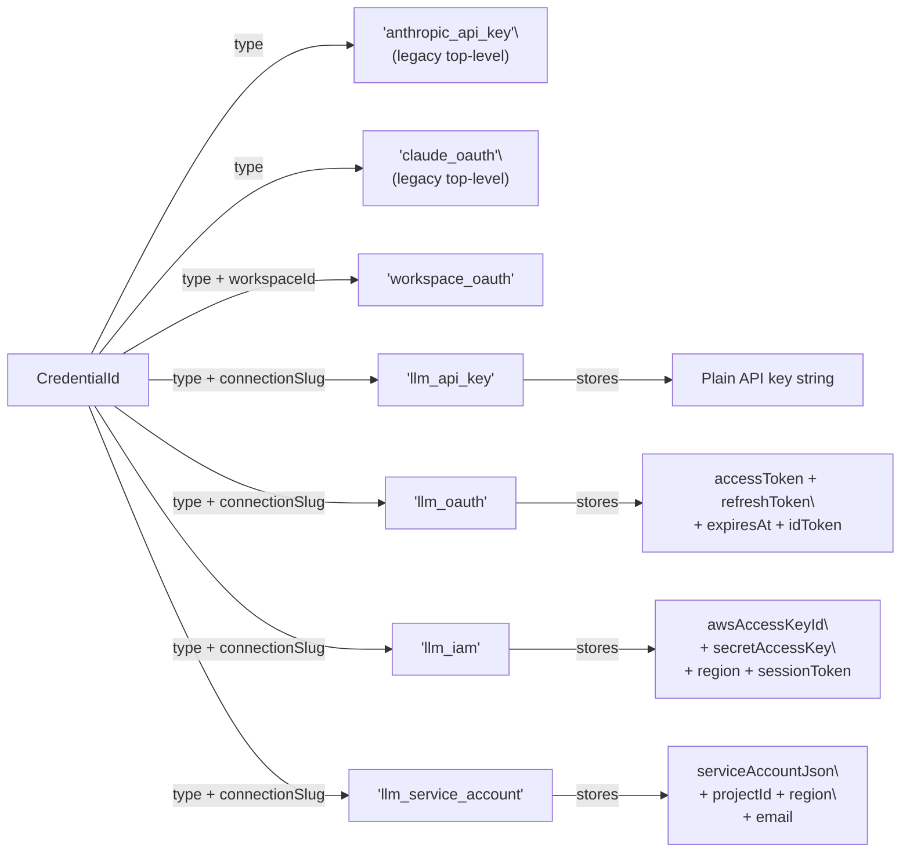
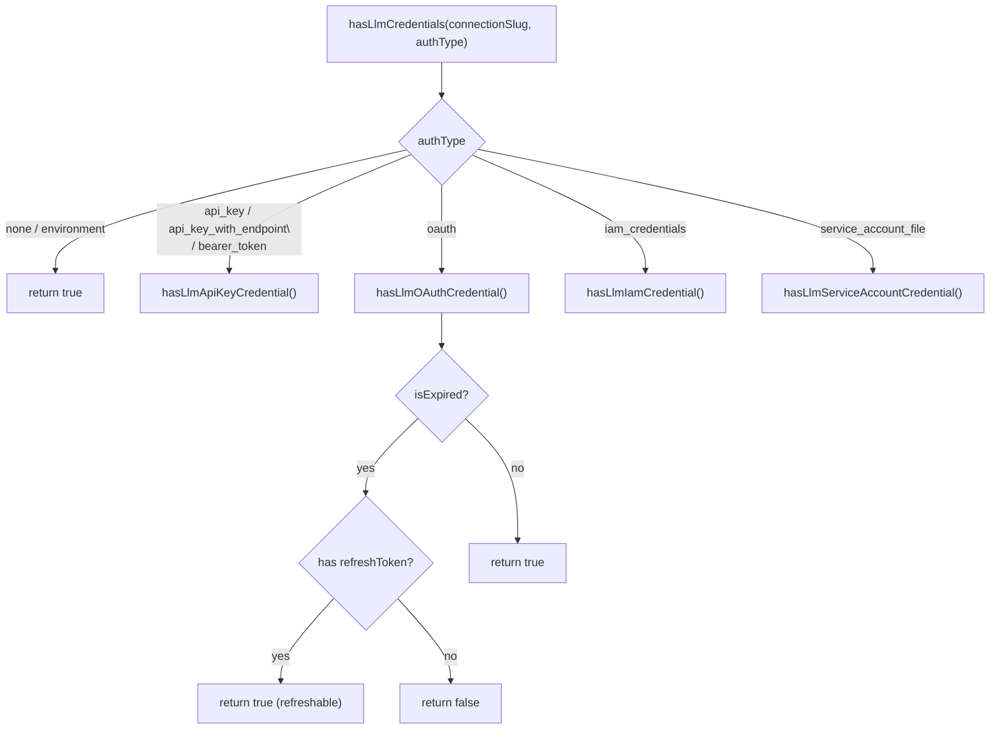

# Credential Storage & Encryption

<details>
<summary>Relevant source files</summary>

The following files were used as context for generating this wiki page:

- [packages/shared/src/agent/diagnostics.ts](packages/shared/src/agent/diagnostics.ts)
- [packages/shared/src/auth/oauth.ts](packages/shared/src/auth/oauth.ts)
- [packages/shared/src/config/storage.ts](packages/shared/src/config/storage.ts)
- [packages/shared/src/credentials/backends/env.ts](packages/shared/src/credentials/backends/env.ts)
- [packages/shared/src/credentials/manager.ts](packages/shared/src/credentials/manager.ts)
- [packages/shared/src/sources/types.ts](packages/shared/src/sources/types.ts)
- [packages/shared/src/utils/summarize.ts](packages/shared/src/utils/summarize.ts)

</details>

This page covers how Craft Agents stores and protects secrets: the on-disk encrypted file format, the `CredentialManager` API and its backend abstraction, credential type taxonomy, expiry logic, and how build-time OAuth client secrets are injected. For an overview of how OAuth flows are initiated during onboarding, see [Authentication Setup](#3.3). For the separation between credential storage and general configuration files (`config.json`, workspace configs), see [Storage & Configuration](#2.8).

---

## Overview

Credentials are stored separately from configuration. `config.json` holds non-sensitive settings (workspace IDs, connection slugs, UI preferences). Secrets — API keys, OAuth tokens, cloud IAM credentials — are stored exclusively in a single encrypted binary file: `~/.craft-agent/credentials.enc`.

The encryption algorithm is **AES-256-GCM**. This provides both confidentiality and authenticated integrity. The encrypted file cannot be read or tampered with without the correct key, which is derived from machine-specific material by the `SecureStorageBackend`.

The comment in `storage.ts` is explicit:

[packages/shared/src/config/storage.ts:45-46]()

> `// Config stored in JSON file (credentials stored in encrypted file, not here)`

---

## Architecture

**Credential Storage Architecture**



Sources: [packages/shared/src/credentials/manager.ts:1-76](), [packages/shared/src/credentials/backends/env.ts:1-35](), [packages/shared/src/config/storage.ts:391-408]()

---

## Backend Abstraction

`CredentialManager` delegates all storage operations to one or more `CredentialBackend` implementations. Each backend implements a common interface (`CredentialBackend`) and declares a `priority` and `isAvailable()` check.

On initialization ([packages/shared/src/credentials/manager.ts:50-76]()):

1. Each potential backend calls `isAvailable()`.
2. Available backends are sorted by `priority` (highest first).
3. The highest-priority available backend becomes the **write backend**.
4. All available backends are queried during reads (first match wins).

Currently only one backend is operational:

| Backend               | Class                  | Priority | Status                                         |
| --------------------- | ---------------------- | -------- | ---------------------------------------------- |
| Encrypted file        | `SecureStorageBackend` | 100      | **Active**                                     |
| Environment variables | `EnvironmentBackend`   | 110      | **Disabled** (`isAvailable()` returns `false`) |

`EnvironmentBackend` was disabled to force explicit credential entry rather than silently picking up ambient environment variables.

Sources: [packages/shared/src/credentials/manager.ts:50-76](), [packages/shared/src/credentials/backends/env.ts:14-18]()

---

## Credential Types

Every credential is addressed by a `CredentialId`, which is a typed object. The `type` field selects the credential category; additional fields scope the credential to a connection or workspace.

**Credential ID Taxonomy**



Sources: [packages/shared/src/credentials/manager.ts:174-444]()

The convenience methods on `CredentialManager` map directly to these IDs:

| Convenience method                                        | `CredentialId.type`   | Scoping field    |
| --------------------------------------------------------- | --------------------- | ---------------- |
| `getApiKey` / `setApiKey`                                 | `anthropic_api_key`   | —                |
| `getClaudeOAuthCredentials` / `setClaudeOAuthCredentials` | `claude_oauth`        | —                |
| `getWorkspaceOAuth` / `setWorkspaceOAuth`                 | `workspace_oauth`     | `workspaceId`    |
| `getLlmApiKey` / `setLlmApiKey`                           | `llm_api_key`         | `connectionSlug` |
| `getLlmOAuth` / `setLlmOAuth`                             | `llm_oauth`           | `connectionSlug` |
| `getLlmIamCredentials` / `setLlmIamCredentials`           | `llm_iam`             | `connectionSlug` |
| `getLlmServiceAccount` / `setLlmServiceAccount`           | `llm_service_account` | `connectionSlug` |

Sources: [packages/shared/src/credentials/manager.ts:174-443]()

---

## StoredCredential Structure

Once decrypted, each entry is a `StoredCredential` record. Fields are optional because different credential types use different subsets:

| Field                 | Type      | Used by                                                                  |
| --------------------- | --------- | ------------------------------------------------------------------------ |
| `value`               | `string`  | All types (primary secret: API key, access token, secret key JSON, etc.) |
| `refreshToken`        | `string?` | OAuth credentials                                                        |
| `expiresAt`           | `number?` | OAuth credentials (Unix ms)                                              |
| `source`              | `string?` | `claude_oauth` — `'native'` or `'cli'`                                   |
| `tokenType`           | `string?` | `workspace_oauth`                                                        |
| `clientId`            | `string?` | `workspace_oauth`                                                        |
| `idToken`             | `string?` | `llm_oauth` (OpenAI/Codex OIDC id_token)                                 |
| `awsAccessKeyId`      | `string?` | `llm_iam`                                                                |
| `awsRegion`           | `string?` | `llm_iam`                                                                |
| `awsSessionToken`     | `string?` | `llm_iam`                                                                |
| `gcpProjectId`        | `string?` | `llm_service_account`                                                    |
| `gcpRegion`           | `string?` | `llm_service_account`                                                    |
| `serviceAccountEmail` | `string?` | `llm_service_account`                                                    |

Sources: [packages/shared/src/credentials/manager.ts:196-443]()

---

## Expiry and Refresh Logic

`CredentialManager.isExpired()` ([packages/shared/src/credentials/manager.ts:549-565]()) determines whether a stored credential needs refresh before use:

```
if expiresAt is set:
    expired = now > expiresAt - 5 minutes   ← 5-minute buffer
elif refreshToken is set:
    expired = true                           ← force refresh attempt (safe default)
else:
    expired = false                          ← API keys never expire
```

The 5-minute buffer ensures the agent does not use a token that expires mid-request. The "treat OAuth without `expiresAt` as expired" rule is a defensive default: some providers omit `expires_in` from token responses, but a refresh token is available, so attempting a refresh is safe and prevents silent failures.

`hasLlmCredentials()` ([packages/shared/src/credentials/manager.ts:458-492]()) routes by `LlmAuthType` and returns `true` for `'none'` and `'environment'` (no stored credential needed), `false` if a required credential is absent or both expired and non-refreshable:

**Credential Validity Check Flow**



Sources: [packages/shared/src/credentials/manager.ts:458-565]()

---

## Lifecycle: Write, Read, and Delete

**Normal write path** — credential is encrypted and appended/replaced in `credentials.enc`:

```
caller → CredentialManager.set(id, credential)
       → writeBackend.set(id, credential)         // SecureStorageBackend
       → AES-256-GCM encrypt
       → write ~/.craft-agent/credentials.enc
```

**Normal read path** — all backends are queried in priority order:

```
caller → CredentialManager.get(id)
       → for each backend:
           backend.get(id) → decrypt → match by id → return
       → first non-null wins
```

**Workspace deletion** — removes all source credentials scoped to the workspace:

[packages/shared/src/config/storage.ts:609-640]()

```ts
// Inside removeWorkspace():
const manager = getCredentialManager()
await manager.deleteWorkspaceCredentials(workspaceId)
```

`deleteWorkspaceCredentials()` calls `list({ workspaceId })` to enumerate all matching `CredentialId`s and then `delete()` each one.

**Full logout** — `clearAllConfig()` deletes both `config.json` and `credentials.enc`:

[packages/shared/src/config/storage.ts:391-408]()

Sources: [packages/shared/src/credentials/manager.ts:87-168](), [packages/shared/src/config/storage.ts:391-408](), [packages/shared/src/config/storage.ts:609-640]()

---

## Health Check

`CredentialManager.checkHealth()` ([packages/shared/src/credentials/manager.ts:582-652]()) is called on app startup to surface problems before a session is run. It performs two checks:

1. **Decryption test** — calls `list({})`, which forces the backend to read and decrypt `credentials.enc`. If this fails, it classifies the error:

| Error pattern                             | `CredentialHealthIssue.type` | User message                                |
| ----------------------------------------- | ---------------------------- | ------------------------------------------- |
| `decrypt`, `cipher`, `authentication tag` | `decryption_failed`          | "Credentials from another machine detected" |
| `json`, `parse`, `unexpected`             | `file_corrupted`             | "Credential file is corrupted"              |
| Other                                     | `file_corrupted`             | "Failed to read credentials"                |

2. **Default connection check** — resolves the default `LlmConnection` slug from config and checks whether credentials exist for it via `hasLlmCredentials()`. Reports `no_default_credentials` if absent.

The `decryption_failed` case typically occurs when a user copies their config directory between machines: the AES key is machine-specific, so the encrypted file cannot be decrypted on the new machine.

Sources: [packages/shared/src/credentials/manager.ts:582-652]()

---

## Migration: Legacy to Connection-Scoped Credentials

Earlier versions stored a single Anthropic API key or OAuth token at the top level (no connection scope). These were replaced by connection-scoped credentials keyed by `connectionSlug`.

The migration is reflected in removed helper functions — the comments in `storage.ts` document what each was replaced with:

[packages/shared/src/config/storage.ts:178-203]()

| Removed function                  | Replacement                                      |
| --------------------------------- | ------------------------------------------------ |
| `getAnthropicApiKey()`            | `credentialManager.getLlmApiKey(connectionSlug)` |
| `getClaudeOAuthToken()`           | `credentialManager.getLlmOAuth(connectionSlug)`  |
| `updateApiKey()`                  | `setupLlmConnection` IPC handler                 |
| `getAuthType()` / `setAuthType()` | Derived from `getLlmConnection()`                |

The legacy `anthropic_api_key` and `claude_oauth` credential types remain supported in `CredentialManager` for backward compatibility with any credentials stored before migration, but new credentials are always written under `llm_api_key` or `llm_oauth` with a `connectionSlug`.

Sources: [packages/shared/src/config/storage.ts:178-203](), [packages/shared/src/credentials/manager.ts:174-230]()

---

## Build-Time OAuth Secret Injection

Certain OAuth providers (Claude Max/Pro, GitHub Copilot, ChatGPT Plus) require client credentials that must be embedded in the application binary at build time. These are **not** stored in `credentials.enc` — they are compile-time constants injected into the renderer or main process bundle via environment variables during `electron:build`.

The build pipeline reads these secrets from a `.env` file (populated by `sync-secrets`) and injects them as inlined string literals in the built bundles. This means the secrets travel with the packaged application rather than being stored on-disk at runtime. For the full build-time injection pipeline, see [Build System](#5.2) and [Authentication Setup](#3.3).

---

## Singleton Access

`CredentialManager` is accessed via a module-level singleton:

[packages/shared/src/credentials/manager.ts:655-663]()

```ts
let manager: CredentialManager | null = null

export function getCredentialManager(): CredentialManager {
  if (!manager) {
    manager = new CredentialManager()
  }
  return manager
}
```

All initialization is deferred — `_doInitialize()` runs on the first actual credential operation via `ensureInitialized()`. Concurrent calls during initialization are serialized via a shared `initPromise`.

Sources: [packages/shared/src/credentials/manager.ts:655-663](), [packages/shared/src/credentials/manager.ts:25-76]()
