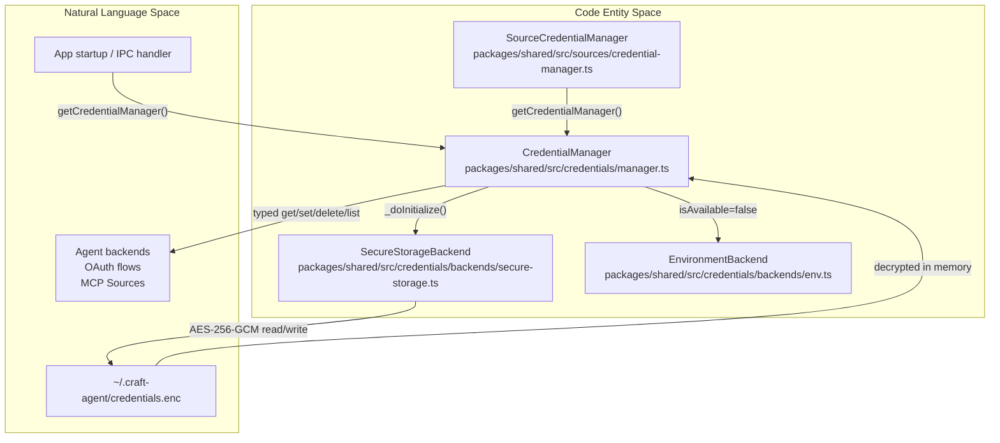
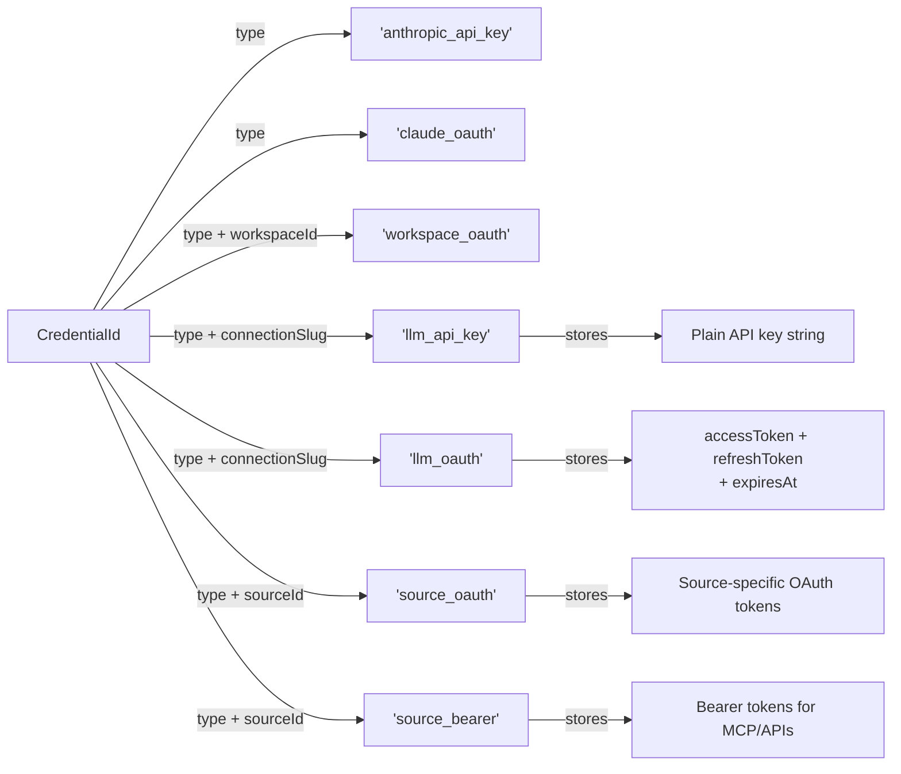
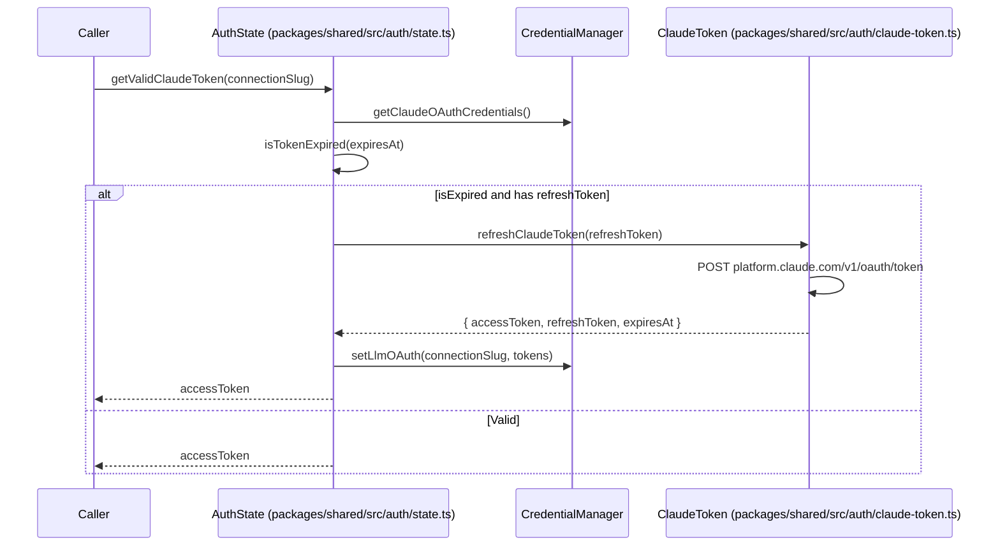

# Credential Storage & Encryption

<details>
<summary>Relevant source files</summary>

The following files were used as context for generating this wiki page:

- [apps/electron/src/main/onboarding.ts](apps/electron/src/main/onboarding.ts)
- [apps/electron/src/renderer/pages/settings/AppSettingsPage.tsx](apps/electron/src/renderer/pages/settings/AppSettingsPage.tsx)
- [apps/electron/src/shared/types.ts](apps/electron/src/shared/types.ts)
- [bun.lock](bun.lock)
- [packages/shared/src/auth/claude-oauth-config.ts](packages/shared/src/auth/claude-oauth-config.ts)
- [packages/shared/src/auth/claude-oauth.ts](packages/shared/src/auth/claude-oauth.ts)
- [packages/shared/src/auth/claude-token.ts](packages/shared/src/auth/claude-token.ts)
- [packages/shared/src/config/storage.ts](packages/shared/src/config/storage.ts)
- [packages/shared/src/sources/credential-manager.ts](packages/shared/src/sources/credential-manager.ts)

</details>


This page covers how Craft Agents stores and protects secrets: the on-disk encrypted file format, the `CredentialManager` API and its backend abstraction, credential type taxonomy, expiry logic, and how build-time OAuth client secrets are injected. For an overview of how OAuth flows are initiated during onboarding, see [Authentication Setup](#3.3). For the separation between credential storage and general configuration files (`config.json`, workspace configs), see [Storage & Configuration](#2.8).

---

## Overview

Credentials are stored separately from configuration. `config.json` holds non-sensitive settings (workspace IDs, connection slugs, UI preferences). Secrets — API keys, OAuth tokens, cloud IAM credentials — are stored exclusively in a single encrypted binary file: `~/.craft-agent/credentials.enc`.

The encryption algorithm is **AES-256-GCM**. This provides both confidentiality and authenticated integrity. The encrypted file cannot be read or tampered with without the correct key, which is derived from machine-specific material by the `SecureStorageBackend`.

The logic in `storage.ts` is explicit about this separation:
[packages/shared/src/config/storage.ts:50-51]()
> `// Config stored in JSON file (credentials stored in encrypted file, not here)`

---

## Architecture

The `CredentialManager` serves as the central orchestrator for secret management, utilized by both the Electron main process for provider authentication and the `SourceCredentialManager` for external service integrations (MCP, Google, Slack).

**Credential Storage Architecture**



Sources: [packages/shared/src/credentials/manager.ts:1-76](), [packages/shared/src/sources/credential-manager.ts:3-26](), [packages/shared/src/config/storage.ts:3-3]()

---

## Backend Abstraction

`CredentialManager` delegates all storage operations to one or more `CredentialBackend` implementations. Each backend implements a common interface (`CredentialBackend`) and declares a `priority` and `isAvailable()` check.

On initialization ([packages/shared/src/credentials/manager.ts:50-76]()):

1. Each potential backend calls `isAvailable()`.
2. Available backends are sorted by `priority` (highest first).
3. The highest-priority available backend becomes the **write backend**.
4. All available backends are queried during reads (first match wins).

Currently only one backend is operational:

| Backend | Class | Priority | Status |
|---|---|---|---|
| Encrypted file | `SecureStorageBackend` | 100 | **Active** |
| Environment variables | `EnvironmentBackend` | 110 | **Disabled** (`isAvailable()` returns `false`) |

`EnvironmentBackend` was disabled to force explicit credential entry rather than silently picking up ambient environment variables.

Sources: [packages/shared/src/credentials/manager.ts:50-76]()

---

## Credential Types

Every credential is addressed by a `CredentialId`, which is a typed object. The `type` field selects the credential category; additional fields scope the credential to a connection or workspace.

**Credential ID Taxonomy**



Sources: [packages/shared/src/credentials/manager.ts:174-444](), [packages/shared/src/sources/credential-manager.ts:164-187]()

The `SourceCredentialManager` provides a high-level abstraction for sources, handling fallback logic between OAuth and Bearer tokens for MCP sources:
[packages/shared/src/sources/credential-manager.ts:164-187]()

---

## StoredCredential Structure

Once decrypted, each entry is a `StoredCredential` record. Fields are optional because different credential types use different subsets:

| Field | Type | Used by |
|---|---|---|
| `value` | `string` | All types (primary secret: API key, access token, etc.) |
| `refreshToken` | `string?` | OAuth credentials (Claude, Google, Slack, MS) |
| `expiresAt` | `number?` | OAuth credentials (Unix ms) |
| `source` | `string?` | `claude_oauth` — `'native'` or `'cli'` |
| `tokenType` | `string?` | `workspace_oauth` |
| `clientId` | `string?` | `workspace_oauth` |
| `idToken` | `string?` | `llm_oauth` (OpenAI/Codex OIDC id_token) |
| `awsAccessKeyId` | `string?` | `llm_iam` |
| `awsRegion` | `string?` | `llm_iam` |
| `gcpProjectId` | `string?` | `llm_service_account` |

Sources: [packages/shared/src/credentials/manager.ts:196-443](), [packages/shared/src/auth/claude-oauth.ts:23-28]()

---

## Expiry and Refresh Logic

`CredentialManager.isExpired()` determines whether a stored credential needs refresh before use. A 5-minute buffer is applied to ensure tokens don't expire mid-request.

### OAuth Token Refresh Flow
The system implements provider-specific refresh logic for Claude, Google, Slack, and Microsoft. For Claude, the `refreshClaudeToken` function is used.

**Claude OAuth Refresh Flow**


Sources: [packages/shared/src/auth/claude-token.ts:16-73](), [packages/shared/src/auth/claude-token.ts:78-86](), [packages/shared/src/sources/credential-manager.ts:206-220]()

---

## Health Check

`CredentialManager.checkHealth()` is called on app startup to surface problems. It performs two checks:

1. **Decryption test** — calls `list({})`, which forces the backend to read and decrypt `credentials.enc`. If this fails, it classifies the error:

| Error pattern | `CredentialHealthIssue.type` | User message |
|---|---|---|
| `decrypt`, `cipher`, `authentication tag` | `decryption_failed` | "Credentials from another machine detected" |
| `json`, `parse`, `unexpected` | `file_corrupted` | "Credential file is corrupted" |

2. **Default connection check** — resolves the default `LlmConnection` slug and checks credentials via `hasLlmCredentials()`. Reports `no_default_credentials` if absent.

Sources: [packages/shared/src/credentials/manager.ts:582-652]()

---

## Migration: Connection-Scoped Credentials

Legacy versions stored a single Anthropic API key or OAuth token at the top level. The current system migrates these to connection-scoped storage keyed by `connectionSlug`.

When a Claude OAuth code is exchanged in `onboarding.ts`, it is saved to both the new LLM connection system and the legacy key for backward compatibility:
[apps/electron/src/main/onboarding.ts:128-142]()

```typescript
// Save to new LLM connection system
await manager.setLlmOAuth(connectionSlug, {
  accessToken: tokens.accessToken,
  refreshToken: tokens.refreshToken,
  expiresAt: tokens.expiresAt,
})

// Also save to legacy key for validation compatibility
await manager.setClaudeOAuthCredentials({
  accessToken: tokens.accessToken,
  refreshToken: tokens.refreshToken,
  expiresAt: tokens.expiresAt,
  source: 'native',
})
```

Sources: [apps/electron/src/main/onboarding.ts:112-151](), [packages/shared/src/config/storage.ts:51-54]()

---

## Build-Time OAuth Secret Injection

OAuth client configurations are managed in shared config files, but sensitive secrets are injected during the build process. For Claude, the `CLAUDE_OAUTH_CONFIG` contains the public client ID and endpoints.

[packages/shared/src/auth/claude-oauth-config.ts:8-36]()
```typescript
export const CLAUDE_OAUTH_CONFIG = {
  CLIENT_ID: '9d1c250a-e61b-44d9-88ed-5944d1962f5e',
  AUTH_URL: 'https://claude.ai/oauth/authorize',
  TOKEN_URL: 'https://platform.claude.com/v1/oauth/token',
  REDIRECT_URI: 'https://console.anthropic.com/oauth/code/callback',
  SCOPES: 'org:create_api_key user:profile user:inference',
} as const;
```

Other providers (Google, Slack) follow a similar pattern but utilize environment variables injected via the build pipeline as described in the build system documentation.

Sources: [packages/shared/src/auth/claude-oauth-config.ts:8-36](), [packages/shared/src/auth/claude-oauth.ts:16-20]()