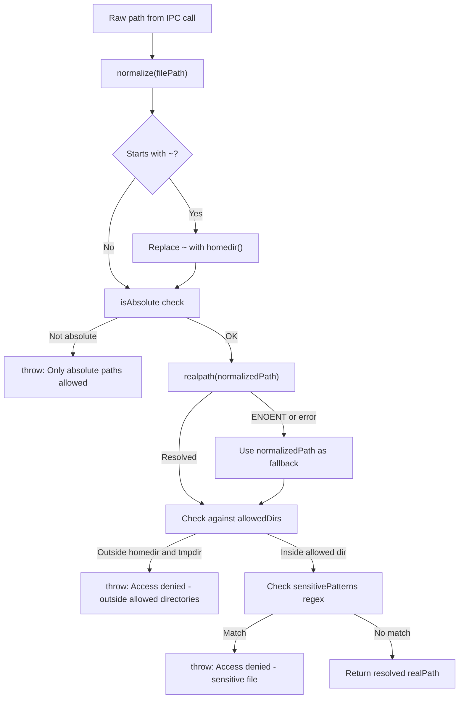
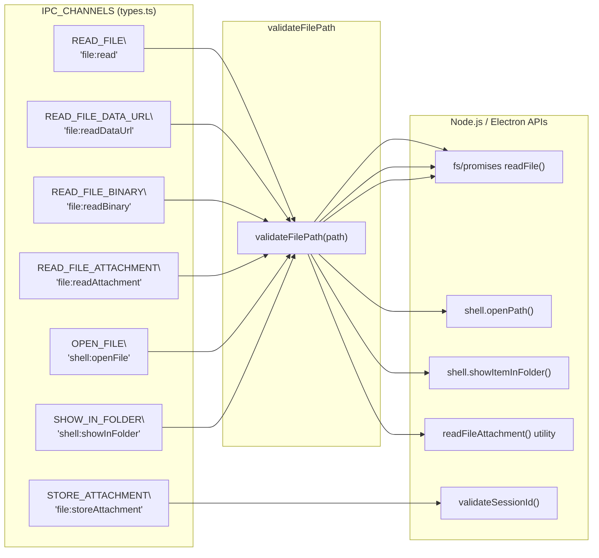
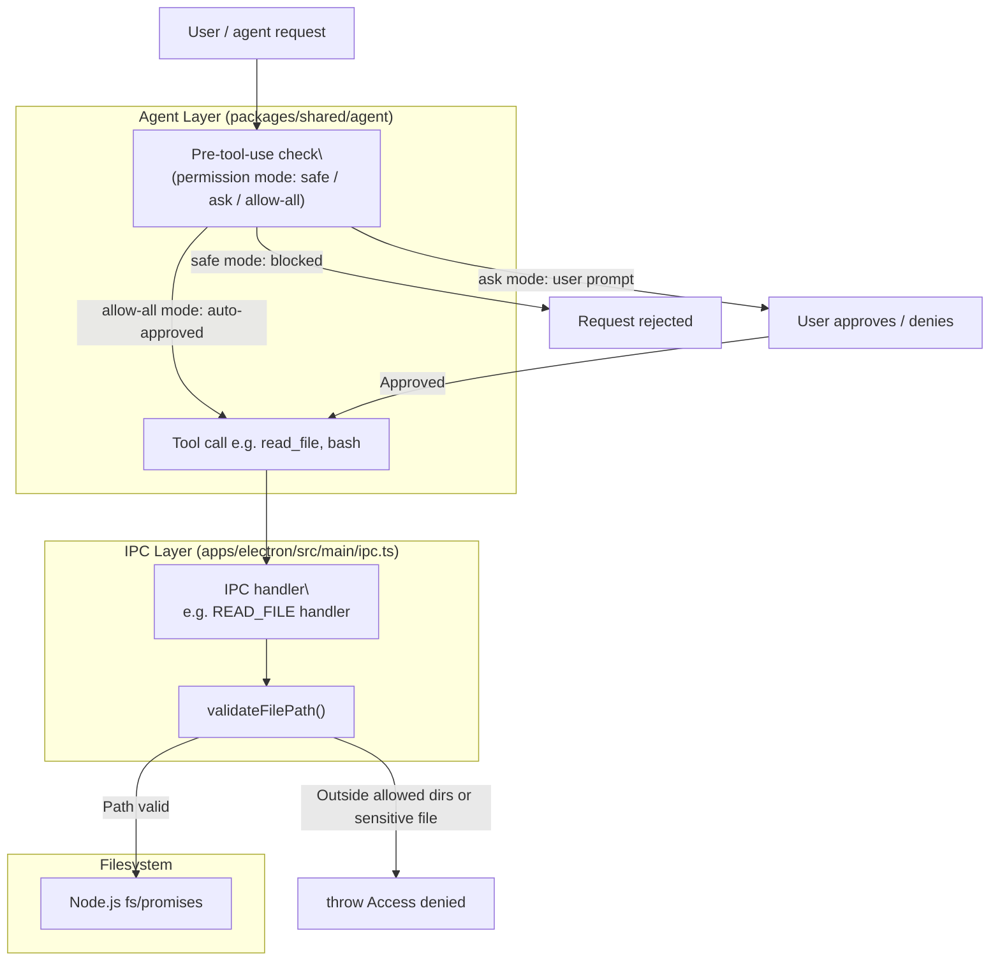

# File Access Validation

<details>
<summary>Relevant source files</summary>

The following files were used as context for generating this wiki page:

- [README.md](README.md)
- [apps/electron/src/main/ipc.ts](apps/electron/src/main/ipc.ts)
- [apps/electron/src/shared/types.ts](apps/electron/src/shared/types.ts)

</details>

This page documents the path validation and filename sanitization logic that protects the Craft Agents main process from path traversal attacks via the IPC layer. It covers the `validateFilePath` and `sanitizeFilename` functions in `apps/electron/src/main/ipc.ts`, which IPC handlers apply them, and the relationship between IPC-level path gating and the agent permission system.

For the broader security architecture (process isolation, renderer sandboxing), see [Security Architecture](#7.1). For credential storage protection, see [Credential Storage & Encryption](#7.2). For the IPC channel surface itself, see [IPC Communication Layer](#2.6). For the permission mode system that governs which file operations the agent may request, see [Permission System](#4.5).

---

## Why Path Validation Is Needed

The Electron renderer process is sandboxed — it has no direct Node.js filesystem access. All file I/O goes through IPC calls to the main process. This makes the IPC handlers a trust boundary: a compromised or misbehaving renderer, or a crafted agent output containing a manipulated path string, could attempt to reach files outside the intended working area by embedding `..` sequences, symlinks to sensitive locations, or absolute paths to system credential files.

The `validateFilePath` function in [apps/electron/src/main/ipc.ts:78-136]() is the single enforcement point for all renderer-initiated file reads.

---

## `validateFilePath`

`validateFilePath` is an `async` function that takes a raw path string and returns a validated, resolved absolute path, or throws with an `Access denied` message. It is called by every IPC handler that reads or opens a file.

**Validation pipeline (in order):**

| Step                 | What happens                                           | Why                                                   |
| -------------------- | ------------------------------------------------------ | ----------------------------------------------------- |
| Normalize            | `normalize(filePath)` resolves `.` and `..` components | Neutralizes simple traversal sequences                |
| Tilde expand         | `~` prefix replaced with `homedir()`                   | Allows user-friendly `~/…` paths                      |
| Absolute check       | Throws if path is not absolute after normalization     | Prevents relative path escapes                        |
| Symlink resolution   | `realpath(normalizedPath)` resolves all symlinks       | Prevents symlink-based escape to outside allowed dirs |
| Allow-list check     | Path must start with `homedir()` or `tmpdir()`         | Restricts access to user home and platform temp       |
| Sensitive file block | Regex-matches against a list of sensitive patterns     | Extra protection for credential files within home     |

**Allow-list logic** [apps/electron/src/main/ipc.ts:102-116]():

```
allowedDirs = [ homedir(), tmpdir() ]
```

The check uses `path.sep` to avoid false positives where one directory name is a prefix of another:

```
normalizedReal.startsWith(normalizedDir + sep) || normalizedReal === normalizedDir
```

**Sensitive file blocklist** [apps/electron/src/main/ipc.ts:119-132]():

| Pattern                    | What it blocks                    |
| -------------------------- | --------------------------------- |
| `/\.ssh\//`                | SSH private keys and config       |
| `/\.gnupg\//`              | GPG keyrings                      |
| `/\.aws\/credentials/`     | AWS credential files              |
| `/\.env$/` and `/\.env\./` | `.env` files                      |
| `/credentials\.json$/`     | OAuth/service account credentials |
| `/secrets?\./i`            | Any file named `secret(s).*`      |
| `/\.pem$/`                 | PEM certificates                  |
| `/\.key$/`                 | Private key files                 |

These patterns apply even if the path is within `homedir()`, providing defense-in-depth against reads of the user's own credential files.

**Validation flow diagram:**



Sources: [apps/electron/src/main/ipc.ts:78-136]()

---

## `sanitizeFilename`

`sanitizeFilename` [apps/electron/src/main/ipc.ts:36-52]() is used when persisting uploaded attachments to disk. It ensures that an agent-supplied or user-supplied filename cannot escape the target attachments directory or cause filesystem issues.

**Transformations applied (in order):**

| Transform                        | Characters affected   | Replacement |
| -------------------------------- | --------------------- | ----------- |
| Path separators                  | `/`, `\`              | `_`         |
| Windows-forbidden chars          | `< > : " \| ? *`      | `_`         |
| Control characters               | ASCII 0–31            | Removed     |
| Multiple dots                    | `..`, `...`, etc.     | Single `.`  |
| Leading/trailing dots and spaces | `.foo`, `foo.`, `foo` | Stripped    |
| Length cap                       | > 200 chars           | Truncated   |
| Empty result                     | (after above)         | `'unnamed'` |

The sanitized name is then combined with a `randomUUID()` prefix to produce the stored filename:

```
const storedFileName = `${id}_${safeName}`
```

This means even a fully-sanitized duplicate name never collides on disk.

Sources: [apps/electron/src/main/ipc.ts:36-52](), [apps/electron/src/main/ipc.ts:657-659]()

---

## IPC Handlers That Apply Path Validation

The following diagram maps each IPC channel constant to the handler that calls `validateFilePath`, and the Node.js API ultimately invoked.

**IPC path validation coverage:**



Note: `STORE_ATTACHMENT` does not call `validateFilePath` because the destination path is constructed entirely by the main process from workspace config and a UUID. Instead it calls `validateSessionId` on the caller-supplied `sessionId` before constructing the path [apps/electron/src/main/ipc.ts:648-649]().

Sources: [apps/electron/src/main/ipc.ts:487-503](), [apps/electron/src/main/ipc.ts:507-534](), [apps/electron/src/main/ipc.ts:538-549](), [apps/electron/src/main/ipc.ts:567-592](), [apps/electron/src/main/ipc.ts:1122-1139](), [apps/electron/src/main/ipc.ts:1142-1154]()

---

## Session ID Validation for Attachment Storage

When the renderer calls `STORE_ATTACHMENT`, it provides a `sessionId` that is incorporated into the destination directory path (`{workspaceRootPath}/sessions/{sessionId}/attachments/`). The comment in the code explicitly calls this out as a security step [apps/electron/src/main/ipc.ts:647-649]():

> SECURITY: Validate sessionId to prevent path traversal attacks. This must happen before using sessionId in any file path operations.

`validateSessionId` is imported from `@craft-agent/shared/sessions` [apps/electron/src/main/ipc.ts:17](). If the sessionId fails validation (e.g. contains `/`, `..`, or other illegal characters), the handler throws before any path construction occurs.

Sources: [apps/electron/src/main/ipc.ts:626-659]()

---

## Relationship to the Agent Permission System

The `validateFilePath` IPC gate and the agent permission system are two separate, complementary layers. They operate at different points in the call stack.



| Layer                     | Scope                                             | Controls                                                            |
| ------------------------- | ------------------------------------------------- | ------------------------------------------------------------------- |
| Permission system (agent) | Which operations the agent may _attempt_          | Bash commands, MCP tools, file writes — gated per `PermissionMode`  |
| `validateFilePath` (IPC)  | Which paths the main process will _actually read_ | Enforced regardless of permission mode; cannot be bypassed by agent |

Even in `allow-all` mode, the IPC path validator still runs. An agent in an unrestricted session cannot read `/etc/passwd` or `~/.ssh/id_rsa` because the IPC handler will reject the path before any I/O occurs.

The permission mode system is documented in detail in [Permission System](#4.5).

Sources: [apps/electron/src/main/ipc.ts:78-136](), [apps/electron/src/main/ipc.ts:487-503](), [apps/electron/src/shared/types.ts:130-136]()

---

## Error Handling

All handlers that call `validateFilePath` wrap the call in a `try/catch`. On failure, they:

1. Log the error via `ipcLog.error` (for operator visibility)
2. Re-throw a new `Error` with a user-facing message (e.g. `"Failed to read file: Access denied: file path is outside allowed directories"`)

The `READ_FILE` handler has a special case for `ENOENT` [apps/electron/src/main/ipc.ts:496-498](): it logs at `debug` level rather than `error` because missing optional config files (such as `automations.json`) are expected and non-fatal.

Sources: [apps/electron/src/main/ipc.ts:487-503](), [apps/electron/src/main/ipc.ts:507-534]()
