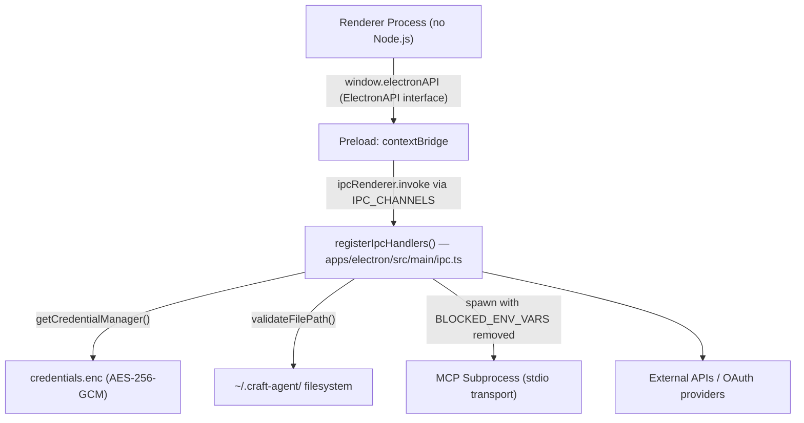
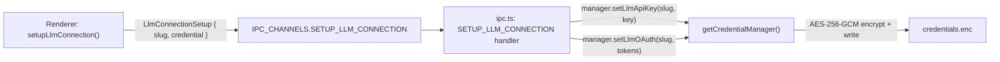
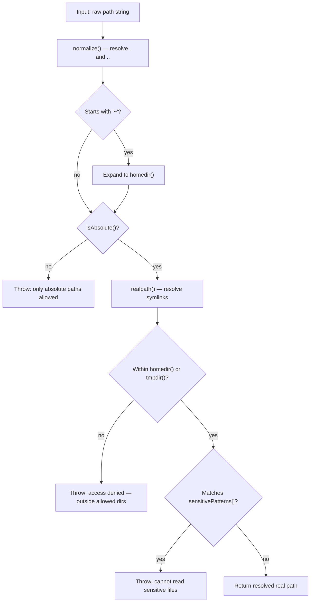

# Security

Relevant source files

The following files were used as context for generating this wiki page:

- [README.md](README.md)
- [apps/electron/src/main/ipc.ts](apps/electron/src/main/ipc.ts)
- [apps/electron/src/shared/types.ts](apps/electron/src/shared/types.ts)

This page provides an overview of the security model in Craft Agents, covering the four primary protection areas: Electron process isolation, encrypted credential storage, file path validation, and subprocess/network controls.

For deeper coverage of individual areas:

- [Security Architecture](#7.1) — Electron sandbox design, IPC isolation, SSRF protections
- [Credential Storage & Encryption](#7.2) — AES-256-GCM `credentials.enc`, `CredentialManager` internals, build-time secret injection
- [File Access Validation](#7.3) — path traversal prevention logic and the agent permission system

---

## Process Isolation

Craft Agents runs in Electron's three-process model. The renderer process is sandboxed with `nodeIntegration: false` and has no direct access to Node.js APIs. All security-sensitive operations — file I/O, credential access, subprocess spawning — live exclusively in the main process.

| Process      | Node.js Access                 | Role                                      |
| ------------ | ------------------------------ | ----------------------------------------- |
| **Renderer** | None                           | React UI, user interaction                |
| **Preload**  | Limited (`contextBridge` only) | Exposes `window.electronAPI`              |
| **Main**     | Full                           | File I/O, credentials, agent/MCP spawning |

The renderer interacts with the main process only through the named channels in `IPC_CHANNELS`, mediated by the typed `ElectronAPI` interface defined in `apps/electron/src/shared/types.ts`. The preload script bridges these two surfaces.

**Diagram: Security Boundary Architecture**

Sources: [apps/electron/src/main/ipc.ts:138-140](), [apps/electron/src/shared/types.ts:595-931](), [apps/electron/src/shared/types.ts:968-1315]()

---

## Credential Storage

API keys and OAuth tokens are never stored in plaintext. The `CredentialManager` (provided by `getCredentialManager()` from `@craft-agent/shared/credentials`) encrypts all credentials using AES-256-GCM and writes them to `~/.craft-agent/credentials.enc`.

Credentials are scoped per connection slug (e.g. `anthropic-api`, `copilot`, `chatgpt`) and per source slug. The renderer never receives the encryption key or the raw file contents.

**Diagram: Credential Write Flow**

The main `CredentialManager` operations used across `ipc.ts`:

| Method                              | Purpose                                                   |
| ----------------------------------- | --------------------------------------------------------- |
| `setLlmApiKey(slug, key)`           | Store an API key for a connection                         |
| `setLlmOAuth(slug, tokens)`         | Store OAuth tokens (access, refresh, id, expiresAt)       |
| `getLlmApiKey(slug)`                | Retrieve API key (e.g., for settings pre-fill)            |
| `getLlmOAuth(slug)`                 | Retrieve OAuth tokens (e.g., to check expiry)             |
| `deleteLlmCredentials(slug)`        | Remove all credentials for a connection slug              |
| `hasLlmCredentials(slug, authType)` | Check whether credentials exist                           |
| `list()`                            | Enumerate all stored credential IDs                       |
| `checkHealth()`                     | Validate the credential store is readable and uncorrupted |

The `CREDENTIAL_HEALTH_CHECK` IPC handler calls `manager.checkHealth()` at app startup. This detects corruption or machine migration issues before the user sends a message.

Sources: [apps/electron/src/main/ipc.ts:1293-1298](), [apps/electron/src/main/ipc.ts:1300-1422](), [apps/electron/src/main/ipc.ts:1656-1673]()

---

## File Access Validation

Every IPC handler that touches the filesystem first calls `validateFilePath()` to prevent path traversal attacks. The function enforces a strict allowlist of base directories and blocks access to sensitive files by pattern.

**Diagram: validateFilePath() Decision Flow**

The `sensitivePatterns` array in `validateFilePath()` blocks the following paths even when they are inside `homedir()`:

| Pattern                | Protected resource                         |
| ---------------------- | ------------------------------------------ |
| `/\.ssh\//`            | SSH private keys and config                |
| `/\.gnupg\//`          | GPG key ring                               |
| `/\.aws\/credentials/` | AWS access keys                            |
| `/\.env$/`             | Root `.env` files                          |
| `/\.env\./`            | `.env.local`, `.env.production`, etc.      |
| `/credentials\.json$/` | Google service account files               |
| `/secrets?\./i`        | `secret.*`, `secrets.*` (case-insensitive) |
| `/\.pem$/`             | PEM certificates                           |
| `/\.key$/`             | Private key files                          |

`validateFilePath()` is invoked in these IPC handlers: `READ_FILE`, `READ_FILE_DATA_URL`, `READ_FILE_BINARY`, `READ_FILE_ATTACHMENT`, `OPEN_FILE`, `SHOW_IN_FOLDER`.

### Session ID Validation

The `STORE_ATTACHMENT` handler calls `validateSessionId(sessionId)` (from `@craft-agent/shared/sessions`) before constructing any file path from the session ID parameter. This prevents directory traversal through a crafted session ID value.

### Filename Sanitization

`sanitizeFilename()` is applied to all user-supplied filenames before they are used in stored attachment paths. It performs the following transformations in order:

1. Replaces `/` and `\` with `_`
2. Replaces Windows-forbidden characters (`< > : " | ? *`) with `_`
3. Strips ASCII control characters (0–31)
4. Collapses multiple consecutive dots (e.g., `..` → `.`)
5. Trims leading/trailing dots and spaces
6. Truncates the result to 200 characters
7. Falls back to `"unnamed"` if the result is empty

Sources: [apps/electron/src/main/ipc.ts:36-52](), [apps/electron/src/main/ipc.ts:78-136](), [apps/electron/src/main/ipc.ts:487-549](), [apps/electron/src/main/ipc.ts:626-651]()

---

## MCP Subprocess Environment Isolation

When a local MCP server (stdio transport) is spawned, the inherited process environment is filtered. The following variables are explicitly blocked to prevent credential leakage into the subprocess:

| Category            | Blocked Variables                                                 |
| ------------------- | ----------------------------------------------------------------- |
| App auth            | `ANTHROPIC_API_KEY`, `CLAUDE_CODE_OAUTH_TOKEN`                    |
| AWS                 | `AWS_ACCESS_KEY_ID`, `AWS_SECRET_ACCESS_KEY`, `AWS_SESSION_TOKEN` |
| SCM                 | `GITHUB_TOKEN`, `GH_TOKEN`                                        |
| AI providers        | `OPENAI_API_KEY`, `GOOGLE_API_KEY`                                |
| Payments / packages | `STRIPE_SECRET_KEY`, `NPM_TOKEN`                                  |

If a specific MCP server legitimately needs one of these variables, it can be explicitly passed using the `env` field in the source's configuration file. This is a per-source opt-in, not inherited from the parent process by default.

Sources: README.md

---

## Network Protection

The `OPEN_URL` IPC handler (`IPC_CHANNELS.OPEN_URL`) validates the protocol of every URL before it is passed to `shell.openExternal()`. Only the following protocols are allowed:

- `http:`
- `https:`
- `mailto:`
- `craftdocs:`

The `craftagents:` protocol is intercepted and handled internally via `handleDeepLink()` rather than being opened in the system browser. Any other protocol causes the handler to throw with the message `"Only http, https, mailto, craftdocs URLs are allowed"`.

Sources: [apps/electron/src/main/ipc.ts:1093-1119]()

---

## Validation Coverage Summary

The table below maps IPC channels to the validation functions they invoke.

| IPC Channel                 | Constant                   | Validation                                   |
| --------------------------- | -------------------------- | -------------------------------------------- |
| `READ_FILE`                 | `file:read`                | `validateFilePath()`                         |
| `READ_FILE_DATA_URL`        | `file:readDataUrl`         | `validateFilePath()`                         |
| `READ_FILE_BINARY`          | `file:readBinary`          | `validateFilePath()`                         |
| `READ_FILE_ATTACHMENT`      | `file:readAttachment`      | `validateFilePath()`                         |
| `OPEN_FILE`                 | `shell:openFile`           | `validateFilePath()`                         |
| `SHOW_IN_FOLDER`            | `shell:showInFolder`       | `validateFilePath()`                         |
| `STORE_ATTACHMENT`          | `file:storeAttachment`     | `validateSessionId()` + `sanitizeFilename()` |
| `OPEN_URL`                  | `shell:openUrl`            | Protocol allowlist                           |
| `WORKSPACE_SETTINGS_UPDATE` | `workspaceSettings:update` | Key allowlist (`validKeys` array)            |

Sources: [apps/electron/src/main/ipc.ts:487-549](), [apps/electron/src/main/ipc.ts:626-840](), [apps/electron/src/main/ipc.ts:1093-1119](), [apps/electron/src/main/ipc.ts:1557-1595]()
