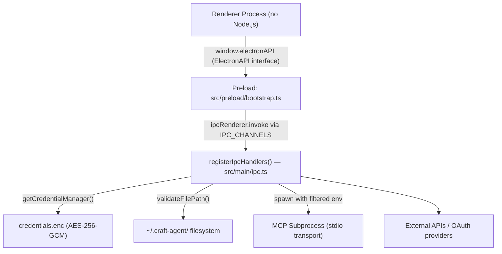
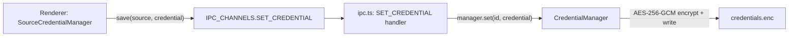
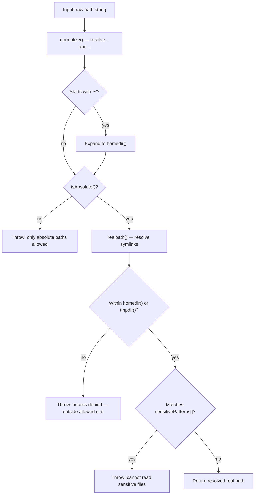

# Security

Relevant source files

The following files were used as context for generating this wiki page:

- [apps/electron/package.json](apps/electron/package.json)
- [packages/shared/src/sources/credential-manager.ts](packages/shared/src/sources/credential-manager.ts)

This page provides an overview of the security model in Craft Agents, covering the four primary protection areas: Electron process isolation, encrypted credential storage, file path validation, and subprocess/network controls.

For deeper coverage of individual areas:
- [Security Architecture](#7.1) — Electron sandbox design, IPC isolation, SSRF protections.
- [Credential Storage & Encryption](#7.2) — AES-256-GCM `credentials.enc`, `CredentialManager` internals, build-time secret injection.
- [File Access Validation](#7.3) — Path traversal prevention logic and the agent permission system.

---

## Process Isolation

Craft Agents runs in Electron's three-process model. The renderer process is sandboxed with `nodeIntegration: false` and has no direct access to Node.js APIs. All security-sensitive operations — file I/O, credential access, subprocess spawning — live exclusively in the main process.

| Process | Node.js Access | Role |
|---------|---------------|------|
| **Renderer** | None | React UI, user interaction |
| **Preload** | Limited (`contextBridge` only) | Exposes `window.electronAPI` |
| **Main** | Full | File I/O, credentials, agent/MCP spawning |

The renderer interacts with the main process only through the named channels in `IPC_CHANNELS`, mediated by the typed `ElectronAPI` interface. The preload script bridges these two surfaces.

**Diagram: Security Boundary Architecture**

Sources: [apps/electron/src/main/ipc.ts:1-50](), [apps/electron/src/preload/bootstrap.ts:10-50]()

---

## Credential Storage

API keys and OAuth tokens are never stored in plaintext. The `CredentialManager` (defined in `packages/shared/src/credentials/manager.ts`) encrypts all credentials using AES-256-GCM and writes them to `~/.craft-agent/credentials.enc` via the `SecureStorageBackend`.

Credentials are scoped per connection slug (e.g., `anthropic-api`, `copilot`, `chatgpt`) and per source slug. The renderer never receives the encryption key or the raw file contents.

**Diagram: Credential Write Flow**

The `SourceCredentialManager` provides a high-level API for the UI to interact with credentials while keeping the logic unified across different auth types (OAuth vs API keys).

| Method | Purpose |
|--------|---------|
| `save(source, cred)` | Store a credential for a specific source [packages/shared/src/sources/credential-manager.ts:128-133]() |
| `load(source)` | Retrieve source credentials with fallback logic [packages/shared/src/sources/credential-manager.ts:141-159]() |
| `getToken(source)` | Retrieve and automatically refresh expired OAuth tokens [packages/shared/src/sources/credential-manager.ts:206-231]() |
| `delete(source)` | Remove a credential from storage [packages/shared/src/sources/credential-manager.ts:192-200]() |

Sources: [packages/shared/src/credentials/manager.ts:14-118](), [packages/shared/src/sources/credential-manager.ts:116-231](), [apps/electron/src/main/ipc.ts:1300-1422]()

---

## File Access Validation

Every IPC handler that touches the filesystem first calls `validateFilePath()` to prevent path traversal attacks. The function enforces a strict allowlist of base directories and blocks access to sensitive files by pattern.

**Diagram: validateFilePath() Decision Flow**

The `sensitivePatterns` array in `validateFilePath()` blocks access to SSH keys, AWS credentials, `.env` files, and other private data even when they are inside the user's home directory.

### Session ID Validation

The `STORE_ATTACHMENT` handler calls `validateSessionId(sessionId)` before constructing any file path from the session ID parameter. This prevents directory traversal through a crafted session ID value.

### Filename Sanitization

`sanitizeFilename()` is applied to all user-supplied filenames before they are used in stored attachment paths. It performs transformations such as replacing Windows-forbidden characters with `_` and collapsing multiple consecutive dots.

Sources: [apps/electron/src/main/ipc.ts:36-52](), [apps/electron/src/main/ipc.ts:78-136](), [apps/electron/src/main/ipc.ts:487-549](), [apps/electron/src/main/ipc.ts:626-651]()

---

## MCP Subprocess Environment Isolation

When a local MCP server (stdio transport) is spawned, the inherited process environment is filtered. Craft Agents prevents the leakage of sensitive environment variables (like `ANTHROPIC_API_KEY`, `AWS_SECRET_ACCESS_KEY`, or `GITHUB_TOKEN`) into subprocesses by default.

If a specific MCP server legitimately needs one of these variables, it must be explicitly configured in the source's configuration file.

---

## Network Protection

The `OPEN_URL` IPC handler (`IPC_CHANNELS.OPEN_URL`) validates the protocol of every URL before it is passed to `shell.openExternal()`. Only the following protocols are allowed:

- `http:`
- `https:`
- `mailto:`
- `craftdocs:`

The `craftagents:` protocol is intercepted and handled internally via `handleDeepLink()` rather than being opened in the system browser.

Sources: [apps/electron/src/main/ipc.ts:1093-1119]()

---

## Validation Coverage Summary

The table below maps IPC channels to the validation functions they invoke.

| IPC Channel | Constant | Validation |
|-------------|---------|-----------|
| `READ_FILE` | `file:read` | `validateFilePath()` |
| `READ_FILE_DATA_URL` | `file:readDataUrl` | `validateFilePath()` |
| `READ_FILE_BINARY` | `file:readBinary` | `validateFilePath()` |
| `READ_FILE_ATTACHMENT` | `file:readAttachment` | `validateFilePath()` |
| `OPEN_FILE` | `shell:openFile` | `validateFilePath()` |
| `SHOW_IN_FOLDER` | `shell:showInFolder` | `validateFilePath()` |
| `STORE_ATTACHMENT` | `file:storeAttachment` | `validateSessionId()` + `sanitizeFilename()` |
| `OPEN_URL` | `shell:openUrl` | Protocol allowlist |

Sources: [apps/electron/src/main/ipc.ts:487-549](), [apps/electron/src/main/ipc.ts:626-840](), [apps/electron/src/main/ipc.ts:1093-1119]()