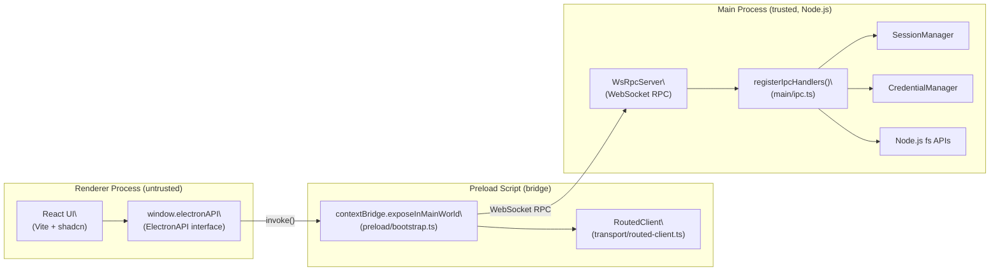
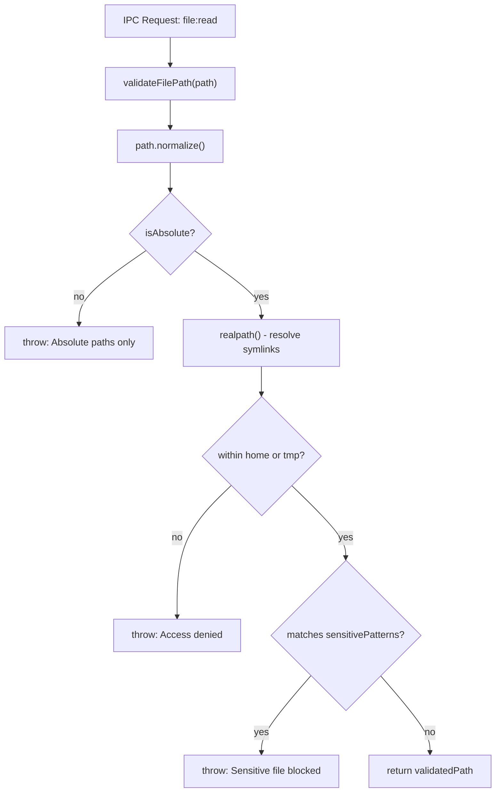
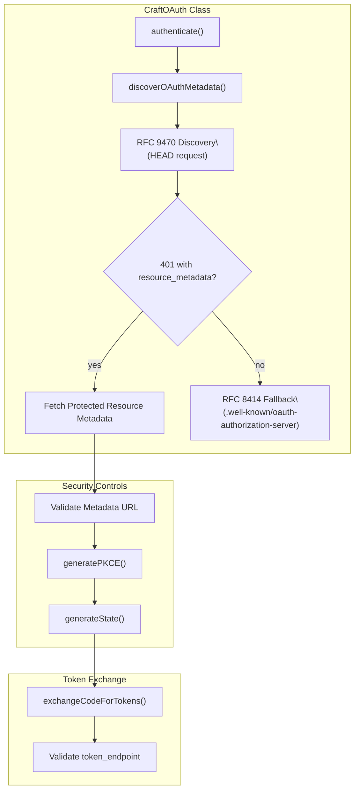

# Security Architecture

Relevant source files

The following files were used as context for generating this wiki page:

- [apps/electron/src/preload/bootstrap.ts](apps/electron/src/preload/bootstrap.ts)
- [apps/electron/src/renderer/components/onboarding/CredentialsStep.tsx](apps/electron/src/renderer/components/onboarding/CredentialsStep.tsx)
- [apps/electron/src/renderer/components/onboarding/OnboardingWizard.tsx](apps/electron/src/renderer/components/onboarding/OnboardingWizard.tsx)
- [packages/shared/src/auth/__tests__/oauth.test.ts](packages/shared/src/auth/__tests__/oauth.test.ts)
- [packages/shared/src/auth/oauth.ts](packages/shared/src/auth/oauth.ts)

This page covers the overall security design of Craft Agents: how process isolation is enforced, how the IPC boundary restricts renderer capabilities, how file access is validated, and how subprocess environments are sanitized. For the specific encryption scheme used for stored credentials, see [7.2 Credential Storage & Encryption](). For file-access permission modes (safe/ask/allow-all), see [4.5 Permission System]().

---

## Design Principles

The security model rests on four pillars:

| Pillar | Mechanism |
|---|---|
| **Process isolation** | Electron renderer runs without Node.js access (`nodeIntegration: false`, `contextIsolation: true`). |
| **Least-privilege IPC** | The renderer may only call an explicitly typed set of functions exposed via `contextBridge`. |
| **Input validation** | Every file path, session ID, URL, and attachment passes through validation before use. |
| **Subprocess isolation** | MCP stdio subprocesses inherit a filtered environment that excludes sensitive credentials. |
| **SSRF Protections** | OAuth and metadata discovery flows validate remote URLs and prevent unencrypted token transmission. |

---

## Electron Process Isolation

Craft Agents uses a multi-process Electron model. The renderer process has no direct access to Node.js APIs or the file system. All privileged operations must be requested over IPC.

**Electron Process Trust Boundary**

Sources: [apps/electron/src/preload/bootstrap.ts:20-49](), [apps/electron/src/preload/bootstrap.ts:180-210](), [apps/electron/src/shared/types.ts:968-1315]()

The renderer accesses exactly the methods defined by `ElectronAPI`. In thin-client mode (triggered by `CRAFT_SERVER_URL`), the preload script enforces encrypted connections, refusing to connect to remote servers over unencrypted `ws://` to prevent token leakage [apps/electron/src/preload/bootstrap.ts:68-77]().

---

## IPC Boundary Surface

All IPC channels are declared as constants in `IPC_CHANNELS` and mapped to the `ElectronAPI` via `CHANNEL_MAP`.

**IPC Channel Categories**

| Category | Example Channels | Implementation Detail |
|---|---|---|
| **Session management** | `sessions:sendMessage` | Routed via `SessionManager`. |
| **File operations** | `file:read`, `file:readPreview` | Path-validated; `readFilePreviewDataUrl` provides resized base64 thumbnails. |
| **Credential operations**| `credentials:get`, `credentials:set` | Managed by `SourceCredentialManager`. |
| **Shell operations** | `shell:openUrl` | URL-validated and protocol-restricted via `shell.openExternal` [apps/electron/src/preload/bootstrap.ts:160-160](). |
| **Dialog operations** | `__dialog:showOpenDialog` | Proxied via `ipcRenderer.invoke` to main process dialog APIs [apps/electron/src/preload/bootstrap.ts:175-177](). |

The `CHANNEL_MAP` ensures that only valid, registered methods can be invoked across the bridge, with a runtime parity test enforcing this contract.

---

## File System Access Controls

The main process enforces strict path validation for all file-related IPC handlers.

### `validateFilePath()`

This function (located in `apps/electron/src/main/ipc.ts`) enforces:

1. **Normalization**: `path.normalize()` resolves `.` and `..` components.
2. **Tilde expansion**: Leading `~` is expanded to the user's home directory.
3. **Absolute path requirement**: Relative paths are rejected.
4. **Symlink resolution**: `fs.realpath()` resolves symlinks to prevent traversal attacks.
5. **Allowed directory check**: Paths must be within `os.homedir()` or `os.tmpdir()`.
6. **Sensitive file patterns**: Access is blocked for patterns like `/.ssh/`, `/.aws/credentials`, `.env`, and `credentials.json`.

**File Path Validation Flow**

Sources: [apps/electron/src/main/ipc.ts:78-136]()

---

## Subprocess Environment Isolation

When spawning local MCP servers via `stdio` transport, the system filters the environment variables passed to the subprocess.

**Blocked environment variables:**
- `ANTHROPIC_API_KEY`
- `CLAUDE_CODE_OAUTH_TOKEN`
- `AWS_ACCESS_KEY_ID` / `AWS_SECRET_ACCESS_KEY`
- `GITHUB_TOKEN` / `GH_TOKEN`
- `OPENAI_API_KEY`
- `GOOGLE_API_KEY`

This prevents local MCP servers from accidentally or maliciously exfiltrating the main application's or the user's system-wide cloud credentials.

---

## OAuth and SSRF Protections

The application implements robust protections against Server-Side Request Forgery (SSRF) and CSRF during OAuth metadata discovery and authentication flows.

### OAuth Metadata Discovery
The system uses progressive discovery to find OAuth endpoints for MCP servers [packages/shared/src/auth/oauth.ts:56-67](). To prevent SSRF, `discoverOAuthMetadata` validates the resource metadata hints returned in `WWW-Authenticate` headers [packages/shared/src/auth/__tests__/oauth.test.ts:66-101]().

### CSRF and PKCE
- **State Parameter**: A random 16-byte state is generated for every authentication request to prevent CSRF attacks [packages/shared/src/auth/oauth.ts:39-41]().
- **PKCE**: Proof Key for Code Exchange (PKCE) is enforced for public clients, generating a `code_challenge` from a `code_verifier` [packages/shared/src/auth/oauth.ts:32-36]().

### Transport Security
The `WsRpcClient` enforces TLS for all remote connections (`wss://`) unless the destination is `localhost`, preventing man-in-the-middle attacks on the RPC channel [apps/electron/src/preload/bootstrap.ts:68-77]().

**OAuth Discovery Flow**

Sources: [packages/shared/src/auth/oauth.ts:31-41](), [packages/shared/src/auth/oauth.ts:56-67](), [packages/shared/src/auth/__tests__/oauth.test.ts:65-101](), [apps/electron/src/preload/bootstrap.ts:68-77]()

---

## Credential Handling at the IPC Boundary

The renderer never receives raw credentials during onboarding or normal operation.

- **Onboarding**: During flows like ChatGPT or GitHub Copilot OAuth, the renderer only receives status updates or device codes [apps/electron/src/renderer/components/onboarding/CredentialsStep.tsx:153-174](). The actual token exchange happens in the main process.
- **Device Flow**: For Copilot, the `userCode` is displayed for the user to enter on GitHub, while the sensitive `device_code` used for polling is kept in the trusted process [apps/electron/src/renderer/components/onboarding/CredentialsStep.tsx:158-165]().
- **Token Refresh**: The `CraftOAuth` class manages token refresh internally, ensuring that the renderer only interacts with high-level "connected" states [packages/shared/src/auth/oauth.ts:149-186]().

Sources: [apps/electron/src/renderer/components/onboarding/CredentialsStep.tsx:153-193](), [packages/shared/src/auth/oauth.ts:149-186](), [apps/electron/src/renderer/components/onboarding/OnboardingWizard.tsx:162-177]()