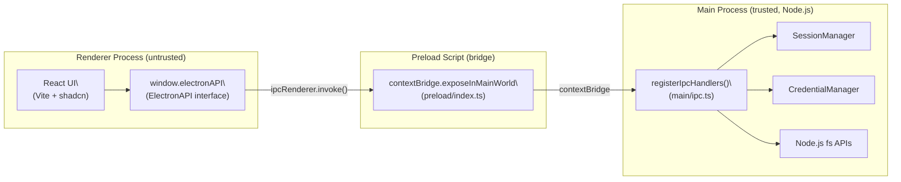
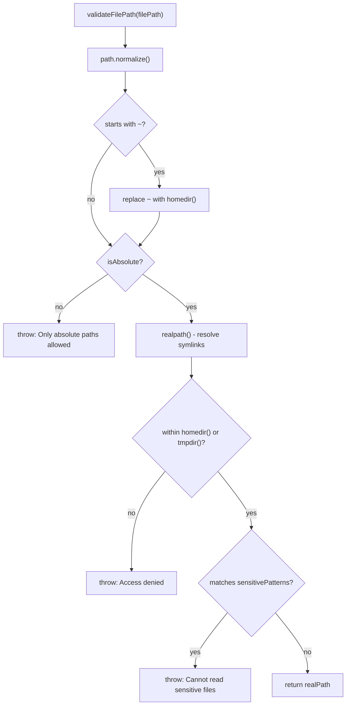
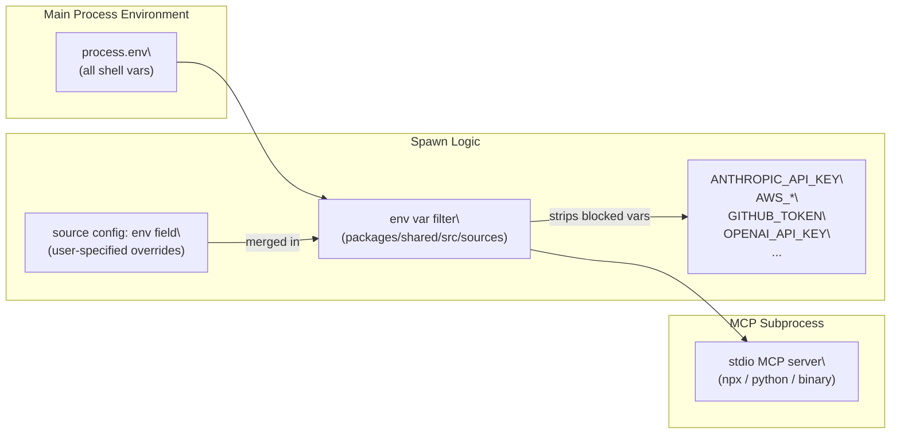
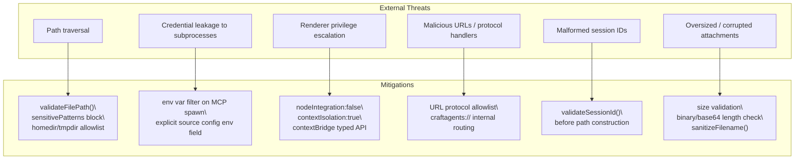

# Security Architecture

<details>
<summary>Relevant source files</summary>

The following files were used as context for generating this wiki page:

- [README.md](README.md)
- [apps/electron/package.json](apps/electron/package.json)
- [apps/electron/src/main/ipc.ts](apps/electron/src/main/ipc.ts)
- [apps/electron/src/shared/types.ts](apps/electron/src/shared/types.ts)

</details>

This page covers the overall security design of Craft Agents: how process isolation is enforced, how the IPC boundary restricts renderer capabilities, how file access is validated, and how subprocess environments are sanitized. For the specific encryption scheme used for stored credentials, see [Credential Storage & Encryption](#7.2). For file-access permission modes (safe/ask/allow-all), see [File Access Validation](#7.3).

---

## Design Principles

The security model rests on four pillars:

| Pillar               | Mechanism                                                                                          |
| -------------------- | -------------------------------------------------------------------------------------------------- |
| Process isolation    | Electron renderer runs without Node.js access (`nodeIntegration: false`, `contextIsolation: true`) |
| Least-privilege IPC  | The renderer may only call an explicitly typed set of functions exposed via `contextBridge`        |
| Input validation     | Every file path, session ID, URL, and attachment passes through validation before use              |
| Subprocess isolation | MCP stdio subprocesses inherit a filtered environment that excludes sensitive credentials          |

---

## Electron Process Isolation

Craft Agents uses a three-process Electron model. The renderer process has no direct access to Node.js APIs or the file system. All privileged operations must be requested over IPC.

**Electron Process Trust Boundary**



Sources: [apps/electron/src/main/ipc.ts:138](), [apps/electron/src/shared/types.ts:968-1315]()

The renderer accesses exactly the methods defined by `ElectronAPI` in `apps/electron/src/shared/types.ts`. No other Node.js capability is reachable from the renderer.

---

## IPC Boundary Surface

All IPC channels are declared as constants in `IPC_CHANNELS` (`apps/electron/src/shared/types.ts:595-931`). Each channel is handled by a dedicated `ipcMain.handle()` call inside `registerIpcHandlers()`.

**IPC Channel Categories**

| Category              | Example Channels                                    | Handler Location               |
| --------------------- | --------------------------------------------------- | ------------------------------ |
| Session management    | `sessions:sendMessage`, `sessions:cancel`           | `ipc.ts` → `SessionManager`    |
| File operations       | `file:read`, `file:storeAttachment`                 | `ipc.ts` (path-validated)      |
| Credential operations | `credentials:healthCheck`, `auth:logout`            | `ipc.ts` → `CredentialManager` |
| Shell operations      | `shell:openUrl`, `shell:openFile`                   | `ipc.ts` (URL-validated)       |
| Onboarding / OAuth    | `onboarding:startClaudeOAuth`, `copilot:startOAuth` | `onboarding.ts`, `ipc.ts`      |
| LLM connections       | `LLM_Connection:list`, `LLM_Connection:test`        | `ipc.ts`                       |

The renderer never calls `ipcRenderer` directly. Everything is wrapped in `window.electronAPI`, which is declared as the `ElectronAPI` interface. This keeps the IPC surface typed and auditable.

**IPC Request Flow**

```mermaid
sequenceDiagram
    participant UI as "React UI"
    participant EA as "window.electronAPI"
    participant PL as "contextBridge (preload)"
    participant IH as "registerIpcHandlers()\
(ipc.ts)"
    participant SV as "SessionManager / FS / CredentialManager"

    UI->>EA: "readFile(path)"
    EA->>PL: "ipcRenderer.invoke('file:read', path)"
    PL->>IH: "ipcMain.handle('file:read')"
    IH->>IH: "validateFilePath(path)"
    IH->>SV: "readFile(safePath)"
    SV-->>IH: "content"
    IH-->>PL: "content"
    PL-->>EA: "content"
    EA-->>UI: "content"
```

Sources: [apps/electron/src/main/ipc.ts:487-503](), [apps/electron/src/shared/types.ts:595-931]()

---

## File System Access Controls

The `READ_FILE`, `READ_FILE_DATA_URL`, `READ_FILE_BINARY`, `OPEN_FILE`, and `SHOW_IN_FOLDER` IPC handlers all call `validateFilePath()` before any I/O.

### `validateFilePath()`

Located at [apps/electron/src/main/ipc.ts:78-136](), this function enforces:

1. **Normalization** — `path.normalize()` resolves all `.` and `..` components before any check.
2. **Tilde expansion** — Leading `~` is expanded to `os.homedir()`.
3. **Absolute path requirement** — Relative paths are rejected outright.
4. **Symlink resolution** — `fs.realpath()` resolves symlinks to their true destinations so symlink attacks cannot bypass directory checks.
5. **Allowed directory check** — The resolved path must be prefixed by `os.homedir()` or `os.tmpdir()`. Anything outside is rejected.
6. **Sensitive file patterns** — Even inside the home directory, paths matching the following patterns are blocked:

```
/.ssh/
/.gnupg/
/.aws/credentials
/.env (and .env.*)
/credentials.json
/secrets. (case-insensitive)
/.pem
/.key
```

**File Path Validation Flow**



Sources: [apps/electron/src/main/ipc.ts:78-136]()

### `sanitizeFilename()`

Used when storing file attachments ([apps/electron/src/main/ipc.ts:36-52]()), this function:

- Replaces `/` and `\` with `_`
- Removes Windows-forbidden characters (`< > : " | ? *`)
- Strips control characters (ASCII 0–31)
- Collapses multiple dots to prevent extension tricks
- Strips leading/trailing dots and spaces
- Limits filenames to 200 characters
- Falls back to `'unnamed'` if the result is empty

### Session ID Validation

Before any file path is constructed using a session ID, `validateSessionId()` (from `@craft-agent/shared/sessions`) is called. This is enforced in the `STORE_ATTACHMENT` handler at [apps/electron/src/main/ipc.ts:647-649]() and prevents path traversal via a crafted session ID.

---

## Subprocess Environment Isolation

When Craft Agents spawns local MCP servers via stdio transport, the subprocess inherits a filtered copy of the parent environment. Sensitive credentials that happen to be present in the shell environment are stripped before the subprocess is started.

**Blocked environment variables (not passed to MCP subprocesses):**

| Variable                                                          | Reason                  |
| ----------------------------------------------------------------- | ----------------------- |
| `ANTHROPIC_API_KEY`                                               | App authentication key  |
| `CLAUDE_CODE_OAUTH_TOKEN`                                         | App OAuth token         |
| `AWS_ACCESS_KEY_ID`, `AWS_SECRET_ACCESS_KEY`, `AWS_SESSION_TOKEN` | AWS credentials         |
| `GITHUB_TOKEN`, `GH_TOKEN`                                        | GitHub credentials      |
| `OPENAI_API_KEY`                                                  | OpenAI credentials      |
| `GOOGLE_API_KEY`                                                  | Google credentials      |
| `STRIPE_SECRET_KEY`                                               | Stripe credentials      |
| `NPM_TOKEN`                                                       | npm publish credentials |

To explicitly pass an environment variable to a specific MCP server, the user must set it in the `env` field of the source config. Omission from that field means it will not be forwarded.

**MCP Subprocess Environment Filtering**



Sources: [README.md:431-441]()

---

## URL and Protocol Validation

The `OPEN_URL` IPC handler ([apps/electron/src/main/ipc.ts:1093-1118]()) validates every URL before acting on it:

1. `new URL(url)` is called first — malformed URLs throw immediately.
2. `craftagents://` scheme URLs are routed internally to `handleDeepLink()` rather than to the system browser.
3. For external URLs, only these protocols are allowed: `http:`, `https:`, `mailto:`, `craftdocs:`. Any other protocol (including `file:`, `javascript:`, etc.) throws an error.

Similarly, the `OPEN_FILE` and `SHOW_IN_FOLDER` handlers resolve relative paths to absolute with `path.resolve()` and then pass through `validateFilePath()` before invoking `shell.openPath()` or `shell.showItemInFolder()`.

---

## Credential Handling at the IPC Boundary

The renderer never receives raw credentials. Credential operations are handled entirely in the main process by `CredentialManager` (accessed via `getCredentialManager()`).

**What the renderer can do:**

- Call `setupLlmConnection()` to submit a credential — the value is forwarded to `CredentialManager` and never echoed back.
- Call `getLlmConnectionApiKey()` to retrieve an API key for pre-filling an edit form — this is the only path where a key is returned.
- Call `logout()` to clear all credentials.

**What the renderer cannot do:**

- Read the raw `credentials.enc` file (blocked by `validateFilePath` sensitive patterns).
- Call encryption/decryption primitives directly.
- Enumerate stored credentials beyond the structured `CredentialManager.list()` result.

For the encryption algorithm and file format, see [Credential Storage & Encryption](#7.2).

---

## Build-Time Secret Injection

OAuth client credentials for built-in providers (Slack, Microsoft) are injected at compile time via `esbuild --define` flags ([apps/electron/package.json:18]()):

```
--define:process.env.SLACK_OAUTH_CLIENT_ID=\"${SLACK_OAUTH_CLIENT_ID:-}\"
--define:process.env.SLACK_OAUTH_CLIENT_SECRET=\"${SLACK_OAUTH_CLIENT_SECRET:-}\"
--define:process.env.MICROSOFT_OAUTH_CLIENT_ID=\"${MICROSOFT_OAUTH_CLIENT_ID:-}\"
```

These values are read from a `.env` file at build time and embedded in the compiled main-process binary. They are not present in the renderer bundle. Google OAuth credentials are **not** baked in; users must supply their own `googleOAuthClientId` and `googleOAuthClientSecret` via source configuration, where they are stored in `credentials.enc`.

---

## Security Surface Summary



Sources: [apps/electron/src/main/ipc.ts:36-136](), [apps/electron/src/main/ipc.ts:626-838](), [apps/electron/src/main/ipc.ts:1093-1118](), [README.md:431-441](), [apps/electron/src/shared/types.ts:968-1315]()
