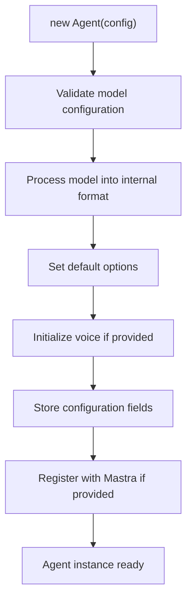
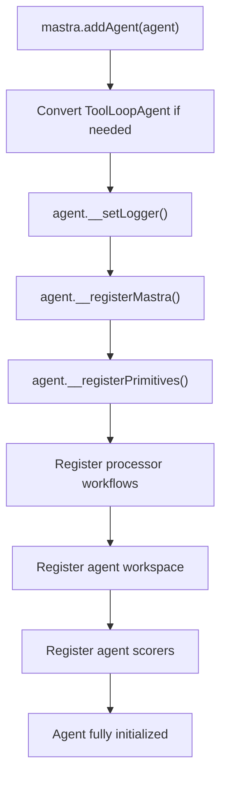
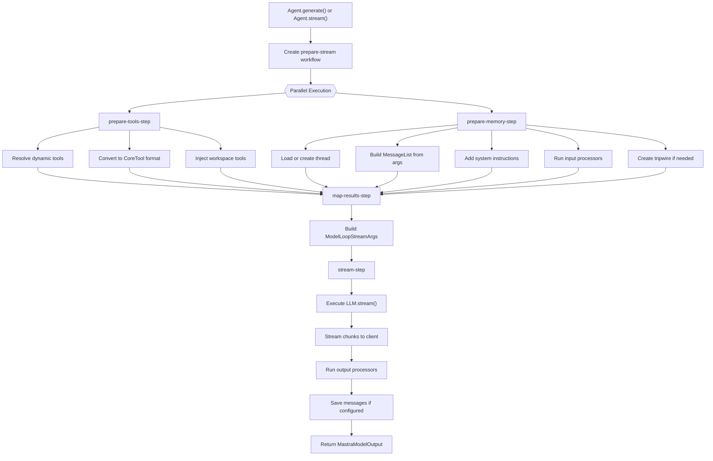
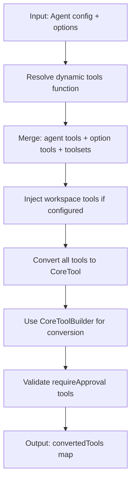
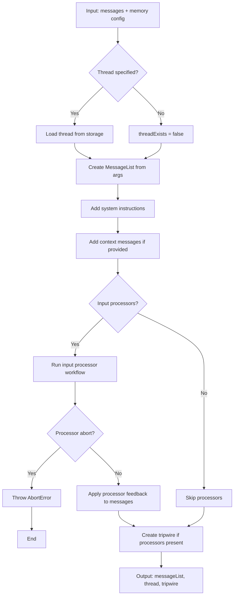
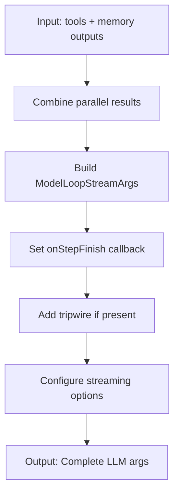
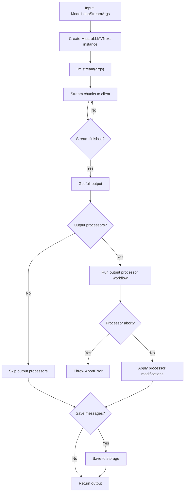
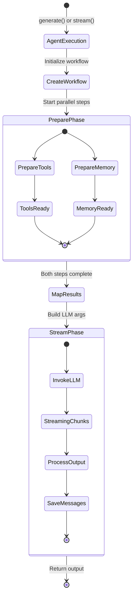

# Agent Configuration and Execution

<details>
<summary>Relevant source files</summary>

The following files were used as context for generating this wiki page:

- [examples/bird-checker-with-express/src/index.ts](examples/bird-checker-with-express/src/index.ts)
- [examples/bird-checker-with-nextjs-and-eval/src/lib/mastra/actions.ts](examples/bird-checker-with-nextjs-and-eval/src/lib/mastra/actions.ts)
- [packages/core/src/action/index.ts](packages/core/src/action/index.ts)
- [packages/core/src/agent/**tests**/utils.test.ts](packages/core/src/agent/__tests__/utils.test.ts)
- [packages/core/src/agent/agent-legacy.ts](packages/core/src/agent/agent-legacy.ts)
- [packages/core/src/agent/agent.test.ts](packages/core/src/agent/agent.test.ts)
- [packages/core/src/agent/agent.ts](packages/core/src/agent/agent.ts)
- [packages/core/src/agent/agent.types.ts](packages/core/src/agent/agent.types.ts)
- [packages/core/src/agent/index.ts](packages/core/src/agent/index.ts)
- [packages/core/src/agent/trip-wire.ts](packages/core/src/agent/trip-wire.ts)
- [packages/core/src/agent/types.ts](packages/core/src/agent/types.ts)
- [packages/core/src/agent/utils.ts](packages/core/src/agent/utils.ts)
- [packages/core/src/agent/workflows/prepare-stream/index.ts](packages/core/src/agent/workflows/prepare-stream/index.ts)
- [packages/core/src/agent/workflows/prepare-stream/map-results-step.ts](packages/core/src/agent/workflows/prepare-stream/map-results-step.ts)
- [packages/core/src/agent/workflows/prepare-stream/prepare-memory-step.ts](packages/core/src/agent/workflows/prepare-stream/prepare-memory-step.ts)
- [packages/core/src/agent/workflows/prepare-stream/prepare-tools-step.ts](packages/core/src/agent/workflows/prepare-stream/prepare-tools-step.ts)
- [packages/core/src/agent/workflows/prepare-stream/stream-step.ts](packages/core/src/agent/workflows/prepare-stream/stream-step.ts)
- [packages/core/src/llm/index.ts](packages/core/src/llm/index.ts)
- [packages/core/src/llm/model/model.test.ts](packages/core/src/llm/model/model.test.ts)
- [packages/core/src/llm/model/model.ts](packages/core/src/llm/model/model.ts)
- [packages/core/src/mastra/index.ts](packages/core/src/mastra/index.ts)
- [packages/core/src/observability/types/tracing.ts](packages/core/src/observability/types/tracing.ts)
- [packages/core/src/stream/aisdk/v5/execute.ts](packages/core/src/stream/aisdk/v5/execute.ts)
- [packages/core/src/tools/tool-builder/builder.test.ts](packages/core/src/tools/tool-builder/builder.test.ts)
- [packages/core/src/tools/tool-builder/builder.ts](packages/core/src/tools/tool-builder/builder.ts)
- [packages/core/src/tools/tool.ts](packages/core/src/tools/tool.ts)
- [packages/core/src/tools/types.ts](packages/core/src/tools/types.ts)

</details>

## Purpose and Scope

This document covers the configuration and execution architecture of agents in Mastra. It details the `AgentConfig` interface, agent initialization process, the `generate()` and `stream()` execution methods, execution options, and the internal `prepare-stream` workflow pipeline that orchestrates agent execution.

For LLM provider integration and model routing, see [LLM Integration and Model Router](#3.2). For tool execution mechanics, see [Tool Integration and Execution](#3.3). For memory management, see [Agent Memory System](#3.4).

---

## Agent Configuration

### AgentConfig Interface

The `AgentConfig` interface defines all configuration options for creating an agent. It is a generic type that accepts type parameters for agent ID, tools, output schema, and request context validation.

**Key Configuration Fields**

| Field                  | Type                                                      | Required | Description                                  |
| ---------------------- | --------------------------------------------------------- | -------- | -------------------------------------------- |
| `id`                   | `string`                                                  | Yes      | Unique identifier for the agent              |
| `name`                 | `string`                                                  | Yes      | Display name for the agent                   |
| `description`          | `string`                                                  | No       | Purpose and capabilities description         |
| `instructions`         | `DynamicArgument<AgentInstructions>`                      | Yes      | System instructions guiding agent behavior   |
| `model`                | `MastraModelConfig \| DynamicModel \| ModelWithRetries[]` | Yes      | Language model configuration                 |
| `maxRetries`           | `number`                                                  | No       | Maximum retries for model calls (default: 0) |
| `tools`                | `DynamicArgument<ToolsInput>`                             | No       | Tools available to the agent                 |
| `workflows`            | `DynamicArgument<Record<string, Workflow>>`               | No       | Workflows the agent can execute              |
| `memory`               | `DynamicArgument<MastraMemory>`                           | No       | Memory module for stateful context           |
| `workspace`            | `DynamicArgument<Workspace>`                              | No       | File storage and code execution environment  |
| `inputProcessors`      | `DynamicArgument<InputProcessorOrWorkflow[]>`             | No       | Pre-processing pipeline                      |
| `outputProcessors`     | `DynamicArgument<OutputProcessorOrWorkflow[]>`            | No       | Post-processing pipeline                     |
| `maxProcessorRetries`  | `number`                                                  | No       | Maximum processor retry attempts             |
| `scorers`              | `DynamicArgument<MastraScorers>`                          | No       | Evaluation scorers for observability         |
| `agents`               | `DynamicArgument<Record<string, Agent>>`                  | No       | Sub-agents for delegation                    |
| `voice`                | `MastraVoice`                                             | No       | Speech input/output capabilities             |
| `defaultOptions`       | `DynamicArgument<AgentExecutionOptions>`                  | No       | Default execution options                    |
| `requestContextSchema` | `ZodSchema`                                               | No       | Schema for validating request context        |

Sources: [packages/core/src/agent/types.ts:133-275]()

### Model Configuration Options

Agents support three model configuration patterns:

**1. Single Model Configuration**

```typescript
const agent = new Agent({
  id: 'weather-agent',
  name: 'Weather Agent',
  instructions: 'You provide weather information',
  model: 'openai/gpt-4o',
  // or
  model: openai('gpt-4o'),
  // or
  model: { provider: 'openai', modelId: 'gpt-4o' },
})
```

**2. Dynamic Model Selection**

```typescript
const agent = new Agent({
  id: 'adaptive-agent',
  name: 'Adaptive Agent',
  instructions: 'You adapt to user preferences',
  model: ({ requestContext }) => {
    const tier = requestContext.get('userTier')
    return tier === 'premium' ? 'openai/gpt-4o' : 'openai/gpt-3.5-turbo'
  },
})
```

**3. Model Fallback Array**

```typescript
const agent = new Agent({
  id: 'reliable-agent',
  name: 'Reliable Agent',
  instructions: 'You provide reliable service',
  model: [
    { model: 'openai/gpt-4o', maxRetries: 2 },
    { model: 'anthropic/claude-3-5-sonnet-20241022', maxRetries: 2 },
    { model: 'google/gemini-1.5-pro', maxRetries: 2 },
  ],
})
```

When using a fallback array, the agent attempts each model in order. If a model fails after its `maxRetries`, the agent moves to the next model. The array is stored internally as `ModelFallbacks` with generated IDs and enabled flags.

Sources: [packages/core/src/agent/agent.ts:211-237](), [packages/core/src/agent/types.ts:116-131]()

### Dynamic Configuration with Request Context

Many configuration fields accept `DynamicArgument<T>`, which can be either a static value or a function that receives `requestContext`:

```typescript
type DynamicArgument<T, TRequestContext = unknown> =
  | T
  | (({
      requestContext,
    }: {
      requestContext: RequestContext<TRequestContext>
    }) => T | Promise<T>)
```

This enables context-aware configuration:

```typescript
const agent = new Agent({
  id: 'multi-tenant-agent',
  name: 'Multi-tenant Agent',
  instructions: ({ requestContext }) => {
    const tenant = requestContext.get('tenantId')
    return `You are an assistant for ${tenant}. Follow their specific guidelines...`
  },
  tools: ({ requestContext }) => {
    const permissions = requestContext.get('permissions')
    return permissions.includes('admin')
      ? { ...regularTools, ...adminTools }
      : regularTools
  },
})
```

Sources: [packages/core/src/agent/types.ts:133-275](), [packages/core/src/types.ts:82-86]()

---

## Agent Initialization

### Constructor Process

The `Agent` constructor performs several initialization steps:



**Constructor Steps** ([packages/core/src/agent/agent.ts:186-305]()):

1. **Model Validation**: Throws `MastraError` if `model` is missing or if model array is empty
2. **Model Processing**:
   - Single model: stored as-is
   - Model array: converted to `ModelFallbacks` with IDs and retry counts
3. **Default Options**: Stores `defaultOptions`, `defaultGenerateOptionsLegacy`, `defaultStreamOptionsLegacy`, `defaultNetworkOptions`
4. **Voice Initialization**: Creates `DefaultVoice` if not provided, registers tools and instructions with voice
5. **Mastra Registration**: If `mastra` is provided, registers agent and primitives

Sources: [packages/core/src/agent/agent.ts:186-305]()

### Registration with Mastra

When an agent is added to a Mastra instance via `mastra.addAgent()`, additional initialization occurs:



**Registration Steps** ([packages/core/src/mastra/index.ts:843-925]()):

1. **ToolLoopAgent Conversion**: If the agent is an AI SDK v6 `ToolLoopAgent`, it's converted to a Mastra `Agent`
2. **Logger Injection**: Sets the Mastra logger on the agent
3. **Mastra Registration**: Provides agent access to the Mastra instance
4. **Primitives Injection**: Injects `logger`, `storage`, `agents`, `tts`, `vectors`
5. **Processor Workflows**: Registers configured processor workflows (input/output)
6. **Workspace Registration**: Registers agent's workspace in global registry
7. **Scorer Registration**: Makes agent-level scorers discoverable via Mastra

Sources: [packages/core/src/mastra/index.ts:843-925]()

---

## Execution Methods

Agents provide two primary execution APIs: **Legacy** (AI SDK v4) and **VNext** (AI SDK v5). Both support synchronous (`generate`) and streaming (`stream`) modes.

### Method Comparison

| Method             | AI SDK Version | Return Type                   | Primary Use Case                       |
| ------------------ | -------------- | ----------------------------- | -------------------------------------- |
| `generateLegacy()` | v4             | `Promise<GenerateTextResult>` | Legacy applications, maxSteps control  |
| `streamLegacy()`   | v4             | `Promise<StreamTextResult>`   | Legacy streaming with stepwise control |
| `generate()`       | v5             | `Promise<FullOutput>`         | Modern synchronous execution           |
| `stream()`         | v5             | `Promise<MastraModelOutput>`  | Modern streaming execution             |

### Generate Method Signatures

**VNext `generate()` Method**

The modern `generate()` method has multiple overloads for different use cases:

```typescript
// Basic text generation
async generate(
  messages: MessageListInput,
  options?: StreamParamsBaseWithoutMessages
): Promise<FullOutput<undefined>>

// Structured output generation
async generate<OUTPUT extends {}>(
  messages: MessageListInput,
  options: StreamParamsBaseWithoutMessages<OUTPUT> & {
    structuredOutput: SerializableStructuredOutputOptions<OUTPUT>;
  }
): Promise<FullOutput<OUTPUT>>
```

**Key Features**:

- First parameter is `messages` (array of messages or `MessageList`)
- Second parameter is `options` object (no messages in options)
- Returns `FullOutput<OUTPUT>` with complete response data
- Supports structured output with schema validation

**Legacy `generateLegacy()` Method**

```typescript
// Basic text generation
async generateLegacy(
  prompt: string | CoreMessage[],
  options?: AgentGenerateOptions
): Promise<GenerateTextResult>

// With output schema
async generateLegacy<Output extends ZodSchema | JSONSchema7>(
  prompt: string | CoreMessage[],
  options: AgentGenerateOptions<Output> & { output: Output }
): Promise<GenerateTextResult<Output>>
```

**Key Features**:

- Single parameter combining prompt and options (AI SDK v4 pattern)
- Returns `GenerateTextResult` with text, toolCalls, usage
- `maxSteps` controls multi-turn tool calling

Sources: [packages/core/src/agent/agent.ts:1094-1138](), [packages/core/src/agent/agent.ts:2022-2081]()

### Stream Method Signatures

**VNext `stream()` Method**

```typescript
// Basic streaming
async stream(
  messages: MessageListInput,
  options?: StreamParamsBaseWithoutMessages
): Promise<MastraModelOutput<undefined>>

// Structured output streaming
async stream<OUTPUT extends {}>(
  messages: MessageListInput,
  options: StreamParamsBaseWithoutMessages<OUTPUT> & {
    structuredOutput: SerializableStructuredOutputOptions<OUTPUT>;
  }
): Promise<MastraModelOutput<OUTPUT>>
```

**Returns**: `MastraModelOutput` instance with:

- `fullStream`: Complete stream of all chunk types
- `textStream`: Text-only stream
- `objectStream`: Structured output stream
- `getFullOutput()`: Awaitable final output
- `finishReason`: Completion reason

**Legacy `streamLegacy()` Method**

```typescript
async streamLegacy(
  prompt: string | CoreMessage[],
  options?: AgentStreamOptions
): Promise<StreamTextResult>
```

**Returns**: `StreamTextResult` with:

- `textStream`: AsyncIterable of text deltas
- `fullStream`: Complete event stream
- `onFinish`: Callback when streaming completes

Sources: [packages/core/src/agent/agent.ts:1140-1203](), [packages/core/src/agent/agent.ts:2083-2162]()

### Client-Side Tool Execution

Both `generate()` and `stream()` support client-side tools that require user interaction:

```typescript
const result = await agent.generate('Change the theme to dark mode', {
  clientTools: {
    setTheme: createTool({
      id: 'setTheme',
      description: 'Changes the application theme',
      inputSchema: z.object({ theme: z.enum(['light', 'dark']) }),
      execute: async ({ theme }) => {
        // Executes in client browser
        document.body.className = theme
        return { success: true }
      },
    }),
  },
})
```

The execution flow for client tools:

1. Agent generates tool call with `finishReason: 'tool-calls'`
2. Client SDK (`@mastra/client-js`) detects client tools
3. Client executes the tool locally
4. Client sends tool result back to agent
5. Agent continues generation with tool result

Sources: [packages/core/src/agent/agent.test.ts:604-689](), [client-sdks/client-js/src/resources/agent.ts:43-110]()

---

## Execution Options

### AgentExecutionOptions (VNext)

The `AgentExecutionOptions` interface defines options for VNext methods (`generate()` and `stream()`):

**Core Options**

| Option             | Type                                                                   | Description                                |
| ------------------ | ---------------------------------------------------------------------- | ------------------------------------------ |
| `memory`           | `AgentMemoryOption`                                                    | Thread and resource identifiers for memory |
| `instructions`     | `SystemMessage`                                                        | Override agent's default instructions      |
| `context`          | `CoreMessage[]`                                                        | Additional context messages                |
| `maxSteps`         | `number`                                                               | Maximum steps for multi-turn execution     |
| `toolChoice`       | `'auto' \| 'none' \| 'required' \| { type: 'tool', toolName: string }` | Tool selection strategy                    |
| `stopWhen`         | `(params: StopWhenParams) => boolean`                                  | Custom stopping condition                  |
| `structuredOutput` | `StructuredOutputOptions`                                              | Schema for validated output                |
| `clientTools`      | `ToolsInput`                                                           | Tools executed on client side              |

**Processing and Tracing**

| Option                | Type                          | Description                            |
| --------------------- | ----------------------------- | -------------------------------------- |
| `inputProcessors`     | `InputProcessorOrWorkflow[]`  | Override agent's input processors      |
| `outputProcessors`    | `OutputProcessorOrWorkflow[]` | Override agent's output processors     |
| `maxProcessorRetries` | `number`                      | Max processor retry attempts           |
| `tracingContext`      | `TracingContext`              | Span hierarchy for distributed tracing |
| `tracingOptions`      | `TracingOptions`              | Options for starting new traces        |

**Model Settings**

| Option                      | Type              | Description                                        |
| --------------------------- | ----------------- | -------------------------------------------------- |
| `modelSettings.temperature` | `number`          | Sampling temperature                               |
| `modelSettings.topP`        | `number`          | Nucleus sampling parameter                         |
| `modelSettings.maxTokens`   | `number`          | Maximum output tokens                              |
| `providerOptions`           | `ProviderOptions` | Provider-specific options (e.g., reasoning effort) |

Sources: [packages/core/src/agent/agent.types.ts:1-137]()

### AgentGenerateOptions (Legacy)

Legacy options for `generateLegacy()` method:

**Key Differences from VNext**:

- Uses `threadId` and `resourceId` fields (deprecated) instead of `memory` object
- Uses `onStepFinish` callback instead of separate processor pipeline
- Uses `output` for structured output instead of `structuredOutput`
- Uses `experimental_output` for structured output alongside tool calls

```typescript
interface AgentGenerateOptions<OUTPUT, EXPERIMENTAL_OUTPUT> {
  // Memory (deprecated pattern)
  threadId?: string
  resourceId?: string
  memory?: AgentMemoryOption // New pattern

  // Execution control
  maxSteps?: number
  toolChoice?: 'auto' | 'none' | 'required' | { type: 'tool'; toolName: string }

  // Callbacks
  onStepFinish?: GenerateTextOnStepFinishCallback

  // Structured output
  output?: OutputType | OUTPUT
  experimental_output?: EXPERIMENTAL_OUTPUT

  // Additional options
  instructions?: SystemMessage
  toolsets?: ToolsetsInput
  context?: CoreMessage[]
  savePerStep?: boolean
}
```

Sources: [packages/core/src/agent/types.ts:288-362]()

### Memory Options

The `memory` option provides thread and resource identification:

```typescript
type AgentMemoryOption = {
  thread: string | (Partial<StorageThreadType> & { id: string })
  resource: string
  options?: MemoryConfig
}
```

**Usage Patterns**:

```typescript
// Simple thread and resource
await agent.generate('Hello', {
  memory: {
    thread: 'thread-123',
    resource: 'user-456',
  },
})

// Thread with metadata
await agent.generate('Hello', {
  memory: {
    thread: {
      id: 'thread-123',
      title: 'Customer Support Session',
      metadata: { customerId: 'cust-789', priority: 'high' },
    },
    resource: 'user-456',
    options: { readOnly: false },
  },
})
```

If `memory` is not provided, agents can still use memory if configured at agent level, but messages won't be persisted to storage.

Sources: [packages/core/src/agent/types.ts:277-281]()

---

## Prepare-Stream Workflow Pipeline

All agent execution (both `generate()` and `stream()`, Legacy and VNext) flows through an internal workflow pipeline called **prepare-stream**. This workflow orchestrates tool preparation, memory loading, processor execution, and LLM invocation.

### Pipeline Architecture



**Pipeline Characteristics**:

- **Parallel Preparation**: Tools and memory are prepared concurrently for optimal performance
- **Type Safety**: Each step has defined input/output schemas using Zod
- **Error Handling**: Pipeline catches errors and wraps in `MastraError` with context
- **Tracing**: All steps participate in distributed tracing with spans
- **Flexibility**: Workflow engine allows custom execution engines (default, evented, Inngest)

Sources: [packages/core/src/agent/workflows/prepare-stream/index.ts:20-92]()

### Step 1: prepare-tools-step

**Purpose**: Resolves dynamic tools, converts to `CoreTool` format, injects workspace tools, and validates tool configurations.



**Tool Resolution Logic**:

1. **Dynamic Tool Resolution**: If `agent.tools` is a function, call it with `requestContext`
2. **Tool Merging**: Combine tools from multiple sources (order matters):
   - Agent-configured tools
   - Execution option tools
   - Toolsets from options
3. **Workspace Tool Injection**: If agent has workspace, inject filesystem, sandbox, and search tools
4. **Format Conversion**: Use `CoreToolBuilder` to convert all tools to `CoreTool` format compatible with AI SDK
5. **Validation**: Ensure tools requiring approval have execute functions defined

**Output Schema**:

```typescript
prepareToolsStepOutputSchema = z.object({
  convertedTools: z.record(z.string(), z.custom<InternalCoreTool>()),
})
```

Sources: [packages/core/src/agent/workflows/prepare-stream/prepare-tools-step.ts:1-140]()

### Step 2: prepare-memory-step

**Purpose**: Loads conversation history, builds message list with system instructions, runs input processors, and creates tripwire for processor validation.



**Key Operations**:

1. **Thread Loading**:
   - If `memory.thread` provided, load from storage or prepare for creation
   - Thread existence tracked in `threadExists` flag
2. **MessageList Construction**:
   - Convert input messages to internal `MessageList` format
   - Add system instructions at the beginning
   - Append context messages if provided

3. **Input Processor Execution**:
   - Run processor workflow if configured
   - Processors can abort execution with feedback
   - Apply processor feedback to messages
   - Track processor state for retry handling

4. **Tripwire Creation**:
   - If processors are configured, create a tripwire
   - Tripwire validates LLM output against processor expectations
   - Enables automatic retry on validation failure

**Output Schema**:

```typescript
prepareMemoryStepOutputSchema = z.object({
  messageList: z.custom<MessageList>().nullable(),
  thread: z.custom<StorageThreadType>().nullable(),
  threadExists: z.boolean(),
  tripwire: z.custom<TripWire>().nullable(),
  processorStates: z.custom<Map<string, ProcessorState>>().optional(),
})
```

Sources: [packages/core/src/agent/workflows/prepare-stream/prepare-memory-step.ts:1-228]()

### Step 3: map-results-step

**Purpose**: Combines outputs from parallel steps, builds final arguments for LLM invocation, and sets up callbacks for message persistence.



**Callback Configuration**:

The `onStepFinish` callback handles:

- **Thread Creation**: Creates thread on first step if not exists
- **Message Persistence**: Saves messages if `savePerStep: true`
- **User Callback**: Invokes user-provided `onStepFinish` if defined

**Tripwire Integration**:

If processors are configured, adds tripwire to LLM arguments:

```typescript
{
  tripwire: {
    validator: async (output) => {
      const result = await tripwire.validate(output)
      if (result.shouldRetry) {
        throw new APICallError({
          message: result.feedback,
          // ... retry logic
        })
      }
    }
  }
}
```

The tripwire ensures LLM output meets processor requirements, triggering retries with feedback if validation fails.

Sources: [packages/core/src/agent/workflows/prepare-stream/map-results-step.ts:34-162]()

### Step 4: stream-step

**Purpose**: Invokes the LLM with prepared arguments, streams responses, runs output processors, and handles message persistence.



**LLM Invocation**:

The step creates a `MastraLLMVNext` instance and calls its `stream()` method:

```typescript
const llm = new MastraLLMVNext({
  model: resolvedModel,
  mastra,
  tracingContext,
  options: { tracingPolicy },
})

const output = await llm.stream({
  ...streamArgs,
  maxSteps,
  toolChoice,
  temperature,
  // ... other args
})
```

**Output Processing Pipeline**:

1. **Streaming**: Chunks are streamed to client via `MastraModelOutput`
2. **Completion**: Wait for stream to finish, get full output
3. **Output Processors**: Run processor workflow on complete output
4. **Message Persistence**: Save messages to storage if configured and not read-only

**Error Handling**:

- Processor abort errors are caught and wrapped in `MastraError`
- LLM errors propagate with full context (model, provider, runId, threadId)
- Storage errors during save are logged but don't fail the request

Sources: [packages/core/src/agent/workflows/prepare-stream/stream-step.ts:1-150]()

### State Flow Diagram



**State Transitions**:

1. **AgentExecution → CreateWorkflow**: Agent method called, workflow instantiated
2. **CreateWorkflow → PreparePhase**: Parallel tool and memory preparation begins
3. **PreparePhase → MapResults**: Both parallel steps complete successfully
4. **MapResults → StreamPhase**: Arguments built, LLM invocation ready
5. **StreamPhase → [*]**: Streaming completes, output processors run, messages saved

**Error States** (not shown):

- Processor abort: Throws `AbortError`, workflow bails
- Tripwire failure: Triggers retry if retries remaining
- LLM error: Wrapped in `MastraError`, propagates to caller

Sources: [packages/core/src/agent/workflows/prepare-stream/index.ts:20-92]()

---

## Sources Summary

**Agent Configuration**:

- [packages/core/src/agent/types.ts:133-275]()
- [packages/core/src/agent/agent.ts:186-305]()

**Agent Initialization**:

- [packages/core/src/agent/agent.ts:186-305]()
- [packages/core/src/mastra/index.ts:843-925]()

**Execution Methods**:

- [packages/core/src/agent/agent.ts:1094-1203]()
- [packages/core/src/agent/agent.ts:2022-2162]()
- [packages/core/src/agent/agent.test.ts:604-689]()
- [client-sdks/client-js/src/resources/agent.ts:43-110]()

**Execution Options**:

- [packages/core/src/agent/agent.types.ts:1-137]()
- [packages/core/src/agent/types.ts:288-443]()

**Prepare-Stream Pipeline**:

- [packages/core/src/agent/workflows/prepare-stream/index.ts:20-92]()
- [packages/core/src/agent/workflows/prepare-stream/prepare-tools-step.ts:1-140]()
- [packages/core/src/agent/workflows/prepare-stream/prepare-memory-step.ts:1-228]()
- [packages/core/src/agent/workflows/prepare-stream/map-results-step.ts:34-162]()
- [packages/core/src/agent/workflows/prepare-stream/stream-step.ts:1-150]()
