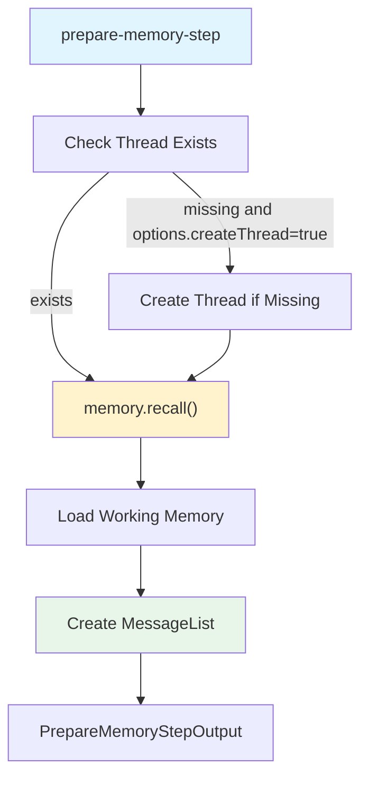
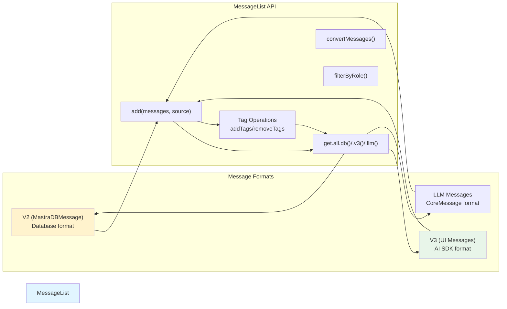
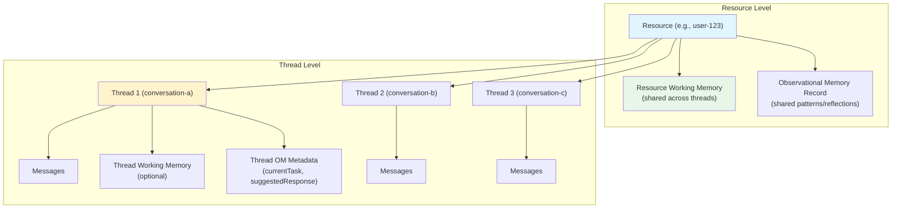
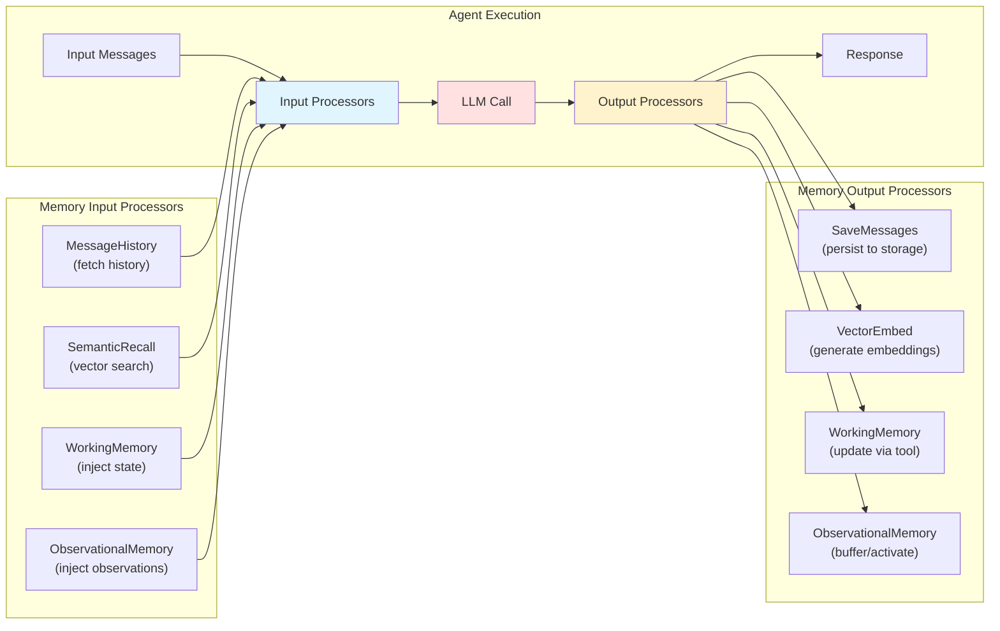
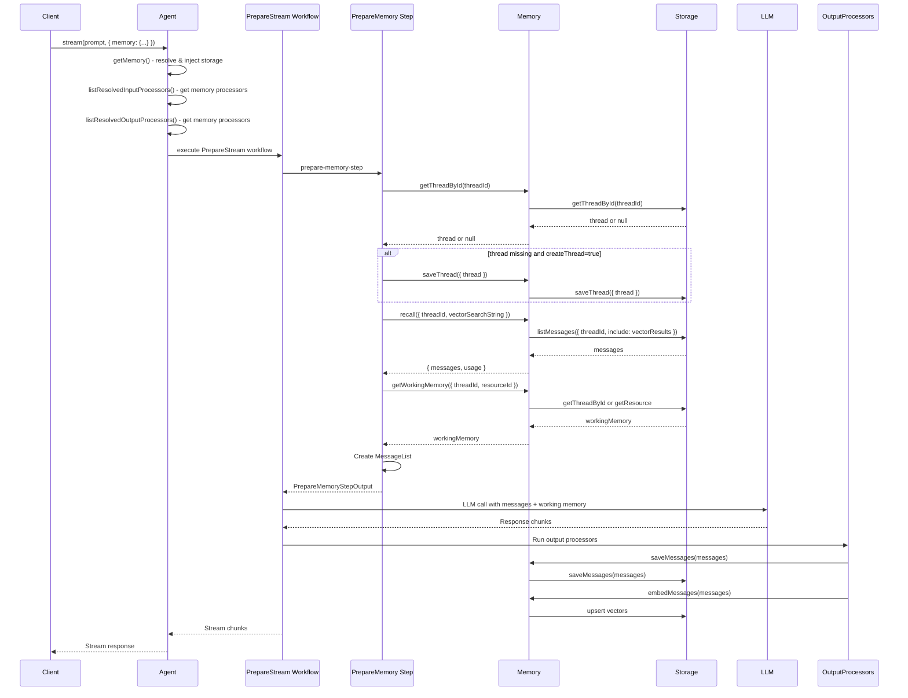

# Agent Memory System

<details>
<summary>Relevant source files</summary>

The following files were used as context for generating this wiki page:

- [examples/bird-checker-with-express/src/index.ts](examples/bird-checker-with-express/src/index.ts)
- [examples/bird-checker-with-nextjs-and-eval/src/lib/mastra/actions.ts](examples/bird-checker-with-nextjs-and-eval/src/lib/mastra/actions.ts)
- [packages/agent-builder/integration-tests/.gitignore](packages/agent-builder/integration-tests/.gitignore)
- [packages/agent-builder/integration-tests/README.md](packages/agent-builder/integration-tests/README.md)
- [packages/agent-builder/integration-tests/docker-compose.yml](packages/agent-builder/integration-tests/docker-compose.yml)
- [packages/agent-builder/integration-tests/src/fixtures/minimal-mastra-project/.gitignore](packages/agent-builder/integration-tests/src/fixtures/minimal-mastra-project/.gitignore)
- [packages/agent-builder/integration-tests/src/fixtures/minimal-mastra-project/env.example](packages/agent-builder/integration-tests/src/fixtures/minimal-mastra-project/env.example)
- [packages/core/src/action/index.ts](packages/core/src/action/index.ts)
- [packages/core/src/agent/**tests**/utils.test.ts](packages/core/src/agent/__tests__/utils.test.ts)
- [packages/core/src/agent/agent-legacy.ts](packages/core/src/agent/agent-legacy.ts)
- [packages/core/src/agent/agent.test.ts](packages/core/src/agent/agent.test.ts)
- [packages/core/src/agent/agent.ts](packages/core/src/agent/agent.ts)
- [packages/core/src/agent/agent.types.ts](packages/core/src/agent/agent.types.ts)
- [packages/core/src/agent/index.ts](packages/core/src/agent/index.ts)
- [packages/core/src/agent/trip-wire.ts](packages/core/src/agent/trip-wire.ts)
- [packages/core/src/agent/types.ts](packages/core/src/agent/types.ts)
- [packages/core/src/agent/utils.ts](packages/core/src/agent/utils.ts)
- [packages/core/src/agent/workflows/prepare-stream/index.ts](packages/core/src/agent/workflows/prepare-stream/index.ts)
- [packages/core/src/agent/workflows/prepare-stream/map-results-step.ts](packages/core/src/agent/workflows/prepare-stream/map-results-step.ts)
- [packages/core/src/agent/workflows/prepare-stream/prepare-memory-step.ts](packages/core/src/agent/workflows/prepare-stream/prepare-memory-step.ts)
- [packages/core/src/agent/workflows/prepare-stream/prepare-tools-step.ts](packages/core/src/agent/workflows/prepare-stream/prepare-tools-step.ts)
- [packages/core/src/agent/workflows/prepare-stream/stream-step.ts](packages/core/src/agent/workflows/prepare-stream/stream-step.ts)
- [packages/core/src/llm/index.ts](packages/core/src/llm/index.ts)
- [packages/core/src/llm/model/model.test.ts](packages/core/src/llm/model/model.test.ts)
- [packages/core/src/llm/model/model.ts](packages/core/src/llm/model/model.ts)
- [packages/core/src/mastra/index.ts](packages/core/src/mastra/index.ts)
- [packages/core/src/memory/memory.ts](packages/core/src/memory/memory.ts)
- [packages/core/src/memory/types.ts](packages/core/src/memory/types.ts)
- [packages/core/src/observability/types/tracing.ts](packages/core/src/observability/types/tracing.ts)
- [packages/core/src/stream/aisdk/v5/execute.ts](packages/core/src/stream/aisdk/v5/execute.ts)
- [packages/core/src/tools/tool-builder/builder.test.ts](packages/core/src/tools/tool-builder/builder.test.ts)
- [packages/core/src/tools/tool-builder/builder.ts](packages/core/src/tools/tool-builder/builder.ts)
- [packages/core/src/tools/tool.ts](packages/core/src/tools/tool.ts)
- [packages/core/src/tools/types.ts](packages/core/src/tools/types.ts)
- [packages/memory/integration-tests/docker-compose.yml](packages/memory/integration-tests/docker-compose.yml)
- [packages/memory/integration-tests/src/agent-memory.test.ts](packages/memory/integration-tests/src/agent-memory.test.ts)
- [packages/memory/integration-tests/src/processors.test.ts](packages/memory/integration-tests/src/processors.test.ts)
- [packages/memory/integration-tests/src/streaming-memory.test.ts](packages/memory/integration-tests/src/streaming-memory.test.ts)
- [packages/memory/integration-tests/src/test-utils.ts](packages/memory/integration-tests/src/test-utils.ts)
- [packages/memory/integration-tests/src/with-libsql-storage.test.ts](packages/memory/integration-tests/src/with-libsql-storage.test.ts)
- [packages/memory/integration-tests/src/with-pg-storage.test.ts](packages/memory/integration-tests/src/with-pg-storage.test.ts)
- [packages/memory/integration-tests/src/with-upstash-storage.test.ts](packages/memory/integration-tests/src/with-upstash-storage.test.ts)
- [packages/memory/integration-tests/src/worker/generic-memory-worker.ts](packages/memory/integration-tests/src/worker/generic-memory-worker.ts)
- [packages/memory/integration-tests/src/working-memory.test.ts](packages/memory/integration-tests/src/working-memory.test.ts)
- [packages/memory/integration-tests/vitest.config.ts](packages/memory/integration-tests/vitest.config.ts)
- [packages/memory/src/index.test.ts](packages/memory/src/index.test.ts)
- [packages/memory/src/index.ts](packages/memory/src/index.ts)
- [packages/memory/src/tools/working-memory.ts](packages/memory/src/tools/working-memory.ts)

</details>

## Purpose and Scope

This document covers how memory integrates with agents in Mastra, including memory configuration, message management via `MessageList`, thread/resource scoping, and the automatic injection of memory processors into the agent execution pipeline.

For information about:

- Memory storage backends and adapters, see [Memory System Architecture](#7.1)
- Storage interfaces and message persistence, see [Thread Management and Message Storage](#7.2)
- Three-tier observational memory implementation, see [Observational Memory System](#7.9)
- Working memory tool and schema modes, see [Working Memory and Tool Integration](#7.10)

---

## Memory Configuration in Agents

### Basic Setup

Agents accept a `memory` parameter that can be provided statically or resolved dynamically via a function:

[packages/core/src/agent/agent.ts:162]()

```typescript
#memory?: DynamicArgument<MastraMemory>;
```

The memory can be:

- A `MastraMemory` instance (from `@mastra/memory`)
- A function that returns a `MastraMemory` instance (for dynamic configuration based on `RequestContext`)

[packages/core/src/agent/agent.ts:280-282]()

### Storage Injection

When an agent's memory doesn't have its own storage configured, the agent automatically injects storage from its parent `Mastra` instance. This happens in the `getMemory()` method:

[packages/core/src/agent/agent.ts:800-862]()

The injection logic:

1. Resolves the memory (if it's a function)
2. Checks if memory has `hasOwnStorage === false`
3. Injects `mastra.getStorage()` into the memory
4. Validates that storage is available before returning

This ensures memory can always persist messages without requiring duplicate storage configuration.

**Sources:** [packages/core/src/agent/agent.ts:162](), [packages/core/src/agent/agent.ts:280-282](), [packages/core/src/agent/agent.ts:800-862]()

---

## Memory Preparation in Agent Execution

### Prepare Memory Step

During agent execution, the `prepare-memory-step` loads conversation history and working memory before the LLM call. This step is part of the internal workflow created by `createPrepareStreamWorkflow()`:



**Prepare Memory Step Workflow**

The step returns a `PrepareMemoryStepOutput` containing:

- `thread`: Thread metadata
- `messageList`: `MessageList` instance with conversation history
- `workingMemory`: Current working memory state (string or object)
- `memorySystemMessage`: System message for working memory instructions

[packages/core/src/agent/workflows/prepare-stream/prepare-memory-step.ts:1-194]()

### Recall Process

The `memory.recall()` method fetches messages with optional semantic search:

[packages/memory/src/index.ts:151-312]()

Key features:

- **Pagination**: Controlled by `perPage` (defaults to `threadConfig.lastMessages`)
- **Semantic Search**: When `vectorSearchString` is provided and `semanticRecall` is enabled
- **Message Range**: Fetches surrounding messages for semantic recall results
- **History Disabling**: `lastMessages: false` returns empty array (disables history)

**Sources:** [packages/core/src/agent/workflows/prepare-stream/prepare-memory-step.ts:1-194](), [packages/memory/src/index.ts:151-312]()

---

## MessageList: Central Message Management

### MessageList Class

`MessageList` is the central data structure for managing agent messages. It provides a unified interface for converting between different message formats:



**MessageList Format Conversion**

[packages/core/src/agent/message-list/index.ts:1-500]()

### Format Details

**V2 (Database Format - `MastraDBMessage`):**

- Used for storage persistence
- Includes metadata fields: `threadId`, `resourceId`, `createdAt`
- Content structure: `{ format: 2, parts: [...] }`

**V3 (UI Format - `UIMessage`):**

- Used for client-server communication
- AI SDK compatible format
- Supports attachments, tool calls, streaming metadata

**LLM Format (`CoreMessage`):**

- Used for LLM API calls
- Role-based: `system`, `user`, `assistant`, `tool`
- Optimized for model consumption

### Working Memory Tag Management

`MessageList` handles working memory tags that mark messages for exclusion from storage:

[packages/core/src/agent/message-list/index.ts:1-500]()

Tags like `<working_memory_start>` and `<working_memory_end>` are:

- Added during message preparation
- Stripped before saving to storage
- Used to inject working memory content without persisting it

**Sources:** [packages/core/src/agent/message-list/index.ts:1-500]()

---

## Thread and Resource Scoping

### Scoping Model

Memory in Mastra uses a two-level scoping model:



**Resource and Thread Scoping Model**

[packages/core/src/memory/types.ts:38-45]()

### Resource Scope

A **resource** represents a user, organization, or any entity that owns multiple conversation threads:

- **Resource ID**: Unique identifier (e.g., `user-123`, `org-456`)
- **Resource Working Memory**: Shared state across all threads for that resource
- **Observational Memory**: Shared patterns and reflections

### Thread Scope

A **thread** represents a single conversation or task:

[packages/core/src/memory/types.ts:38-45]()

- **Thread ID**: Unique identifier (e.g., `thread-abc`)
- **Thread Working Memory**: Isolated state for this conversation (optional)
- **Thread Messages**: Conversation history
- **Thread Metadata**: Custom key-value data, including Observational Memory state

### Configuring Scope

Working memory and semantic recall support both scopes:

[packages/core/src/memory/types.ts:172-182]() (Working Memory scope)

```typescript
// Resource scope (default) - shared across threads
memory: new Memory({
  options: {
    workingMemory: {
      enabled: true,
      scope: 'resource', // default
    },
  },
})

// Thread scope - isolated per conversation
memory: new Memory({
  options: {
    workingMemory: {
      enabled: true,
      scope: 'thread',
    },
  },
})
```

**Sources:** [packages/core/src/memory/types.ts:38-45](), [packages/core/src/memory/types.ts:172-182]()

---

## Memory Processors: Auto-Injection

### Processor Pipeline Integration

Memory automatically provides input and output processors that integrate into the agent's processor pipeline:



**Memory Processor Integration Pipeline**

### Input Processors

Memory provides input processors via `memory.getInputProcessors()`:

[packages/core/src/memory/memory.ts:579-642]()

Default input processors (order matters):

1. **MessageHistory**: Fetches recent conversation history
2. **SemanticRecall**: Performs vector search for relevant past messages
3. **WorkingMemory**: Injects working memory state into system message
4. **ObservationalMemory**: Injects observations and reflections

### Output Processors

Memory provides output processors via `memory.getOutputProcessors()`:

[packages/core/src/memory/memory.ts:644-706]()

Default output processors (order matters):

1. **SaveMessages**: Persists messages to storage
2. **VectorEmbed**: Generates embeddings for semantic recall
3. **WorkingMemory**: Monitors `updateWorkingMemory` tool calls
4. **ObservationalMemory**: Buffers/activates observational memory

### Auto-Injection in Agents

Agents automatically combine memory processors with user-configured processors:

[packages/core/src/agent/agent.ts:599-631]() (Input processors)
[packages/core/src/agent/agent.ts:567-592]() (Output processors)

The order is:

- **Input**: Memory processors → User processors
- **Output**: User processors → Memory processors

This ensures memory operations happen first (input) and last (output).

**Sources:** [packages/core/src/memory/memory.ts:579-642](), [packages/core/src/memory/memory.ts:644-706](), [packages/core/src/agent/agent.ts:599-631](), [packages/core/src/agent/agent.ts:567-592]()

---

## Memory Configuration Options

### MemoryConfigInternal

All memory behavior is controlled via `MemoryConfigInternal`, which can be provided:

- At memory construction time (default config)
- At agent execution time (per-request override)
- At thread level (stored in thread metadata)

[packages/core/src/memory/types.ts:193-346]()

### Key Configuration Fields

```mermaid
graph TB
    subgraph "Message History"
        LastMessages["lastMessages: number | false<br/>(how many recent messages)"]
    end

    subgraph "Working Memory"
        WMEnabled["enabled: boolean"]
        WMScope["scope: 'resource' | 'thread'"]
        WMSchema["schema: StandardSchema<br/>(structured mode)"]
        WMTemplate["template: string<br/>(template mode)"]
        WMVersion["version: 'stable' | 'vnext'<br/>(additive vs replace)"]
    end

    subgraph "Semantic Recall"
        SREnabled["enabled: boolean"]
        SRTopK["topK: number"]
        SRScope["scope: 'resource' | 'thread'"]
        SRRange["messageRange: before/after"]
        SRIndex["indexConfig: metric, type, etc"]
    end

    subgraph "Observational Memory"
        OMEnabled["enabled: boolean"]
        OMModel["model: ModelConfig"]
        OMObserver["observerModel: ModelConfig"]
        OMReflector["reflectorModel: ModelConfig"]
        OMThresholds["thresholds: buffer/activate"]
    end

    subgraph "Title Generation"
        TitleEnabled["enabled: boolean"]
        TitleModel["model: ModelConfig"]
        TitlePrompt["prompt: string"]
    end

    MemoryConfig["MemoryConfigInternal"] --> LastMessages
    MemoryConfig --> WMEnabled
    MemoryConfig --> SREnabled
    MemoryConfig --> OMEnabled
    MemoryConfig --> TitleEnabled

    style MemoryConfig fill:#e1f5ff
```



**MemoryConfigInternal Structure**

### Configuration Merging

The `getMergedThreadConfig()` method deep-merges configurations:

[packages/core/src/memory/memory.ts:350-372]()

Priority (highest to lowest):

1. Per-request config (passed to `agent.generate()` or `agent.stream()`)
2. Thread-level config (stored in thread metadata)
3. Memory instance config (from constructor)
4. Default config (`memoryDefaultOptions`)

### Example Configuration

```typescript
const memory = new Memory({
  options: {
    // Message history
    lastMessages: 20, // or false to disable

    // Working memory
    workingMemory: {
      enabled: true,
      scope: 'resource', // shared across threads
      schema: z.object({
        name: z.string(),
        preferences: z.array(z.string()),
      }),
    },

    // Semantic recall
    semanticRecall: {
      enabled: true,
      topK: 5,
      scope: 'thread', // search within thread only
      messageRange: { before: 2, after: 2 },
    },

    // Observational memory
    observationalMemory: {
      enabled: true,
      model: 'openai/gpt-4o-mini',
      thresholds: {
        bufferPercentage: 20, // start buffering at 20%
        activationPercentage: 100, // activate at 100%
      },
    },

    // Title generation
    generateTitle: {
      enabled: true,
      model: 'openai/gpt-4o-mini',
    },
  },
})
```

**Sources:** [packages/core/src/memory/types.ts:193-346](), [packages/core/src/memory/memory.ts:350-372]()

---

## Agent Execution with Memory

### Complete Flow



**Agent Memory Execution Flow**

### Key Steps

1. **Memory Resolution**: Agent resolves dynamic memory and injects storage
2. **Processor Collection**: Memory provides input/output processors
3. **Memory Preparation**: `prepare-memory-step` loads history and working memory
4. **Recall**: Fetch messages from storage with optional semantic search
5. **Working Memory Load**: Fetch current state from thread or resource
6. **MessageList Creation**: Convert messages to LLM format
7. **LLM Execution**: Call model with prepared messages
8. **Output Processing**: Save messages, generate embeddings, update working memory

**Sources:** [packages/core/src/agent/agent.ts:1-3000](), [packages/core/src/agent/workflows/prepare-stream/index.ts:1-200](), [packages/core/src/agent/workflows/prepare-stream/prepare-memory-step.ts:1-194]()

---

## Working with MessageList

### Creating a MessageList

```typescript
// Create from database messages
const list = new MessageList({
  threadId: 'thread-123',
  resourceId: 'user-456',
})

// Add messages from storage
list.add(dbMessages, 'memory')

// Add new user message
list.add(
  [
    {
      id: 'msg-1',
      role: 'user',
      content: { format: 2, parts: [{ type: 'text', text: 'Hello' }] },
      createdAt: new Date(),
    },
  ],
  'user'
)
```

### Format Conversion

```typescript
// Get messages in different formats
const dbMessages = list.get.all.db() // MastraDBMessage[]
const v3Messages = list.get.all.v3() // UIMessage[]
const llmMessages = list.get.all.llm() // CoreMessage[]

// Convert between formats
const converted = MessageList.convertMessages(messages, {
  from: 'v2',
  to: 'llm',
})
```

### Tag Management

```typescript
// Add working memory tags
list.addTags(['<working_memory_start>'], 0)
list.addTags(['<working_memory_end>'], 5)

// Remove tags before saving
const cleaned = list.removeTags([
  '<working_memory_start>',
  '<working_memory_end>',
])
```

[packages/core/src/agent/message-list/index.ts:1-500]()

**Sources:** [packages/core/src/agent/message-list/index.ts:1-500]()

---

## Memory Context in RequestContext

### MemoryRequestContext

Memory-specific execution context is passed via `RequestContext` under the `'MastraMemory'` key:

[packages/core/src/memory/types.ts:118-165]()

Structure:

```typescript
type MemoryRequestContext = {
  thread?: Partial<StorageThreadType> & { id: string }
  resourceId?: string
  memoryConfig?: MemoryConfigInternal
}
```

This allows processors and tools to access:

- Current thread being processed
- Resource ID for scoping
- Memory configuration for the current request

### Validation

The `parseMemoryRequestContext()` helper safely extracts and validates this context:

[packages/core/src/memory/types.ts:131-165]()

**Sources:** [packages/core/src/memory/types.ts:118-165](), [packages/core/src/memory/types.ts:131-165]()

---

## Thread Metadata and OM State

### Thread Metadata Structure

Threads store Mastra-specific metadata under `thread.metadata.mastra`:

[packages/core/src/memory/types.ts:51-70]()

```typescript
type ThreadMastraMetadata = {
  om?: ThreadOMMetadata // Observational memory state
}

type ThreadOMMetadata = {
  currentTask?: string
  suggestedResponse?: string
  lastObservedAt?: string // ISO timestamp
  lastObservedMessageCursor?: {
    createdAt: string
    id: string
  }
}
```

### Helpers

Safe getter/setter functions prevent mutation:

[packages/core/src/memory/types.ts:80-113]()

```typescript
// Get OM metadata
const omData = getThreadOMMetadata(thread.metadata)

// Set OM metadata (returns new object)
const newMetadata = setThreadOMMetadata(thread.metadata, {
  currentTask: 'Research project',
  suggestedResponse: 'Continue with analysis...',
})
```

**Sources:** [packages/core/src/memory/types.ts:51-70](), [packages/core/src/memory/types.ts:80-113]()

---

## Key Interfaces and Types

### MastraMemory Abstract Class

[packages/core/src/memory/memory.ts:109-440]()

Key methods:

- `recall()`: Fetch messages with optional semantic search
- `getThreadById()`: Retrieve thread metadata
- `listThreads()`: List threads with filtering
- `saveThread()`: Create or update thread
- `getWorkingMemory()`: Fetch working memory state
- `updateWorkingMemory()`: Update working memory
- `getInputProcessors()`: Provide input processors
- `getOutputProcessors()`: Provide output processors

### PrepareMemoryStepOutput

[packages/core/src/agent/workflows/prepare-stream/schema.ts:1-100]()

Output from `prepare-memory-step`:

- `thread`: Thread metadata
- `messageList`: `MessageList` with conversation history
- `workingMemory`: Current working memory (string or object)
- `memorySystemMessage`: System message for working memory

### MemoryConfigInternal

[packages/core/src/memory/types.ts:193-346]()

Complete configuration for all memory features:

- `lastMessages`: Message history limit
- `workingMemory`: Working memory config (scope, schema, template)
- `semanticRecall`: Semantic search config (topK, scope, messageRange)
- `observationalMemory`: OM config (model, thresholds)
- `generateTitle`: Title generation config

**Sources:** [packages/core/src/memory/memory.ts:109-440](), [packages/core/src/agent/workflows/prepare-stream/schema.ts:1-100](), [packages/core/src/memory/types.ts:193-346]()
