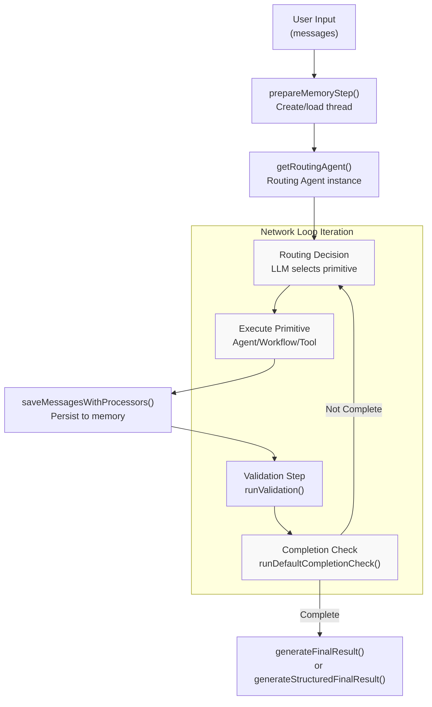
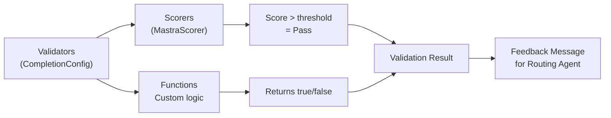
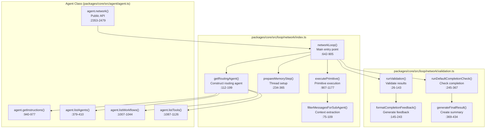
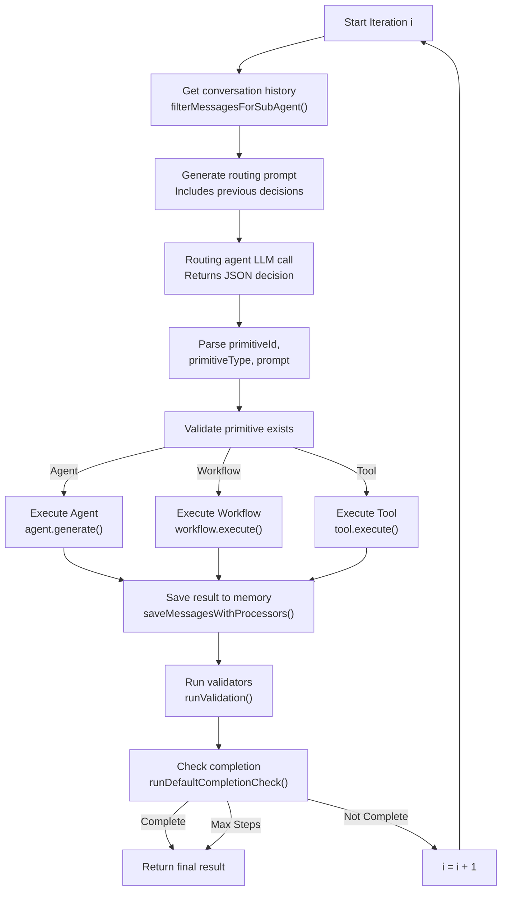

# Agent Networks and Multi-Agent Collaboration

<details>
<summary>Relevant source files</summary>

The following files were used as context for generating this wiki page:

- [examples/bird-checker-with-express/src/index.ts](examples/bird-checker-with-express/src/index.ts)
- [examples/bird-checker-with-nextjs-and-eval/src/lib/mastra/actions.ts](examples/bird-checker-with-nextjs-and-eval/src/lib/mastra/actions.ts)
- [packages/core/src/action/index.ts](packages/core/src/action/index.ts)
- [packages/core/src/agent/**tests**/utils.test.ts](packages/core/src/agent/__tests__/utils.test.ts)
- [packages/core/src/agent/agent-legacy.ts](packages/core/src/agent/agent-legacy.ts)
- [packages/core/src/agent/agent.test.ts](packages/core/src/agent/agent.test.ts)
- [packages/core/src/agent/agent.ts](packages/core/src/agent/agent.ts)
- [packages/core/src/agent/agent.types.ts](packages/core/src/agent/agent.types.ts)
- [packages/core/src/agent/index.ts](packages/core/src/agent/index.ts)
- [packages/core/src/agent/trip-wire.ts](packages/core/src/agent/trip-wire.ts)
- [packages/core/src/agent/types.ts](packages/core/src/agent/types.ts)
- [packages/core/src/agent/utils.ts](packages/core/src/agent/utils.ts)
- [packages/core/src/agent/workflows/prepare-stream/index.ts](packages/core/src/agent/workflows/prepare-stream/index.ts)
- [packages/core/src/agent/workflows/prepare-stream/map-results-step.ts](packages/core/src/agent/workflows/prepare-stream/map-results-step.ts)
- [packages/core/src/agent/workflows/prepare-stream/prepare-memory-step.ts](packages/core/src/agent/workflows/prepare-stream/prepare-memory-step.ts)
- [packages/core/src/agent/workflows/prepare-stream/prepare-tools-step.ts](packages/core/src/agent/workflows/prepare-stream/prepare-tools-step.ts)
- [packages/core/src/agent/workflows/prepare-stream/stream-step.ts](packages/core/src/agent/workflows/prepare-stream/stream-step.ts)
- [packages/core/src/llm/index.ts](packages/core/src/llm/index.ts)
- [packages/core/src/llm/model/model.test.ts](packages/core/src/llm/model/model.test.ts)
- [packages/core/src/llm/model/model.ts](packages/core/src/llm/model/model.ts)
- [packages/core/src/mastra/index.ts](packages/core/src/mastra/index.ts)
- [packages/core/src/observability/types/tracing.ts](packages/core/src/observability/types/tracing.ts)
- [packages/core/src/stream/aisdk/v5/execute.ts](packages/core/src/stream/aisdk/v5/execute.ts)
- [packages/core/src/tools/tool-builder/builder.test.ts](packages/core/src/tools/tool-builder/builder.test.ts)
- [packages/core/src/tools/tool-builder/builder.ts](packages/core/src/tools/tool-builder/builder.ts)
- [packages/core/src/tools/tool.ts](packages/core/src/tools/tool.ts)
- [packages/core/src/tools/types.ts](packages/core/src/tools/types.ts)

</details>

## Purpose and Scope

This document describes the **Agent Network** system in Mastra, which enables multiple agents, workflows, and tools to collaborate on complex tasks through automatic coordination. An agent network uses a routing agent to dynamically select and orchestrate primitives (agents, workflows, tools) across multiple iterations until task completion.

For information about individual agent execution (non-collaborative), see [Agent Configuration and Execution](#3.1). For workflow orchestration patterns, see [Workflow System](#4). For agent memory in single-agent scenarios, see [Agent Memory System](#3.4).

---

## System Overview

The agent network system implements a **multi-agent coordination pattern** where a routing agent intelligently selects which primitive to execute at each step. Unlike traditional multi-agent systems with fixed orchestration, Mastra's network loop dynamically adapts based on the task context and previous execution results.

**Core Capabilities:**

- Dynamic primitive selection via LLM-based routing
- Automatic iteration until task completion
- Validation-driven completion checking
- Context-aware memory management
- Streaming execution with real-time feedback

**Use Cases:**

- Complex tasks requiring multiple specialized agents
- Multi-step workflows with conditional logic
- Tasks where the execution path cannot be predetermined
- Scenarios requiring human-in-the-loop validation

Sources: [packages/core/src/loop/network/index.ts:1-63](), [packages/core/src/agent/agent.types.ts:18-65]()

---

## Architecture: Network Execution Pipeline



**Pipeline Stages:**

1. **Memory Preparation** - Creates or loads thread, saves user message
2. **Routing Agent Setup** - Constructs agent with available primitives
3. **Iteration Loop** - Repeats until completion or max steps reached
4. **Validation** - Checks execution results against validators
5. **Completion Check** - Determines if task is complete
6. **Final Result** - Generates summary response

Sources: [packages/core/src/loop/network/index.ts:642-905]()

---

## Key Components

### Routing Agent

The routing agent is a specialized agent that analyzes the task and conversation history to select the appropriate primitive for each step.

**Construction:** `getRoutingAgent()` in [packages/core/src/loop/network/index.ts:112-199]()

**System Instructions:**

- Lists all available agents with descriptions
- Lists all available workflows with input schemas
- Lists all available tools with input schemas
- Receives additional instructions from `NetworkRoutingConfig.additionalInstructions`
- Includes completion criteria from task context

**Configuration:**

```typescript
routing: {
  additionalInstructions?: string;
  verboseIntrospection?: boolean;
}
```

The routing agent uses the parent agent's model but excludes memory-derived processors to prevent interference with routing decisions. User-configured processors like token limiters are still applied.

**Special Flag:** The routing agent is marked with `_agentNetworkAppend: true` to enable special message handling in network mode.

Sources: [packages/core/src/loop/network/index.ts:112-199](), [packages/core/src/agent/agent.types.ts:19-42]()

### Primitives

Primitives are the executable units that the routing agent can select. There are three types:

| Primitive Type | Description                     | Schema Requirement        | Execution            |
| -------------- | ------------------------------- | ------------------------- | -------------------- |
| **Agent**      | Sub-agent for specialized tasks | Text prompt               | `agent.generate()`   |
| **Workflow**   | Multi-step orchestrated process | JSON matching inputSchema | `workflow.execute()` |
| **Tool**       | External function call          | JSON matching inputSchema | `tool.execute()`     |

**Primitive Execution:** [packages/core/src/loop/network/index.ts:907-1177]()

The `executePrimitive()` function handles all three types with unified error handling, suspension support, and result formatting.

Sources: [packages/core/src/loop/network/index.ts:907-1177](), [packages/core/src/loop/types.ts:174-179]()

### Validation System

Validation determines whether a primitive's result is acceptable or requires retry. The system uses a `CompletionConfig` to define validators.

**Validator Types:**



**Completion Strategies:**

| Strategy   | Behavior                      | Use Case                    |
| ---------- | ----------------------------- | --------------------------- |
| `all`      | All validators must pass      | Strict quality requirements |
| `any`      | At least one validator passes | Flexible success criteria   |
| `majority` | More than 50% pass            | Consensus-based validation  |

**Implementation:** `runValidation()` in [packages/core/src/loop/network/validation.ts:26-143]()

Validation results generate feedback messages that guide the routing agent's next decision.

Sources: [packages/core/src/loop/network/validation.ts:26-143](), [packages/core/src/agent/agent.types.ts:15-16]()

### Completion Check

The completion check determines whether the entire task is finished. It combines LLM-based assessment with optional scorer validation.

**Default Completion Check:** `runDefaultCompletionCheck()` in [packages/core/src/loop/network/validation.ts:245-367]()

**Process:**

1. Constructs prompt with task context and completion criteria
2. Sends to routing agent with structured output schema
3. Receives `{ isComplete: boolean, completionReason: string }`
4. If completion scorers configured, validates the decision
5. Returns completion result with feedback

**Completion Scorers:**
When `completion.scorers` is configured, the system validates the completion decision:

- Extracts task and result from conversation
- Runs scorers on the pair
- Checks if scores meet thresholds per strategy
- If failed, provides feedback to retry

Sources: [packages/core/src/loop/network/validation.ts:245-367](), [packages/core/src/loop/network/validation.ts:145-243]()

---

## Code-to-Concept: Network Loop Implementation



**Key Files and Functions:**

| Component     | File                                           | Key Functions                                    |
| ------------- | ---------------------------------------------- | ------------------------------------------------ |
| Network Loop  | `packages/core/src/loop/network/index.ts`      | `networkLoop()`, `executePrimitive()`            |
| Validation    | `packages/core/src/loop/network/validation.ts` | `runValidation()`, `runDefaultCompletionCheck()` |
| Agent API     | `packages/core/src/agent/agent.ts`             | `agent.network()`, primitive list methods        |
| Configuration | `packages/core/src/agent/agent.types.ts`       | `NetworkOptions`, `NetworkRoutingConfig`         |

Sources: [packages/core/src/loop/network/index.ts:642-905](), [packages/core/src/loop/network/validation.ts:26-367](), [packages/core/src/agent/agent.ts:2353-2479]()

---

## Configuration Options

### NetworkOptions Type

**Type Definition:** [packages/core/src/agent/agent.types.ts:47-117]()

```typescript
type NetworkOptions<OUTPUT = undefined> = {
  memory?: AgentMemoryOption
  autoResumeSuspendedTools?: boolean
  runId?: string
  requestContext?: RequestContext<any>
  maxSteps?: number
  tracingContext?: TracingContext
  structuredOutput?: StructuredOutputOptions<OUTPUT>
  routing?: NetworkRoutingConfig
  completion?: CompletionConfig
  onPrimitiveComplete?: (result: CompletionRunResult) => void | Promise<void>
  onIterationComplete?: (result: CompletionRunResult) => void | Promise<void>
  returnScorerData?: boolean
  includeRawChunks?: boolean
  tracingOptions?: TracingOptions
  abortSignal?: AbortSignal
}
```

### Routing Configuration

**Type:** `NetworkRoutingConfig` in [packages/core/src/agent/agent.types.ts:19-42]()

| Option                   | Type      | Default | Description                             |
| ------------------------ | --------- | ------- | --------------------------------------- |
| `additionalInstructions` | `string`  | -       | Custom instructions for routing agent   |
| `verboseIntrospection`   | `boolean` | `false` | Include detailed reasoning in responses |

**Example:**

```typescript
routing: {
  additionalInstructions: `
    Prefer using the 'coder' agent for implementation tasks.
    Always use the 'reviewer' agent before marking complete.
  `,
  verboseIntrospection: true
}
```

### Completion Configuration

**Type:** `CompletionConfig` in [packages/core/src/loop/network/validation.ts:1-24]()

| Option       | Type                           | Description                      |
| ------------ | ------------------------------ | -------------------------------- |
| `validators` | `Array`                        | Validators for primitive results |
| `scorers`    | `Array`                        | Scorers for completion decision  |
| `strategy`   | `'all' \| 'any' \| 'majority'` | Validation pass strategy         |

**Validator Format:**

```typescript
validators: [
  {
    scorer: myScorer,
    threshold: 0.8,
    sampling: { type: 'ratio', rate: 0.5 },
  },
  {
    validator: (context) => context.result.includes('complete'),
  },
]
```

Sources: [packages/core/src/agent/agent.types.ts:47-117](), [packages/core/src/loop/network/validation.ts:1-24]()

---

## Execution Flow: Step-by-Step

### 1. Initialization Phase

**Function:** `prepareMemoryStep()` in [packages/core/src/loop/network/index.ts:234-365]()

1. Resolves memory from agent configuration
2. Creates or loads thread by `threadId`
3. Saves user message to thread
4. Generates thread title (first user message only)
5. Returns thread reference

**Parallel Operations:**

- Message saving
- Title generation (non-blocking)
- Memory processor execution

### 2. Routing Agent Creation

**Function:** `getRoutingAgent()` in [packages/core/src/loop/network/index.ts:112-199]()

**Agent Construction:**

1. Retrieves parent agent's instructions, model, memory
2. Gets configured processors (excluding memory processors)
3. Builds primitive lists (agents, workflows, tools)
4. Formats lists with descriptions and schemas
5. Generates routing instructions with primitive information
6. Creates Agent instance with special flag

**Instruction Template:**

```
You are a router in a network of specialized AI agents.
Your job is to decide which agent should handle each step of a task.

## System Instructions
{parent instructions}

## Available Agents in Network
- **agent1**: description
- **agent2**: description

## Available Workflows in Network
- **workflow1**: description, input schema: {...}

## Available Tools in Network
- **tool1**: description, input schema: {...}
```

Sources: [packages/core/src/loop/network/index.ts:112-199]()

### 3. Network Loop Iteration

**Main Loop:** [packages/core/src/loop/network/index.ts:642-905]()



**Per-Iteration Data:**

- `iteration`: Current iteration number (0-indexed)
- `primitiveId`: Selected primitive identifier
- `primitiveType`: 'agent' | 'workflow' | 'tool' | 'none'
- `prompt`: Prompt/input for the primitive
- `result`: Primitive execution result
- `isComplete`: Completion status
- `completionReason`: Why task is/isn't complete

Sources: [packages/core/src/loop/network/index.ts:642-905]()

### 4. Primitive Execution

**Function:** `executePrimitive()` in [packages/core/src/loop/network/index.ts:907-1177]()

**Agent Execution:**

1. Extracts conversation context via `filterMessagesForSubAgent()`
2. Calls `agent.generate()` with filtered history + new prompt
3. Returns text result

**Workflow Execution:**

1. Parses prompt as JSON (workflow input schema)
2. Calls `workflow.execute()` with structured input
3. Returns stringified workflow result

**Tool Execution:**

1. Parses prompt as JSON (tool input schema)
2. Calls `tool.execute()` with structured input
3. Returns stringified tool result

**Error Handling:**

- Catches all errors during primitive execution
- Converts to error messages for routing agent
- Continues loop with error feedback

**Suspension Support:**
Primitives can suspend execution for human-in-the-loop approval. The network loop propagates suspension up to the caller.

Sources: [packages/core/src/loop/network/index.ts:907-1177]()

### 5. Message Filtering

**Function:** `filterMessagesForSubAgent()` in [packages/core/src/loop/network/index.ts:75-109]()

**Purpose:** Extract clean conversation context for sub-agents by removing internal network JSON.

**Exclusion Rules:**

- Messages with `isNetwork: true` (result markers)
- Messages with `primitiveId` and `selectionReason` (routing decisions)
- Messages with `metadata.mode === 'network'`
- Messages with `metadata.completionResult`

**Inclusion Rules:**

- All user messages
- Assistant messages without network-internal markers

This ensures sub-agents see only the relevant conversation, not the network's internal coordination messages.

Sources: [packages/core/src/loop/network/index.ts:75-109]()

---

## Memory Management in Networks

### Thread Context

The network loop uses a single thread for the entire execution, shared across all primitives. This provides:

- **Unified conversation history** - All primitives see previous results
- **Context propagation** - Sub-agents inherit relevant context
- **Message filtering** - Internal network messages are excluded

**Thread Lifecycle:**

1. Created or loaded in `prepareMemoryStep()`
2. User message saved immediately
3. Each primitive result saved after execution
4. Final result optionally saved

### Memory Configuration

**Applies To:** The routing agent inherits the parent agent's memory configuration.

**Memory Processors:**

- Memory processors (semantic recall, working memory) are excluded from routing agent
- User-configured processors are applied to routing agent
- All processors apply to sub-agents unless overridden

**Storage Integration:**
Messages are saved via `saveMessagesWithProcessors()` which:

1. Creates MessageList from messages
2. Runs output processors on the list
3. Saves processed messages to memory

Sources: [packages/core/src/loop/network/index.ts:234-365](), [packages/core/src/loop/network/index.ts:374-409]()

---

## Streaming and Real-Time Updates

### Stream Chunk Types

The network loop emits specialized chunks via `MastraAgentNetworkStream`:

| Chunk Type                       | Payload                          | Description                  |
| -------------------------------- | -------------------------------- | ---------------------------- |
| `routing-agent-start`            | `{ iteration, prompt }`          | Routing decision begins      |
| `routing-agent-end`              | `{ iteration, decision }`        | Routing decision complete    |
| `primitive-start`                | `{ primitiveType, primitiveId }` | Primitive execution begins   |
| `primitive-end`                  | `{ result, iteration }`          | Primitive execution complete |
| `network-completion-check-start` | `{ iteration }`                  | Completion check begins      |
| `network-completion-check-end`   | `{ isComplete, reason }`         | Completion check complete    |
| `network-final-result`           | `{ result, iteration }`          | Final result generated       |

**Stream Processing:**
The network loop uses `MastraAgentNetworkStream` from [packages/core/src/stream/MastraAgentNetworkStream.ts]() to coordinate streaming from routing agent, primitives, and final result generation.

### Client-Side Consumption

**Client SDK:** The `Agent.network()` method in [client-sdks/client-js/src/resources/agent.ts:728-836]() handles network streaming:

```typescript
for await (const chunk of stream) {
  switch (chunk.type) {
    case 'routing-agent-end':
      // Routing decision made
      break
    case 'primitive-end':
      // Primitive completed
      break
    case 'network-completion-check-end':
      // Completion status updated
      break
  }
}
```

Sources: [packages/core/src/stream/MastraAgentNetworkStream.ts:1-100](), [client-sdks/client-js/src/resources/agent.ts:728-836]()

---

## Usage Patterns

### Basic Network Execution

```typescript
const agent = new Agent({
  id: 'coordinator',
  name: 'Project Coordinator',
  instructions: 'Coordinate specialized agents to complete software tasks',
  model: 'openai/gpt-4o',
  agents: {
    coder: coderAgent,
    reviewer: reviewerAgent,
    tester: testerAgent,
  },
  workflows: {
    buildPipeline: buildWorkflow,
  },
  tools: {
    runTests: testsTool,
  },
})

const result = await agent.network('Implement login feature with tests', {
  maxSteps: 10,
  routing: {
    additionalInstructions: 'Always run tests after implementation',
  },
})
```

### With Completion Validation

```typescript
const result = await agent.network('Research and write report on AI safety', {
  maxSteps: 15,
  completion: {
    validators: [
      {
        scorer: completenessScorer,
        threshold: 0.8,
      },
      {
        validator: (ctx) => {
          // Custom logic
          return ctx.result.length > 1000
        },
      },
    ],
    strategy: 'all',
  },
})
```

### With Structured Output

```typescript
const result = await agent.network('Analyze codebase and identify issues', {
  structuredOutput: {
    schema: z.object({
      issues: z.array(
        z.object({
          file: z.string(),
          line: z.number(),
          severity: z.enum(['low', 'medium', 'high']),
          description: z.string(),
        })
      ),
    }),
  },
})

console.log(result.object.issues)
```

### With Iteration Callbacks

```typescript
const result = await agent.network('Multi-step research task', {
  onIterationComplete: async (result) => {
    console.log(
      `Iteration ${result.iteration}: ${result.primitiveType} - ${result.primitiveId}`
    )
    console.log(`Complete: ${result.isComplete}`)
  },
  onPrimitiveComplete: async (result) => {
    // Called after each primitive execution
    await logPrimitiveResult(result)
  },
})
```

Sources: [packages/core/src/agent/agent.ts:2353-2479](), [packages/core/src/agent/agent-network.test.ts:37-291]()

---

## Error Handling and Edge Cases

### Primitive Errors

**Handling:** Errors during primitive execution are caught and converted to messages for the routing agent. The loop continues with error feedback.

**Error Message Format:**

```json
{
  "error": "Error message",
  "primitiveType": "agent",
  "primitiveId": "agent1"
}
```

### Suspension Handling

When a primitive suspends (e.g., tool requires human approval), the network loop:

1. Captures suspension payload and resume schema
2. Stops iteration immediately
3. Returns `finishReason: 'suspend'`
4. Client can resume with approval data

### Max Steps Reached

When `maxSteps` is reached without completion:

- Loop terminates immediately
- `isComplete: false`
- `completionReason` explains max steps reached
- Final result generated based on last state

### Invalid Routing Decisions

If routing agent returns invalid JSON or references non-existent primitives:

- Error captured and logged
- Feedback message generated
- Loop continues with error context

Sources: [packages/core/src/loop/network/index.ts:907-1177](), [packages/core/src/loop/network/index.ts:642-905]()

---

## Performance Considerations

### Memory Overhead

Each iteration stores:

- Routing decision (JSON, ~500 bytes)
- Primitive result (variable, often KB range)
- Validation feedback (text, ~200-500 bytes)

**Mitigation:**

- Use `filterMessagesForSubAgent()` to reduce context size
- Configure memory processors to limit history size
- Set reasonable `maxSteps` values

### LLM Call Costs

A typical network execution makes:

- 1 routing LLM call per iteration
- 1 LLM call per primitive execution (if agent)
- 1 completion check LLM call per iteration

**Optimization:**

- Use completion validators to skip unnecessary iterations
- Configure routing agent with clear instructions
- Use workflows/tools when deterministic logic suffices

### Streaming Performance

Network streaming adds overhead compared to single-agent streaming:

- Additional chunk types
- Processor execution per primitive
- Memory saves per iteration

**Best Practices:**

- Use `includeRawChunks: false` to reduce stream size
- Batch memory saves when possible
- Consider non-streaming for batch workloads

Sources: [packages/core/src/loop/network/index.ts:642-905]()

---

## Integration Points

### Server API

**Endpoint:** `POST /agents/:agentId/network/stream` in [packages/server/src/server/handlers/agents.ts]()

**Request Body:**

```typescript
{
  messages: MessageListInput,
  maxSteps?: number,
  routing?: NetworkRoutingConfig,
  completion?: CompletionConfig,
  requestContext?: RequestContext
}
```

**Response:** Server-Sent Events stream with network chunks

### Client SDK

**Method:** `agent.networkStream()` in [client-sdks/client-js/src/resources/agent.ts:728-836]()

**Returns:** `AsyncIterable<NetworkChunk>`

**Example:**

```typescript
const stream = await agent.networkStream({
  messages: 'Build a todo app',
  maxSteps: 20,
})

for await (const chunk of stream) {
  if (chunk.type === 'network-final-result') {
    console.log('Final:', chunk.payload.result)
  }
}
```

Sources: [packages/server/src/server/handlers/agents.ts:1-2500](), [client-sdks/client-js/src/resources/agent.ts:728-836]()

---

## Testing Utilities

### Mock Network Agents

Tests use `MockLanguageModelV2` to simulate network behavior:

```typescript
const mockRoutingModel = new MockLanguageModelV2({
  doGenerate: async () => ({
    content: [
      {
        type: 'text',
        text: JSON.stringify({
          primitiveId: 'agent1',
          primitiveType: 'agent',
          prompt: 'Execute task',
        }),
      },
    ],
  }),
})
```

### Iteration Validation

Helper function `checkIterations()` in [packages/core/src/agent/agent-network.test.ts:19-35]() validates:

- Iterations start at 0 (not 1)
- Iterations increment correctly
- No gaps in sequence

### Test Patterns

Common test scenarios in [packages/core/src/agent/agent-network.test.ts]():

- Multi-iteration workflows
- Completion validation
- Structured output
- Error handling
- Suspension and resume

Sources: [packages/core/src/agent/agent-network.test.ts:1-700]()

---

## Related Systems

- **Agent Configuration** (#3.1) - Setting up individual agents
- **Tool Integration** (#3.3) - Creating tools for network primitives
- **Workflow System** (#4) - Building workflow primitives
- **Memory System** (#7.1) - Memory architecture used by networks
- **Evaluation System** (#11.3) - Scorers used in validation
- **Request Context** (#2.2) - Dynamic configuration in networks
