# Agent System

<details>
<summary>Relevant source files</summary>

The following files were used as context for generating this wiki page:

- [examples/bird-checker-with-express/src/index.ts](examples/bird-checker-with-express/src/index.ts)
- [examples/bird-checker-with-nextjs-and-eval/src/lib/mastra/actions.ts](examples/bird-checker-with-nextjs-and-eval/src/lib/mastra/actions.ts)
- [packages/core/src/action/index.ts](packages/core/src/action/index.ts)
- [packages/core/src/agent/**tests**/utils.test.ts](packages/core/src/agent/__tests__/utils.test.ts)
- [packages/core/src/agent/agent-legacy.ts](packages/core/src/agent/agent-legacy.ts)
- [packages/core/src/agent/agent.test.ts](packages/core/src/agent/agent.test.ts)
- [packages/core/src/agent/agent.ts](packages/core/src/agent/agent.ts)
- [packages/core/src/agent/agent.types.ts](packages/core/src/agent/agent.types.ts)
- [packages/core/src/agent/index.ts](packages/core/src/agent/index.ts)
- [packages/core/src/agent/trip-wire.ts](packages/core/src/agent/trip-wire.ts)
- [packages/core/src/agent/types.ts](packages/core/src/agent/types.ts)
- [packages/core/src/agent/utils.ts](packages/core/src/agent/utils.ts)
- [packages/core/src/agent/workflows/prepare-stream/index.ts](packages/core/src/agent/workflows/prepare-stream/index.ts)
- [packages/core/src/agent/workflows/prepare-stream/map-results-step.ts](packages/core/src/agent/workflows/prepare-stream/map-results-step.ts)
- [packages/core/src/agent/workflows/prepare-stream/prepare-memory-step.ts](packages/core/src/agent/workflows/prepare-stream/prepare-memory-step.ts)
- [packages/core/src/agent/workflows/prepare-stream/prepare-tools-step.ts](packages/core/src/agent/workflows/prepare-stream/prepare-tools-step.ts)
- [packages/core/src/agent/workflows/prepare-stream/stream-step.ts](packages/core/src/agent/workflows/prepare-stream/stream-step.ts)
- [packages/core/src/llm/index.ts](packages/core/src/llm/index.ts)
- [packages/core/src/llm/model/model.loop.ts](packages/core/src/llm/model/model.loop.ts)
- [packages/core/src/llm/model/model.loop.types.ts](packages/core/src/llm/model/model.loop.types.ts)
- [packages/core/src/llm/model/model.test.ts](packages/core/src/llm/model/model.test.ts)
- [packages/core/src/llm/model/model.ts](packages/core/src/llm/model/model.ts)
- [packages/core/src/loop/**snapshots**/loop.test.ts.snap](packages/core/src/loop/__snapshots__/loop.test.ts.snap)
- [packages/core/src/loop/index.ts](packages/core/src/loop/index.ts)
- [packages/core/src/loop/loop.test.ts](packages/core/src/loop/loop.test.ts)
- [packages/core/src/loop/loop.ts](packages/core/src/loop/loop.ts)
- [packages/core/src/loop/test-utils/fullStream.ts](packages/core/src/loop/test-utils/fullStream.ts)
- [packages/core/src/loop/test-utils/generateText.ts](packages/core/src/loop/test-utils/generateText.ts)
- [packages/core/src/loop/test-utils/options.ts](packages/core/src/loop/test-utils/options.ts)
- [packages/core/src/loop/test-utils/resultObject.ts](packages/core/src/loop/test-utils/resultObject.ts)
- [packages/core/src/loop/test-utils/streamObject.ts](packages/core/src/loop/test-utils/streamObject.ts)
- [packages/core/src/loop/test-utils/textStream.ts](packages/core/src/loop/test-utils/textStream.ts)
- [packages/core/src/loop/test-utils/tools.ts](packages/core/src/loop/test-utils/tools.ts)
- [packages/core/src/loop/test-utils/utils.ts](packages/core/src/loop/test-utils/utils.ts)
- [packages/core/src/loop/types.ts](packages/core/src/loop/types.ts)
- [packages/core/src/loop/workflows/agentic-execution/llm-execution-step.test.ts](packages/core/src/loop/workflows/agentic-execution/llm-execution-step.test.ts)
- [packages/core/src/loop/workflows/agentic-execution/llm-execution-step.ts](packages/core/src/loop/workflows/agentic-execution/llm-execution-step.ts)
- [packages/core/src/loop/workflows/agentic-execution/tool-call-step.test.ts](packages/core/src/loop/workflows/agentic-execution/tool-call-step.test.ts)
- [packages/core/src/loop/workflows/agentic-execution/tool-call-step.ts](packages/core/src/loop/workflows/agentic-execution/tool-call-step.ts)
- [packages/core/src/mastra/index.ts](packages/core/src/mastra/index.ts)
- [packages/core/src/observability/types/tracing.ts](packages/core/src/observability/types/tracing.ts)
- [packages/core/src/stream/aisdk/v5/compat/prepare-tools.test.ts](packages/core/src/stream/aisdk/v5/compat/prepare-tools.test.ts)
- [packages/core/src/stream/aisdk/v5/compat/prepare-tools.ts](packages/core/src/stream/aisdk/v5/compat/prepare-tools.ts)
- [packages/core/src/stream/aisdk/v5/execute.ts](packages/core/src/stream/aisdk/v5/execute.ts)
- [packages/core/src/stream/aisdk/v5/output-helpers.ts](packages/core/src/stream/aisdk/v5/output-helpers.ts)
- [packages/core/src/stream/base/output.ts](packages/core/src/stream/base/output.ts)
- [packages/core/src/stream/types.ts](packages/core/src/stream/types.ts)
- [packages/core/src/tools/index.ts](packages/core/src/tools/index.ts)
- [packages/core/src/tools/provider-tool-utils.test.ts](packages/core/src/tools/provider-tool-utils.test.ts)
- [packages/core/src/tools/provider-tool-utils.ts](packages/core/src/tools/provider-tool-utils.ts)
- [packages/core/src/tools/tool-builder/builder.test.ts](packages/core/src/tools/tool-builder/builder.test.ts)
- [packages/core/src/tools/tool-builder/builder.ts](packages/core/src/tools/tool-builder/builder.ts)
- [packages/core/src/tools/tool.ts](packages/core/src/tools/tool.ts)
- [packages/core/src/tools/toolchecks.test.ts](packages/core/src/tools/toolchecks.test.ts)
- [packages/core/src/tools/toolchecks.ts](packages/core/src/tools/toolchecks.ts)
- [packages/core/src/tools/types.ts](packages/core/src/tools/types.ts)

</details>

The Agent System is Mastra's execution engine for LLM-powered autonomous agents. It orchestrates the interaction between language models, tools, memory, and processors to enable multi-turn agentic behavior. This page documents the `Agent` class, its configuration options, execution methods, and the underlying loop architecture that powers agent behavior.

For agent network topology and multi-agent routing patterns, see [Agent Networks and Multi-Agent Collaboration](#3.7). For the detailed execution flow, see [Agentic Execution Loop (The Loop)](#3.8). For memory integration specifics, see [Agent Memory System](#3.4).

## Agent Class Architecture

The `Agent` class is the primary interface for creating and executing LLM-powered agents. It manages the complete lifecycle of agent operations including model calls, tool execution, memory persistence, and stream processing.

### Agent Class Overview

```mermaid
graph TB
    Agent["Agent&lt;TAgentId, TTools, TOutput&gt;"]

    subgraph "Core Properties"
        ID["id: TAgentId"]
        Name["name: string"]
        Instructions["#instructions: DynamicArgument&lt;AgentInstructions&gt;"]
        Model["model: DynamicArgument&lt;MastraModelConfig | ModelWithRetries[]&gt;"]
    end

    subgraph "Integration Points"
        Memory["#memory: DynamicArgument&lt;MastraMemory&gt;"]
        Tools["#tools: DynamicArgument&lt;TTools&gt;"]
        Processors["#inputProcessors, #outputProcessors"]
        Workspace["#workspace: DynamicArgument&lt;AnyWorkspace&gt;"]
        Scorers["#scorers: DynamicArgument&lt;MastraScorers&gt;"]
        Agents["#agents: DynamicArgument&lt;Record&lt;string, Agent&gt;&gt;"]
    end

    subgraph "Execution Methods"
        Generate["generate(prompt, options)"]
        Stream["stream(prompt, options)"]
        GenerateLegacy["generateLegacy(prompt, options)"]
        StreamLegacy["streamLegacy(prompt, options)"]
        Network["network(prompt, options)"]
    end

    subgraph "Internal Systems"
        LegacyHandler["#legacyHandler: AgentLegacyHandler"]
        SaveQueue["SaveQueueManager"]
        ProcessorRunner["ProcessorRunner"]
    end

    Agent --> ID
    Agent --> Name
    Agent --> Instructions
    Agent --> Model
    Agent --> Memory
    Agent --> Tools
    Agent --> Processors
    Agent --> Workspace
    Agent --> Scorers
    Agent --> Agents
    Agent --> Generate
    Agent --> Stream
    Agent --> GenerateLegacy
    Agent --> StreamLegacy
    Agent --> Network
    Agent --> LegacyHandler
    Agent --> SaveQueue
    Agent --> ProcessorRunner
```

**Sources:** [packages/core/src/agent/agent.ts:147-322]()

### Agent Configuration Schema

The `AgentConfig` interface defines all configuration options for creating an agent:

| Configuration Field    | Type                                                       | Required | Description                                  |
| ---------------------- | ---------------------------------------------------------- | -------- | -------------------------------------------- |
| `id`                   | `TAgentId`                                                 | Yes      | Unique identifier for the agent              |
| `name`                 | `string`                                                   | Yes      | Display name for the agent                   |
| `instructions`         | `DynamicArgument<AgentInstructions>`                       | Yes      | System message(s) guiding agent behavior     |
| `model`                | `DynamicArgument<MastraModelConfig \| ModelWithRetries[]>` | Yes      | Language model or fallback chain             |
| `maxRetries`           | `number`                                                   | No       | Maximum retries for model calls (default: 0) |
| `tools`                | `DynamicArgument<TTools>`                                  | No       | Tools accessible to the agent                |
| `workflows`            | `DynamicArgument<Record<string, Workflow>>`                | No       | Workflows the agent can execute              |
| `memory`               | `DynamicArgument<MastraMemory>`                            | No       | Memory module for state persistence          |
| `agents`               | `DynamicArgument<Record<string, Agent>>`                   | No       | Sub-agents for delegation                    |
| `scorers`              | `DynamicArgument<MastraScorers>`                           | No       | Evaluation scorers                           |
| `workspace`            | `DynamicArgument<AnyWorkspace>`                            | No       | File storage and code execution environment  |
| `inputProcessors`      | `DynamicArgument<InputProcessorOrWorkflow[]>`              | No       | Pre-LLM message processors                   |
| `outputProcessors`     | `DynamicArgument<OutputProcessorOrWorkflow[]>`             | No       | Post-LLM response processors                 |
| `maxProcessorRetries`  | `number`                                                   | No       | Maximum processor-triggered retries          |
| `requestContextSchema` | `PublicSchema<TRequestContext>`                            | No       | Schema for validating request context        |

**Sources:** [packages/core/src/agent/types.ts:118-335]()

### Dynamic Arguments Pattern

Many agent configuration fields support `DynamicArgument<T>`, which can be either a static value or a function that resolves the value at runtime:

```typescript
type DynamicArgument<T, TRequestContext = unknown> =
  | T
  | ((context: { requestContext: RequestContext }) => T | Promise<T>)
```

This enables context-aware configuration based on the `RequestContext` (e.g., user tier, feature flags, tenant ID).

**Sources:** [packages/core/src/agent/types.ts:118-335](), [packages/core/src/types/index.ts]()

## Agent Execution Methods

Agents provide multiple execution methods depending on the AI SDK version and use case:

### Execution Method Comparison

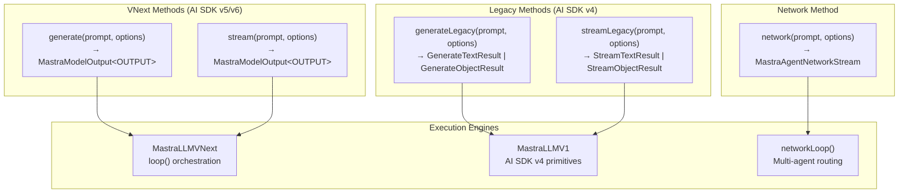

**Sources:** [packages/core/src/agent/agent.ts:1247-1612]()

### Generate vs Stream

Both `generate()` and `stream()` return a `MastraModelOutput<OUTPUT>` object that provides multiple access patterns:

```typescript
// Streaming access
for await (const chunk of output.textStream) {
  console.log(chunk)
}

// Promise-based access (awaits full completion)
const text = await output.text
const usage = await output.usage
const toolCalls = await output.toolCalls

// Full output access
const full = await output.getFullOutput()
```

The difference is in how the underlying stream is consumed:

- `generate()`: Internally consumes the stream, optimized for awaiting final results
- `stream()`: Optimized for real-time chunk-by-chunk consumption

**Sources:** [packages/core/src/stream/base/output.ts:1-798](), [packages/core/src/agent/agent.ts:1247-1458]()

## Agent Initialization and Registration

### Mastra Registration

Agents can be registered with a `Mastra` instance during construction or dynamically added later:

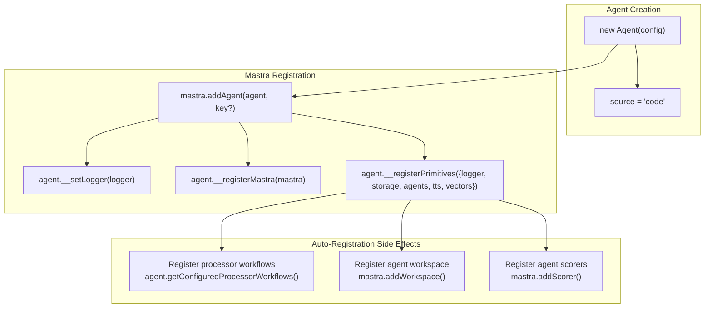

The `addAgent()` method performs several registration steps:

1. Sets the logger from the Mastra instance
2. Registers the Mastra reference on the agent
3. Injects primitives (storage, other agents, TTS, vectors)
4. Auto-registers processor workflows for discoverability
5. Auto-registers the agent's workspace (if configured)
6. Auto-registers the agent's scorers

**Sources:** [packages/core/src/mastra/index.ts:846-953]()

### Agent Source Tracking

Agents have a `source` property indicating their origin:

- `'code'`: Defined in application code (default)
- `'stored'`: Loaded from storage (via editor/admin interface)

This enables different behavior for code-defined vs dynamically-created agents.

**Sources:** [packages/core/src/agent/agent.ts:155](), [packages/core/src/mastra/index.ts:901-904]()

## Model Configuration and Resolution

### Model Specification Patterns

Agents support multiple model specification patterns:

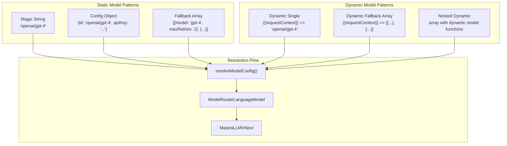

**Sources:** [packages/core/src/agent/types.ts:125-219](), [packages/core/src/llm/model/resolve-model.ts]()

### Model Fallback Chain

When an array of `ModelWithRetries` is provided, the agent attempts each model in sequence until one succeeds:

```typescript
type ModelWithRetries = {
  id?: string
  model: DynamicArgument<MastraModelConfig>
  maxRetries?: number // defaults to agent-level maxRetries
  enabled?: boolean // defaults to true
}
```

Fallback models are tried when:

- Primary model call fails with `APICallError`
- Primary model exceeds `maxRetries`
- `enabled: false` models are skipped

**Sources:** [packages/core/src/agent/types.ts:125-130](), [packages/core/src/agent/agent.ts:229-254]()

### Model Version Compatibility

Agents automatically adapt to the model's supported AI SDK version:

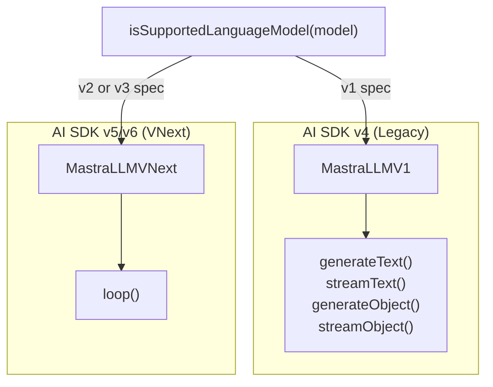

**Sources:** [packages/core/src/agent/utils.ts:1-40](), [packages/core/src/agent/agent.ts:1183-1244]()

## Tool Integration Architecture

### Tool Registration and Preparation

Tools can be provided to agents through multiple channels:

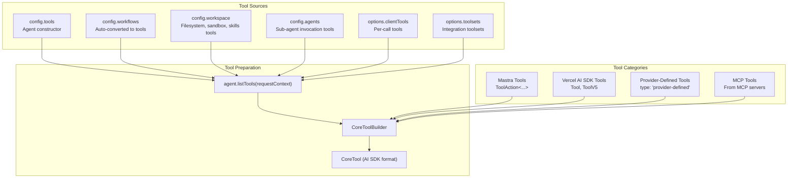

**Sources:** [packages/core/src/agent/agent.ts:799-1019](), [packages/core/src/tools/tool-builder/builder.ts:1-550]()

### CoreToolBuilder: Tool Format Adapter

The `CoreToolBuilder` class converts all tool formats to the AI SDK's `CoreTool` format:

| Input Tool Type       | Signature                     | Output Format                              |
| --------------------- | ----------------------------- | ------------------------------------------ |
| Mastra `ToolAction`   | `execute(inputData, context)` | `CoreTool` with `execute(params, options)` |
| Vercel AI SDK `Tool`  | `execute(params, options)`    | `CoreTool` (pass-through)                  |
| Provider-Defined Tool | N/A (server-executed)         | `CoreTool` with `type: 'provider-defined'` |
| MCP Tool              | `execute(inputData, context)` | `CoreTool` with `mcpMetadata`              |

The builder wraps execution to:

- Convert parameter signatures
- Add tracing spans (`TOOL_CALL` or `MCP_TOOL_CALL`)
- Inject execution context (mastra, memory, workspace, suspend/resume)
- Handle tool approval flows
- Validate input/output schemas

**Sources:** [packages/core/src/tools/tool-builder/builder.ts:61-550]()

### Tool Execution Context

Tools executed within agents receive a rich execution context:

```typescript
export interface ToolExecutionContext<TSuspend, TResume> {
  // Mastra instance access
  mastra?: Mastra
  memory?: MastraMemory
  workspace?: Workspace

  // Identifiers
  threadId?: string
  resourceId?: string
  runId?: string
  requestContext: RequestContext

  // Suspend/resume for multi-turn workflows
  suspend: (suspendPayload: TSuspend, options?: SuspendOptions) => Promise<void>
  resumeData?: TResume

  // Stream writing
  writer: ToolStream
  abortSignal?: AbortSignal

  // Tracing
  tracingContext?: TracingContext
}
```

Different contexts are provided based on where the tool executes:

- **Agent context**: Adds `toolCallId`, `messages`, `threadId`, `resourceId`
- **Workflow context**: Adds `workflowId`, `state`, `setState`
- **MCP context**: Adds `extra` (MCP protocol context), `elicitation`

**Sources:** [packages/core/src/tools/types.ts:28-69](), [packages/core/src/tools/tool-builder/builder.ts:333-499]()

## Memory Integration

### Memory Configuration

Agents can be configured with a `MastraMemory` instance that provides thread-based conversation history, semantic recall, and working memory:

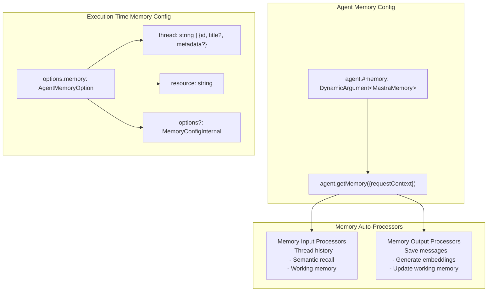

**Sources:** [packages/core/src/agent/types.ts:337-341](), [packages/core/src/agent/agent.ts:806-814]()

### Memory Processor Auto-Injection

When an agent has memory configured, the system automatically adds memory processors to the input and output processor chains:

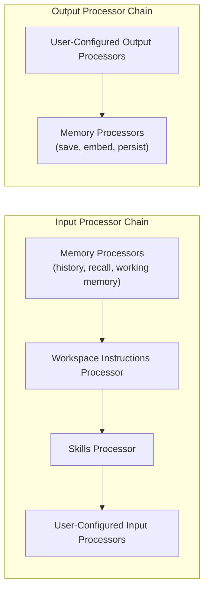

Memory processors run first on input (to load history) and last on output (to persist new messages).

**Sources:** [packages/core/src/agent/agent.ts:594-631]()

## Processor System

### Input and Output Processors

Processors transform messages before LLM execution (input processors) or after LLM execution (output processors):

```typescript
// Input processor signature
processInput?(options: {
  messages: MastraDBMessage[];
  agentName: string;
  requestContext: RequestContext;
}) => Promise<MastraDBMessage[]> | MastraDBMessage[];

// Output processor signature
processOutputResult?(options: {
  result: LLMStepResult;
  input: MastraDBMessage[];
  agentName: string;
  requestContext: RequestContext;
}) => Promise<OutputResult> | OutputResult;
```

Processors can:

- Transform messages (e.g., add context, filter content)
- Abort execution with custom responses (`abort()`)
- Trigger retries with feedback (`abort({retry: true, feedback: '...'})`)
- Access and modify processor state

**Sources:** [packages/core/src/processors/index.ts](), [packages/core/src/agent/agent.ts:456-561]()

### Processor Workflows

Processors can be defined as standalone objects or as full workflows:

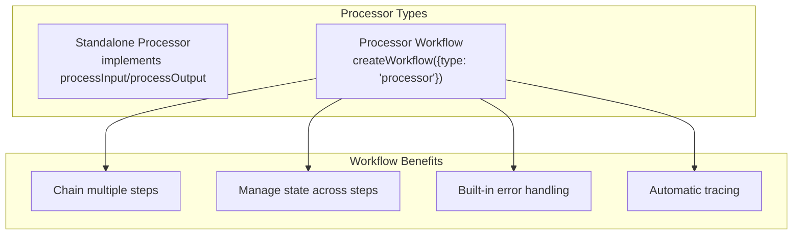

Processor workflows use `ProcessorStepSchema` for input/output:

```typescript
const ProcessorStepSchema = z.object({
  input: z.custom<MastraDBMessage[]>(),
  result: z.custom<LLMStepResult>().optional(),
  agentName: z.string(),
  requestContext: z.custom<RequestContext>(),
})
```

**Sources:** [packages/core/src/processors/index.ts:1-50](), [packages/core/src/agent/agent.ts:486-561]()

### Processor Retry Mechanism

Processors can trigger agent retries when `abort({retry: true})` is called:

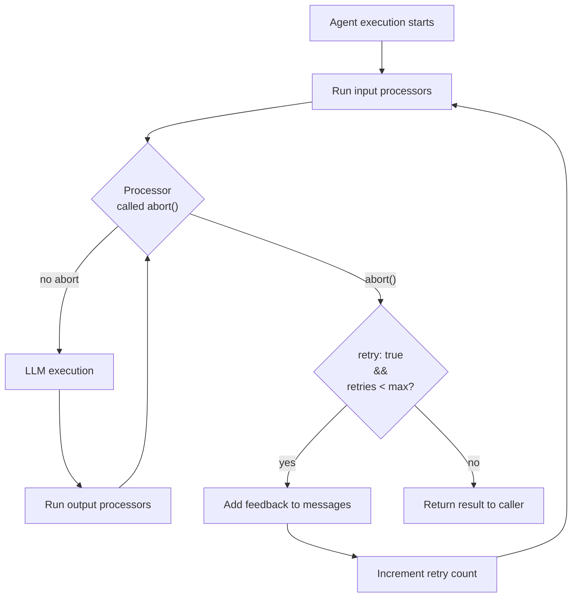

The maximum number of retries is controlled by:

- `agent.maxProcessorRetries` (agent-level default)
- `options.maxProcessorRetries` (per-execution override)

**Sources:** [packages/core/src/agent/agent.ts:1375-1458](), [packages/core/src/stream/base/output.ts:319-481]()

## Structured Output

### Structured Output Modes

Agents support two modes for structured output:

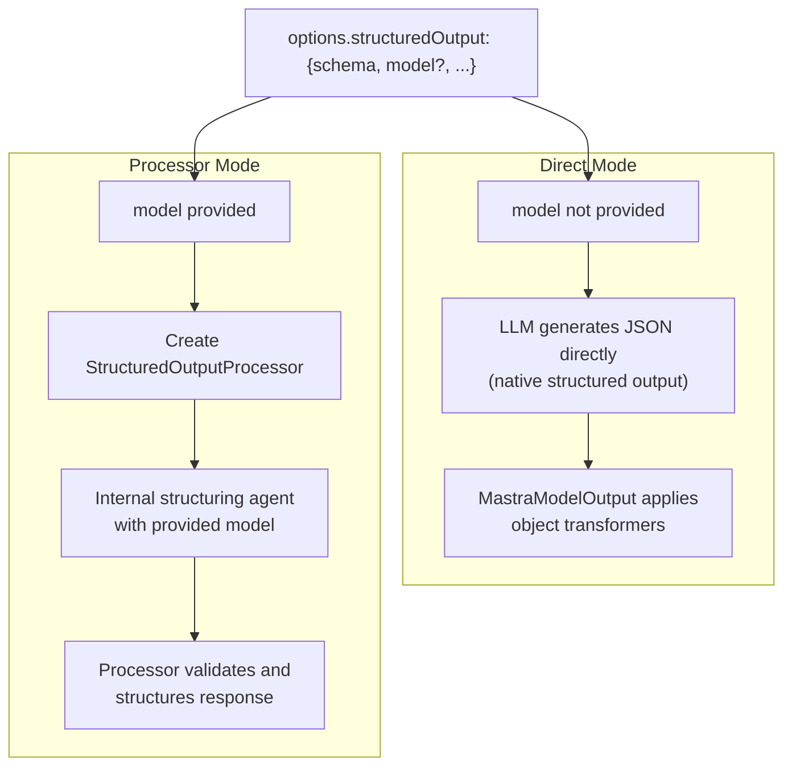

**Sources:** [packages/core/src/stream/base/output.ts:293-298](), [packages/core/src/processors/processors/structured-output.ts]()

### Structured Output Options

```typescript
type StructuredOutputOptions<OUTPUT> = {
  schema: StandardSchemaWithJSON<OUTPUT>
  model?: MastraModelConfig
  instructions?: string
  jsonPromptInjection?: boolean
  logger?: IMastraLogger
  providerOptions?: ProviderOptions
  errorStrategy?: 'strict' | 'warn' | 'fallback'
  fallbackValue?: OUTPUT
}
```

| Option                | Purpose                                                    |
| --------------------- | ---------------------------------------------------------- |
| `schema`              | Zod schema or JSONSchema7 for output validation            |
| `model`               | Dedicated model for structuring (enables processor mode)   |
| `instructions`        | Custom instructions for the structuring agent              |
| `jsonPromptInjection` | Force prompt injection instead of native structured output |
| `errorStrategy`       | How to handle schema validation failures                   |
| `fallbackValue`       | Default value when errorStrategy is 'fallback'             |

**Sources:** [packages/core/src/agent/types.ts:66-116]()

## Execution Flow Diagrams

### Generate/Stream Execution Pipeline

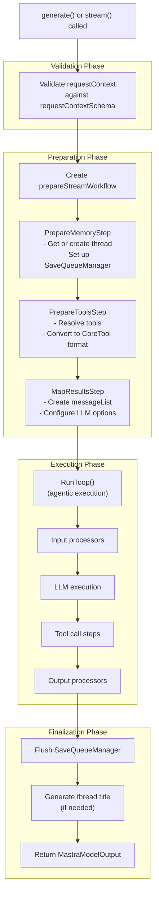

**Sources:** [packages/core/src/agent/agent.ts:1247-1458](), [packages/core/src/agent/workflows/prepare-stream/index.ts:1-150]()

### Message Flow Through Processors

```mermaid
graph LR
    subgraph "Input Messages"
        UserInput["User message"]
        MemoryHistory["Memory history messages"]
    end

    subgraph "Input Processing"
        CombineInput["Combine into MessageList"]
        MemoryInputProc["Memory input processors<br/>- Load history<br/>- Semantic recall<br/>- Working memory"]
        WorkspaceProc["Workspace instructions"]
        SkillsProc["Skills processor"]
        CustomInputProc["Custom input processors"]
        TripwireInput["Tripwire check"]
    end

    subgraph "LLM Interaction"
        LLMCall["LLM execution<br/>(with tools)"]
        ResponseStream["Response stream"]
    end

    subgraph "Output Processing"
        CustomOutputProc["Custom output processors"]
        StructuredProc["Structured output processor"]
        MemoryOutputProc["Memory output processors<br/>- Save messages<br/>- Generate embeddings"]
    end

    subgraph "Final Output"
        OutputToClient["MastraModelOutput<br/>streams to client"]
    end

    UserInput --> CombineInput
    MemoryHistory --> CombineInput

    CombineInput --> MemoryInputProc
    MemoryInputProc --> WorkspaceProc
    WorkspaceProc --> SkillsProc
    SkillsProc --> CustomInputProc
    CustomInputProc --> TripwireInput

    TripwireInput --> LLMCall
    LLMCall --> ResponseStream

    ResponseStream --> CustomOutputProc
    CustomOutputProc --> StructuredProc
    StructuredProc --> MemoryOutputProc

    MemoryOutputProc --> OutputToClient
```

**Sources:** [packages/core/src/agent/agent.ts:594-631](), [packages/core/src/processors/runner.ts]()

## Multi-Agent Architecture

### Agent Network Tools

Agents configured with sub-agents (`config.agents`) automatically receive tools for invoking those agents:

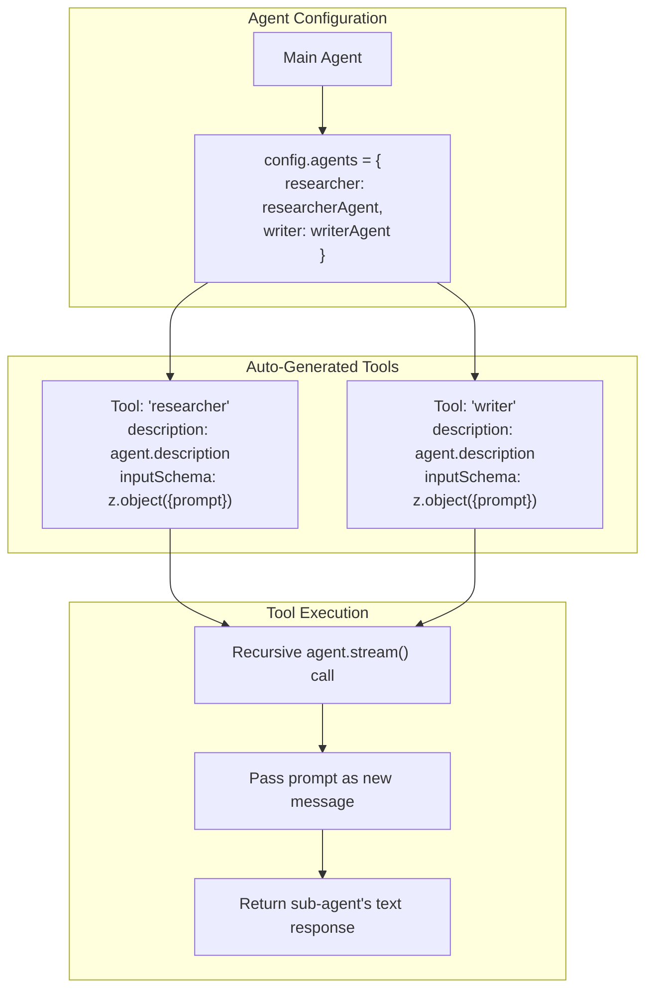

**Sources:** [packages/core/src/agent/agent.ts:945-1019]()

### Network Routing Method

The `network()` method implements sophisticated multi-agent routing with delegation hooks and completion scoring:

```typescript
const result = await agent.network('Build me a web app', {
  agents: { researcher, coder, tester },
  routing: {
    maxSteps: 20,
    verboseIntrospection: true,
  },
  completion: {
    scorers: [testsScorer, buildScorer],
    strategy: 'all', // or 'any'
  },
  onDelegationStart: ({ agentId, prompt, iteration }) => {
    // Modify prompt, filter messages, bail early
  },
  onDelegationComplete: ({ agentId, result, iteration }) => {
    // Process result, continue or stop
  },
  onIterationComplete: ({ iteration, isComplete }) => {
    console.log(`Iteration ${iteration}: ${isComplete ? 'done' : 'continuing'}`)
  },
})
```

See [Agent Networks and Multi-Agent Collaboration](#3.7) for detailed documentation.

**Sources:** [packages/core/src/agent/agent.ts:1612-1705](), [packages/core/src/loop/network/index.ts]()

## MastraModelOutput Interface

### Output Access Patterns

The `MastraModelOutput<OUTPUT>` class provides multiple ways to access execution results:

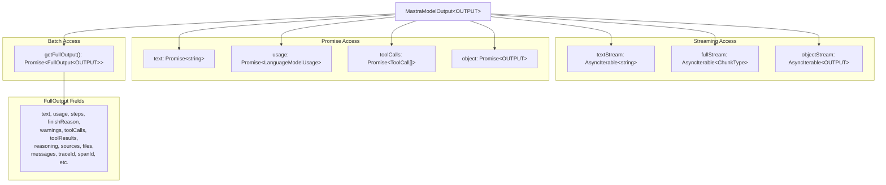

**Sources:** [packages/core/src/stream/base/output.ts:144-798]()

### Destructuring Support

`MastraModelOutput` can be safely destructured thanks to proxy-based property binding:

```typescript
// Destructuring preserves method binding
const { text, usage, toolCalls } = await agent.stream(prompt)
const finalText = await text // Works correctly

// Streaming also works after destructuring
const { textStream } = await agent.stream(prompt)
for await (const chunk of textStream) {
  console.log(chunk)
}
```

**Sources:** [packages/core/src/stream/base/output.ts:32-53]()

## Error Handling and Tripwires

### Tripwire Mechanism

Processors can abort execution early using the `TripWire` utility:

```typescript
const tripwire = new TripWire()

// In an input processor
if (containsBlockedContent(messages)) {
  tripwire.abort({
    reason: 'Content policy violation',
    responseText: 'I cannot assist with that request.',
    statusCode: 400,
  })
}
```

When a tripwire is triggered:

1. Execution stops immediately (LLM is not called)
2. A synthetic response is generated with the tripwire's text
3. `finishReason` is set to `'tripwire'`
4. The tripwire payload is available in the output

**Sources:** [packages/core/src/agent/trip-wire.ts](), [packages/core/src/agent/utils.ts:100-143]()

### Model Fallback Error Handling

When using model fallback arrays, errors are handled gracefully:

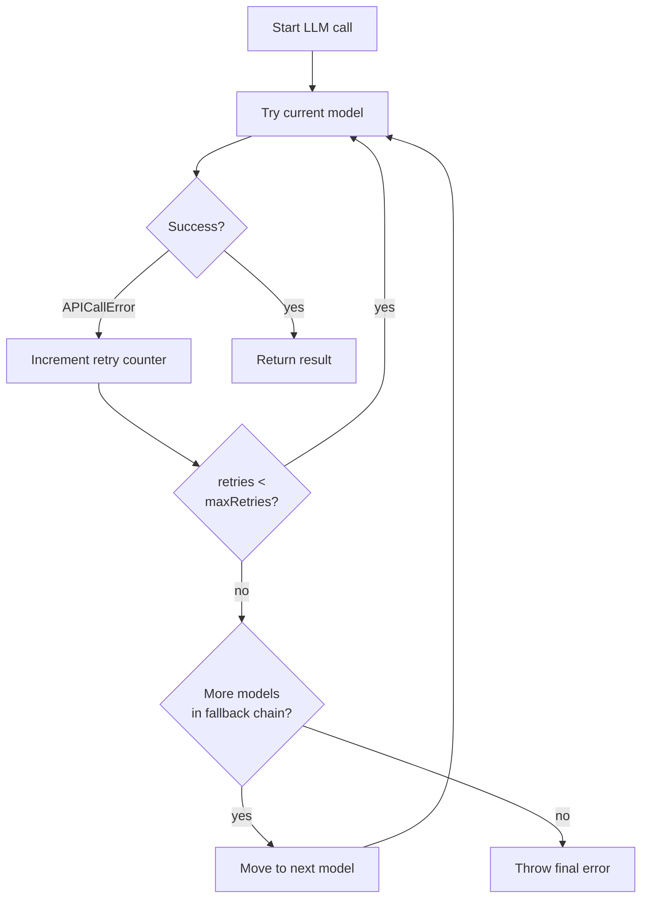

**Sources:** [packages/core/src/loop/workflows/agentic-execution/llm-execution-step.ts:559-636]()

## Observability and Tracing

### Span Hierarchy

Agent execution creates a hierarchical span structure:

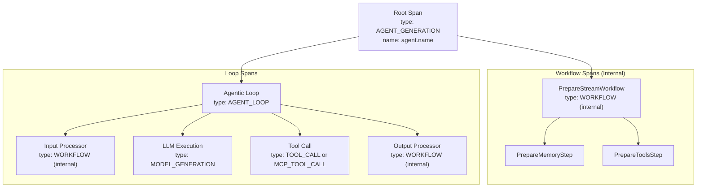

Internal spans (processor workflows, prepare steps) are marked with `internal: InternalSpans.WORKFLOW` to allow exporters to filter them from external observability systems.

**Sources:** [packages/core/src/agent/agent.ts:1292-1310](), [packages/core/src/observability/types/tracing.ts]()

### Trace and Span IDs

Trace IDs and span IDs are accessible from the output:

```typescript
const output = await agent.stream(prompt)
const full = await output.getFullOutput()

console.log('Trace ID:', full.traceId) // For correlating across services
console.log('Span ID:', full.spanId) // Root span ID for this execution
```

**Sources:** [packages/core/src/stream/base/output.ts:252-257](), [packages/core/src/stream/base/output.ts:86-142]()

## Request Context and Validation

### RequestContext Injection

The `RequestContext` object flows through all agent operations, providing a dependency injection mechanism:

```typescript
const ctx = new RequestContext()
ctx.set('userId', 'user-123')
ctx.set('tier', 'premium')
ctx.set('featureFlags', { newUI: true })

const output = await agent.stream(prompt, { requestContext: ctx })
```

Tools, processors, and memory can access the context:

```typescript
const tool = createTool({
  execute: async (input, context) => {
    const userId = context.requestContext.get('userId')
    // Use userId for authorization, logging, etc.
  },
})
```

**Sources:** [packages/core/src/request-context/index.ts](), [packages/core/src/agent/agent.ts:382-407]()

### RequestContext Schema Validation

Agents can enforce request context shape via `requestContextSchema`:

```typescript
const agent = new Agent({
  // ...
  requestContextSchema: z.object({
    userId: z.string(),
    tier: z.enum(['free', 'premium', 'enterprise']),
  }),
})

// This will throw if requestContext is missing userId or tier
await agent.stream(prompt, { requestContext: ctx })
```

Validation occurs at the start of `generate()` and `stream()` calls, before any processing.

**Sources:** [packages/core/src/agent/agent.ts:316-318](), [packages/core/src/agent/agent.ts:382-407]()

## Legacy Methods (AI SDK v4)

### AgentLegacyHandler

For AI SDK v4 compatibility, agents delegate to `AgentLegacyHandler`:

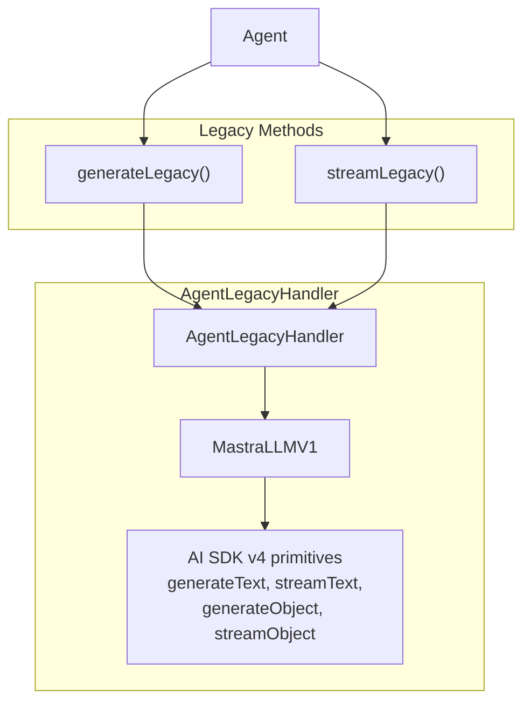

Legacy methods return AI SDK v4 result types:

- `GenerateTextResult` / `StreamTextResult`
- `GenerateObjectResult` / `StreamObjectResult`

These lack some features of VNext methods (processor workflows, working memory, observational memory, structured output processor).

**Sources:** [packages/core/src/agent/agent-legacy.ts:1-1100](), [packages/core/src/llm/model/model.ts]()

---

**Primary Sources:**

- [packages/core/src/agent/agent.ts:1-2200]()
- [packages/core/src/agent/types.ts:1-500]()
- [packages/core/src/agent/agent.types.ts:1-400]()
- [packages/core/src/agent/index.ts:1-41]()
- [packages/core/src/loop/workflows/agentic-execution/llm-execution-step.ts:1-900]()
- [packages/core/src/tools/tool-builder/builder.ts:1-550]()
- [packages/core/src/stream/base/output.ts:1-800]()
- [packages/core/src/mastra/index.ts:846-999]()
