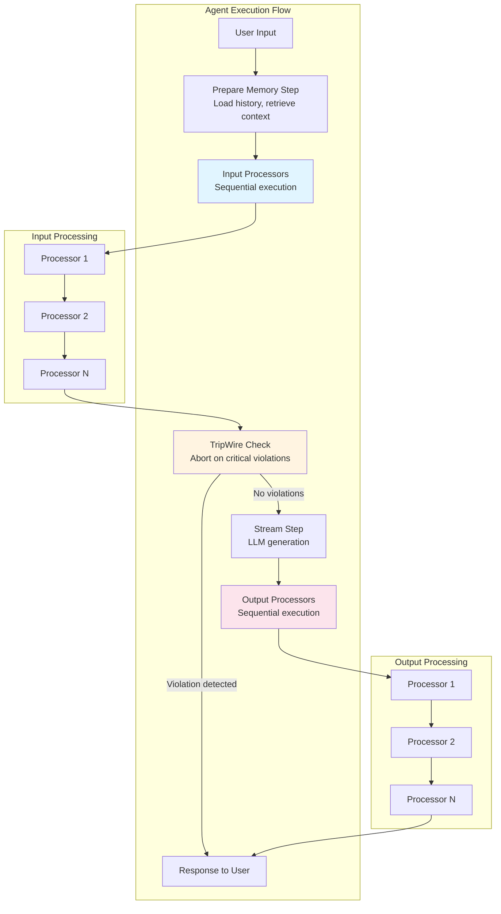
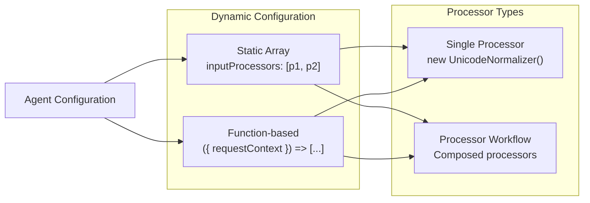
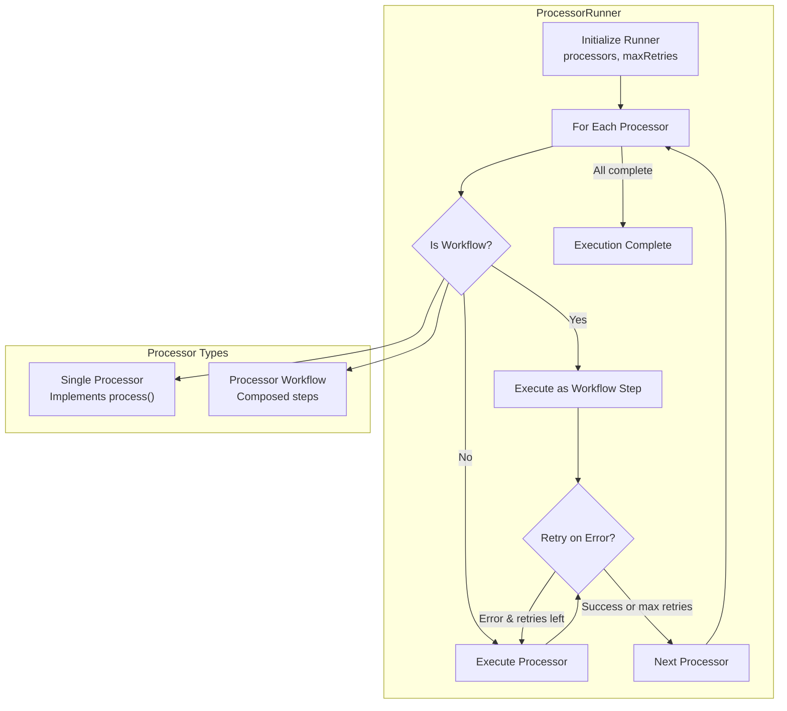
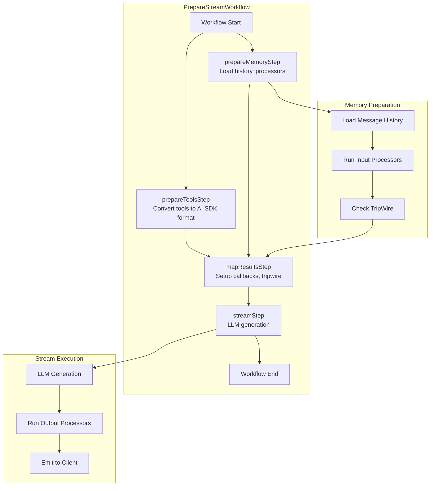

# Input and Output Processors

<details>
<summary>Relevant source files</summary>

The following files were used as context for generating this wiki page:

- [examples/bird-checker-with-express/src/index.ts](examples/bird-checker-with-express/src/index.ts)
- [examples/bird-checker-with-nextjs-and-eval/src/lib/mastra/actions.ts](examples/bird-checker-with-nextjs-and-eval/src/lib/mastra/actions.ts)
- [packages/core/src/action/index.ts](packages/core/src/action/index.ts)
- [packages/core/src/agent/**tests**/utils.test.ts](packages/core/src/agent/__tests__/utils.test.ts)
- [packages/core/src/agent/agent-legacy.ts](packages/core/src/agent/agent-legacy.ts)
- [packages/core/src/agent/agent.test.ts](packages/core/src/agent/agent.test.ts)
- [packages/core/src/agent/agent.ts](packages/core/src/agent/agent.ts)
- [packages/core/src/agent/agent.types.ts](packages/core/src/agent/agent.types.ts)
- [packages/core/src/agent/index.ts](packages/core/src/agent/index.ts)
- [packages/core/src/agent/trip-wire.ts](packages/core/src/agent/trip-wire.ts)
- [packages/core/src/agent/types.ts](packages/core/src/agent/types.ts)
- [packages/core/src/agent/utils.ts](packages/core/src/agent/utils.ts)
- [packages/core/src/agent/workflows/prepare-stream/index.ts](packages/core/src/agent/workflows/prepare-stream/index.ts)
- [packages/core/src/agent/workflows/prepare-stream/map-results-step.ts](packages/core/src/agent/workflows/prepare-stream/map-results-step.ts)
- [packages/core/src/agent/workflows/prepare-stream/prepare-memory-step.ts](packages/core/src/agent/workflows/prepare-stream/prepare-memory-step.ts)
- [packages/core/src/agent/workflows/prepare-stream/prepare-tools-step.ts](packages/core/src/agent/workflows/prepare-stream/prepare-tools-step.ts)
- [packages/core/src/agent/workflows/prepare-stream/stream-step.ts](packages/core/src/agent/workflows/prepare-stream/stream-step.ts)
- [packages/core/src/llm/index.ts](packages/core/src/llm/index.ts)
- [packages/core/src/llm/model/model.loop.ts](packages/core/src/llm/model/model.loop.ts)
- [packages/core/src/llm/model/model.loop.types.ts](packages/core/src/llm/model/model.loop.types.ts)
- [packages/core/src/llm/model/model.test.ts](packages/core/src/llm/model/model.test.ts)
- [packages/core/src/llm/model/model.ts](packages/core/src/llm/model/model.ts)
- [packages/core/src/loop/**snapshots**/loop.test.ts.snap](packages/core/src/loop/__snapshots__/loop.test.ts.snap)
- [packages/core/src/loop/index.ts](packages/core/src/loop/index.ts)
- [packages/core/src/loop/loop.test.ts](packages/core/src/loop/loop.test.ts)
- [packages/core/src/loop/loop.ts](packages/core/src/loop/loop.ts)
- [packages/core/src/loop/test-utils/fullStream.ts](packages/core/src/loop/test-utils/fullStream.ts)
- [packages/core/src/loop/test-utils/generateText.ts](packages/core/src/loop/test-utils/generateText.ts)
- [packages/core/src/loop/test-utils/options.ts](packages/core/src/loop/test-utils/options.ts)
- [packages/core/src/loop/test-utils/resultObject.ts](packages/core/src/loop/test-utils/resultObject.ts)
- [packages/core/src/loop/test-utils/streamObject.ts](packages/core/src/loop/test-utils/streamObject.ts)
- [packages/core/src/loop/test-utils/textStream.ts](packages/core/src/loop/test-utils/textStream.ts)
- [packages/core/src/loop/test-utils/tools.ts](packages/core/src/loop/test-utils/tools.ts)
- [packages/core/src/loop/test-utils/utils.ts](packages/core/src/loop/test-utils/utils.ts)
- [packages/core/src/loop/types.ts](packages/core/src/loop/types.ts)
- [packages/core/src/loop/workflows/agentic-execution/llm-execution-step.test.ts](packages/core/src/loop/workflows/agentic-execution/llm-execution-step.test.ts)
- [packages/core/src/loop/workflows/agentic-execution/llm-execution-step.ts](packages/core/src/loop/workflows/agentic-execution/llm-execution-step.ts)
- [packages/core/src/loop/workflows/agentic-execution/tool-call-step.test.ts](packages/core/src/loop/workflows/agentic-execution/tool-call-step.test.ts)
- [packages/core/src/loop/workflows/agentic-execution/tool-call-step.ts](packages/core/src/loop/workflows/agentic-execution/tool-call-step.ts)
- [packages/core/src/mastra/index.ts](packages/core/src/mastra/index.ts)
- [packages/core/src/observability/types/tracing.ts](packages/core/src/observability/types/tracing.ts)
- [packages/core/src/stream/aisdk/v5/compat/prepare-tools.test.ts](packages/core/src/stream/aisdk/v5/compat/prepare-tools.test.ts)
- [packages/core/src/stream/aisdk/v5/compat/prepare-tools.ts](packages/core/src/stream/aisdk/v5/compat/prepare-tools.ts)
- [packages/core/src/stream/aisdk/v5/execute.ts](packages/core/src/stream/aisdk/v5/execute.ts)
- [packages/core/src/stream/aisdk/v5/output-helpers.ts](packages/core/src/stream/aisdk/v5/output-helpers.ts)
- [packages/core/src/stream/base/output.ts](packages/core/src/stream/base/output.ts)
- [packages/core/src/stream/types.ts](packages/core/src/stream/types.ts)
- [packages/core/src/tools/index.ts](packages/core/src/tools/index.ts)
- [packages/core/src/tools/provider-tool-utils.test.ts](packages/core/src/tools/provider-tool-utils.test.ts)
- [packages/core/src/tools/provider-tool-utils.ts](packages/core/src/tools/provider-tool-utils.ts)
- [packages/core/src/tools/tool-builder/builder.test.ts](packages/core/src/tools/tool-builder/builder.test.ts)
- [packages/core/src/tools/tool-builder/builder.ts](packages/core/src/tools/tool-builder/builder.ts)
- [packages/core/src/tools/tool.ts](packages/core/src/tools/tool.ts)
- [packages/core/src/tools/toolchecks.test.ts](packages/core/src/tools/toolchecks.test.ts)
- [packages/core/src/tools/toolchecks.ts](packages/core/src/tools/toolchecks.ts)
- [packages/core/src/tools/types.ts](packages/core/src/tools/types.ts)

</details>

Input and output processors provide a composable pipeline architecture for applying guardrails, transformations, and validation to agent interactions. Processors intercept and modify data at specific points in the execution flow—input processors transform messages before they reach the language model, while output processors modify responses before returning them to users. This enables security controls (prompt injection detection, PII filtering), content moderation, normalization, and response optimization without coupling these concerns to core agent logic.

For information about memory processors that filter and transform messages loaded from storage, see [Memory Processors](#7.1). For processors used in observability tracing, see [Sensitive Data Filter](#11.1).

## Processor Pipeline Architecture

The processor system integrates with the agent execution pipeline through the prepare-stream workflow, running processors as discrete steps with retry logic and error handling.



**Agent Execution with Processor Pipeline**

Processors execute sequentially in the order they are configured. Each processor can:

- **Transform**: Modify the input/output data
- **Block**: Use TripWire to halt execution with an error or warning
- **Validate**: Check data against rules or schemas
- **Enrich**: Add metadata or context

Sources: [packages/core/src/agent/agent.ts:143-145](), [packages/core/src/agent/workflows/prepare-stream/index.ts]()

## Configuration Patterns

Processors are configured on the agent through the `inputProcessors` and `outputProcessors` options. Both accept arrays of processor instances or processor workflows.



**Processor Configuration Patterns**

Processors can be configured statically or dynamically based on request context, enabling per-request processor selection based on user tier, feature flags, or other runtime conditions.

Sources: [packages/core/src/agent/agent.ts:143-145](), [packages/core/src/agent/types.ts:28-29](), [docs/public/llms-full.txt:907-909]()

## Input Processors

Input processors run after memory preparation but before the message reaches the language model. They transform, validate, or block user input based on security rules, content policies, or normalization requirements.

### Execution Context

Input processors receive `ProcessInputStepArgs` which includes:

- `messages`: The conversation history including the new user message
- `memory`: Active memory configuration if enabled
- `threadId` / `resourceId`: Memory identifiers
- `tripwire`: TripWire instance for blocking execution

The processor returns modified messages or throws a TripWire error to halt execution.

Sources: [packages/core/src/processors/index.ts](), [packages/core/src/agent/agent.ts:143]()

### UnicodeNormalizer

Normalizes Unicode characters, standardizes whitespace, and removes control characters to prevent visual spoofing attacks and improve LLM comprehension.

| Configuration Option | Type    | Default | Description                    |
| -------------------- | ------- | ------- | ------------------------------ |
| `stripControlChars`  | boolean | `true`  | Remove control characters      |
| `collapseWhitespace` | boolean | `true`  | Normalize whitespace sequences |
| `normalizationForm`  | string  | `'NFC'` | Unicode normalization form     |

```typescript
import { UnicodeNormalizer } from '@mastra/core/processors'

const agent = new Agent({
  id: 'normalized-agent',
  inputProcessors: [
    new UnicodeNormalizer({
      stripControlChars: true,
      collapseWhitespace: true,
    }),
  ],
})
```

Sources: [docs/public/llms-full.txt:936-958]()

### PromptInjectionDetector

Uses an LLM to detect prompt injection attempts, jailbreak patterns, and system override attacks. Can block, rewrite, or log detected threats.

| Configuration Option | Type                                | Description                                                        |
| -------------------- | ----------------------------------- | ------------------------------------------------------------------ |
| `model`              | string                              | LLM to use for detection                                           |
| `threshold`          | number                              | Confidence threshold (0-1)                                         |
| `strategy`           | `'block'` \| `'rewrite'` \| `'log'` | Action on detection                                                |
| `detectionTypes`     | string[]                            | Types to detect: `'injection'`, `'jailbreak'`, `'system-override'` |

```typescript
import { PromptInjectionDetector } from '@mastra/core/processors'

const agent = new Agent({
  id: 'secure-agent',
  inputProcessors: [
    new PromptInjectionDetector({
      model: 'openrouter/openai/gpt-oss-safeguard-20b',
      threshold: 0.8,
      strategy: 'block',
      detectionTypes: ['injection', 'jailbreak'],
    }),
  ],
})
```

Sources: [docs/public/llms-full.txt:960-986]()

### LanguageDetector

Detects the language of user messages and optionally translates them to a target language before processing. Enables multilingual support while maintaining consistent agent instructions in a single language.

| Configuration Option | Type                        | Description                    |
| -------------------- | --------------------------- | ------------------------------ |
| `model`              | string                      | LLM for detection/translation  |
| `targetLanguages`    | string[]                    | Target language codes          |
| `strategy`           | `'translate'` \| `'detect'` | Translation or detection only  |
| `threshold`          | number                      | Detection confidence threshold |

```typescript
import { LanguageDetector } from '@mastra/core/processors'

const agent = new Agent({
  id: 'multilingual-agent',
  inputProcessors: [
    new LanguageDetector({
      model: 'openrouter/openai/gpt-oss-safeguard-20b',
      targetLanguages: ['English', 'en'],
      strategy: 'translate',
      threshold: 0.8,
    }),
  ],
})
```

Sources: [docs/public/llms-full.txt:988-1013]()

## Output Processors

Output processors run after the language model generates a response but before it's returned to the user. They optimize streaming, enforce content policies, limit token usage, or redact sensitive information.

### Execution Context

Output processors receive the streaming response from the LLM and can:

- Buffer and batch stream parts
- Filter or redact content
- Enforce token limits
- Add metadata
- Transform the output format

Sources: [packages/core/src/agent/agent.ts:144](), [docs/public/llms-full.txt:1014-1016]()

### BatchPartsProcessor

Combines multiple stream parts before emitting them to reduce network overhead and improve client-side rendering performance.

| Configuration Option | Type    | Default | Description                  |
| -------------------- | ------- | ------- | ---------------------------- |
| `batchSize`          | number  | `5`     | Number of parts to batch     |
| `maxWaitTime`        | number  | `100`   | Maximum wait time (ms)       |
| `emitOnNonText`      | boolean | `true`  | Emit batch on non-text parts |

```typescript
import { BatchPartsProcessor } from '@mastra/core/processors'

const agent = new Agent({
  id: 'batched-agent',
  outputProcessors: [
    new BatchPartsProcessor({
      batchSize: 5,
      maxWaitTime: 100,
      emitOnNonText: true,
    }),
  ],
})
```

Sources: [docs/public/llms-full.txt:1018-1043]()

### TokenLimiterProcessor

Limits the number of tokens in model responses to manage costs and latency. Can truncate or block responses that exceed the limit.

| Configuration Option | Type                              | Description                |
| -------------------- | --------------------------------- | -------------------------- |
| `limit`              | number                            | Maximum tokens allowed     |
| `strategy`           | `'truncate'` \| `'block'`         | Action when limit exceeded |
| `countMode`          | `'cumulative'` \| `'per-message'` | Token counting mode        |

```typescript
import { TokenLimiterProcessor } from '@mastra/core/processors'

const agent = new Agent({
  id: 'limited-agent',
  outputProcessors: [
    new TokenLimiterProcessor({
      limit: 1000,
      strategy: 'truncate',
      countMode: 'cumulative',
    }),
  ],
})
```

Sources: [docs/public/llms-full.txt:1045-1069]()

### SystemPromptScrubber

Detects and redacts system prompts, internal instructions, or security-sensitive content that leaked into model responses. Uses an LLM to identify sensitive patterns.

| Configuration Option | Type                          | Description                    |
| -------------------- | ----------------------------- | ------------------------------ |
| `model`              | string                        | LLM for detection              |
| `strategy`           | `'redact'` \| `'block'`       | Action on detection            |
| `customPatterns`     | string[]                      | Additional patterns to detect  |
| `redactionMethod`    | `'placeholder'` \| `'remove'` | How to redact                  |
| `placeholderText`    | string                        | Replacement text for redaction |

```typescript
import { SystemPromptScrubber } from '@mastra/core/processors'

const agent = new Agent({
  id: 'scrubbed-agent',
  outputProcessors: [
    new SystemPromptScrubber({
      model: 'openrouter/openai/gpt-oss-safeguard-20b',
      strategy: 'redact',
      customPatterns: ['API_KEY', 'SECRET'],
      redactionMethod: 'placeholder',
      placeholderText: '[REDACTED]',
    }),
  ],
})
```

Sources: [docs/public/llms-full.txt:1071-1093]()

## Hybrid Processors

Some processors can be configured as either input or output processors, depending on where content moderation or filtering should occur.

### ModerationProcessor

Detects and blocks inappropriate content including hate speech, harassment, violence, and other policy violations. Can run on input to filter user messages or on output to prevent harmful responses.

| Configuration Option | Type                  | Description                    |
| -------------------- | --------------------- | ------------------------------ |
| `model`              | string                | LLM for moderation             |
| `categories`         | string[]              | Content categories to detect   |
| `threshold`          | number                | Confidence threshold (0-1)     |
| `strategy`           | `'block'` \| `'warn'` | Action on violation            |
| `instructions`       | string                | Custom moderation instructions |

```typescript
import { ModerationProcessor } from '@mastra/core/processors'

// As input processor
const inputModeration = new Agent({
  id: 'input-moderated',
  inputProcessors: [
    new ModerationProcessor({
      model: 'openrouter/openai/gpt-oss-safeguard-20b',
      categories: ['hate', 'harassment', 'violence'],
      threshold: 0.7,
      strategy: 'block',
    }),
  ],
})

// As output processor
const outputModeration = new Agent({
  id: 'output-moderated',
  outputProcessors: [
    new ModerationProcessor({
      model: 'openrouter/openai/gpt-oss-safeguard-20b',
      categories: ['hate', 'self-harm'],
      threshold: 0.8,
      strategy: 'block',
    }),
  ],
})
```

Sources: [docs/public/llms-full.txt:910-929](), [docs/public/llms-full.txt:890-902]()

## TripWire Mechanism

The TripWire system provides early exit capabilities when processors detect violations that should halt execution. Instead of throwing exceptions that propagate through the stack, TripWire captures the error state and returns it cleanly to the caller.

```mermaid
graph TB
    subgraph "Normal Execution"
        N1["Input Processor 1"]
        N2["Input Processor 2"]
        N3["TripWire Check"]
        N4["Continue to LLM"]

        N1 -->|Pass| N2
        N2 -->|Pass| N3
        N3 -->|No violations| N4
    end

    subgraph "TripWire Activation"
        T1["Input Processor"]
        T2["Violation Detected"]
        T3["tripwire.error()"]
        T4["TripWire Check"]
        T5["Return Error Response"]

        T1 --> T2
        T2 --> T3
        T3 --> T4
        T4 -->|Violation found| T5
    end

    style T3 fill:#fff4e1
    style T5 fill:#fce4ec
```



**TripWire Error Flow**

The TripWire instance is passed to processors through the execution context. Processors call `tripwire.error()` or `tripwire.warn()` to register violations. After all processors complete, the pipeline checks for violations and halts execution if critical errors were registered.

### TripWire Methods

| Method          | Signature                                           | Description                     |
| --------------- | --------------------------------------------------- | ------------------------------- |
| `error()`       | `(message: string, metadata?: object) => void`      | Register a blocking error       |
| `warn()`        | `(message: string, metadata?: object) => void`      | Register a non-blocking warning |
| `hasError()`    | `() => boolean`                                     | Check if blocking errors exist  |
| `hasWarning()`  | `() => boolean`                                     | Check if warnings exist         |
| `getErrors()`   | `() => Array<{message: string, metadata?: object}>` | Retrieve all errors             |
| `getWarnings()` | `() => Array<{message: string, metadata?: object}>` | Retrieve all warnings           |

Sources: [packages/core/src/agent/index.ts:1](), [packages/core/src/agent/trip-wire.ts]()

## ProcessorRunner Execution

The `ProcessorRunner` class orchestrates processor execution with retry logic, error handling, and workflow integration.



**ProcessorRunner Execution Flow**

Processors can be composed into workflows using `createStep` and workflow composition methods. The `isProcessorWorkflow` function determines execution path, enabling complex multi-step processing pipelines.

Sources: [packages/core/src/processors/runner.ts](), [packages/core/src/agent/agent.ts:39-40]()

## Dynamic Processor Selection

Processors support dynamic configuration through function-based selection, enabling request-specific processor pipelines based on user tier, feature flags, or other runtime conditions.

```typescript
import { Agent } from '@mastra/core/agent'
import {
  ModerationProcessor,
  PromptInjectionDetector,
} from '@mastra/core/processors'

const agent = new Agent({
  id: 'dynamic-processors',
  inputProcessors: ({ requestContext }) => {
    const userTier = requestContext.get('user-tier')

    // Enterprise users get enhanced security
    if (userTier === 'enterprise') {
      return [
        new PromptInjectionDetector({
          model: 'openrouter/openai/gpt-oss-safeguard-20b',
          threshold: 0.9,
          strategy: 'block',
        }),
        new ModerationProcessor({
          model: 'openrouter/openai/gpt-oss-safeguard-20b',
          categories: ['hate', 'harassment', 'violence', 'self-harm'],
          threshold: 0.7,
          strategy: 'block',
        }),
      ]
    }

    // Standard users get basic moderation
    return [
      new ModerationProcessor({
        model: 'openrouter/openai/gpt-oss-safeguard-20b',
        categories: ['hate', 'violence'],
        threshold: 0.8,
        strategy: 'warn',
      }),
    ]
  },
})
```

This pattern enables multi-tenant applications to enforce different policies per customer, A/B test processor configurations, or enable premium features for specific user segments.

Sources: [packages/core/src/agent/agent.ts:143-145](), [packages/core/src/agent/types.ts:28-29]()

## Processor Workflows

Complex processing pipelines can be built by composing processors into workflows using the workflow creation API. This enables conditional logic, parallel processing, and retry strategies across multiple processors.

```typescript
import { createWorkflow, createStep } from '@mastra/core/workflows'
import {
  UnicodeNormalizer,
  PromptInjectionDetector,
} from '@mastra/core/processors'

const processorWorkflow = createWorkflow({
  id: 'security-pipeline',
  inputSchema: z.object({
    messages: z.array(z.any()),
  }),
})
  .step(
    createStep({
      id: 'normalize',
      execute: async ({ context }) => {
        const normalizer = new UnicodeNormalizer()
        return await normalizer.process(context)
      },
    })
  )
  .step(
    createStep({
      id: 'detect-injection',
      execute: async ({ context }) => {
        const detector = new PromptInjectionDetector({
          model: 'openrouter/openai/gpt-oss-safeguard-20b',
          threshold: 0.8,
          strategy: 'block',
        })
        return await detector.process(context)
      },
    })
  )

const agent = new Agent({
  id: 'workflow-processors',
  inputProcessors: [processorWorkflow],
})
```

Sources: [packages/core/src/agent/agent.ts:50](), [packages/core/src/processors/index.ts:38-39]()

## Retry Configuration

Processors support configurable retry logic through the `maxProcessorRetries` agent option. When a processor fails due to transient errors (network issues, rate limits), the runner automatically retries up to the specified limit.

```typescript
const agent = new Agent({
  id: 'retry-agent',
  inputProcessors: [
    new PromptInjectionDetector({
      model: 'openrouter/openai/gpt-oss-safeguard-20b',
      threshold: 0.8,
    }),
  ],
  maxProcessorRetries: 3, // Retry up to 3 times on failure
})
```

Retry behavior:

- **Retryable errors**: Network errors, rate limits, temporary service unavailability
- **Non-retryable errors**: Validation failures, TripWire violations, configuration errors
- **Exponential backoff**: Not currently implemented, retries occur immediately

Sources: [packages/core/src/agent/agent.ts:145]()

## Integration with Agent Execution

Processors integrate with the broader agent execution flow through the prepare-stream workflow. The workflow orchestrates memory preparation, input processing, TripWire checking, LLM streaming, and output processing as discrete steps.



**Prepare-Stream Workflow with Processors**

The `prepareMemoryStep` runs input processors after loading message history but before checking the TripWire. Output processors run within the stream step, processing each chunk as it's emitted from the LLM.

Sources: [packages/core/src/agent/workflows/prepare-stream/index.ts](), [packages/core/src/agent/workflows/prepare-stream/map-results-step.ts]()
