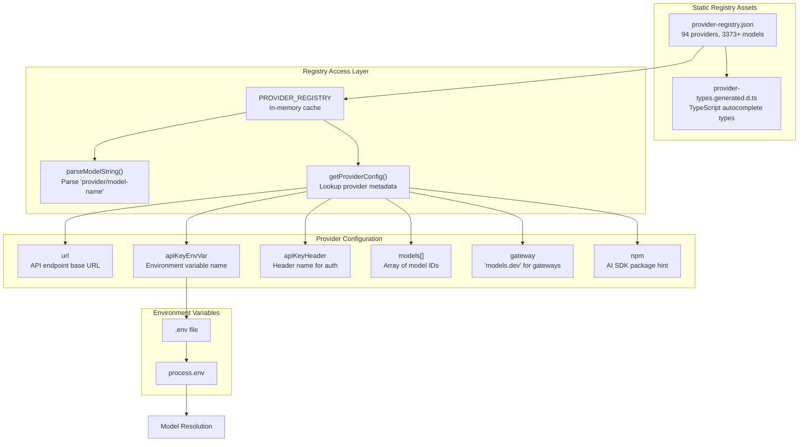
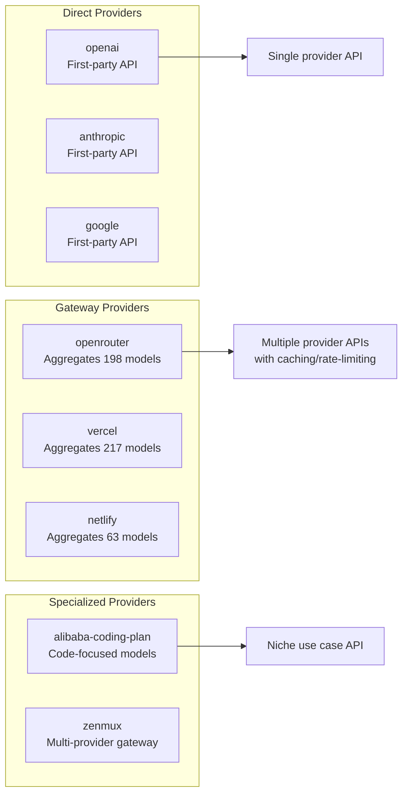
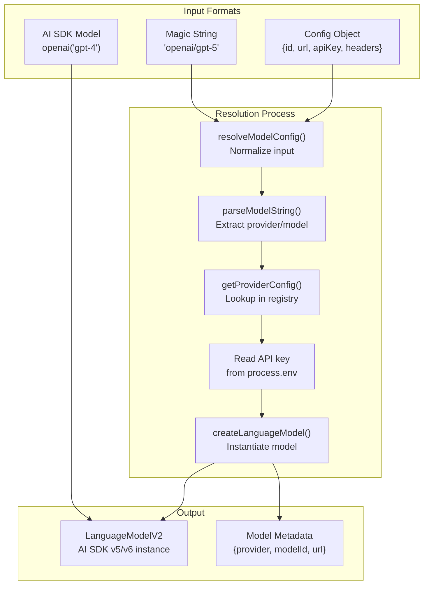
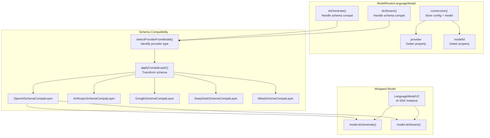
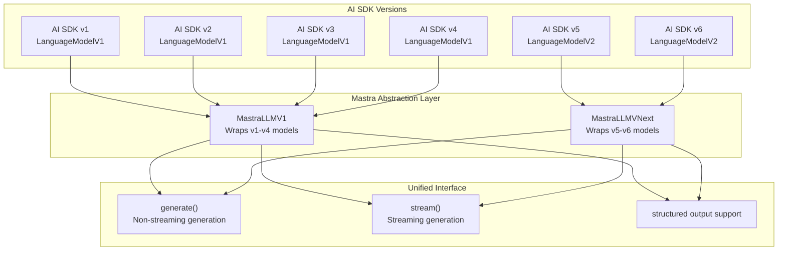
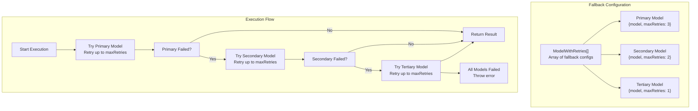
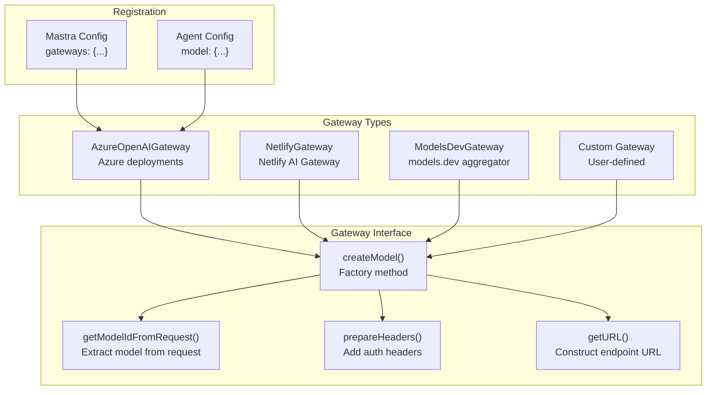
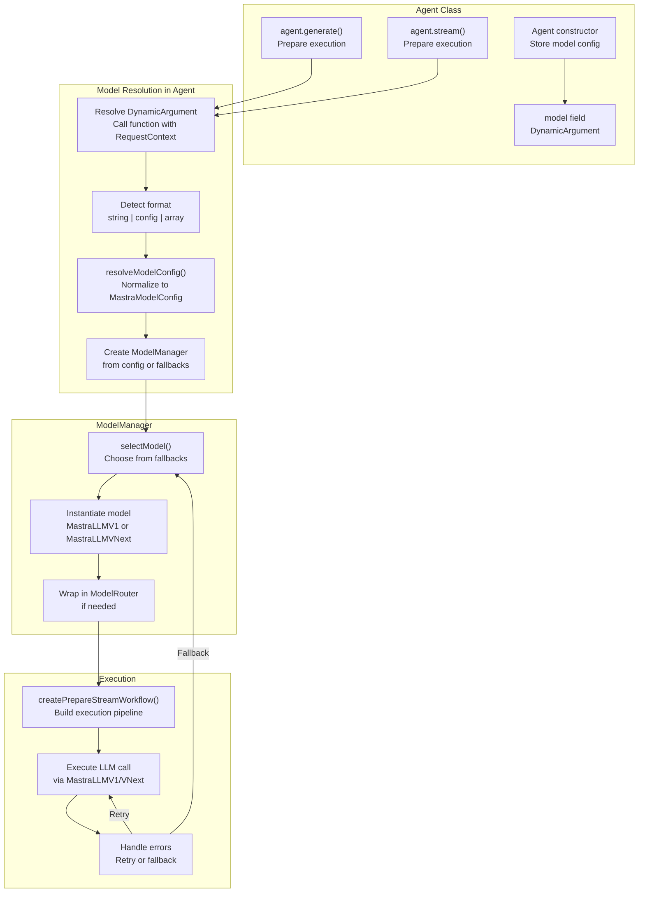

# LLM Integration and Model Router

<details>
<summary>Relevant source files</summary>

The following files were used as context for generating this wiki page:

- [docs/src/content/en/models/gateways/index.mdx](docs/src/content/en/models/gateways/index.mdx)
- [docs/src/content/en/models/gateways/netlify.mdx](docs/src/content/en/models/gateways/netlify.mdx)
- [docs/src/content/en/models/gateways/openrouter.mdx](docs/src/content/en/models/gateways/openrouter.mdx)
- [docs/src/content/en/models/gateways/vercel.mdx](docs/src/content/en/models/gateways/vercel.mdx)
- [docs/src/content/en/models/index.mdx](docs/src/content/en/models/index.mdx)
- [docs/src/content/en/models/providers/\_meta.ts](docs/src/content/en/models/providers/_meta.ts)
- [docs/src/content/en/models/providers/alibaba-cn.mdx](docs/src/content/en/models/providers/alibaba-cn.mdx)
- [docs/src/content/en/models/providers/alibaba.mdx](docs/src/content/en/models/providers/alibaba.mdx)
- [docs/src/content/en/models/providers/anthropic.mdx](docs/src/content/en/models/providers/anthropic.mdx)
- [docs/src/content/en/models/providers/baseten.mdx](docs/src/content/en/models/providers/baseten.mdx)
- [docs/src/content/en/models/providers/cerebras.mdx](docs/src/content/en/models/providers/cerebras.mdx)
- [docs/src/content/en/models/providers/chutes.mdx](docs/src/content/en/models/providers/chutes.mdx)
- [docs/src/content/en/models/providers/cortecs.mdx](docs/src/content/en/models/providers/cortecs.mdx)
- [docs/src/content/en/models/providers/deepinfra.mdx](docs/src/content/en/models/providers/deepinfra.mdx)
- [docs/src/content/en/models/providers/github-models.mdx](docs/src/content/en/models/providers/github-models.mdx)
- [docs/src/content/en/models/providers/google.mdx](docs/src/content/en/models/providers/google.mdx)
- [docs/src/content/en/models/providers/groq.mdx](docs/src/content/en/models/providers/groq.mdx)
- [docs/src/content/en/models/providers/index.mdx](docs/src/content/en/models/providers/index.mdx)
- [docs/src/content/en/models/providers/modelscope.mdx](docs/src/content/en/models/providers/modelscope.mdx)
- [docs/src/content/en/models/providers/nano-gpt.mdx](docs/src/content/en/models/providers/nano-gpt.mdx)
- [docs/src/content/en/models/providers/nebius.mdx](docs/src/content/en/models/providers/nebius.mdx)
- [docs/src/content/en/models/providers/nvidia.mdx](docs/src/content/en/models/providers/nvidia.mdx)
- [docs/src/content/en/models/providers/openai.mdx](docs/src/content/en/models/providers/openai.mdx)
- [docs/src/content/en/models/providers/opencode.mdx](docs/src/content/en/models/providers/opencode.mdx)
- [docs/src/content/en/models/providers/perplexity.mdx](docs/src/content/en/models/providers/perplexity.mdx)
- [docs/src/content/en/models/providers/requesty.mdx](docs/src/content/en/models/providers/requesty.mdx)
- [docs/src/content/en/models/providers/scaleway.mdx](docs/src/content/en/models/providers/scaleway.mdx)
- [docs/src/content/en/models/providers/synthetic.mdx](docs/src/content/en/models/providers/synthetic.mdx)
- [docs/src/content/en/models/providers/togetherai.mdx](docs/src/content/en/models/providers/togetherai.mdx)
- [docs/src/content/en/models/providers/upstage.mdx](docs/src/content/en/models/providers/upstage.mdx)
- [docs/src/content/en/models/providers/venice.mdx](docs/src/content/en/models/providers/venice.mdx)
- [docs/src/content/en/models/providers/vultr.mdx](docs/src/content/en/models/providers/vultr.mdx)
- [docs/src/content/en/models/providers/wandb.mdx](docs/src/content/en/models/providers/wandb.mdx)
- [docs/src/content/en/models/providers/xai.mdx](docs/src/content/en/models/providers/xai.mdx)
- [docs/src/content/en/models/providers/zai-coding-plan.mdx](docs/src/content/en/models/providers/zai-coding-plan.mdx)
- [docs/src/content/en/models/providers/zai.mdx](docs/src/content/en/models/providers/zai.mdx)
- [docs/src/content/en/models/providers/zhipuai-coding-plan.mdx](docs/src/content/en/models/providers/zhipuai-coding-plan.mdx)
- [docs/src/content/en/models/providers/zhipuai.mdx](docs/src/content/en/models/providers/zhipuai.mdx)
- [docs/src/content/en/models/sidebars.js](docs/src/content/en/models/sidebars.js)
- [examples/bird-checker-with-express/src/index.ts](examples/bird-checker-with-express/src/index.ts)
- [examples/bird-checker-with-nextjs-and-eval/src/lib/mastra/actions.ts](examples/bird-checker-with-nextjs-and-eval/src/lib/mastra/actions.ts)
- [packages/core/src/action/index.ts](packages/core/src/action/index.ts)
- [packages/core/src/agent/**tests**/utils.test.ts](packages/core/src/agent/__tests__/utils.test.ts)
- [packages/core/src/agent/agent-legacy.ts](packages/core/src/agent/agent-legacy.ts)
- [packages/core/src/agent/agent.test.ts](packages/core/src/agent/agent.test.ts)
- [packages/core/src/agent/agent.ts](packages/core/src/agent/agent.ts)
- [packages/core/src/agent/agent.types.ts](packages/core/src/agent/agent.types.ts)
- [packages/core/src/agent/index.ts](packages/core/src/agent/index.ts)
- [packages/core/src/agent/trip-wire.ts](packages/core/src/agent/trip-wire.ts)
- [packages/core/src/agent/types.ts](packages/core/src/agent/types.ts)
- [packages/core/src/agent/utils.ts](packages/core/src/agent/utils.ts)
- [packages/core/src/agent/workflows/prepare-stream/index.ts](packages/core/src/agent/workflows/prepare-stream/index.ts)
- [packages/core/src/agent/workflows/prepare-stream/map-results-step.ts](packages/core/src/agent/workflows/prepare-stream/map-results-step.ts)
- [packages/core/src/agent/workflows/prepare-stream/prepare-memory-step.ts](packages/core/src/agent/workflows/prepare-stream/prepare-memory-step.ts)
- [packages/core/src/agent/workflows/prepare-stream/prepare-tools-step.ts](packages/core/src/agent/workflows/prepare-stream/prepare-tools-step.ts)
- [packages/core/src/agent/workflows/prepare-stream/stream-step.ts](packages/core/src/agent/workflows/prepare-stream/stream-step.ts)
- [packages/core/src/llm/index.ts](packages/core/src/llm/index.ts)
- [packages/core/src/llm/model/model.test.ts](packages/core/src/llm/model/model.test.ts)
- [packages/core/src/llm/model/model.ts](packages/core/src/llm/model/model.ts)
- [packages/core/src/llm/model/provider-registry.json](packages/core/src/llm/model/provider-registry.json)
- [packages/core/src/llm/model/provider-types.generated.d.ts](packages/core/src/llm/model/provider-types.generated.d.ts)
- [packages/core/src/mastra/index.ts](packages/core/src/mastra/index.ts)
- [packages/core/src/observability/types/tracing.ts](packages/core/src/observability/types/tracing.ts)
- [packages/core/src/stream/aisdk/v5/execute.ts](packages/core/src/stream/aisdk/v5/execute.ts)
- [packages/core/src/tools/tool-builder/builder.test.ts](packages/core/src/tools/tool-builder/builder.test.ts)
- [packages/core/src/tools/tool-builder/builder.ts](packages/core/src/tools/tool-builder/builder.ts)
- [packages/core/src/tools/tool.ts](packages/core/src/tools/tool.ts)
- [packages/core/src/tools/types.ts](packages/core/src/tools/types.ts)

</details>

The LLM Integration and Model Router system provides unified access to 3373+ language models across 94 providers through a single consistent interface. It handles model resolution, API credential management, version compatibility across AI SDK v1-v6, and automatic failover between models.

For agent execution patterns that use these models, see [Agent Configuration and Execution](#3.1). For the execution loop architecture that calls these models, see [Agentic Execution Loop (The Loop)](#3.8). For provider-specific schema adaptations, see [Schema Compatibility Layers](#5.6).

## Provider Registry Architecture

The provider registry is a JSON-based catalog that centralizes configuration for all supported model providers. It powers model discovery, IDE autocomplete, and runtime model resolution.



**Sources:** [packages/core/src/llm/model/provider-registry.json:1-1500](), [packages/core/src/llm/model/provider-types.generated.d.ts:1-100]()

### Registry Structure

The `provider-registry.json` file defines each provider with these properties:

| Property       | Type              | Purpose                          | Example                              |
| -------------- | ----------------- | -------------------------------- | ------------------------------------ |
| `url`          | string            | API endpoint base URL            | `"https://api.openai.com/v1"`        |
| `apiKeyEnvVar` | string            | Environment variable for API key | `"OPENAI_API_KEY"`                   |
| `apiKeyHeader` | string            | HTTP header for authentication   | `"Authorization"`                    |
| `name`         | string            | Display name                     | `"OpenAI"`                           |
| `models`       | string[]          | Array of model IDs               | `["gpt-4", "gpt-5"]`                 |
| `gateway`      | string (optional) | Gateway type identifier          | `"models.dev"`                       |
| `npm`          | string (optional) | AI SDK package hint              | `"@ai-sdk/openai"`                   |
| `docUrl`       | string (optional) | Provider documentation URL       | `"https://platform.openai.com/docs"` |

**Sources:** [packages/core/src/llm/model/provider-registry.json:1-50]()

### Generated TypeScript Types

The registry generates TypeScript types that enable IDE autocomplete for model strings:

```typescript
// Auto-generated from provider-registry.json
export type ProviderModelsMap = {
  readonly openai: readonly [
    'gpt-4o',
    'gpt-5',
    'gpt-5-mini',
    // ... 43 more models
  ]
  readonly anthropic: readonly [
    'claude-opus-4.6',
    'claude-sonnet-4.6',
    // ... 21 more models
  ]
  // ... 92 more providers
}
```

**Sources:** [packages/core/src/llm/model/provider-types.generated.d.ts:1-100]()

### Provider Categories

The registry distinguishes between three types of providers:



**Sources:** [packages/core/src/llm/model/provider-registry.json:1-100](), [docs/src/content/en/models/gateways/index.mdx:1-44]()

## Model Resolution System

Model resolution translates user-provided model specifications into executable `LanguageModelV2` instances. It supports three input formats: magic strings, configuration objects, and AI SDK model instances.



**Sources:** [packages/core/src/llm/model/resolve-model.ts:1-100]()

### Magic String Resolution

Magic strings use the format `"provider/model-name"` and are resolved by looking up the provider in the registry:

```typescript
// Input: "openai/gpt-5"
// Resolution steps:
// 1. parseModelString("openai/gpt-5") → { provider: "openai", model: "gpt-5" }
// 2. getProviderConfig("openai") → { url: "https://api.openai.com/v1", apiKeyEnvVar: "OPENAI_API_KEY", ... }
// 3. process.env.OPENAI_API_KEY → "sk-..."
// 4. createLanguageModel("openai", "gpt-5", config) → LanguageModelV2 instance
```

The `parseModelString` function handles both simple and namespaced model IDs:

| Input                                    | Provider       | Model                         |
| ---------------------------------------- | -------------- | ----------------------------- |
| `"openai/gpt-5"`                         | `"openai"`     | `"gpt-5"`                     |
| `"openrouter/anthropic/claude-opus-4.6"` | `"openrouter"` | `"anthropic/claude-opus-4.6"` |
| `"custom/my-model"`                      | `"custom"`     | `"my-model"`                  |

**Sources:** [packages/core/src/llm/model/provider-registry.ts:100-200]()

### Configuration Object Resolution

Configuration objects provide explicit control over model instantiation:

```typescript
// Full configuration object
{
  id: "openai/gpt-5",
  url: "https://api.openai.com/v1", // Optional override
  apiKey: process.env.CUSTOM_KEY,    // Optional override
  headers: {                         // Optional custom headers
    "OpenAI-Organization": "org-123"
  }
}
```

**Sources:** [packages/core/src/llm/model/shared.types.ts:50-100](), [docs/src/content/en/models/index.mdx:250-270]()

### Custom Provider Configuration

Custom providers for local models or private deployments:

```typescript
{
  id: "custom/my-qwen3-model",
  url: "http://localhost:1234/v1" // LMStudio or similar
}
```

**Sources:** [docs/src/content/en/models/index.mdx:305-342]()

## Model Router Implementation

The `ModelRouterLanguageModel` class wraps AI SDK model instances with provider-specific error handling, schema compatibility layers, and retry logic.



**Sources:** [packages/core/src/llm/model/router.ts:1-200]()

### Provider Detection

The router identifies the provider from the model's `modelId` property:

```typescript
function detectProviderFromModel(model: LanguageModelV2): string {
  // Extract provider from modelId like "openai:gpt-5" or "anthropic:claude-opus-4.6"
  const modelId = model.modelId
  const colonIndex = modelId.indexOf(':')
  if (colonIndex !== -1) {
    return modelId.slice(0, colonIndex)
  }
  return 'unknown'
}
```

**Sources:** [packages/core/src/llm/model/router.ts:50-80]()

### Schema Compatibility Layers

Each provider may have specific requirements for tool schemas. The router applies the appropriate compatibility layer:

| Provider         | Layer                              | Transformations                                     |
| ---------------- | ---------------------------------- | --------------------------------------------------- |
| OpenAI           | `OpenAISchemaCompatLayer`          | Strict mode support, additional properties handling |
| OpenAI Reasoning | `OpenAIReasoningSchemaCompatLayer` | Reasoning mode schema adjustments                   |
| Anthropic        | `AnthropicSchemaCompatLayer`       | Cache control annotations                           |
| Google           | `GoogleSchemaCompatLayer`          | Gemini-specific schema format                       |
| DeepSeek         | `DeepSeekSchemaCompatLayer`        | DeepSeek model adjustments                          |
| Meta             | `MetaSchemaCompatLayer`            | Llama model schema format                           |

**Sources:** [packages/core/src/tools/tool-builder/builder.ts:1-50]()

## AI SDK Version Compatibility

Mastra supports six versions of the AI SDK through abstraction layers that normalize interfaces across versions.



**Sources:** [packages/core/src/llm/model/model.ts:1-100](), [packages/core/src/llm/model/model.loop.ts:1-100]()

### MastraLLMV1: Legacy AI SDK Support

The `MastraLLMV1` class wraps AI SDK v1-v4 models (which use `LanguageModelV1` interface):

```typescript
// Located in packages/core/src/llm/model/model.ts
export class MastraLLMV1 extends MastraBase {
  #model: LanguageModelV1;

  constructor({ model, mastra, options }) {
    super({ name: 'aisdk' });
    this.#model = model;
    this.#options = options;
    this.#mastra = mastra;
  }

  async generate({ messages, tools, schema, ... }) {
    // Call AI SDK v4 generateText or generateObject
    if (schema) {
      return this.#generateObjectWithSchema({ messages, schema, ... });
    }
    return this.#generateText({ messages, tools, ... });
  }

  async stream({ messages, tools, ... }) {
    // Call AI SDK v4 streamText or streamObject
    return this.#streamText({ messages, tools, ... });
  }
}
```

**Sources:** [packages/core/src/llm/model/model.ts:50-100]()

### MastraLLMVNext: Modern AI SDK Support

The `MastraLLMVNext` class wraps AI SDK v5-v6 models (which use `LanguageModelV2` interface) and integrates with the model loop:

```typescript
// Located in packages/core/src/llm/model/model.loop.ts
export class MastraLLMVNext extends MastraBase {
  #model: LanguageModelV2;

  constructor({ model, mastra, options }) {
    super({ name: 'aisdk-vnext' });
    this.#model = model;
    this.#options = options;
    this.#mastra = mastra;
  }

  async generate({ messages, tools, schema, ... }) {
    // Use modelLoop for agentic execution with tool calls
    return this.#runModelLoop({
      model: this.#model,
      messages,
      tools,
      schema,
      ...
    });
  }

  async stream({ messages, tools, ... }) {
    // Stream version of model loop
    return this.#streamModelLoop({
      model: this.#model,
      messages,
      tools,
      ...
    });
  }
}
```

**Sources:** [packages/core/src/llm/model/model.loop.ts:50-150]()

### Version Detection

The `isSupportedLanguageModel` function determines which abstraction layer to use:

```typescript
export function isSupportedLanguageModel(
  model: unknown
): model is SupportedLanguageModel {
  if (!model || typeof model !== 'object') return false

  // Check for AI SDK v5/v6 (LanguageModelV2)
  if (
    'specificationVersion' in model &&
    (model.specificationVersion === 'v5' || model.specificationVersion === 'v6')
  ) {
    return true
  }

  // Check for AI SDK v1-v4 (LanguageModelV1)
  if (
    'doGenerate' in model &&
    'doStream' in model &&
    !('specificationVersion' in model)
  ) {
    return true
  }

  return false
}
```

**Sources:** [packages/core/src/agent/utils.ts:100-150]()

## Model Fallback System

Model fallbacks enable automatic failover between models when the primary model fails due to rate limits, errors, or unavailability.



**Sources:** [packages/core/src/agent/agent.ts:229-254](), [docs/src/content/en/models/index.mdx:272-302]()

### Fallback Configuration Format

Agents accept an array of `ModelWithRetries` objects:

```typescript
const agent = new Agent({
  id: 'resilient-assistant',
  name: 'Resilient Assistant',
  instructions: 'You are a helpful assistant.',
  model: [
    {
      id: 'fallback-1', // Optional identifier
      model: 'openai/gpt-5', // Primary model
      maxRetries: 3, // Retry count for this model
      enabled: true, // Optional, defaults to true
    },
    {
      id: 'fallback-2',
      model: 'anthropic/claude-opus-4.6',
      maxRetries: 2,
    },
    {
      id: 'fallback-3',
      model: 'google/gemini-2.5-pro',
      maxRetries: 1,
    },
  ],
})
```

**Sources:** [packages/core/src/agent/types.ts:125-131](), [docs/src/content/en/models/index.mdx:276-297]()

### Fallback Execution Logic

The agent's model resolution converts the array to a `ModelFallbacks` structure at construction:

```typescript
// In Agent constructor
if (Array.isArray(config.model)) {
  this.model = config.model.map((mdl) => ({
    id: mdl.id ?? randomUUID(),
    model: mdl.model,
    maxRetries: mdl.maxRetries ?? config?.maxRetries ?? 0,
    enabled: mdl.enabled ?? true,
  })) as ModelFallbacks
  this.#originalModel = [...this.model]
}
```

During execution, the system iterates through enabled fallbacks until one succeeds:

```typescript
// Conceptual flow in agent execution
for (const fallbackConfig of modelFallbacks) {
  if (!fallbackConfig.enabled) continue

  let attempts = 0
  while (attempts < fallbackConfig.maxRetries) {
    try {
      const result = await executeWithModel(fallbackConfig.model)
      return result // Success
    } catch (error) {
      attempts++
      if (attempts >= fallbackConfig.maxRetries) {
        break // Try next fallback
      }
    }
  }
}
throw new Error('All model fallbacks failed')
```

**Sources:** [packages/core/src/agent/agent.ts:244-250](), [packages/core/src/agent/workflows/prepare-stream/map-results-step.ts:1-100]()

## Gateway System

Gateways provide custom routing logic for specialized model providers like Azure OpenAI or multi-provider aggregators like OpenRouter.



**Sources:** [packages/core/src/llm/model/gateways/base.ts:1-100](), [packages/core/src/llm/model/gateways/index.ts:1-50]()

### MastraModelGateway Base Class

All gateways extend the abstract `MastraModelGateway` class:

```typescript
export abstract class MastraModelGateway {
  protected config: ProviderConfig

  constructor(config: ProviderConfig) {
    this.config = config
  }

  // Factory method to create model instance
  abstract createModel(options: {
    modelId: string
    requestContext?: RequestContext
  }): LanguageModelV2

  // Extract model ID from deployment-specific request
  getModelIdFromRequest?(request: any): string | undefined

  // Prepare authentication headers
  protected abstract prepareHeaders(options: {
    requestContext?: RequestContext
  }): Record<string, string>

  // Construct API endpoint URL
  protected abstract getURL(options: {
    modelId: string
    requestContext?: RequestContext
  }): string
}
```

**Sources:** [packages/core/src/llm/model/gateways/base.ts:1-100]()

### Azure OpenAI Gateway

The Azure OpenAI gateway handles Azure-specific deployment names and API versions:

```typescript
export class AzureOpenAIGateway extends MastraModelGateway {
  constructor(config: AzureOpenAIGatewayConfig) {
    super(config)
    // config includes: resourceName, apiVersion, deployments{}
  }

  createModel({ modelId, requestContext }) {
    // Map modelId to Azure deployment name
    const deployment = this.config.deployments[modelId]
    if (!deployment) {
      throw new Error(`No deployment found for model: ${modelId}`)
    }

    // Construct Azure-specific URL
    const url = `https://${this.config.resourceName}.openai.azure.com/openai/deployments/${deployment}/chat/completions?api-version=${this.config.apiVersion}`

    // Return LanguageModelV2 instance with Azure config
    return createAzureOpenAI({
      deployment,
      url,
      apiKey: this.getAPIKey(requestContext),
    })
  }

  protected prepareHeaders({ requestContext }) {
    return {
      'api-key': this.getAPIKey(requestContext),
    }
  }

  protected getURL({ modelId, requestContext }) {
    const deployment = this.config.deployments[modelId]
    return `https://${this.config.resourceName}.openai.azure.com/openai/deployments/${deployment}/chat/completions?api-version=${this.config.apiVersion}`
  }
}
```

**Sources:** [packages/core/src/llm/model/gateways/azure-openai.ts:1-100]()

### Gateway Registration

Gateways are registered with the Mastra instance:

```typescript
const mastra = new Mastra({
  gateways: {
    'azure-prod': new AzureOpenAIGateway({
      resourceName: 'my-resource',
      apiVersion: '2024-02-01',
      apiKeyEnvVar: 'AZURE_OPENAI_API_KEY',
      deployments: {
        'gpt-5': 'my-gpt5-deployment',
        'gpt-4': 'my-gpt4-deployment',
      },
    }),
  },
})
```

Agents can then reference gateway models:

```typescript
const agent = new Agent({
  id: 'azure-agent',
  name: 'Azure Agent',
  model: {
    gateway: 'azure-prod',
    id: 'gpt-5',
  },
})
```

**Sources:** [packages/core/src/mastra/index.ts:236-241]()

## Integration with Agent System

The agent class integrates with the LLM system through model resolution and the `ModelManager` abstraction.



**Sources:** [packages/core/src/agent/agent.ts:158-254](), [packages/core/src/agent/workflows/prepare-stream/index.ts:1-100]()

### Agent Model Field

The agent's `model` field accepts multiple formats:

```typescript
export class Agent<TAgentId extends string = string> {
  model:
    | DynamicArgument<MastraModelConfig | ModelWithRetries[]>
    | ModelFallbacks
  #originalModel:
    | DynamicArgument<MastraModelConfig | ModelWithRetries[]>
    | ModelFallbacks

  constructor(config: AgentConfig<TAgentId>) {
    // Store model configuration
    if (Array.isArray(config.model)) {
      // Convert to ModelFallbacks structure
      this.model = config.model.map((mdl) => ({
        id: mdl.id ?? randomUUID(),
        model: mdl.model,
        maxRetries: mdl.maxRetries ?? config?.maxRetries ?? 0,
        enabled: mdl.enabled ?? true,
      })) as ModelFallbacks
    } else {
      this.model = config.model
    }
    this.#originalModel = config.model
  }
}
```

**Sources:** [packages/core/src/agent/agent.ts:158-254]()

### Model Resolution in Execution

During `agent.generate()` or `agent.stream()`, the model configuration is resolved:

```typescript
// In agent execution flow
async resolveModelForExecution(options: {
  requestContext: RequestContext;
}): Promise<ResolvedModelSelection> {
  // If model is a function (DynamicArgument), call it
  let modelConfig = this.model;
  if (typeof modelConfig === 'function') {
    modelConfig = await modelConfig({
      requestContext: options.requestContext,
    });
  }

  // If modelConfig is ModelFallbacks array, return as-is
  if (Array.isArray(modelConfig)) {
    return modelConfig as ModelFallbacks;
  }

  // Otherwise resolve single model config
  return await resolveModelConfig(modelConfig, {
    mastra: this.#mastra,
    requestContext: options.requestContext,
  });
}
```

**Sources:** [packages/core/src/agent/agent.ts:500-600]()

### Model Instantiation in Prepare Stream Workflow

The `createPrepareStreamWorkflow` function creates a `ModelManager` that handles model instantiation and fallback logic:

```typescript
// In prepare-stream workflow
const prepareToolsStep = createStep({
  id: 'prepare-tools',
  execute: async ({ context }) => {
    const { resolvedModel } = context

    // Create ModelManager from resolved model
    const modelManager = new ModelManager({
      model: resolvedModel,
      mastra: context.mastra,
    })

    // Select model (handles fallback selection)
    const selectedModel = await modelManager.selectModel({
      requestContext: context.requestContext,
    })

    // Instantiate model wrapper
    const llm = isSupportedLanguageModelV2(selectedModel)
      ? new MastraLLMVNext({ model: selectedModel, mastra: context.mastra })
      : new MastraLLMV1({ model: selectedModel, mastra: context.mastra })

    return { llm }
  },
})
```

**Sources:** [packages/core/src/agent/workflows/prepare-stream/index.ts:1-200]()

### Dynamic Model Selection with RequestContext

The model can be selected dynamically based on `RequestContext`:

```typescript
const agent = new Agent({
  id: 'dynamic-assistant',
  name: 'Dynamic Assistant',
  model: ({ requestContext }) => {
    // Select model based on user tier
    const tier = requestContext.get('user-tier')
    if (tier === 'premium') {
      return 'openai/gpt-5'
    } else if (tier === 'standard') {
      return 'anthropic/claude-opus-4.6'
    } else {
      return 'openai/gpt-4o-mini'
    }
  },
})
```

**Sources:** [docs/src/content/en/models/index.mdx:193-213](), [packages/core/src/agent/types.ts:155-195]()
