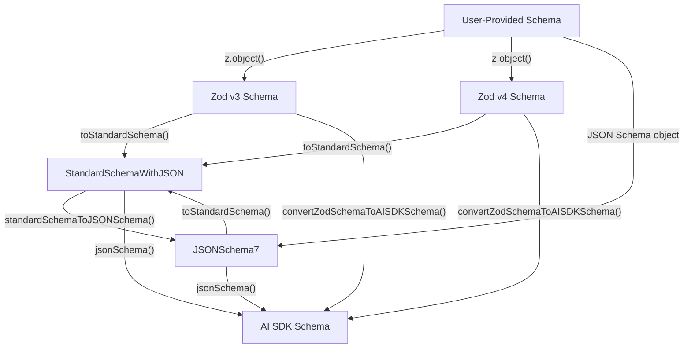
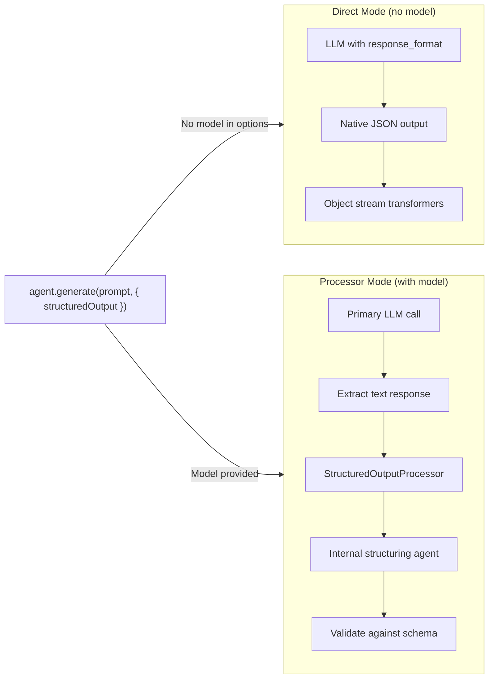
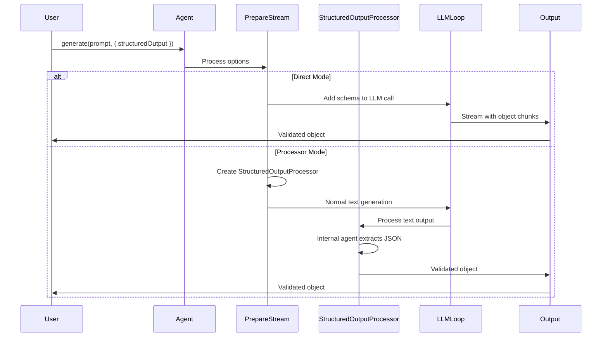
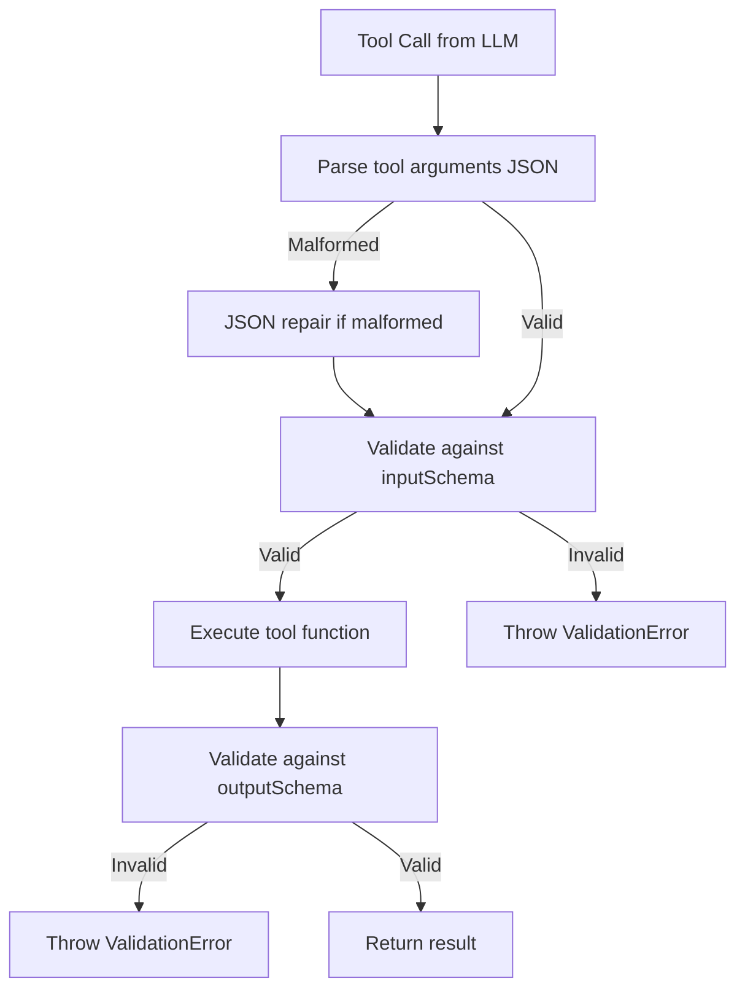
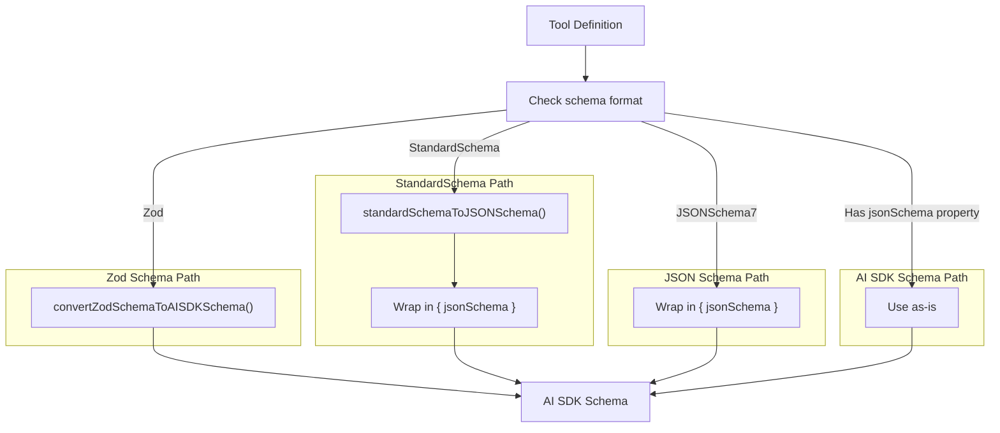
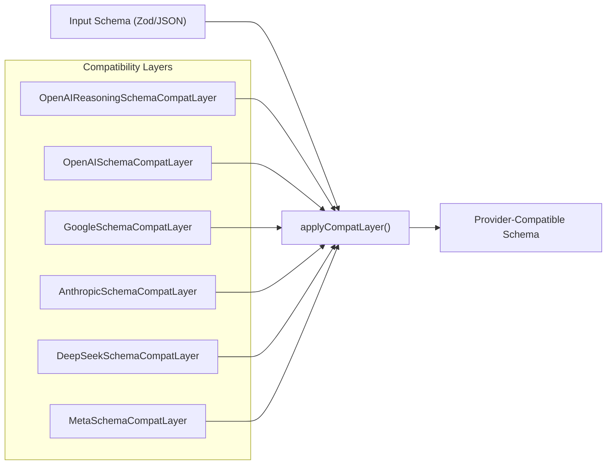
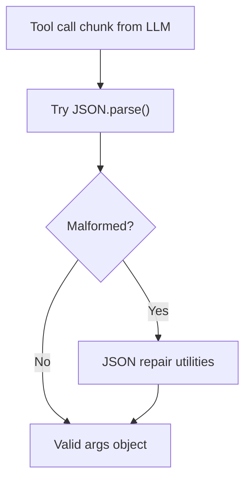

# Structured Output and Schema Validation

<details>
<summary>Relevant source files</summary>

The following files were used as context for generating this wiki page:

- [examples/bird-checker-with-express/src/index.ts](examples/bird-checker-with-express/src/index.ts)
- [examples/bird-checker-with-nextjs-and-eval/src/lib/mastra/actions.ts](examples/bird-checker-with-nextjs-and-eval/src/lib/mastra/actions.ts)
- [packages/core/src/action/index.ts](packages/core/src/action/index.ts)
- [packages/core/src/agent/**tests**/utils.test.ts](packages/core/src/agent/__tests__/utils.test.ts)
- [packages/core/src/agent/agent-legacy.ts](packages/core/src/agent/agent-legacy.ts)
- [packages/core/src/agent/agent.test.ts](packages/core/src/agent/agent.test.ts)
- [packages/core/src/agent/agent.ts](packages/core/src/agent/agent.ts)
- [packages/core/src/agent/agent.types.ts](packages/core/src/agent/agent.types.ts)
- [packages/core/src/agent/index.ts](packages/core/src/agent/index.ts)
- [packages/core/src/agent/trip-wire.ts](packages/core/src/agent/trip-wire.ts)
- [packages/core/src/agent/types.ts](packages/core/src/agent/types.ts)
- [packages/core/src/agent/utils.ts](packages/core/src/agent/utils.ts)
- [packages/core/src/agent/workflows/prepare-stream/index.ts](packages/core/src/agent/workflows/prepare-stream/index.ts)
- [packages/core/src/agent/workflows/prepare-stream/map-results-step.ts](packages/core/src/agent/workflows/prepare-stream/map-results-step.ts)
- [packages/core/src/agent/workflows/prepare-stream/prepare-memory-step.ts](packages/core/src/agent/workflows/prepare-stream/prepare-memory-step.ts)
- [packages/core/src/agent/workflows/prepare-stream/prepare-tools-step.ts](packages/core/src/agent/workflows/prepare-stream/prepare-tools-step.ts)
- [packages/core/src/agent/workflows/prepare-stream/stream-step.ts](packages/core/src/agent/workflows/prepare-stream/stream-step.ts)
- [packages/core/src/llm/index.ts](packages/core/src/llm/index.ts)
- [packages/core/src/llm/model/model.loop.ts](packages/core/src/llm/model/model.loop.ts)
- [packages/core/src/llm/model/model.loop.types.ts](packages/core/src/llm/model/model.loop.types.ts)
- [packages/core/src/llm/model/model.test.ts](packages/core/src/llm/model/model.test.ts)
- [packages/core/src/llm/model/model.ts](packages/core/src/llm/model/model.ts)
- [packages/core/src/loop/**snapshots**/loop.test.ts.snap](packages/core/src/loop/__snapshots__/loop.test.ts.snap)
- [packages/core/src/loop/index.ts](packages/core/src/loop/index.ts)
- [packages/core/src/loop/loop.test.ts](packages/core/src/loop/loop.test.ts)
- [packages/core/src/loop/loop.ts](packages/core/src/loop/loop.ts)
- [packages/core/src/loop/test-utils/fullStream.ts](packages/core/src/loop/test-utils/fullStream.ts)
- [packages/core/src/loop/test-utils/generateText.ts](packages/core/src/loop/test-utils/generateText.ts)
- [packages/core/src/loop/test-utils/options.ts](packages/core/src/loop/test-utils/options.ts)
- [packages/core/src/loop/test-utils/resultObject.ts](packages/core/src/loop/test-utils/resultObject.ts)
- [packages/core/src/loop/test-utils/streamObject.ts](packages/core/src/loop/test-utils/streamObject.ts)
- [packages/core/src/loop/test-utils/textStream.ts](packages/core/src/loop/test-utils/textStream.ts)
- [packages/core/src/loop/test-utils/tools.ts](packages/core/src/loop/test-utils/tools.ts)
- [packages/core/src/loop/test-utils/utils.ts](packages/core/src/loop/test-utils/utils.ts)
- [packages/core/src/loop/types.ts](packages/core/src/loop/types.ts)
- [packages/core/src/loop/workflows/agentic-execution/llm-execution-step.test.ts](packages/core/src/loop/workflows/agentic-execution/llm-execution-step.test.ts)
- [packages/core/src/loop/workflows/agentic-execution/llm-execution-step.ts](packages/core/src/loop/workflows/agentic-execution/llm-execution-step.ts)
- [packages/core/src/loop/workflows/agentic-execution/tool-call-step.test.ts](packages/core/src/loop/workflows/agentic-execution/tool-call-step.test.ts)
- [packages/core/src/loop/workflows/agentic-execution/tool-call-step.ts](packages/core/src/loop/workflows/agentic-execution/tool-call-step.ts)
- [packages/core/src/mastra/index.ts](packages/core/src/mastra/index.ts)
- [packages/core/src/observability/types/tracing.ts](packages/core/src/observability/types/tracing.ts)
- [packages/core/src/stream/aisdk/v5/compat/prepare-tools.test.ts](packages/core/src/stream/aisdk/v5/compat/prepare-tools.test.ts)
- [packages/core/src/stream/aisdk/v5/compat/prepare-tools.ts](packages/core/src/stream/aisdk/v5/compat/prepare-tools.ts)
- [packages/core/src/stream/aisdk/v5/execute.ts](packages/core/src/stream/aisdk/v5/execute.ts)
- [packages/core/src/stream/aisdk/v5/output-helpers.ts](packages/core/src/stream/aisdk/v5/output-helpers.ts)
- [packages/core/src/stream/base/output.ts](packages/core/src/stream/base/output.ts)
- [packages/core/src/stream/types.ts](packages/core/src/stream/types.ts)
- [packages/core/src/tools/index.ts](packages/core/src/tools/index.ts)
- [packages/core/src/tools/provider-tool-utils.test.ts](packages/core/src/tools/provider-tool-utils.test.ts)
- [packages/core/src/tools/provider-tool-utils.ts](packages/core/src/tools/provider-tool-utils.ts)
- [packages/core/src/tools/tool-builder/builder.test.ts](packages/core/src/tools/tool-builder/builder.test.ts)
- [packages/core/src/tools/tool-builder/builder.ts](packages/core/src/tools/tool-builder/builder.ts)
- [packages/core/src/tools/tool.ts](packages/core/src/tools/tool.ts)
- [packages/core/src/tools/toolchecks.test.ts](packages/core/src/tools/toolchecks.test.ts)
- [packages/core/src/tools/toolchecks.ts](packages/core/src/tools/toolchecks.ts)
- [packages/core/src/tools/types.ts](packages/core/src/tools/types.ts)

</details>

This page documents how Mastra handles structured output generation from language models and schema validation across the framework. It covers schema types, conversion between formats, structured output modes for agents, tool input/output validation, and provider-specific compatibility layers.

For information about general agent configuration and execution, see [Agent Configuration and Execution](#3.1). For tool definition patterns, see [Tool Definition and Execution Context](#6.1).

---

## Overview

Mastra provides comprehensive schema validation and structured output capabilities across multiple contexts:

1. **Agent Structured Output**: Coercing LLM responses into validated JSON objects matching a schema
2. **Tool Input/Output Validation**: Ensuring tool arguments and results conform to defined schemas
3. **Schema Format Conversion**: Translating between Zod, JSON Schema, StandardSchema, and AI SDK formats
4. **Provider Compatibility**: Adapting schemas for provider-specific requirements (OpenAI strict mode, Anthropic caching, etc.)

The framework supports both native LLM structured output (when the model supports it) and prompt-based JSON extraction for models without native support.

**Sources**: [packages/core/src/agent/types.ts:70-116](), [packages/core/src/stream/base/output.ts:229]()

---

## Schema Type System

### Supported Schema Formats

Mastra accepts schemas in multiple formats and converts between them as needed:



**Diagram**: Schema format conversion flow in Mastra

**Sources**: [packages/core/src/schema/index.ts](), [packages/core/src/tools/tool-builder/builder.ts:230-252]()

### StandardSchemaWithJSON Interface

`StandardSchemaWithJSON` is Mastra's internal unified schema representation that preserves both validation capabilities and JSON Schema representation:

| Property                 | Type        | Purpose                                           |
| ------------------------ | ----------- | ------------------------------------------------- |
| `~standard.validate()`   | Function    | Validates input and returns issues or typed value |
| `~standard.types.input`  | Type        | TypeScript type for input                         |
| `~standard.types.output` | Type        | TypeScript type for output                        |
| `jsonSchema`             | JSONSchema7 | JSON Schema representation for serialization      |

This interface allows Mastra to work with any schema format while maintaining type safety and enabling serialization for storage/transport.

**Sources**: [packages/core/src/schema/types.ts]()

---

## Structured Output in Agents

### Configuration Options

Agents can generate structured output in two distinct modes:

```typescript
// StructuredOutputOptionsBase type definition
type StructuredOutputOptionsBase<OUTPUT> = {
  model?: MastraModelConfig // Optional internal structuring model
  instructions?: string // Custom instructions for structuring
  jsonPromptInjection?: boolean // Use prompt injection vs native format
  logger?: IMastraLogger
  providerOptions?: ProviderOptions // Provider-specific options
} & FallbackFields<OUTPUT>

// With schema
type StructuredOutputOptions<OUTPUT> = StructuredOutputOptionsBase<OUTPUT> & {
  schema: StandardSchemaWithJSON<OUTPUT>
}
```

**Sources**: [packages/core/src/agent/types.ts:70-110]()

### Structured Output Modes



**Diagram**: Two modes of structured output generation

#### Direct Mode

When `structuredOutput.model` is not provided, the framework uses the agent's model directly with native structured output:

- The LLM's native `response_format` parameter is used (OpenAI's JSON mode, Anthropic's tool use, etc.)
- Object transformation happens in the stream via `createObjectStreamTransformer()`
- Best performance but requires model support for structured output
- Mode detection occurs at: [packages/core/src/stream/base/output.ts:295-297]()

#### Processor Mode

When `structuredOutput.model` is provided, an internal agent handles extraction:

- The primary agent generates a text response normally
- `StructuredOutputProcessor` intercepts the output
- An internal agent with the specified model extracts structured data
- Supports models without native structured output via prompt engineering
- Can use different models for generation vs structuring (e.g., cheap model for extraction)
- Processor application: [packages/core/src/agent/workflows/prepare-stream/map-results-step.ts:75-89]()

**Sources**: [packages/core/src/stream/base/output.ts:295-297](), [packages/core/src/processors/processors/structured-output.ts]()

### Error Handling Strategies

Structured output supports configurable error handling:

```typescript
type FallbackFields<OUTPUT> =
  | { errorStrategy?: 'strict' | 'warn'; fallbackValue?: never }
  | { errorStrategy: 'fallback'; fallbackValue: OUTPUT }
```

| Strategy           | Behavior                                      |
| ------------------ | --------------------------------------------- |
| `strict` (default) | Throws error if validation fails              |
| `warn`             | Logs warning but returns invalid data         |
| `fallback`         | Returns `fallbackValue` on validation failure |

**Sources**: [packages/core/src/agent/types.ts:66-69]()

### Usage Example Flow



**Diagram**: Structured output execution flow

**Sources**: [packages/core/src/agent/workflows/prepare-stream/map-results-step.ts:9-150]()

---

## Schema Validation in Tools

### Tool Schema Properties

Tools define schemas for input, output, suspend, and resume operations:

```typescript
interface ToolAction {
  inputSchema?: StandardSchemaWithJSON<TSchemaIn> // Required input validation
  outputSchema?: StandardSchemaWithJSON<TSchemaOut> // Optional output validation
  suspendSchema?: StandardSchemaWithJSON<TSuspendSchema> // Suspend payload schema
  resumeSchema?: StandardSchemaWithJSON<TResumeSchema> // Resume data schema
  execute?: (inputData: TSchemaIn, context: TContext) => Promise<TSchemaOut>
}
```

**Sources**: [packages/core/src/tools/types.ts:246-280]()

### Validation Pipeline



**Diagram**: Tool validation pipeline

**Sources**: [packages/core/src/tools/validation.ts](), [packages/core/src/tools/tool-builder/builder.ts:456-482]()

### Validation Functions

The `validation.ts` module provides type-safe validation functions:

| Function                    | Purpose                               | Returns                                                  |
| --------------------------- | ------------------------------------- | -------------------------------------------------------- |
| `validateToolInput()`       | Validates args against inputSchema    | `{ success: true, data }` or `{ success: false, error }` |
| `validateToolOutput()`      | Validates result against outputSchema | `{ success: true, data }` or `{ success: false, error }` |
| `validateToolSuspendData()` | Validates suspend payload             | `{ success: true, data }` or `{ success: false, error }` |
| `validateRequestContext()`  | Validates request context values      | `{ success: true, data }` or `{ success: false, error }` |

Each validation function:

1. Checks if schema is defined
2. Calls the schema's `~standard.validate()` method
3. Returns typed success/failure result with detailed error information

**Sources**: [packages/core/src/tools/validation.ts]()

### Schema Injection for Suspend/Resume

Tools that support suspend/resume automatically get extended input schemas:

```typescript
// Original schema
const originalSchema = z.object({
  filepath: z.string(),
})

// Auto-extended schema for suspend-capable tools
const extendedSchema = originalSchema.extend({
  suspendedToolRunId: z.string().nullable().optional(),
  resumeData: z.any().optional(),
})
```

This allows the LLM to resume suspended tool executions by passing the `suspendedToolRunId` and `resumeData`.

**Sources**: [packages/core/src/tools/tool-builder/builder.ts:83-117]()

---

## Schema Conversion in CoreToolBuilder

### Conversion to AI SDK Format

`CoreToolBuilder` converts all schema formats to AI SDK's `Schema` format for compatibility:



**Diagram**: Schema format conversion in CoreToolBuilder

The conversion happens at multiple points:

- **Input schema conversion**: [packages/core/src/tools/tool-builder/builder.ts:119-151]()
- **Output schema conversion**: [packages/core/src/tools/tool-builder/builder.ts:153-170]()
- **Provider-defined tools**: [packages/core/src/tools/tool-builder/builder.ts:201-290]()

**Sources**: [packages/core/src/tools/tool-builder/builder.ts:119-290]()

### Default Schema for Missing Parameters

Tools without an explicit `inputSchema` receive a default empty object schema:

```typescript
processedParameters = {
  jsonSchema: {
    type: 'object',
    properties: {},
    additionalProperties: false,
  },
}
```

This ensures OpenAI compatibility, which requires at minimum `type: "object"` even for parameter-less tools.

**Sources**: [packages/core/src/tools/tool-builder/builder.ts:244-251]()

---

## Provider-Specific Schema Compatibility

### Compatibility Layer Architecture

Different LLM providers have varying schema requirements. Mastra applies compatibility layers to adapt schemas:



**Diagram**: Provider-specific schema compatibility layers

**Sources**: [packages/core/src/tools/tool-builder/builder.ts:1-12](), [packages/core/src/llm/model/model.ts:91-118]()

### Compatibility Layer Implementations

Each layer checks model information and applies transformations:

| Layer                              | Provider                | Transformations                                            |
| ---------------------------------- | ----------------------- | ---------------------------------------------------------- |
| `OpenAIReasoningSchemaCompatLayer` | OpenAI reasoning models | Strips unsupported fields for reasoning models             |
| `OpenAISchemaCompatLayer`          | OpenAI                  | Enables strict mode when `supportsStructuredOutputs: true` |
| `GoogleSchemaCompatLayer`          | Google                  | Adapts schema for Google's specific requirements           |
| `AnthropicSchemaCompatLayer`       | Anthropic               | Handles Anthropic's tool calling format                    |
| `DeepSeekSchemaCompatLayer`        | DeepSeek                | DeepSeek-specific adaptations                              |
| `MetaSchemaCompatLayer`            | Meta (Llama)            | Meta model requirements                                    |

The `applyCompatLayer()` function iterates through all layers and applies transformations that match the current model.

**Sources**: [packages/core/src/schema-compat/index.ts]()

### Application Points

Compatibility layers are applied at multiple points:

1. **Tool parameter schemas**: Before passing tools to the model [packages/core/src/llm/model/model.ts:91-118]()
2. **Structured output schemas**: Before setting response format [packages/core/src/llm/model/model.ts:150-166]()
3. **Tool builder conversion**: During CoreTool creation [packages/core/src/tools/tool-builder/builder.ts:1-12]()

**Sources**: [packages/core/src/llm/model/model.ts:91-118](), [packages/core/src/tools/tool-builder/builder.ts:1-12]()

---

## JSON Repair for Tool Calls

### Malformed Tool Arguments

LLMs sometimes generate malformed JSON for tool arguments. Mastra includes repair mechanisms:



**Diagram**: JSON repair for tool call arguments

The repair process handles common malformation patterns:

- Incomplete JSON (missing closing braces/brackets)
- Extra commas
- Unquoted keys
- Truncated strings

When repair succeeds, the tool call proceeds normally. If repair fails, the error is captured and may trigger a retry or be surfaced to the user depending on error handling configuration.

**Sources**: [packages/core/src/stream/aisdk/v5/transform.ts]()

### Stream-Based Repair

For streaming tool calls, JSON repair happens as chunks arrive:

1. Tool call deltas accumulate in `#toolCallArgsDeltas`
2. On `tool-call` chunk (complete arguments), attempt parse
3. If parse fails, apply repair to accumulated string
4. Pass repaired args to tool validation

This ensures tool execution can proceed even when the LLM's JSON generation is imperfect.

**Sources**: [packages/core/src/stream/base/output.ts:185-189](), [packages/core/src/loop/workflows/agentic-execution/llm-execution-step.ts:498-529]()

---

## Schema Serialization and Storage

### Serializable Schema Format

For storing agent configurations, structured output schemas are serialized to JSON Schema:

```typescript
type SerializableStructuredOutputOptions<OUTPUT> = Omit<
  StructuredOutputOptionsBase<OUTPUT>,
  'model'
> & {
  model?: ModelRouterModelId | OpenAICompatibleConfig
  schema: JSONSchema7 // Always JSON Schema for serialization
}
```

This allows agent definitions with structured output to be:

- Saved to storage
- Retrieved and hydrated
- Transmitted over the network
- Version controlled

The conversion from Zod/StandardSchema to JSONSchema7 happens via:

```typescript
const jsonSchema = standardSchemaToJSONSchema(toStandardSchema(schema), {
  io: 'input',
})
```

**Sources**: [packages/core/src/agent/types.ts:112-116]()

### Schema IO Direction

Schema conversion supports an `io` parameter to specify whether the schema describes input or output:

| Direction | Usage                        | Validation                                  |
| --------- | ---------------------------- | ------------------------------------------- |
| `input`   | Tool parameters, agent input | More permissive (allows unknown properties) |
| `output`  | Tool results, agent output   | Stricter validation                         |

This distinction ensures appropriate validation strictness at each boundary.

**Sources**: [packages/core/src/schema/to-json-schema.ts]()

---

## Integration with Message System

### Structured Output in MessageList

When agents produce structured output, the result is stored in the message content:

```typescript
type MastraMessageContent = {
  format: 2
  parts: MastraMessagePart[]
  metadata?: {
    structuredOutput?: {
      schema: JSONSchema7
      object: unknown
    }
  }
}
```

This preserves both the generated object and its schema for later retrieval and validation.

**Sources**: [packages/core/src/agent/message-list/types.ts]()

### Object Stream Transformation

The `MastraModelOutput` class provides multiple access patterns for structured output:

```typescript
class MastraModelOutput<OUTPUT> {
  // Stream of partial objects as they're generated
  get objectStream(): AsyncIterable<OUTPUT>

  // Promise that resolves to complete object
  get object(): Promise<OUTPUT>

  // Full output including object and metadata
  async getFullOutput(): Promise<FullOutput<OUTPUT>>
}
```

The `objectStream` is created by `createObjectStreamTransformer()` which accumulates JSON text and parses it incrementally.

**Sources**: [packages/core/src/stream/base/output.ts:318-580](), [packages/core/src/stream/base/output-format-handlers.ts]()

---

## Summary

Mastra's structured output and schema validation system provides:

1. **Multi-format schema support**: Zod v3/v4, JSON Schema, StandardSchema
2. **Two structured output modes**: Direct (native LLM) and Processor (internal agent)
3. **Comprehensive tool validation**: Input, output, suspend, and resume schemas
4. **Provider compatibility**: Automatic schema adaptation for different LLM providers
5. **JSON repair**: Automatic fixing of malformed tool call arguments
6. **Flexible error handling**: Strict, warn, or fallback strategies
7. **Type safety**: Full TypeScript inference across all schema formats
8. **Serialization support**: JSON Schema representation for storage and transport

The validation pipeline ensures type safety from user input through LLM interaction to final output, while the conversion system allows developers to use their preferred schema definition format.

**Sources**: [packages/core/src/agent/types.ts:70-116](), [packages/core/src/tools/tool-builder/builder.ts:1-560](), [packages/core/src/stream/base/output.ts:1-1000]()
